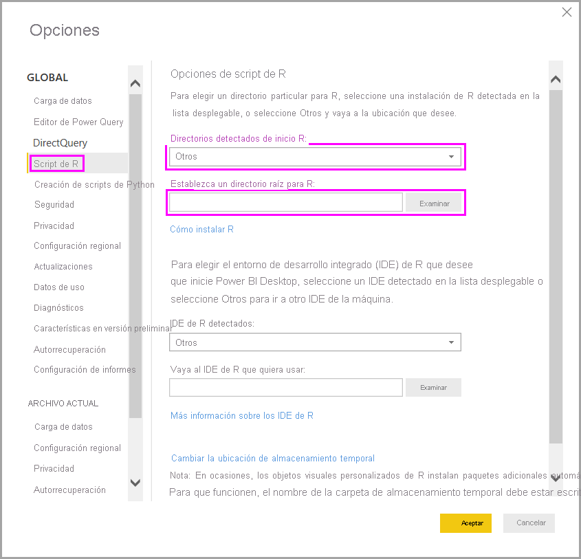

# Ejecución de scripts de R en Power BI Desktop

Puede ejecutar scripts R directamente en Power BI Desktop e importar los conjuntos de datos resultantes en un modelo de datos de Power BI Desktop.

## Instalar R

Para ejecutar scripts R en Power BI Desktop, deberá instalar R en el equipo local. Puede descargar e instalar R de forma gratuita desde varias ubicaciones, incluidas [Microsoft R Application Network](https://mran.revolutionanalytics.com/download/) y el [repositorio de CRAN](https://cran.r-project.org/bin/windows/base/). La versión actual admite caracteres Unicode y espacios (caracteres vacíos) en la ruta de instalación.

## Ejecutar scripts de R

Con solo unos pocos pasos en Power BI Desktop, puede ejecutar scripts de R y crear un modelo de datos. Con el modelo de datos, puede crear informes y compartirlos en el servicio Power BI. Scripting de R de Power BI Desktop admite ahora los formatos de número que contienen decimales (.) y comas (,).

### Preparar un script de R

Para ejecutar un script R en Power BI Desktop, créelo en el entorno de desarrollo de R local y asegúrese de que se ejecuta correctamente.

Para ejecutar el script en Power BI Desktop, asegúrese de que este se ejecuta correctamente en un área de trabajo nueva y sin modificar. Este requisito previo significa que todos los paquetes y dependencias deben cargarse y ejecutarse explícitamente. Puede usar `source()` para ejecutar scripts dependientes.

Al preparar y ejecutar un script de R en Power BI Desktop, hay algunas limitaciones:

* Como solo se importan tramas de datos, recuerde representar los datos que quiere importar a Power BI en una trama de datos.
* Las columnas cuyos tipos son Complex y Vector no se importan y se reemplazan por valores de error en la tabla creada.
* Los valores que son `N/A` se convierten en valores `NULL` en Power BI Desktop.
* Si un script de R se ejecuta durante más de 30 minutos, se agota el tiempo de espera.
* Las llamadas interactivas en el script de R como, por ejemplo, esperar la entrada del usuario, detienen la ejecución del script.
* Al establecer el directorio de trabajo en el script de R, *debe* definir una ruta de acceso completa al directorio de trabajo, en lugar de una ruta de acceso relativa.

### Ejecutar el script de R e importar datos

Ahora puede ejecutar el script de R para importar datos en Power BI Desktop:

1. En Power BI Desktop, seleccione **Obtener datos**, elija **Otros** > **Script R** y, a continuación, seleccione **Conectar**:

    

2. Si R está instalado en el equipo local, solo tiene que copiar el script en la ventana de script y seleccionar **Aceptar**. La versión instalada más reciente se muestra como el motor de R.

    

3. Seleccione **Aceptar** para ejecutar el script R. Cuando el script se ejecuta correctamente, puede elegir las tramas de datos resultantes para agregar al modelo de Power BI.

Puede controlar qué instalación de R se va a usar para ejecutar el script. Para especificar la configuración de la instalación de R, elija **Archivo** > **Opciones y configuración** > **Opciones** y, después, seleccione **Scripting de R**. En **Opciones de script de R**, la lista desplegable **Directorios detectados de inicio R** muestra las opciones de instalación de R actuales. Si la instalación de R que quiere no aparece, elija **Otros** y, a continuación, busque o escriba la carpeta de instalación de R preferida en **Establezca un directorio raíz para R**.

### Refresh

Puede actualizar un script R en Power BI Desktop. Al actualizar un script R, Power BI Desktop ejecuta el script R de nuevo en el entorno de Power BI Desktop.

## Pasos siguientes

Eche un vistazo a la siguiente información adicional sobre R en Power BI.

* [Crear objetos visuales de Power BI con R](../create-reports/desktop-r-visuals.md)
* [Usar una IDE de R externa con Power BI](desktop-r-ide.md)
