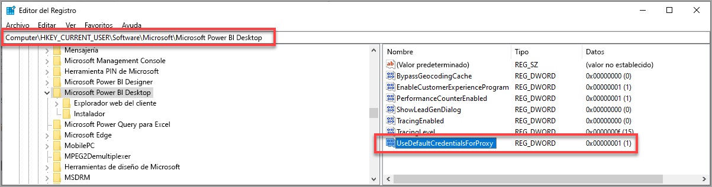

# Solución de problemas de inicio de sesión en Power BI Desktop
Puede haber ocasiones en que intente iniciar sesión en **Power BI Desktop** pero encuentre errores. Hay dos razones principales para problemas de inicio de sesión: **errores de autenticación de proxy** y **errores de redireccionamiento de dirección URL que no son HTTPS**. 

Para determinar qué está causando el problema de inicio de sesión, el primer paso es ponerse en contacto con el administrador y proporcionar información de diagnóstico para que pueda determinar la causa del problema. Mediante un seguimiento de los problemas asociados con su dificultad para iniciar sesión, los administradores pueden determinar cuál de los siguientes errores se aplica al usuario. 

Veamos cada uno de ellos por separado. Al final de este artículo encontrará información sobre cómo capturar un *seguimiento* en Power BI Desktop, lo cual puede ayudarle a realizar un seguimiento de los problemas.

## Error de requerimiento de autenticación de proxy

En la pantalla siguiente se muestra un ejemplo del error *Se requiere autenticación del proxy*.

Las siguientes excepciones en los archivos de seguimiento de *Power BI Desktop* están asociadas a este error:

* *Microsoft.PowerBI.Client.Windows.Services.PowerBIWebException*
* *HttpStatusCode: ProxyAuthenticationRequired*

Cuando se produce este error, el motivo más probable es que un servidor de autenticación de proxy de la red esté bloqueando las solicitudes web emitidas por **Power BI Desktop**. 

Si la red usa un servidor de autenticación de proxy, el administrador puede solucionar este problema si agrega los dominios siguientes a la lista de permitidos del servidor de autenticación de proxy:

* app.powerbi.com
* api.powerbi.com
* dominios en el espacio de nombres *.analysis.windows.net

En el caso de los clientes que forman parte de una nube gubernamental, este problema puede solucionarse si se agregan los dominios siguientes a la lista de permitidos en el servidor de autenticación de proxy:

* app.powerbigov.us
* api.powerbigov.us
* dominios en el espacio de nombres *.analysis.usgovcloudapi.net

## Error de que no se admite el redireccionamiento a direcciones URL que no son HTTPS

Las versiones actuales de **Power BI Desktop** usan la versión actual de la Biblioteca de autenticación de Active Directory (ADAL), que no permite un redireccionamiento a direcciones URL no seguras (no HTTPS). 

Las siguientes excepciones en los archivos de seguimiento de *Power BI Desktop* están asociadas a este error:

* *Microsoft.IdentityModel.Clients.ActiveDirectory.AdalServiceException: no se admite el redireccionamiento a direcciones URL que no son HTTPS en vista web*
* *ErrorCode: non_https_redirect_failed*

Si se produce el error *ErrorCode: non_https_redirect_failed*, una o varias páginas o proveedores de redireccionamiento de la cadena de redireccionamiento no son un punto de conexión protegido con HTTPS, o un emisor de certificados de uno o varios redireccionamientos no está entre las raíces de confianza del dispositivo. Todos los proveedores de cualquier cadena de redireccionamiento de inicio de sesión deben usar una dirección URL HTTPS. Para solucionar este problema, póngase en contacto con el administrador y solicite que se usen direcciones URL seguras para sus sitios de autenticación. 

## Recopilación de un seguimiento en Power BI Desktop

Para recopilar un seguimiento en **Power BI Desktop**, siga estos pasos:

1. Habilite el seguimiento en **Power BI Desktop**; para ello, vaya a **Archivo > Opciones y configuración > Opciones** y seleccione **Diagnósticos** en las opciones en el panel izquierdo. En el panel que aparece, active la casilla junto a **Habilitar seguimiento**, tal y como se muestra en la siguiente imagen. Es posible que tenga que reiniciar **Power BI Desktop**.
   
   

2. A continuación, siga estos pasos que reproducen el error. Cuando esto sucede, **Power BI Desktop** agrega eventos en el registro de seguimiento, que se guarda en el equipo local.

3. Navegue hasta la carpeta de seguimientos en el equipo local. Puede encontrar esa carpeta seleccionando el vínculo de **Diagnósticos** donde habilitó el seguimiento, que se muestra como *Permite abrir la carpeta de volcado de memoria y seguimiento* en la imagen anterior. A menudo esto se encuentra en el equipo local en la siguiente ubicación:

    `C:\Users/<user name>/AppData/Local/Microsoft/Power BI Desktop/Traces`

Puede haber muchos archivos de seguimiento en esa carpeta. Asegúrese de que sólo envía los archivos recientes al administrador para facilitarle una rápida identificación del error. 

## Uso de credenciales predeterminadas del sistema para proxy web

Las solicitudes web emitidas por Power BI Desktop no usan credenciales de proxy web. En las redes que usan un servidor proxy, es posible que Power BI Desktop no pueda realizar correctamente las solicitudes web. 

A partir de la versión de marzo de 2020 de Power BI Desktop, los administradores de red o del sistema pueden permitir el uso de credenciales del sistema predeterminadas para la autenticación del proxy web. Los administradores pueden crear una entrada del Registro llamada **UseDefaultCredentialsForProxy** y establecer el valor en uno (1) para habilitar el uso de las credenciales del sistema predeterminadas para la autenticación del proxy web.

La entrada del Registro se puede colocar en cualquiera de las ubicaciones:

`[HKEY_LOCAL_MACHINE\SOFTWARE\WOW6432Node\Microsoft\Microsoft Power BI Desktop]`
`[HKEY_LOCAL_MACHINE\SOFTWARE\Microsoft\Microsoft Power BI Desktop]`

No es necesario tener la entrada del Registro en ambas ubicaciones.

Una vez creada la entrada del Registro (es posible que sea necesario reiniciar), se usa la configuración de proxy definida en Internet Explorer cuando Power BI Desktop realiza solicitudes web. 

Como sucede con cualquier cambio en la configuración de proxy o de credenciales, hay implicaciones de seguridad en la creación de esta entrada del Registro, por lo que los administradores deben asegurarse de haber configurado correctamente los proxies de Internet Explorer antes de habilitar esta característica.         

### Limitaciones y consideraciones para el uso de credenciales del sistema predeterminadas

Hay una serie de implicaciones de seguridad que los administradores deben tener en cuenta antes de habilitar esta funcionalidad. 

Se deben seguir las recomendaciones siguientes cada vez que se habilite esta característica para los clientes:

* Use solo **Negociación** como esquema de autenticación para el servidor proxy, con el fin de asegurarse de que el cliente solo use los servidores proxy que se unen a la red de Active Directory. 
* No use **Reserva NTLM** en los clientes que utilizan esta característica.
* Si los usuarios no están en una red con un proxy cuando esta característica está habilitada y configurada como se recomienda en esta sección, no se usará el proceso de intentar ponerse en contacto con el servidor proxy y utilizar las credenciales predeterminadas del sistema.

[Uso de credenciales predeterminadas del sistema para proxy web](#using-default-system-credentials-for-web-proxy)

