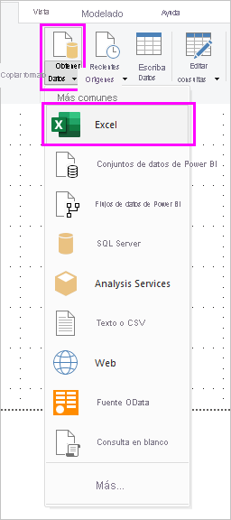
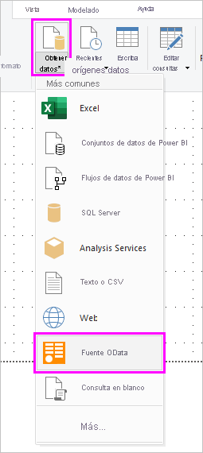
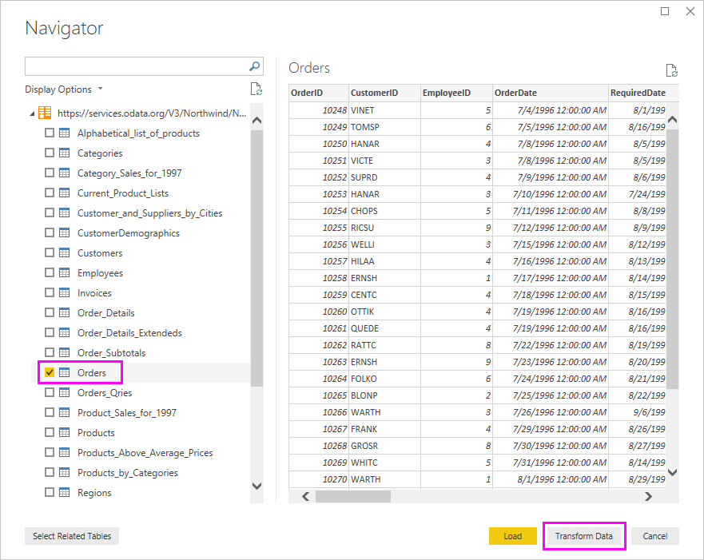
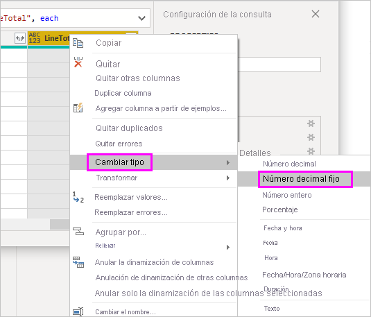
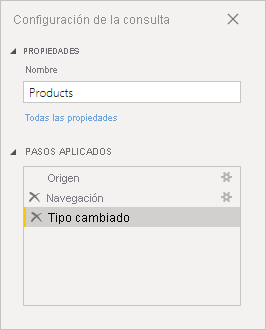
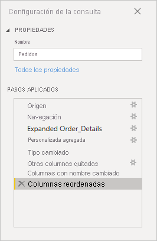
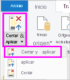
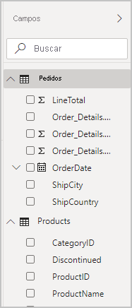
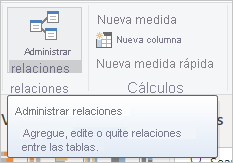
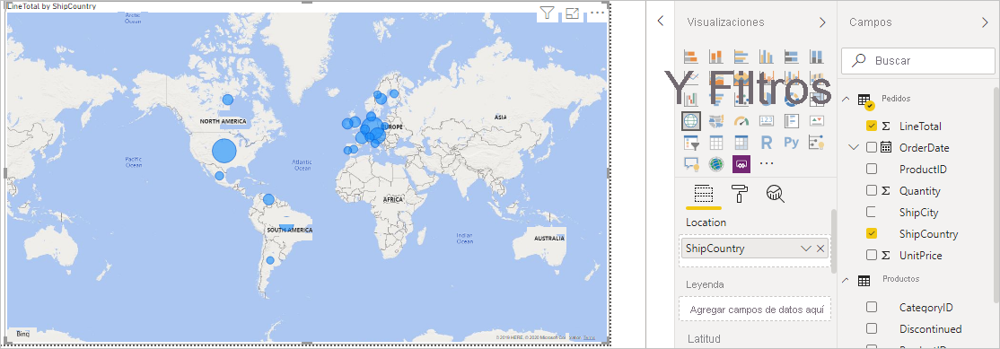

# Tutorial: Análisis de datos de ventas de Excel y una fuente de OData

Es habitual tener datos de varios orígenes de datos. Por ejemplo, podría tener dos bases de datos, una para la información de productos y otra para la información de ventas. Con *Power BI Desktop*, puede combinar datos de orígenes diferentes para crear interesantes y atractivos análisis de datos y visualizaciones.

En este tutorial, combinará datos de dos orígenes de datos:

* Un libro de Excel con información de productos.
* Una fuente de OData que contiene datos de pedidos.

Va a importar cada conjunto de datos y a realizar operaciones de transformación y agregación. Después, usará los datos de los dos orígenes para generar un informe de análisis de ventas con visualizaciones interactivas. Estas técnicas pueden aplicarse también a consultas de SQL Server, archivos CSV y cualquier otro origen de datos en Power  BI Desktop.

>[!NOTE]
>En Power BI Desktop, a menudo hay varias maneras de realizar una tarea. Por ejemplo, puede hacer clic con el botón derecho o usar un menú **Más opciones** en una columna o celda para ver opciones adicionales de la cinta. En los pasos siguientes se describen varios métodos alternativos.

## Importación de datos de productos de Excel

En primer lugar, importe los datos de producto desde el libro de Excel *Products.xlsx* en Power BI Desktop.

1. [Descargue el libro de Excel Products.xlsx](https://download.microsoft.com/download/1/4/E/14EDED28-6C58-4055-A65C-23B4DA81C4DE/Products.xlsx) y guárdelo como *Products.xlsx*.

1. Seleccione la flecha junto a **Obtener datos** en la pestaña **Inicio** de la cinta de opciones de Power BI Desktop y, luego, seleccione **Excel** en el menú **Más comunes**.

   

   >[!NOTE]
   >También puede seleccionar el elemento **Obtener datos** o seleccionar **Obtener datos** en el cuadro de diálogo **Introducción** de Power BI. Luego, seleccione **Excel** o **Archivo** > **Excel** en el cuadro de diálogo **Obtener datos** y, finalmente, **Conectar**.

1. En el cuadro de diálogo **Abrir**, vaya al archivo **Products.xlsx** y selecciónelo y luego seleccione **Abrir**.

1. En el **Navegador**, seleccione la tabla **Productos** y, después, **Transformar datos**.

   

Se abre una vista previa de la tabla en el Editor de Power Query, donde puede aplicar transformaciones para limpiar los datos.

>[!NOTE]
>También puede abrir el Editor de Power Query seleccionando **Editar consultas** > **Editar consultas** en la cinta de opciones **Inicio** de Power BI Desktop. Otra opción es hacer clic con el botón derecho o seleccionar **Más opciones** junto a cualquier consulta de la vista **Informes** y seleccionar **Editar consulta**.

## Limpieza de columnas de productos

El informe combinado solo usará las columnas **ProductID**, **ProductName**, **QuantityPerUnit** y **UnitsInStock** del libro de Excel. Puede quitar las demás columnas.

1. En el Editor de Power Query, seleccione las columnas **ProductID**, **ProductName**, **QuantityPerUnit** y **UnitsInStock**. Puede usar la tecla Ctrl para seleccionar más de una columna, o bien Mayúsculas para seleccionar columnas adyacentes.

1. Haga clic con el botón derecho en cualquiera de los encabezados seleccionados. Seleccione **Quitar otras columnas** en el menú desplegable.
   También puede seleccionar **Quitar columnas** > **Quitar otras columnas** desde el grupo **Administrar columnas** de la pestaña **Inicio** de la cinta de opciones.

   

## Importar los datos de pedidos de la fuente OData

A continuación, importe los datos de pedidos de la fuente de OData del sistema de ventas de Northwind de ejemplo.

1. En el Editor de Power Query, seleccione **Nuevo origen** y, luego, **Fuente de OData** en el menú **Más comunes**.

   

1. En el cuadro de diálogo **Fuente de OData**, escriba la dirección URL de la fuente de OData de Northwind, `https://services.odata.org/V3/Northwind/Northwind.svc/`. Seleccione **Aceptar**.

   

1. En **Navegador**, seleccione la tabla **Pedidos** y, luego, **Transformar datos** para cargar los datos en el Editor de Power Query.

   

   >[!NOTE]
   >En **Navegador**, puede seleccionar cualquier nombre de tabla, sin marcar la casilla, para obtener una vista previa.

## Expansión de los datos del pedido

Cuando se conecta a orígenes de datos que tienen varias tablas, como bases de datos relacionales o la fuente de OData de Northwind, puede utilizar referencias entre tablas para crear las consultas. La tabla **Orders** contiene referencias a varias tablas relacionadas. Puede agregar las columnas **ProductID**, **UnitPrice** y **Quantity** de la tabla relacionada **Order_Details** en la tabla principal (**Orders**) mediante la operación Expandir.

1. Desplácese hacia la derecha en la tabla **Orders** hasta que pueda ver la columna **Order_Details**. Contiene referencias a otra tabla, no datos.

   

1. Seleccione el icono **Expandir** () en el encabezado de columna **Order_Details**.

1. En el menú desplegable:

   1. Seleccione **(Seleccionar todas las columnas)** para borrar todas las columnas.

   1. Seleccione **ProductID**, **UnitPrice** y **Quantity**, y luego seleccione **Aceptar**.

      

Después de expandir la tabla **Order_Details**, tres nuevas columnas de tabla anidada reemplazan a la columna **Order_Details**. Hay nuevas filas en la tabla para los datos agregados de cada pedido.

## Creación de una columna calculada personalizada

El Editor de Power Query le permite crear cálculos y campos personalizados para enriquecer los datos. Se creará una columna personalizada que multiplica el precio unitario por la cantidad de artículos para calcular el precio total de cada artículo de línea en un pedido.

1. En la pestaña **Agregar columna** de la cinta de opciones del Editor de Power Query, seleccione **Columna personalizada**.

   

1. En el cuadro de diálogo **Columna personalizada**, escriba **LineTotal** en el campo **Nuevo nombre de columna**.

1. En el campo **Fórmula de columna personalizada**, después de **=** , escriba **[Order_Details.UnitPrice]** \* **[Order_Details.Quantity]** . También puede seleccionar los nombres de campo en el cuadro de desplazamiento **Columnas disponibles** y seleccionar **<< Insertar**, en lugar de escribirlos.

1. Seleccione **Aceptar**.

   

   El nuevo campo **LineTotal** aparece como la última columna de la tabla **Orders**.

## Definición del tipo de datos del nuevo campo

Cuando el Editor de Power Query se conecta a los datos, intenta determinar el tipo de datos de cada campo con fines de presentación. Un icono de encabezado indica el tipo de datos asignado a cada campo. También puede consultar en **Tipo de datos**, en el grupo **Transformar** de la pestaña **Inicio** de la cinta de opciones.

La nueva columna **LineTotal** tiene un tipo de datos **Any**, pero contiene valores de moneda. Para asignar un tipo de datos, haga clic con el botón derecho en el encabezado de columna **LineTotal**, seleccione **Cambiar tipo** en el menú desplegable y, luego, **Número decimal fijo**.

>[!NOTE]
>También puede seleccionar la columna **LineTotal**, la flecha junto a **Tipo de datos** en la sección **Transformar** de la pestaña **Inicio** de la cinta de opciones, y **Número decimal fijo**.

## Limpieza de las columnas de pedidos

Para que sea más fácil que el modelo funcione con los informes, puede eliminar algunas columnas, cambiarles el nombre y reordenarlas.

El informe va a usar las columnas siguientes:

* **OrderDate**
* **ShipCity**
* **ShipCountry**
* **Order_Details.ProductID**
* **Order_Details.UnitPrice**
* **Order_Details.Quantity**
* **LineTotal**

Seleccione estas columnas y use **Quitar otras columnas** como hizo con los datos de Excel. O bien, puede seleccionar las columnas que no están en la lista, hacer clic con el botón derecho en una de ellos y seleccionar **Quitar columnas**.

Puede cambiar el nombre de las columnas con el prefijo "**Order_Details.** " para facilitar su lectura:

1. Haga doble clic en el encabezado de columna o manténgalo presionado, o bien haga clic con el botón derecho en el encabezado de columna y seleccione **Cambiar nombre** en el menú desplegable.

1. Elimine el prefijo **Order_Details.** de cada nombre.

Por último, para facilitar el acceso a la columna **LineTotal**, arrástrela y colóquela en la izquierda, justo a la derecha de la columna **ShipCountry**.

## Revisión de los pasos de la consulta

Las acciones del Editor de Power Query para dar forma a los datos y transformarlos se registran. Cada acción aparece a la derecha en el panel **Configuración de la consulta**, en **Pasos aplicados**. Puede retroceder por los **Pasos aplicados** para revisar los pasos dados y editarlos, eliminarlos o reorganizarlos si es necesario. Sin embargo, es arriesgado cambiar los pasos anteriores porque pueden afectar a los pasos posteriores.

Seleccione cada una de las consultas en la lista **Consultas** en el lado izquierdo del Editor de Power Query y revise los **Pasos aplicados** en **Configuración de la consulta**. Después de aplicar las transformaciones de datos anteriores, los **pasos aplicados** a las dos consultas deben ser similares a los siguientes:

 &nbsp;&nbsp; 

>[!TIP]
>Subyacentes a los pasos aplicados se encuentran las fórmulas escritas en el *lenguaje de Power Query*, que también se conoce como [lenguaje M](https://docs.microsoft.com/powerquery-m/power-query-m-reference). Para ver y editar las fórmulas, seleccione **Editor avanzado** en el grupo de **consultas** de la pestaña **Inicio** de la cinta de opciones.

## Importación de las consultas transformadas

Cuando obtenga los datos transformados de acuerdo con sus necesidades y esté a punto para importarlos en la vista **Informes** de Power BI Desktop, seleccione **Cerrar y aplicar** > **Cerrar y aplicar** en el grupo **Cerrar** de la pestaña **Inicio** de la cinta de opciones.

Una vez cargados los datos, las consultas aparecen en la lista **Campos** de la vista **Informes** de Power BI Desktop.

## Administración de la relación entre los conjuntos de datos

Power BI Desktop no requiere combinar consultas para crear informes sobre ellas. Sin embargo, puede usar las relaciones entre los conjuntos de datos, en función de los campos que tengan en común, para ampliar y enriquecer los informes. Power BI Desktop puede detectar automáticamente las relaciones, o bien puede crearlas en el cuadro de diálogo **Administrar relaciones** de Power BI Desktop. Para más información, consulte [Crear y administrar relaciones en Power BI Desktop](../transform-model/desktop-create-and-manage-relationships.md).

El campo `ProductID` compartido crea una relación entre los conjuntos de datos de `Orders` y `Products` de este tutorial.

1. En la vista **Informes** de Power BI Desktop, seleccione **Administrar relaciones** en el área **Relaciones** de la pestaña **Inicio** de la cinta de opciones.

   

1. En el cuadro de diálogo **Administrar relaciones**, observe que Power BI Desktop ya ha detectado y enumerado una relación activa entre las tablas **Products** y **Orders**. Para ver la relación, seleccione **Editar**.

   

   Se abre **Editar relación**, donde se muestran los detalles de la relación.  

   

1. Power BI Desktop ha detectado automática y correctamente la relación; por tanto, puede seleccionar **Cancelar** y luego **Cerrar**.

En Power BI Desktop, en el lado izquierdo, seleccione **Modelo** para ver y administrar las relaciones de la consulta. Haga doble clic en la flecha situada en la línea que conecta las dos consultas para abrir el cuadro de diálogo **Editar relación** y ver o cambiar la relación.

Para volver a la vista **Informes** desde la vista **Modelo**, seleccione el icono **Informe**.

## Creación de visualizaciones con los datos

Puede crear diferentes visualizaciones en la vista de revisión de Power BI Desktop para obtener información sobre los datos. Puede generar informes con varias páginas y cada página puede tener varios objetos visuales. Tanto usted como otros usuarios pueden interactuar con las visualizaciones para ayudar a analizar y comprender los datos. Para más información, consulte [Interacción con un informe en la vista de edición en el servicio Power BI](../create-reports/service-interact-with-a-report-in-editing-view.md)

Puede usar los dos conjuntos de datos y la relación entre ellos para facilitar la visualización y el análisis de los datos de ventas.

En primer lugar, cree un gráfico de columnas apiladas que utilice campos de las dos consultas para mostrar la cantidad de cada producto pedido.

1. Seleccione el campo **Quantity** de **Orders** en el panel **Campos** de la derecha, o bien arrástrelo hasta un espacio en blanco en el lienzo. Se crea un gráfico de columnas apiladas en el que se muestra la cantidad total de todos los productos pedidos.

1. Para mostrar la cantidad de cada producto pedido, seleccione **ProductName** en **Products** en el panel **Campos**, o bien arrástrelo hasta el gráfico.

1. Para ordenar los productos según los más o los menos solicitados, seleccione los puntos suspensivos **Más opciones** ( **...** ) en la parte superior derecha de la visualización y, luego, **Ordenar por cantidad**.

1. Use los controladores de las esquinas del gráfico para ampliarlo, para que aparezcan más nombres de productos.

   

A continuación, cree un gráfico en el que aparezcan los importes en dólares de los pedidos (**LineTotal**) a lo largo del tiempo (**OrderDate**).

1. Sin ningún elemento seleccionado en el lienzo, seleccione **LineTotal** en **Orders** en el panel **Campos**, o bien arrástrelo hasta un espacio en blanco en el lienzo. En el gráfico de columnas apiladas se muestra la cantidad total en dólares de todos los pedidos.

1. Seleccione el gráfico apilado y seleccione **OrderDate** en **Pedidos** o bien arrástrelo hasta el gráfico. En el gráfico ahora se muestran el total de línea de cada fecha de pedido.

1. Para cambiar el tamaño de la visualización y poder ver más datos, arrastre las esquinas.

   

   >[!TIP]
   >Si solo ve los **años** en el gráfico y solo tres puntos de datos, seleccione la flecha que está junto a **OrderDate** en el campo **Eje** del panel **Visualizaciones** y seleccione **OrderDate** en lugar de **Jerarquía de fechas**.

Por último, cree una visualización de mapa en la que se muestren las cantidades de pedidos de cada país.

1. Sin ningún elemento seleccionado en el lienzo, seleccione **ShipCountry** en **Orders** en el panel **Campos**, o bien arrástrelo hasta un espacio en blanco en el lienzo. Power BI Desktop detecta que los datos son nombres de países. A continuación, crea automáticamente una visualización de mapa, con un punto de datos por cada país con pedidos.

1. Para que los tamaños de los puntos de datos reflejen los importes de los pedidos de cada país, arrastre el campo **LineTotal** hasta el mapa. También puede arrastrarlo a **Arrastre campos de datos aquí** en **Tamaño** en el panel **Visualizaciones**. Los tamaños de los círculos en el mapa ahora reflejan las cantidades en dólares de los pedidos de cada país.

   

## Interactuación con los objetos visuales de informes para analizar más

Power BI Desktop permite interactuar con objetos visuales que se filtran y resaltan entre sí para descubrir las tendencias futuras. Para obtener más información, consulte [Filtros y resaltado en informes de Power BI](../create-reports/power-bi-reports-filters-and-highlighting.md).

Debido a la relación que existe entre las consultas, las interacciones con una visualización afectan a todas las demás visualizaciones de la página.

En la visualización de mapa, seleccione el círculo en el centro de **Canadá**. Las otras dos visualizaciones se filtran para resaltar los totales de línea y las cantidades de pedidos para Canadá.

Seleccione un producto del gráfico **Cantidad por nombre de producto** para ver el mapa y el filtro de fecha para reflejar los datos de ese producto. Seleccione una fecha del gráfico **LineTotal por OrderDate** para ver el mapa y el filtro de gráfico de producto para mostrar los datos de esa fecha.

>[!TIP]
>Para anular una selección, vuelva a realizar la selección o seleccione alguna de las otras visualizaciones.

## Completar el informe de análisis de ventas

El informe completo combina los datos del archivo de Excel *Products.xlsx* y la fuente de OData de Northwind en objetos visuales que le ayudarán a analizar la información de los pedidos de los distintos países, períodos de tiempo y productos. Cuando el informe esté listo, puede [cargarlo en el servicio Power BI](../create-reports/desktop-upload-desktop-files.md) para compartirlo con otros usuarios de Power BI.

## Pasos siguientes

* [Microsoft Learn para Power BI](https://docs.microsoft.com/learn/powerplatform/power-bi?WT.mc_id=powerbi_landingpage-docs-link)
* [Vea vídeos de Power BI Desktop](/power-bi/fundamentals/desktop-videos)
* [Visite el foro de Power BI](https://go.microsoft.com/fwlink/?LinkID=519326)
* [Lea el blog de Power BI](https://go.microsoft.com/fwlink/?LinkID=519327)
