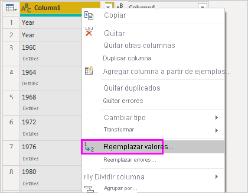
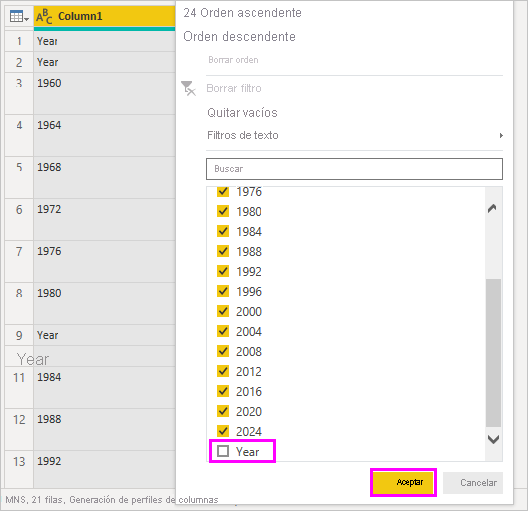
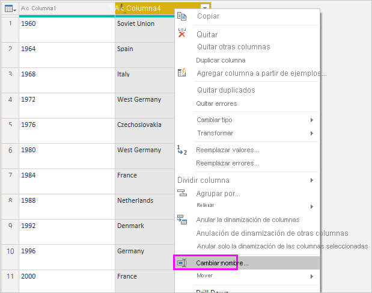
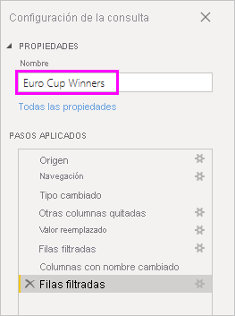
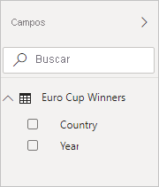
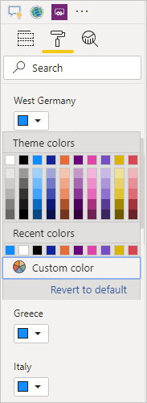
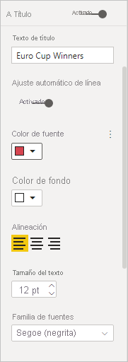
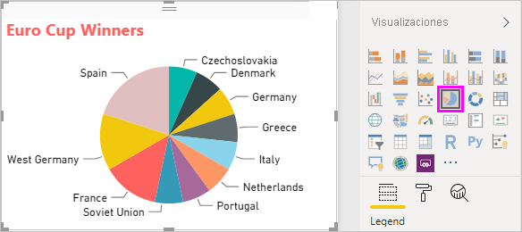

# Tutorial: Análisis de datos de páginas web con Power BI Desktop

Como antiguo fanático del fútbol, desea crear un informe de los ganadores de Campeonato Europeo de la UEFA (Eurocopa) a lo largo de los años. Con Power BI Desktop, puede importar estos datos desde una página web en un informe y crear visualizaciones que muestren los datos. En este tutorial, aprenderá a usar Power BI Desktop para:

- Conectarse a un origen de datos web y navegar por las tablas disponibles.
- Dar forma a los datos y transformarlos en el Editor de Power Query.
- Asignar un nombre a una consulta e importarla en un informe de Power BI Desktop.
- Crear y personalizar un mapa y una visualización de gráfico circular

## Conexión a un origen de datos de web

Puede obtener los datos de los ganadores de la UEFA de la tabla Historial de la página de Wikipedia sobre el Campeonato Europeo de fútbol de la UEFA (Eurocopa), en https://en.wikipedia.org/wiki/UEFA_European_Football_Championship. 

Las conexiones web solo se establecen con la autenticación básica. Los sitios web que requieren autenticación podrían no funcionar correctamente con el conector web.

Para importar los datos:

1. En la pestaña de la cinta de opciones **Inicio** de Power BI Desktop, despliegue la flecha que está junto a **Obtener datos** y luego seleccione **Web**.

    

   >[!NOTE]
   >También puede seleccionar el elemento **Obtener datos** mismo o seleccionar **Obtener datos** en el cuadro de diálogo Introducción de Power BI Desktop, seleccionar después **Web** en la sección **Todo** u **Otros** del cuadro de diálogo **Obtener datos** y, luego, seleccionar **Conectar**.

1. En el cuadro de diálogo **Desde la Web**, pegue la dirección URL `https://en.wikipedia.org/wiki/UEFA_European_Football_Championship` en el cuadro de texto **URL** y luego seleccione **Aceptar**.

    

   Después de conectarse a la página web de Wikipedia, el cuadro de diálogo **Navegador** muestra una lista de las tablas disponibles en la página. Puede seleccionar cualquiera de los nombres de tabla para obtener una vista previa de sus datos. La tabla **Results [edit]** contiene los datos que desea, pero no presenta exactamente la forma esperada. Podrá cambiar la forma de los datos y limpiarlos antes de cargarlos en el informe.

   

   >[!NOTE]
   >En el panel **Vista previa** se muestra la tabla seleccionada más recientemente, pero todas las tablas seleccionadas se cargarán en el Editor de Power Query si selecciona **Transformar datos** o **Cargar**.

1. Seleccione la tabla **Results [edit]** en la lista **Navegador** y después seleccione **Transformar datos**.

   Se abre una vista previa de la tabla en el **Editor de Power Query**, donde puede aplicar transformaciones para limpiar los datos.

   

## Dar forma a los datos en el Editor de Power Query

Desea facilitar el análisis de los datos mostrando solo los años y los países ganadores. Puede usar el Editor de Power Query para realizar estos pasos necesarios para dar forma a los datos y limpiarlos.

En primer lugar, quite todas las columnas excepto dos de la tabla. Cambie el nombre de estas columnas a *Year* y *Country* más adelante en el proceso.

1. En la cuadrícula **Editor de Power Query**, seleccione las columnas. Seleccione Ctrl para seleccionar varios elementos.

1. Haga clic con el botón derecho y seleccione **Quitar otras columnas** o seleccione **Quitar columnas** > **Quitar otras columnas** en el grupo **Administrar columnas** de la pestaña de la cinta de opciones **Inicio** para eliminar todas las demás columnas de la tabla.

   

   o bien

   

A continuación, quite la palabra adicional *Details* de las celdas de la primera columna.

1. Seleccione la primera columna.

1. Haga clic con el botón derecho y seleccione **Reemplazar valores** o seleccione **Reemplazar los valores** del grupo **Transformar** en la pestaña **Inicio** de la cinta de opciones. Esta opción también se encuentra en el grupo **Cualquier columna** de la pestaña **Transformar**.

    

   o bien

   

1. En el cuadro de diálogo **Reemplazar los valores**, escriba **Details** en el cuadro de texto **Valor que buscar**, deje el cuadro de texto **Reemplazar por** vacío y luego seleccione **Aceptar** para borrar la palabra *Details* de esta columna.

   

Algunas celdas contienen solo la palabra "Year" en lugar de valores de año. Puede filtrar la columna para que solo se muestren las filas que no contienen la palabra "Year".

1. Seleccione la flecha desplegable del filtro de la columna.

1. En el menú desplegable, desplácese hacia abajo y desactive la casilla junto a la opción **Year** y, luego, seleccione **Aceptar**.

   

Como solo va a examinar la lista de campeones, puede cambiar el nombre de esta columna a **Country**. Para cambiar el nombre de la columna:

1. Haga doble clic en el encabezado de la segunda columna y manténgalo presionado.
   - O bien, haga clic en el encabezado de la columna y seleccione **Cambiar el nombre**.
   - Otra opción es seleccionar la *columna y seleccionar **Cambiar el nombre** en el grupo **Cualquier columna** de la pestaña **Transformar** de la cinta de opciones.

    
  
   o bien

   

1. Escriba **Country** en el encabezad y presione **ENTRAR** para cambiar el nombre de la columna.

También puede filtrar las filas como "2020" que tengan valores null en la columna **Country**. Podría usar el menú de filtro como en el caso de los valores **Year**, o bien puede hacer lo siguiente:

1. Haga clic con el botón derecho en la celda **Country** en la fila **2020**, que tiene el valor *null*.

1. Seleccione **Filtros de texto** > **No es igual a** en el menú contextual para quitar todas las filas que contienen ese valor de celda.

   

## Importación de la consulta en la vista de informe

Ahora que ya ha dado forma a los datos de la manera deseada, puede asignar el nombre "Euro Cup Winners" a su consulta e importarla en el informe.

1. En el panel **Configuración de consultas** , en el cuadro de texto **Nombre** , escriba **Campeones de la Eurocopa**.

   

1. Seleccione **Cerrar y aplicar** > **Cerrar y aplicar** en la pestaña **Inicio** de la cinta de opciones.

   

La consulta se carga en la *Vista de informe* de Power BI Desktop, donde puede verla en el panel **Campos**.

   

>[!TIP]
>Puede volver siempre al Editor de Power Query para editar y refinar la consulta; para ello, haga lo siguiente:
>- Seleccione los puntos suspensivos **Más opciones** ( **...** ) junto a **Euro Cup Winners** en el panel **Campos** y seleccione **Editar consulta**.
>- Seleccione **Editar consultas** > **Editar consultas** en el grupo **Datos externos** de la pestaña **Inicio** de la cinta de opciones en la vista de informe. 

## Creación de una visualización

Para crear una visualización basada en los datos:

1. Seleccione el campo **Country** en el panel **Campos** o arrástrelo al lienzo del informe. Power BI Desktop reconoce los datos como nombres de países y crea automáticamente una visualización de **mapa**.

   

1. Amplíe el mapa arrastrando los controladores de las esquinas para que todos los nombres de los países ganadores estén visibles.  

   

1. En el mapa se muestran puntos de datos idénticos para cada país ganador del campeonato de la Eurocopa. Para que el tamaño de cada punto de datos refleje cuántas veces ha ganado el país, arrastre el campo **Year** a **Arrastrar campos de datos aquí** en **Tamaño** en la parte inferior del panel **Visualizaciones**. El campo cambia automáticamente a una medida de **Número de años** y en la visualización del mapa se muestran ahora los puntos de datos más altos para los países que ganaron más campeonatos.

   

## Personalización de la visualización

Como puede ver, es muy fácil crear visualizaciones basadas en los datos. También es fácil personalizar las visualizaciones para presentar mejor los datos de las formas que desee.

### Dar formato al mapa

Puede cambiar la apariencia de una visualización; para ello, selecciónela y luego seleccione el icono **Formato** (rodillo) en el panel **Visualizaciones**. Por ejemplo, los puntos de datos de "Alemania" podrían ser erróneos en su visualización, ya que Alemania Occidental ganó dos campeonatos y Alemania, uno, y en el mapa se superponen los dos puntos en lugar de separarlos o agregarlos juntos. Puede dar color diferentes a estos dos puntos para resaltar este hecho. También puede dar al mapa un título más descriptivo y atractivo.

1. Con la visualización seleccionada, seleccione el icono **Formato** y luego seleccione **Colores de datos** para expandir las opciones de color de los datos.

   

1. Cambie el estado de **Mostrar todo** a **Activado** y luego seleccione el menú desplegable junto a **Alemania Occidental** y elija el color amarillo.

   

1. Seleccione **Título** para expandir las opciones de título y, en el campo **Texto del título**, escriba **Euro Cup Winners** en lugar del título actual.

1. Cambie el **Color de fuente** a rojo, el **Tamaño del texto** a **12** y la **Familia de fuentes** a **Segoe (Negrita)** .

   

La visualización de mapa ahora tiene el siguiente aspecto:

### Cambiar el tipo de visualización

Puede cambiar el tipo de una visualización si la selecciona y, a continuación, selecciona un icono diferente en la parte superior del panel **Visualizaciones**. Por ejemplo, en la visualización de mapa faltan los datos de la Unión Soviética y de la República Checa, porque esos países ya no existen en el mapa del mundo. Otro tipo de visualización, como un gráfico de rectángulos o un gráfico circular, puede ser más precisa, porque muestra todos los valores.

Para cambiar el mapa a un gráfico circular, selecciónelo y luego seleccione el icono de **Gráfico circular** en el panel **Visualizaciones**.

>[!TIP]
>- Puede usar las opciones de formato de **Colores de datos** para resaltar "Alemania" y "Alemania Occidental" en el mismo color. 
>- Para agrupar los países con más campeonatos ganados en el gráfico circular, seleccione los puntos suspensivos ( **…** ) en la parte superior derecha de la visualización y luego seleccione **Ordenar por número de año**.

Power BI Desktop ofrece una experiencia perfectamente integrada que va desde la obtención de datos procedentes de una amplia gama de orígenes hasta su manipulación para adaptarlos a cualquier necesidad de análisis y su visualización de forma enriquecida e interactiva. Cuando el informe esté listo, podrá [cargarlo en Power BI](../create-reports/desktop-upload-desktop-files.md) y crear paneles basados en él, paneles que podrá compartir con otros usuarios de Power BI.

## Vea también

* [Microsoft Learn para Power BI](/learn/powerplatform/power-bi?WT.mc_id=powerbi_landingpage-docs-link)
* [Vea vídeos de Power BI Desktop](../fundamentals/desktop-videos.md)
* [Visite el foro de Power BI](https://go.microsoft.com/fwlink/?LinkID=519326)
* [Lea el blog de Power BI](https://go.microsoft.com/fwlink/?LinkID=519327)