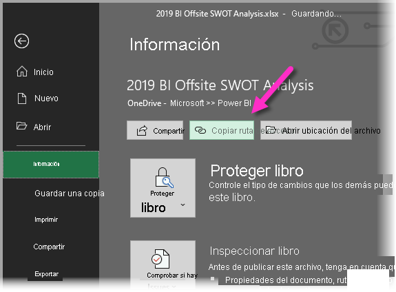
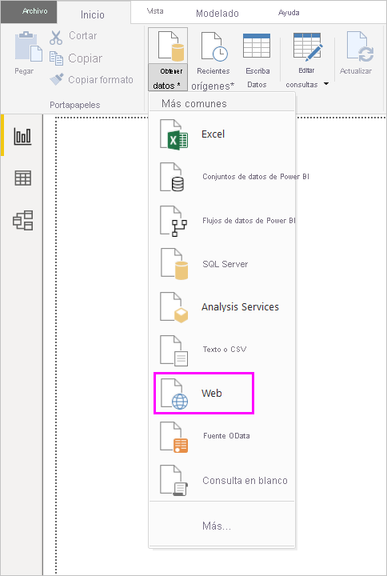
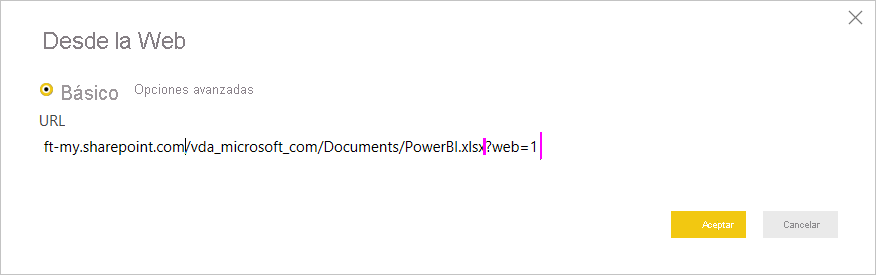

# Usar vínculos de OneDrive para la Empresa en Power BI Desktop
Muchas personas tienen los libros de Excel almacenados en OneDrive para la Empresa, que sería ideal para su uso con Power BI Desktop. Con Power BI Desktop, puede usar los vínculos en línea para archivos de Excel almacenados en OneDrive para la Empresa con el fin de crear informes y objetos visuales. Puede usar una cuenta de grupo de OneDrive para la Empresa, o bien una personal.

La obtención de un vínculo en línea desde OneDrive para la Empresa requiere unos pasos específicos. Las siguientes secciones explican estos pasos, que le permiten compartir el vínculo de archivo entre grupos, en distintos equipos y con sus compañeros de trabajo.

## Obtención de un vínculo de Excel
1. Vaya a la ubicación de OneDrive para la Empresa mediante un explorador. Haga clic con el botón derecho en el archivo que desee usar y seleccione **Abrir en Excel**.
   
   > [!NOTE]
   > Es posible que la interfaz de explorador no tenga exactamente el mismo aspecto que la siguiente imagen. Hay muchas maneras de seleccionar **Abrir en Excel** para los archivos de la interfaz del explorador de OneDrive para la Empresa. Puede utilizar cualquier opción que permita abrir el archivo en Excel.
   
   

2. En Excel, seleccione **Archivo** > **Información** y, luego, haga clic en el botón **Copiar ruta de acceso**, tal como se muestra en la siguiente imagen.
   
   

## Usar el vínculo en Power BI Desktop
En Power BI Desktop, puede usar el vínculo que acaba de copiar en el portapapeles. Realice los pasos siguientes:

1. En Power BI Desktop, seleccione **Obtener datos** > **Web**.
   
   
2. Con la opción **Básico** seleccionada, pegue el vínculo en el cuadro de diálogo **De la web**.
3. Quite la cadena *?web=1* al final del vínculo para que Power BI Desktop pueda navegar correctamente hasta el archivo y, después, seleccione **Aceptar**.
   
     
4. Si Power BI Desktop solicita las credenciales, elija **Windows** (para sitios de SharePoint local) o **Cuenta profesional** (para sitios de Microsoft 365 o OneDrive para la Empresa).
   
   

   Aparecerá un cuadro de diálogo **Navegador**, que le permite realizar la selección a partir de las tablas, hojas y rangos que se encuentran en el libro de Excel. Desde allí, puede usar el archivo de OneDrive para la Empresa, al igual que cualquier otro archivo de Excel. Puede crear informes y utilizarlos en conjuntos de datos, tal como lo haría con cualquier otro origen de datos.

> [!NOTE]
> Para usar un archivo de OneDrive para la Empresa como origen de datos en el servicio Power BI, con **Actualizar servicio** habilitado para ese archivo, asegúrese de seleccionar **OAuth2** como **Método de autenticación** al configurar las opciones de actualización. De lo contrario, podría encontrarse un error (como *No se pudieron actualizar las credenciales del origen de datos*) al intentar realizar la conexión o la actualización. Seleccionar **OAuth2** como método de autenticación soluciona ese error de credenciales.
>
