# <a name="data-refresh-in-power-bi"></a>Actualizar datos en Power BI

Power BI le permite pasar rápidamente de los datos al conocimiento y a la acción, pero debe asegurarse de que los datos de los informes de Power BI y los paneles sean recientes. Saber cómo actualizar los datos es esencial para proporcionar resultados precisos.

En este artículo se describen las características de actualización de datos de Power BI y sus dependencias en un nivel conceptual. También proporciona procedimientos recomendados y sugerencias para evitar problemas comunes de actualización. El contenido sienta la base que le permitirá entender cómo funciona la actualización de datos. Para obtener instrucciones paso a paso específicas para configurar la actualización de datos, consulte los tutoriales y guías de procedimientos indicadas en la sección Pasos siguientes al final de este artículo.

## <a name="understanding-data-refresh"></a>Información sobre la actualización de datos

Siempre que actualice los datos, Power BI debe consultar los orígenes de datos subyacentes, probablemente cargar los datos de origen en un conjunto de datos y, a continuación, actualizar las visualizaciones de informes o los paneles que se basan en el conjunto de datos actualizado. Todo el proceso consta de varias fases, dependiendo de los modos de almacenamiento de los conjuntos de datos, tal y como se explica en las secciones siguientes.

Para entender cómo actualiza Power BI los conjuntos de datos, informes y paneles, debe conocer los siguientes conceptos:

- **Modos de almacenamiento y tipos de conjuntos de datos**: Los modos de almacenamiento y los tipos de conjuntos de datos que admite Power BI tienen distintos requisitos de actualización. Puede elegir entre volver a importar los datos en Power BI para ver los cambios que se ha producido o consultar los datos directamente en el origen.
- **Tipos de actualización de Power BI**: Independientemente de los detalles del conjunto de datos, conocer los distintos tipos de actualización puede ayudarle a entender a qué dedica su tiempo Power BI durante una operación de actualización. Y combinar esta información con las características específicas del modo de almacenamiento ayuda a entender lo que hace Power BI exactamente cuando se selecciona **Actualizar ahora** para un conjunto de datos.

### <a name="storage-modes-and-dataset-types"></a>Modos de almacenamiento y tipos de conjuntos de datos

Un conjunto de datos de Power BI puede funcionar en uno de los siguientes modos para acceder a los datos en distintos orígenes de datos. Para obtener más información, consulte [Modo de almacenamiento en Power BI Desktop](../transform-model/desktop-storage-mode.md).

- Modo de importación
- Modo DirectQuery
- Modo LiveConnect
- Modo de inserción

En el siguiente diagrama se ilustran los diferentes flujos de datos según el modo de almacenamiento. El punto más importante es que solo los conjuntos de datos del modo de importación requieren la actualización de los datos en el origen. La actualización es necesaria porque solo este tipo de conjunto de datos importa los datos desde el origen de datos, y los datos importados pueden actualizarse de forma regular o puntual. Los conjuntos de datos de los modos DirectQuery y LiveConnect de consulta y conexión a Analysis Services no importan datos; consultan el origen de datos subyacente en cada interacción del usuario. Los conjuntos de datos en modo de inserción no acceden a los orígenes de datos directamente, sino que esperan que usted inserte los datos en Power BI. Los requisitos de actualización de los conjuntos de datos varían según el tipo de conjunto de datos o el modo de almacenamiento.

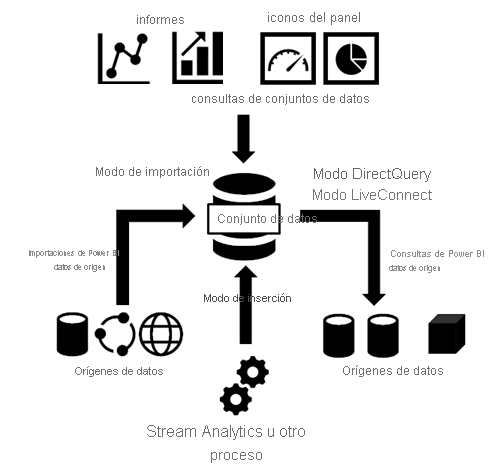

#### <a name="datasets-in-import-mode"></a>Conjuntos de datos en el modo de importación

Power BI importa los datos de los orígenes de datos originales en el conjunto de datos. Las consultas de los paneles e informes de Power BI que se envían al conjunto de datos devuelven los resultados de las tablas y columnas importadas. Se podría pensar en este conjunto de datos como en una copia de un momento en el tiempo. Como Power BI copia los datos, debe actualizar el conjunto de datos para capturar los cambios de los orígenes de datos subyacentes.

Como Power BI almacena en caché los datos, el tamaño de los conjuntos de datos en el modo de importación puede ser considerable. Consulte la siguiente tabla para ver los tamaños máximos de los conjuntos de datos por capacidad. Mantenga el tamaño de los conjuntos de datos con un buen margen por debajo del límite máximo para evitar problemas de actualización si los conjuntos de datos necesitan más recursos que el máximo disponible durante una operación de actualización.

| Tipo de capacidad | Tamaño máximo del conjunto de datos |
| --- | --- |
| Compartido, A1, A2 o A3 | 1 GB |
| A4 o P1 | 3 GB |
| A5 o P2 | 6 GB |
| A6 o P3 | 10 GB |
| | |

#### <a name="datasets-in-directqueryliveconnect-mode"></a>Conjuntos de datos en los modos DirectQuery o LiveConnect

Power BI no importa datos a través de conexiones que funcionan en los modos DirectQuery o LiveConnect. En su lugar, el conjunto de datos devuelve los resultados del origen de datos subyacente siempre que un informe o panel consultan el conjunto de datos. Power BI transforma y reenvía las consultas al origen de datos.

Aunque los modos DirectQuery y LiveConnect son similares en cuanto que Power BI reenvía las consultas al origen, es importante tener en cuenta que Power BI no tiene que transformar las consultas en el modo LiveConnect. Las consultas van directamente a la instancia de Analysis Services que hospeda la base de datos sin consumir los recursos de la capacidad Compartido o Premium.

Como Power BI no importa los datos, no es necesario ejecutar una actualización de datos. Sin embargo, Power BI todavía realiza actualizaciones de los iconos y, posiblemente, actualizaciones de los informes, tal y como se explica en la siguiente sección sobre los tipos de actualizaciones. Un icono es un objeto visual de informe anclado a un panel, y las actualizaciones de los iconos del panel se producen cada hora aproximadamente para que muestren los resultados más recientes. Puede cambiar la programación en la configuración del conjunto de datos, tal y como se muestra en la captura de pantalla siguiente, o forzar una actualización manualmente mediante la opción **Actualizar ahora**.

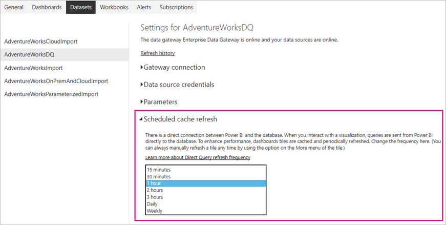

> [!NOTE]
> La sección **Actualización de caché programada** de la pestaña **Conjuntos de datos** no está disponible para los conjuntos de datos en el modo de importación. Estos conjuntos de datos no requieren una actualización independiente de los iconos porque Power BI los actualiza automáticamente durante las actualizaciones de datos programadas o a petición.

#### <a name="push-datasets"></a>Conjuntos de datos de inserción

Los conjuntos de datos de inserción no contienen una definición formal de un origen de datos, por lo que no requieren una actualización de datos en Power BI. Se actualizan insertando los datos en el conjunto de datos mediante un servicio o un proceso externo, como Azure Stream Analytics. Este es un enfoque habitual para realizar análisis en tiempo real con Power BI. Power BI sigue realizando actualizaciones de la memoria caché para todos los iconos que se utilizan con un conjunto de datos de inserción. Para ver un tutorial detallado, consulte [Tutorial: Stream Analytics y Power BI: un panel de análisis en tiempo real para streaming de datos](/azure/stream-analytics/stream-analytics-power-bi-dashboard).

> [!NOTE]
> El modo de inserción tiene varias limitaciones, como se documenta en [limitaciones de la API REST de Power BI](../developer/automation/api-rest-api-limitations.md).

### <a name="power-bi-refresh-types"></a>Tipos de actualización de Power BI

Una operación de actualización de Power BI puede constar de varios tipos de actualización, incluida la actualización de datos, actualización de OneDrive, actualización de las memorias caché de consultas, actualización de los iconos y actualización de los objetos visuales de informes. Aunque Power BI determina automáticamente los pasos de actualización necesarios para un determinado conjunto de datos, debe saber cómo contribuyen a la complejidad y la duración de una operación de actualización. Consulte una referencia rápida en la tabla siguiente.

| Modo de almacenamiento | Actualización de datos | Actualización de OneDrive | Memorias caché de consultas | Actualización de iconos | Objetos visuales de informes |
| --- | --- | --- | --- | --- | --- |
| Importación | A petición y programada | Sí, para los conjuntos de datos conectados | Si están habilitadas en la capacidad Premium | Automáticamente y a petición | No |
| DirectQuery | No aplicable | Sí, para los conjuntos de datos conectados | Si están habilitadas en la capacidad Premium | Automáticamente y a petición | No |
| LiveConnect | No aplicable | Sí, para los conjuntos de datos conectados | Si están habilitadas en la capacidad Premium | Automáticamente y a petición | Sí |
| Insertar | No aplicable | No aplicable | No son prácticas | Automáticamente y a petición | No |
| | | | | | |

#### <a name="data-refresh"></a>Actualización de datos

Para los usuarios de Power BI, actualizar los datos normalmente significa importar datos desde los orígenes de datos originales en un conjunto de datos, ya sea mediante una actualización programada o a petición. Puede realizar varias actualizaciones de los conjuntos de datos diariamente; esto podría ser necesario si el origen de datos subyacente cambia con frecuencia. Power BI limita los conjuntos de datos en la capacidad compartida a ocho actualizaciones diarias. Si el conjunto de datos reside en una capacidad Premium, puede programar hasta 48 actualizaciones al día en la configuración de dicho conjunto de datos. Para obtener más información, consulte [Configuración de actualizaciones programadas](#configure-scheduled-refresh) más adelante en este artículo. Los conjuntos de valores de capacidad Premium con el [punto de conexión de XMLA ](../admin/service-premium-connect-tools.md) habilitado para lectura y escritura admiten operaciones de actualización ilimitadas cuando se configuran mediante programación con TMSL o PowerShell.

También es importante destacar que la limitación de capacidad compartida de las actualizaciones diarias se aplica tanto a las actualizaciones programadas como a las actualizaciones de API combinadas. También puede desencadenar una actualización a petición si selecciona **Actualizar ahora** en el menú del conjunto de datos, tal y como muestra la captura de pantalla siguiente. Las actualizaciones a petición no se incluyen en la limitación de actualización. Tenga en cuenta también que los conjuntos de datos de una capacidad Premium no imponen limitaciones para las actualizaciones de API. Si está interesado en crear su propia solución de actualización mediante la API REST de Power BI, consulte [Conjuntos de datos: actualizar conjunto de datos](/rest/api/power-bi/datasets/refreshdataset).

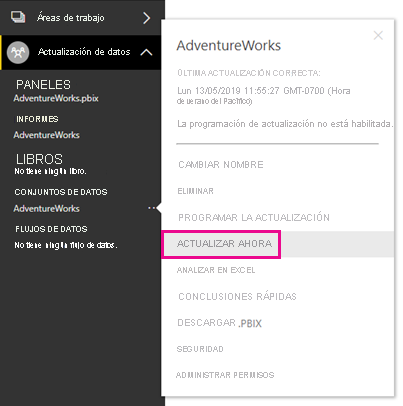

> [!NOTE]
> Las actualizaciones de datos deben completarse en menos de 2 horas en la capacidad compartida. Si los conjuntos de datos requieren operaciones de actualización más prolongadas, considere la posibilidad de mover el conjunto de datos a una capacidad Premium. En la capacidad Premium, la duración máxima de la actualización es de 5 horas.

#### <a name="onedrive-refresh"></a>Actualización de OneDrive

Si ha creado los conjuntos de datos y lo sinformes basados en un archivo de Power BI Desktop, un libro de Excel o un archivo de valores separados por comas (.csv) en OneDrive o SharePoint Online, Power BI realiza otro tipo de actualización, conocida como actualización de OneDrive. Para más información, consulte [Obtener datos de archivos en Power BI](service-get-data-from-files.md).

A diferencia de una actualización del conjunto de datos, en la cual Power BI importa datos desde un origen de datos en un conjunto de datos, la actualización de OneDrive sincroniza los conjuntos de datos y los informes con sus archivos de origen. De forma predeterminada, Power BI comprueba cada hora aproximadamente si un conjunto de datos conectado a un archivo en OneDrive o SharePoint Online requiere sincronización.

Power BI hace una actualización basada en un id. de elemento en OneDrive, por lo que debe tener cuidado al considerar actualizaciones en lugar de reemplazos. Cuando se establece un archivo de OneDrive como el origen de datos, Power BI hace referencia al identificador de elemento del archivo cuando realiza la actualización. Considere el escenario siguiente: tiene un archivo maestro _A_ y una copia de producción de ese archivo _B_, y configura la actualización de OneDrive para el archivo B. Si después _copia_ el archivo A sobre el archivo B, la operación de copia elimina el archivo B antiguo y crea un archivo B con otro identificador de elemento, lo que interrumpe la actualización de OneDrive. Para evitar esta situación, puede cargar y reemplazar el archivo B, que mantiene el mismo id. de elemento.

Puede trasladar el archivo a otra ubicación (por ejemplo, mediante arrastrar y colocar) y la actualización seguirá funcionando porque Power BI todavía conoce el id. de archivo. Pero si copia el archivo en otra ubicación, se crea una instancia del archivo y un valor fileID nuevos. Por tanto, la referencia al archivo de Power BI ya no es válida y se producirá un error en la actualización.

> [!NOTE]
> Power BI puede tardar hasta 60 minutos en actualizar un conjunto de datos, incluso una vez que se completa la sincronización en la máquina local y después de que haya usado *Actualizar ahora* en el servicio Power BI.

Para revisar los ciclos de sincronización anteriores, consulte la pestaña OneDrive en el historial de actualizaciones. La captura de pantalla siguiente muestra un ciclo de sincronización completa para un conjunto de datos de ejemplo.


Tal y como se muestra en la captura de pantalla anterior, Power BI identifica esta actualización de OneDrive como una actualización **programada**, pero no es posible configurar el intervalo de actualización. Solo se puede desactivar la actualización de OneDrive en la configuración del conjunto de datos. Desactivar la actualización resulta útil si no desea que los conjuntos de datos y los informes de Power BI tomen automáticamente los cambios de los archivos de origen.

Tenga en cuenta que la página de configuración del conjunto de datos solo muestra las secciones **Credenciales de OneDrive** y **Actualización de OneDrive** si el conjunto de datos está conectado a un archivo en OneDrive o SharePoint Online, como en la siguiente captura de pantalla. Los conjuntos de datos que no están conectados al archivo de origen en OneDrive o SharePoint Online no muestran estas secciones.


Si deshabilita la actualización de OneDrive para un conjunto de datos y quiere sincronizar el conjunto de datos a petición, seleccione **Actualizar ahora** en el menú de conjunto de datos. Como parte de la actualización a petición, Power BI comprueba si el archivo de origen en OneDrive o SharePoint Online es más reciente que el conjunto de datos en Power BI y, si así fuera, sincroniza el conjunto de datos. El **historial de actualizaciones** enumera estas actividades como actualizaciones a petición en la pestaña **OneDrive**.

Tenga en cuenta que la actualización de OneDrive no extrae datos de los orígenes de datos originales. OneDrive solo actualiza los recursos de Power BI con los metadatos y los datos del archivo .pbix, .xlsx o .csv, tal y como se muestra en el diagrama siguiente. Para asegurarse de que el conjunto de datos tiene los datos más recientes de los orígenes de datos, Power BI también activa una actualización de los datos como parte de una actualización a petición. Puede comprobarlo en el **historial de actualización**, en la pestaña **Programado**.

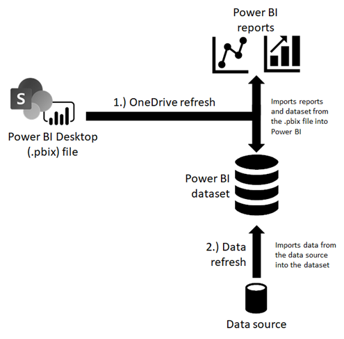

Si mantiene habilitada la actualización de OneDrive para un conjunto de datos conectado a OneDrive o SharePoint Online, y quiere programar la actualización de los datos, asegúrese de configurar la programación para que Power BI realice la actualización de los datos después de la actualización de OneDrive. Por ejemplo, si crea su propio servicio o proceso para actualizar el archivo de origen en OneDrive o SharePoint Online cada noche a la 01:00., puede configurar la actualización programada a las 02:30 para que Power BI tenga tiempo de completar la actualización de OneDrive antes de iniciar la actualización de los datos.

#### <a name="refresh-of-query-caches"></a>Actualización de las memorias caché de consultas

Si el conjunto de datos reside en una capacidad Premium, puede mejorar el rendimiento de los informes y paneles asociados activando la caché de consultas, tal y como se muestra en la captura de pantalla siguiente. El almacenamiento en caché de consultas indica a la capacidad Premium que use su servicio de almacenamiento en caché local para mantener los resultados de la consulta, lo que evita que el origen de datos subyacente tenga que calcular esos resultados. Para más información, vea [Almacenamiento en caché de consultas en Power BI Premium](power-bi-query-caching.md).

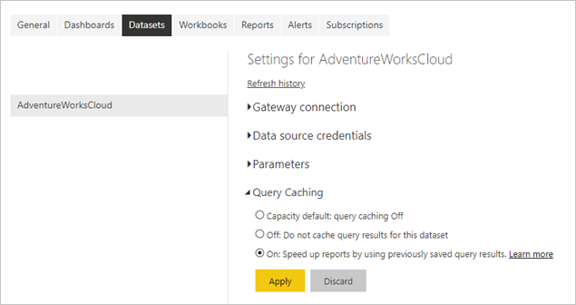

Sin embargo, después de una actualización de datos, los resultados de consulta previamente almacenados en la memoria caché ya no son válidos. Power BI descarta los resultados almacenados en caché y debe volver a generarlos. Por este motivo, el almacenamiento en caché de consultas podría no ser beneficioso para los informes y paneles asociados con conjuntos de datos que se actualizan con mucha frecuencia, por ejemplo, 48 veces al día.

#### <a name="tile-refresh"></a>Actualización de iconos

Power BI mantiene una caché para cada objeto visual de icono de los paneles, y actualiza activamente las memorias caché de iconos cuando cambian los datos. En otras palabras, la actualización de los iconos se produce automáticamente después de una actualización de los datos. Esto es así tanto para las actualizaciones programadas como a petición. También es posible forzar la actualización de los iconos; para ello, seleccione **Más opciones** (...) en la parte superior derecha de un panel y, seguidamente, **Actualizar iconos del panel**.


Como se realiza automáticamente, puede considerar que la actualización de iconos forma parte intrínseca de la actualización de datos. Entre otras cosas, es posible que observe que la duración de la actualización aumenta con el número de iconos. La sobrecarga que produce la actualización de iconos puede ser importante.

De forma predeterminada, Power BI mantiene una memoria caché única para cada icono, pero si utiliza la seguridad dinámica para restringir el acceso a los datos en función de los roles de usuario, tal y como se explica en el artículo [Seguridad de nivel de fila (RLS) con Power BI](../admin/service-admin-rls.md), Power BI debe mantener una memoria caché para cada rol y cada icono. El número de memorias caché de icono se multiplica por el número de roles.

La situación puede llegar a ser más compleja si el conjunto de datos utiliza una conexión dinámica a un modelo de datos de Analysis Services con RLS, tal y como se muestra en el tutorial [Seguridad dinámica de nivel de fila con el modelo tabular de Analysis Services](desktop-tutorial-row-level-security-onprem-ssas-tabular.md). En este caso, Power BI debe mantener y actualizar una memoria caché para cada icono y todos los usuarios que alguna vez vean el panel. Suele ocurrir que la parte de la actualización de iconos de esta operación de actualización de datos supere con creces el tiempo necesario para capturar los datos desde el origen. Para más información acerca de las actualizaciones de iconos, consulte [Solución de problemas de errores de icono](refresh-troubleshooting-tile-errors.md).

#### <a name="refresh-of-report-visuals"></a>Actualización de los objetos visuales de informes

Este proceso de actualización es menos importante, ya que solo es relevante para las conexiones dinámicas con Analysis Services. Para estas conexiones, Power BI almacena en caché el último estado de los objetos visuales del informe para que, cuando vuelva a ver el informe, Power BI no tenga que consultar el modelo tabular de Analysis Services. Cuando se interactúa con el informe, como al cambiar un filtro de informe, Power BI consulta el modelo tabular y actualiza los objetos visuales del informe automáticamente. Si sospecha que un informe muestra datos obsoletos, también puede seleccionar el botón Actualizar del informe para desencadenar una actualización de todos los objetos visuales del informe, como se muestra en la captura de pantalla siguiente.

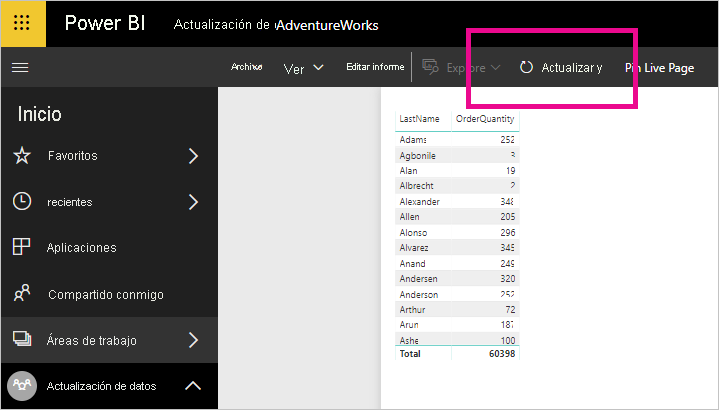

## <a name="review-data-infrastructure-dependencies"></a>Revise las dependencias de infraestructura de datos

Independientemente de los modos de almacenamiento, ninguna actualización de datos se realizará correctamente a menos que los orígenes de datos subyacentes sean accesibles. Hay tres escenarios principales de acceso a los datos:

- Un conjunto de datos que utiliza orígenes de datos que residen en el entorno local.
- Un conjunto de datos que utiliza orígenes de datos en la nube.
- Un conjunto de datos que usa datos de ambos tipos de orígenes, locales y en la nube.

### <a name="connecting-to-on-premises-data-sources"></a>Conexión a orígenes de datos locales

Si su conjunto de datos usa un origen de datos al que Power BI no puede acceder mediante una conexión de red directa, debe configurar una conexión de puerta de enlace para este conjunto de datos antes de habilitar una programación de actualizaciones o de realizar una actualización de datos a petición. Para más información acerca de las puertas de enlace de datos y cómo funcionan, consulte [¿Qué son las puertas de enlace de datos locales?](service-gateway-onprem.md)

Tiene las siguientes opciones:

- Elegir una puerta de enlace de datos de empresa con la definición del origen de datos necesario
- Implementar una puerta de enlace de datos personal

> [!NOTE]
> Para ver la lista de los tipos de orígenes de datos que requieren una puerta de enlace de datos, consulte el artículo [Administrar el origen de datos: importación o actualización programadas](service-gateway-enterprise-manage-scheduled-refresh.md).

#### <a name="using-an-enterprise-data-gateway"></a>Uso de una puerta de enlace de datos de empresa

Microsoft recomienda usar una puerta de enlace de datos de empresa en lugar de una puerta de enlace personal para conectar un conjunto de datos a un origen de datos local. Asegúrese de que la puerta de enlace esté configurada correctamente, lo que significa que debe tener las últimas actualizaciones y todas las definiciones de origen de datos necesarias. Una definición de origen de datos proporciona a Power BI la información de conexión de un origen determinado, incluidos los puntos de conexión, el modo de autenticación y las credenciales. Para más información acerca de cómo administrar los orígenes de datos en una puerta de enlace, consulte [Administrar el origen de datos: importación o actualización programadas](service-gateway-enterprise-manage-scheduled-refresh.md).

Conectar un conjunto de datos a una puerta de enlace de empresa es relativamente sencillo si es un administrador de puertas de enlace. Con permisos de administrador, puede actualizar rápidamente la puerta de enlace y agregar los orígenes de datos que falten. De hecho, puede agregar un origen de datos que falte a la puerta de enlace directamente desde la página de configuración del conjunto de datos. Expanda el botón de alternancia para ver los orígenes de datos y seleccione el vínculo **Agregar a la puerta de enlace**, tal y como se muestra en la captura de pantalla siguiente. Por otro lado, si no es un administrador de puerta de enlace, debe ponerse en contacto con el administrador de la puerta de enlace para agregar la definición del origen de datos necesario.

> [!NOTE]
> Solo los administradores de puerta de enlace pueden agregar orígenes de datos a una puerta de enlace. Además, asegúrese de que el administrador de la puerta de enlace agrega su cuenta de usuario a la lista de usuarios con permisos para usar el origen de datos. La página de configuración del conjunto de datos solo permite seleccionar una puerta de enlace empresarial con un origen de datos coincidente para el que tenga permiso de uso.

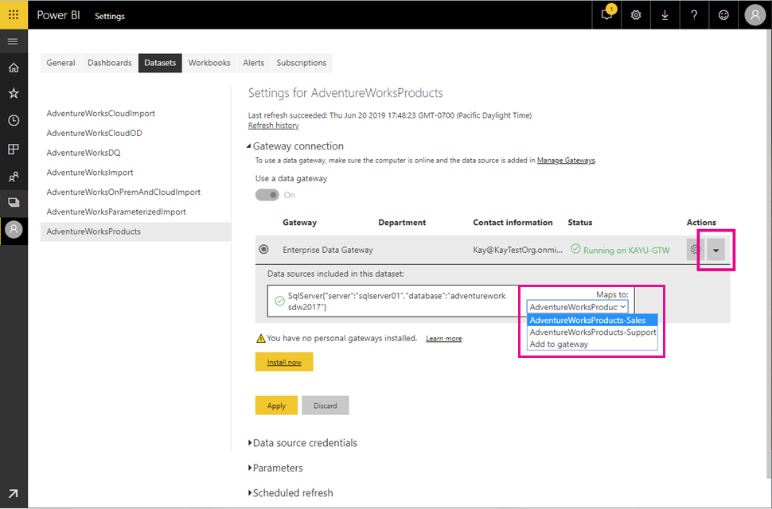

Asegúrese de asignar la definición del origen de datos correcto al origen de datos. Como se muestra en la captura de pantalla anterior, los administradores de la puerta de enlace pueden crear varias definiciones en función de una puerta de enlace única al conectarse al mismo origen de datos, cada uno con credenciales distintas. En el ejemplo mostrado, el propietario de un conjunto de datos del departamento de ventas elegiría la definición del origen de datos AdventureWorksProducts-Sales, mientras que el propietario de un conjunto de datos del departamento de soporte técnico asignaría el conjunto de datos a la definición del origen de datos AdventureWorksProducts-Support. Si los nombres de la definición de los orígenes de datos no son intuitivos, póngase en contacto con el administrador de la puerta de enlace para aclarar qué definición debe elegir.

> [!NOTE]
> Un conjunto de datos solo puede usar una conexión de puerta de enlace. En otras palabras, no se puede acceder a orígenes de datos locales a través de varias conexiones de puerta de enlace. Por lo tanto, debe agregar todas las definiciones de origen de datos necesarias a la misma puerta de enlace.

#### <a name="deploying-a-personal-data-gateway"></a>Implementar una puerta de enlace de datos personal

Si no tiene acceso a una puerta de enlace de datos de empresa y es la única persona que administra los conjuntos de datos, no necesita compartir los orígenes de datos con otros usuarios y puede implementar una puerta de enlace de datos en modo personal. En la sección **Conexión de puerta de enlace**, en **No tiene ninguna puerta de enlace personal instalada**, seleccione **Instalar ahora**. La puerta de enlace de datos personal tiene varias limitaciones, tal y como se documenta en [Puerta de enlace de datos local (modo personal)](service-gateway-personal-mode.md).

A diferencia de una puerta de enlace de datos de empresa, no es necesario agregar definiciones de origen de datos a una puerta de enlace personal. En su lugar, la configuración del origen de datos se administra en la sección **Credenciales de origen de datos** en la configuración del conjunto de datos, tal y como se muestra en la captura de pantalla siguiente.

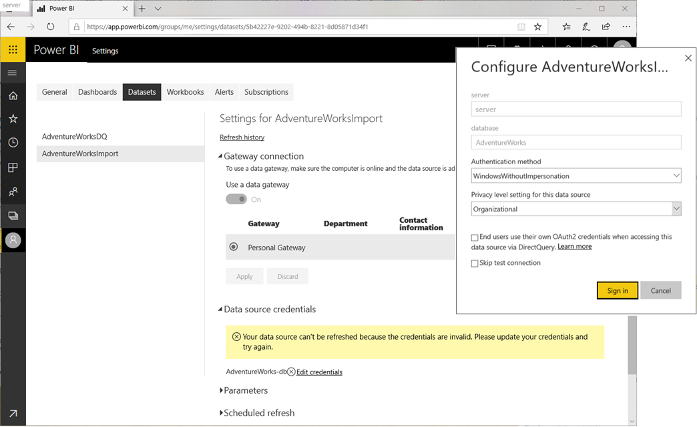


### <a name="accessing-cloud-data-sources"></a>Acceso a orígenes de datos en la nube

Los conjuntos de datos que utilizan orígenes de datos en la nube, como Azure SQL DB, no requieren una puerta de enlace de datos si Power BI puede establecer una conexión de red directa con el origen. Por lo tanto, puede administrar la configuración de estos orígenes de datos mediante la sección **Credenciales de origen de datos** en la configuración del conjunto de datos. Tal y como se muestra en la siguiente captura de pantalla, no es necesario configurar una conexión de puerta de enlace.


> [!NOTE]
> Cada usuario solo puede tener un conjunto de credenciales por origen de datos, en todos los conjuntos de datos que posea, independientemente de las áreas de trabajo en las que residan los conjuntos de datos. 

### <a name="accessing-on-premises-and-cloud-sources-in-the-same-source-query"></a>Acceso a orígenes locales y en la nube en la misma consulta de origen

Un conjunto de datos puede obtener datos de varios orígenes y estos orígenes pueden residir en el entorno local o en la nube. Sin embargo, un conjunto de datos solo puede usar una conexión de puerta de enlace, tal y como se ha mencionado anteriormente. Aunque los orígenes de datos en la nube no requieren necesariamente una puerta de enlace, se necesita una puerta de enlace si un conjunto de datos se conecta a orígenes locales y en la nube en una consulta mashup única. En este escenario, Power BI debe usar una puerta de enlace también para los orígenes de datos en la nube. El siguiente diagrama ilustra cómo este conjunto de datos accede a sus orígenes de datos.


> [!NOTE]
> Si un conjunto de datos utiliza consultas mashup independientes para conectarse a orígenes locales y en la nube, Power BI usa una conexión de puerta de enlace para conectar con los orígenes locales y una conexión de red directa para conectar con los orígenes en la nube. Si una consulta mashup combina o anexa datos de orígenes locales y en la nube, Power BI cambia a la conexión de puerta de enlace incluso para los orígenes en la nube.

Los conjuntos de datos de Power BI se basan en Power Query para acceder y recuperar los datos de origen. La siguiente lista de mashup muestra un ejemplo básico de una consulta que combina datos de un origen local y un origen en la nube.

```
Let

    OnPremSource = Sql.Database("on-premises-db", "AdventureWorks"),

    CloudSource = Sql.Databases("cloudsql.database.windows.net", "AdventureWorks"),

    TableData1 = OnPremSource{[Schema="Sales",Item="Customer"]}[Data],

    TableData2 = CloudSource {[Schema="Sales",Item="Customer"]}[Data],

    MergedData = Table.NestedJoin(TableData1, {"BusinessEntityID"}, TableData2, {"BusinessEntityID"}, "MergedData", JoinKind.Inner)

in

    MergedData
```

Hay dos maneras de configurar una puerta de enlace de datos para que admita la combinación o anexión de datos de orígenes locales y en la nube:

- Agregar a la puerta de enlace de datos una definición de origen de datos para el origen en la nube además de los orígenes de datos locales.
- Active la casilla **Permitir que los orígenes de datos en la nube del cliente se actualicen mediante este clúster de puerta de enlace**.


Si activa la casilla **Permitir que los orígenes de datos en la nube del usuario se actualicen mediante el clúster de esta puerta de enlace** en la configuración de la puerta de enlace, tal y como se muestra en la captura de pantalla anterior, Power BI puede usar la configuración que ha definido el usuario para el origen en la nube en **Credenciales del origen de datos**, en la configuración del conjunto de datos. Esto ayuda a reducir la sobrecarga de la configuración de la puerta de enlace. Por otro lado, si desea tener mayor control sobre las conexiones que establece la puerta de enlace, no debe activar esta casilla. En este caso, debe agregar a la puerta de enlace una definición explícita para cada origen de datos en la nube que quiera admitir. También es posible activar la casilla y agregar las definiciones de origen de datos explícitas para los orígenes en la nube a una puerta de enlace. En este caso, la puerta de enlace usa las definiciones de origen de datos de todos los orígenes que coincidan.

### <a name="configuring-query-parameters"></a>Configuración de los parámetros de consulta

Las consultas mashup o M que cree mediante Power Query pueden variar en complejidad, desde las más sencillas a construcciones con parámetros. La siguiente lista muestra una pequeña consulta mashup de ejemplo que usa dos parámetros llamados _SchemaName_ y _TableName_ para tener acceso a una tabla determinada en una base de datos AdventureWorks.

```
let

    Source = Sql.Database("SqlServer01", "AdventureWorks"),

    TableData = Source{[Schema=SchemaName,Item=TableName]}[Data]

in

    TableData
```

> [!NOTE]
> Los parámetros de consulta solo se admiten en conjuntos de datos en modo de importación. Los modos DirectQuery o LiveConnect no son compatibles con las definiciones de parámetros de consulta.

Para asegurarse de que un conjunto de datos con parámetros tiene acceso a los datos correctos, debe configurar los parámetros de la consulta mashup en la configuración del conjunto de datos. También puede actualizar los parámetros mediante programación utilizando la [API REST de Power BI](/rest/api/power-bi/datasets/updateparametersingroup). En la captura de pantalla siguiente se muestra la interfaz de usuario para configurar los parámetros de consulta de un conjunto de datos que usa la consulta mashup anterior.


## <a name="refresh-and-dynamic-data-sources"></a>Actualización y orígenes de datos dinámicos
 
Un *origen de datos dinámicos* es un origen de datos en el que no se puede determinar parte o nada de la información necesaria para conectarse hasta que Power Query ejecuta su consulta, ya que los datos se generan en código o se devuelven desde otro origen de datos. Ejemplos: el nombre de instancia y la base de datos de una base de datos de SQL Server; la ruta de acceso de un archivo CSV; o la dirección URL de un servicio web. 
 
En la mayoría de los casos, los conjuntos de datos de Power BI que utilizan orígenes de datos dinámicos no se pueden actualizar en el servicio Power BI. Hay algunas excepciones en las que los orígenes de datos dinámicos se pueden actualizar en el servicio Power BI, como cuando se usan las opciones RelativePath y Query con la función M de Web.Contents. También se pueden actualizar las consultas que hacen referencia a parámetros de Power Query.
 
Para determinar si se puede actualizar el origen de datos dinámico, abra el cuadro de diálogo **Configuración del origen de datos** en **Editor de Power Query** y luego seleccione **Orígenes de datos en el archivo actual**. En la ventana que aparece, busque el siguiente mensaje de advertencia, como se muestra en la siguiente imagen:
 
> [!NOTE]
> Puede que algunos orígenes de datos no consten debido a consultas creadas manualmente.

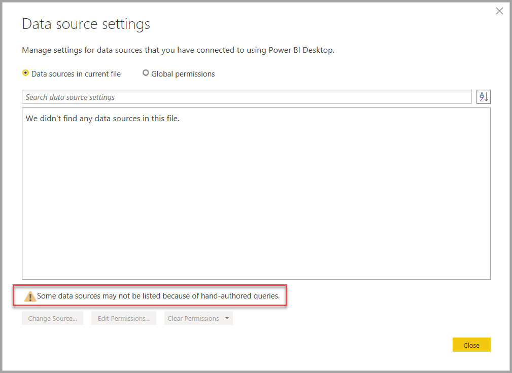

Si esa advertencia está presente en el cuadro de diálogo **Configuración del origen de datos** que aparece, se muestra un origen de datos dinámicos que no se puede actualizar en el servicio Power BI.

## <a name="configure-scheduled-refresh"></a>Configuración de actualización programada

Establecer la conectividad entre Power BI y los orígenes de datos es sin duda la tarea más complicada a la hora de configurar una actualización de datos. Los pasos restantes son relativamente sencillos e incluyen establecer la programación de las actualizaciones y habilitar las notificaciones de error de actualización. Para obtener instrucciones detalladas, consulte la guía de procedimientos [Configuración de la actualización programada](refresh-scheduled-refresh.md).

### <a name="setting-a-refresh-schedule"></a>Establecer una programación de actualización

La sección **Actualización programada** es donde se definen la frecuencia y las franjas de tiempo a las que se actualizará el conjunto de datos. Tal y como se mencionó anteriormente, puede configurar hasta ocho franjas de tiempo diarias si el conjunto de datos se encuentra en una capacidad compartida, o hasta 48 franjas de tiempo en Power BI Premium. En la captura de pantalla siguiente se muestra una programación de actualizaciones en un intervalo de doce horas.


Después de configurar una programación de actualización, la página de configuración del conjunto de datos le informa sobre la próxima hora de actualización, tal y como se muestra en la captura de pantalla anterior. Si quiere actualizar los datos antes, por ejemplo, para probar la configuración del origen de datos y la puerta de enlace, realice una actualización a petición con la opción **Actualizar ahora**, situada en el menú del conjunto de datos del panel de navegación. Las actualizaciones a petición no afectan a la siguiente actualización programada.

Tenga en cuenta también que la hora de actualización configurada puede no ser la hora exacta cuando se inicia el siguiente proceso programado en Power BI. Power BI inicia las actualizaciones programadas en cuanto puede. El objetivo es iniciar la actualización en un plazo de 15 minutos desde la franja de tiempo programada, pero puede producirse un retraso de hasta una hora si el servicio no puede asignar antes los recursos necesarios.

> [!NOTE]
> Power BI desactiva la programación de la actualización después de cuatro errores consecutivos o cuando el servicio detecta un error irrecuperable que requiera una actualización de la configuración, como credenciales no válidas o expiradas. No es posible cambiar el umbral de errores consecutivos.

### <a name="getting-refresh-failure-notifications"></a>Obtención de notificaciones de error de actualización

De forma predeterminada, Power BI envía notificaciones de error de actualización a través de correo electrónico al propietario del conjunto de datos para que el propietario puede actuar de manera oportuna en caso de que se produzcan errores de actualización. Power BI también envía una notificación cuando el servicio deshabilita la programación debido a errores consecutivos. Microsoft recomienda que deje activada la casilla **Enviar un correo con los errores de actualización**.

También es buena idea especificar destinatarios adicionales mediante el cuadro de texto **Enviar un correo a estos usuarios en caso de error de la actualización**. Además del propietario del conjunto de datos, los destinatarios especificados reciben notificaciones de error de actualización. Puede ser un compañero que se encargue de los conjuntos de datos mientras está de vacaciones. También podría ser el alias de correo electrónico del equipo de soporte técnico que se ocupa de los problemas de actualización del departamento o la organización. El envío de notificaciones de error de actualización a otros usuarios además del propietario del conjunto de datos es útil para garantizar que los problemas se detectan y se abordan a tiempo.

Tenga en cuenta que Power BI no solo envía notificaciones de errores de actualización, sino también cuando el servicio detiene una actualización programada debido a su inactividad. Power BI considera que un conjunto de datos está inactivo cuando ningún usuario ha visitado un panel o informe generado para el conjunto de datos en un plazo de dos meses. En este caso, Power BI envía un mensaje de correo electrónico al propietario del conjunto de datos en el que se indica que el servicio ha pausado la programación de actualización del conjunto de datos. Consulte la siguiente captura de pantalla para ver un ejemplo de dicha notificación.

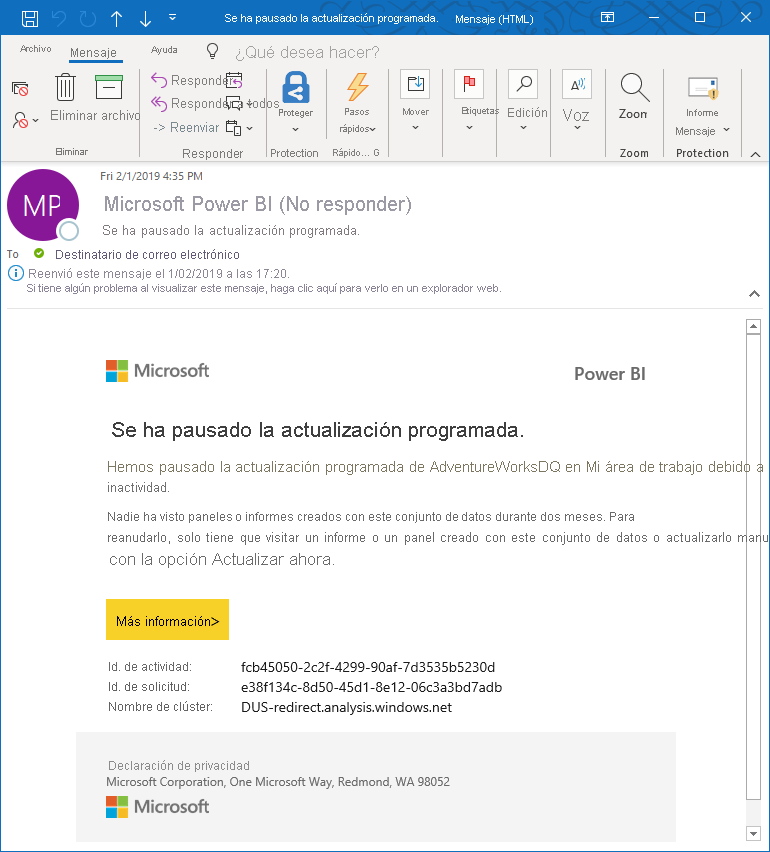

Para reanudar la actualización programada, visite un informe o panel creado con este conjunto de datos o actualice manualmente el conjunto de datos con la opción **Actualizar ahora**.

### <a name="checking-refresh-status-and-history"></a>Comprobación del estado y el historial de actualizaciones

Además de las notificaciones de error, es buena idea comprobar periódicamente si hay errores de actualización de los conjuntos de datos. Una forma rápida es ver la lista de conjuntos de datos en un área de trabajo. Los conjuntos de datos con errores muestran un pequeño icono de advertencia. Seleccione el icono de advertencia para obtener información adicional, tal y como se muestra en la captura de pantalla siguiente. Para más información acerca de la solución de errores específicos de las actualizaciones, consulte [Solución de problemas de escenarios de actualización](refresh-troubleshooting-refresh-scenarios.md).

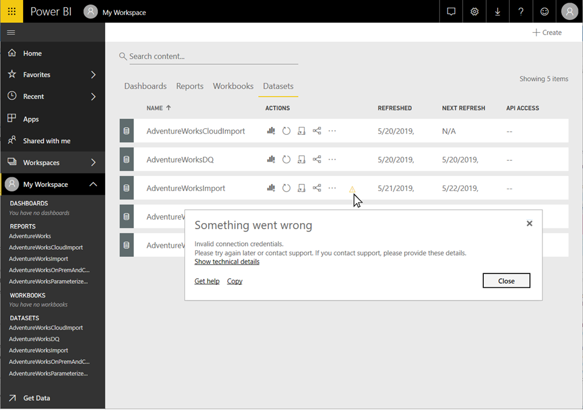

El icono de advertencia ayuda a indicar problemas del conjunto de datos actual, pero también es buena idea comprobar de vez en cuanto el historial de actualizaciones. Como su nombre indica, el historial de actualizaciones permite revisar el estado de los últimos ciclos de sincronización. Por ejemplo, un administrador de puerta de enlace podría haber actualizado un conjunto de credenciales de base de datos expirado. Como puede ver en la siguiente captura de pantalla, el historial de actualizaciones muestra cuándo una actualización afectada ha vuelto a funcionar de nuevo.

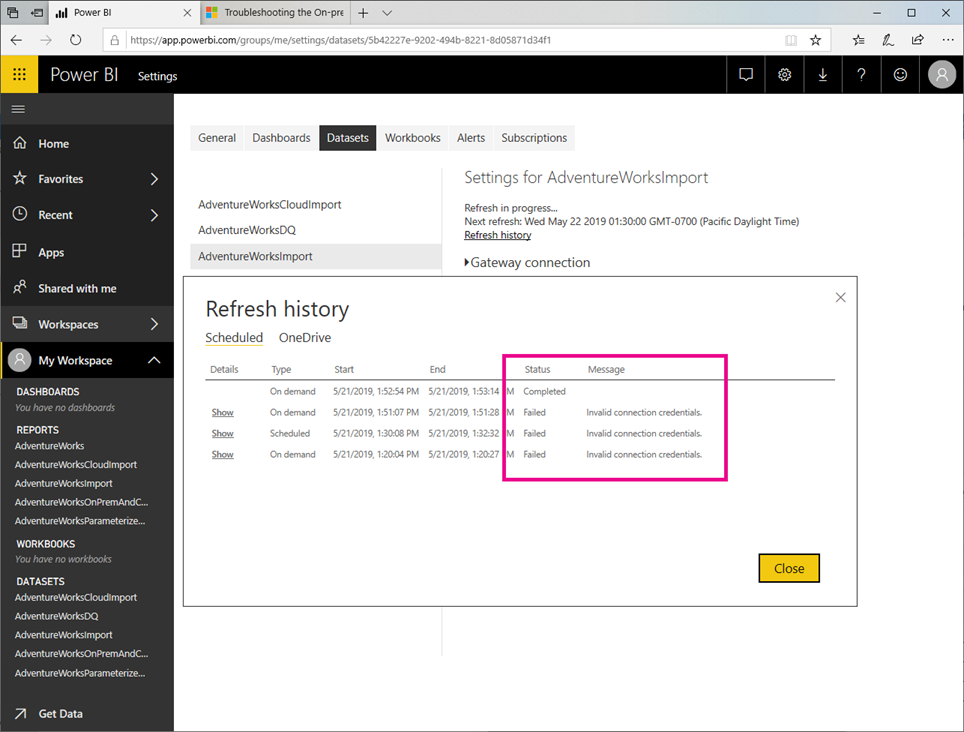

> [!NOTE]
> Encontrará un vínculo al historial de actualizaciones en la configuración del conjunto de datos. También puede recuperar el historial de actualizaciones mediante programación utilizando la [API REST de Power BI](/rest/api/power-bi/datasets/getrefreshhistoryingroup). Usar una solución personalizada permite supervisar el historial de actualizaciones de varios conjuntos de datos de forma centralizada.

## <a name="automatic-page-refresh"></a>Actualización automática de páginas

La actualización automática de páginas funciona en el nivel de página de informe, y permite a los autores de informes establecer un intervalo de actualización de los objetos visuales de una página que solo está activo cuando la página se está usando. La actualización automática de páginas solo está disponible en orígenes de datos de DirectQuery. El intervalo de actualización mínimo depende del tipo de área de trabajo en la que el informe se publica y de la configuración de administración de capacidad de las áreas de trabajo Premium y [áreas de trabajo insertadas](../developer/embedded/embedding.md).

Obtenga más información sobre la actualización automática de páginas en el artículo [Actualización automática de la página](../create-reports/desktop-automatic-page-refresh.md).

## <a name="best-practices"></a>Procedimientos recomendados

Comprobar el historial de actualizaciones de los conjuntos de datos con regularidad es uno de los procedimientos recomendados más importantes que puede adoptar para asegurarse de que los informes y los paneles usan datos actualizados. Si detecta problemas, soluciónelos con prontitud y realice un seguimiento con los propietarios del origen de datos y los administradores de la puerta de enlace, si es necesario.

Además, tenga en cuenta las siguientes recomendaciones para establecer y mantener procesos de actualización de datos confiables para sus conjuntos de datos:

- Programe las actualizaciones en las horas menos ocupadas, especialmente si los conjuntos de datos está en Power BI Premium. Distribuir los ciclos de actualización de los conjuntos de datos a lo largo de un período de tiempo más amplio ayuda a evitar picos que podrían sobrecargar los recursos disponibles. Los retrasos en el comienzo de un ciclo de actualización son una señal de que los recursos están sobrecargados. Si una capacidad Premium está completamente agotada, Power BI podría incluso omitir un ciclo de actualización.
- Tenga presente los límites de actualización. Si los datos de origen cambian con frecuencia o el volumen de datos es importante, considere la posibilidad de utilizar los modos DirectQuery o LiveConnect en lugar del modo de importación, siempre que el aumento de la carga en el origen y el impacto en el rendimiento de las consultas sea aceptable. Evite actualizar constantemente un conjunto de datos en modo de importación. Sin embargo, los modos DirectQuery o LiveConnect tienen varias limitaciones, por ejemplo, un límite de un millón de filas para devolver los datos y un límite de tiempo de respuesta de 225 segundos para ejecutar las consultas, tal y como se documenta en [Usar DirectQuery en Power BI Desktop](desktop-use-directquery.md). Estas limitaciones podrían obligar a usar el modo de importación de todas maneras. Para volúmenes de datos muy grandes, considere la posibilidad de usar [agregaciones en Power BI](../transform-model/desktop-aggregations.md).
- Compruebe que el tiempo de actualización del conjunto de datos no supere la duración máxima de actualización. Use Power BI Desktop para comprobar la duración de la actualización. Si tarda más de 2 horas, considere la posibilidad de mover el conjunto de datos a Power BI Premium. Puede que el conjunto de datos no se actualice en la capacidad compartida. Considere también la posibilidad de usar una [actualización incremental en Power BI Premium](../admin/service-premium-incremental-refresh.md) para los conjuntos de datos mayores de 1 GB o que tarden varias horas en actualizarse.
- Optimice los conjuntos de datos para que incluyan únicamente las tablas y columnas que utilizan los informes y paneles. Optimice sus consultas mashup y, si es posible, evite definiciones de origen de datos dinámico y costosos cálculos DAX. En concreto, evite las funciones DAX que prueban todas las filas de una tabla porque sobrecargan los recursos de procesamiento y tiene un consumo elevado de memoria.
- Aplique la misma configuración de privacidad que en Power BI Desktop para asegurarse de que Power BI pueda generar consultas eficaces a los orígenes. Tenga en cuenta que Power BI Desktop no publica la configuración de privacidad. Debe volver a aplicar manualmente la configuración en las definiciones de origen de datos después de publicar el conjunto de datos.
- Limite el número de objetos visuales en los paneles, especialmente si usa la [seguridad de nivel de fila (RLS)](../admin/service-admin-rls.md). Tal y como se explicó anteriormente en este artículo, un número excesivo de iconos de panel puede aumentar considerablemente la duración de la actualización.
- Utilice una implementación de puerta de enlace de datos de empresa de confianza para conectar los conjuntos de datos a orígenes de datos locales. Si observa errores de actualización relacionados con la puerta de enlace, por ejemplo, la puerta de enlace no está disponible o está sobrecargada, consulte con los administradores de la puerta de enlace para agregar otras puertas de enlace a un clúster existente o implementar un nuevo clúster (escalado vertical frente a escalado horizontal).
- Use puertas de enlace de datos independientes para los conjuntos de datos de importación y los conjuntos de datos DirectQuery o LiveConnect, para que las importaciones de datos durante la actualización programada no afecten al rendimiento de los informes y paneles que usan conjuntos de datos en los modos DirectQuery o LiveConnect y que consultan los orígenes de datos con cada interacción del usuario.
- Asegúrese de que Power BI puede enviar notificaciones de error de actualización a su buzón. Los filtros de correo basura podrían bloquear los mensajes de correo electrónico o moverlos a una carpeta diferente donde es posible que no los vea.


## <a name="next-steps"></a>Pasos siguientes

[Configuración de la actualización programada](refresh-scheduled-refresh.md)  
[Herramientas para la solución de problemas de actualización](service-gateway-onprem-tshoot.md)  
[Solución de problemas de escenarios de actualización](refresh-troubleshooting-refresh-scenarios.md)  

¿Tiene más preguntas? [Pruebe a preguntar a la comunidad de Power BI](https://community.powerbi.com/)
