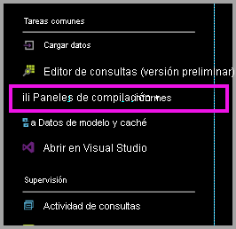
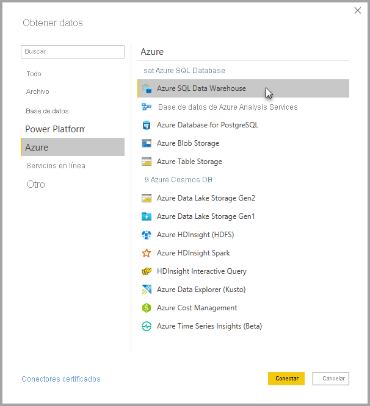
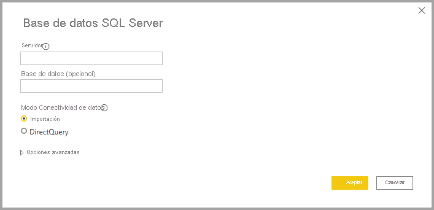
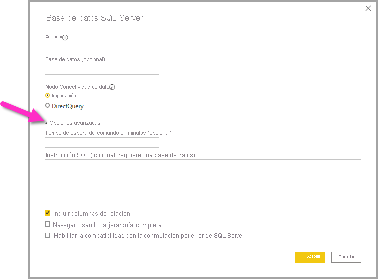

# Azure SQL Data Warehouse con DirectQuery

Azure SQL Data Warehouse con DirectQuery permite crear informes dinámicos en función de los datos y métricas que ya existen en Azure SQL Data Warehouse. Con DirectQuery, las consultas se vuelven a enviar a Azure SQL Data Warehouse en tiempo real a medida que explora los datos. Las consultas en tiempo real, combinadas con el escalado de SQL Data Warehouse, permiten a los usuarios crear informes dinámicos en cuestión de minutos con terabytes de datos. Además, el vínculo **Creación de paneles e informes** permite a los usuarios crear informes de Power BI con su instancia de SQL Data Warehouse.

Cuando use el conector de SQL Data Warehouse:

* Especifique el nombre completo del servidor cuando se conecte (consulte los detalles más abajo).
* Asegúrese de que las reglas de firewall del servidor están configuradas en "Permitir el acceso a los servicios de Azure".
* Cada acción, como seleccionar una columna o agregar un filtro, enviará directamente una consulta al almacenamiento de datos.
* Los iconos se configuran para actualizarse aproximadamente cada 15 minutos y no es necesario programar la actualización.  La actualización se puede ajustar en la configuración avanzada al conectarse.
* Preguntas y respuestas no está disponible para conjuntos de datos de DirectQuery.
* Los cambios de esquema no se detectan automáticamente

Estas restricciones y notas pueden cambiar mientras se sigue mejorando la experiencia. A continuación, se detallan los pasos para conectarse.

## Creación de paneles e informes en Power BI

> [!Important]
> Hemos mejorado la conectividad con Azure SQL Data Warehouse. Use Power BI Desktop para disfrutar de la mejor experiencia de conexión al origen de datos de Azure SQL Data Warehouse. Una vez creados el modelo y el informe, puede publicarlos en el servicio Power BI. El conector directo de Azure SQL Data Warehouse en el servicio Power BI ya no está disponible.

La manera más sencilla de cambiar entre SQL Data Warehouse y Power BI consiste en crear informes en Power BI Desktop. Puede usar el botón **Creación de paneles e informes** de Azure Portal.

1. Para empezar, descargue e instale Power BI Desktop. Vea el artículo [Obtención de Power BI Desktop](../fundamentals/desktop-get-the-desktop.md) para obtener información sobre la descarga e instalación, o bien vaya directamente al paso siguiente.

2. También puede hacer clic en el vínculo **Creación de paneles e informes** para descargar Power BI Desktop.

    

## Conexión a través de Power BI Desktop

Puede conectarse a una instancia de SQL Data Warehouse mediante el botón **Obtener datos** de Power BI Desktop. 

1. Seleccione el botón **Obtener datos** en el menú **Inicio**.  

    

2. Seleccione **Más...** para ver todos los orígenes de datos disponibles. En la ventana que aparece, seleccione **Azure** en el panel de la izquierda y después **Azure SQL Data Warehouse** en la lista de conectores disponibles en el panel de la derecha.

    

3. En la ventana que aparece, escriba el servidor y, opcionalmente, indique la base de datos a la que se quiere conectar. También puede seleccionar el modo de conectividad de datos: Importar o DirectQuery. Para acceder en tiempo real a la información de la instancia de Azure SQL Data Warehouse, use DirectQuery.

    

4. Para ver las opciones avanzadas de la conexión Azure SQL Data Warehouse, seleccione la flecha hacia abajo situada junto a **Opciones avanzadas** para mostrar opciones adicionales para la conexión.

    

En la sección siguiente se describe cómo buscar valores de parámetro para la conexión. 

## Buscar valores de parámetro

El nombre completo del servidor y el nombre de la base de datos pueden encontrarse en Azure Portal. Tenga en cuenta que SQL Data Warehouse solo está presente en Azure Portal en este momento.

> [!NOTE]
> Si su inquilino de Power BI está en la misma región que Azure SQL Data Warehouse, no habrá ningún cargo de salida. Para encontrar la ubicación de su inquilino de Power BI, use [estas instrucciones](../admin/service-admin-where-is-my-tenant-located.md).

[!INCLUDE [direct-query-sso](../includes/direct-query-sso.md)]

## Pasos siguientes

* [Acerca del uso de DirectQuery en Power BI](desktop-directquery-about.md)
* [¿Qué es Power BI?](../fundamentals/power-bi-overview.md)  
* [Obtener datos para Power BI](service-get-data.md)  
* [Azure SQL Data Warehouse](/azure/sql-data-warehouse/sql-data-warehouse-overview-what-is/)

¿Tiene más preguntas? [Pruebe la comunidad de Power BI](https://community.powerbi.com/)