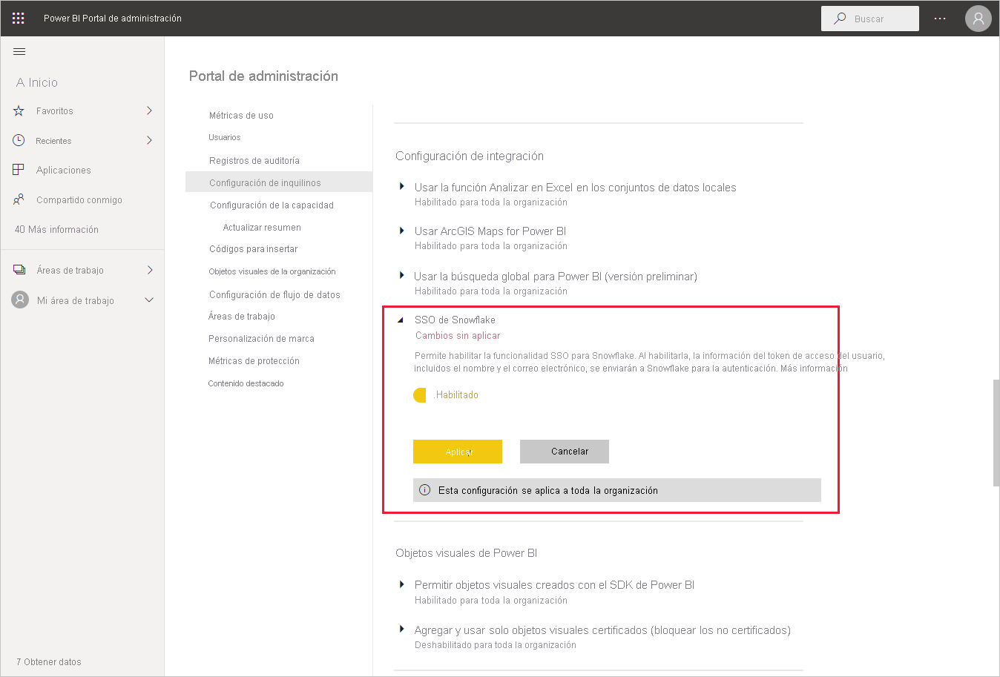
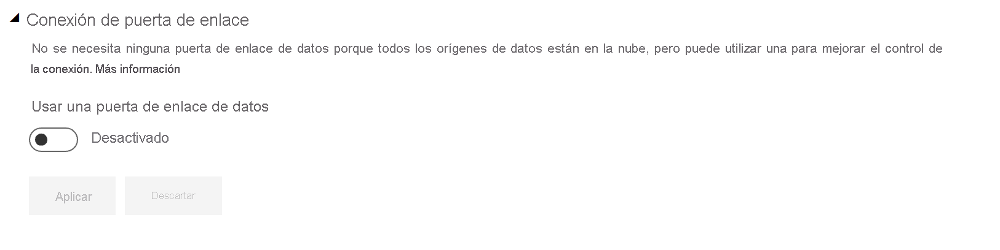
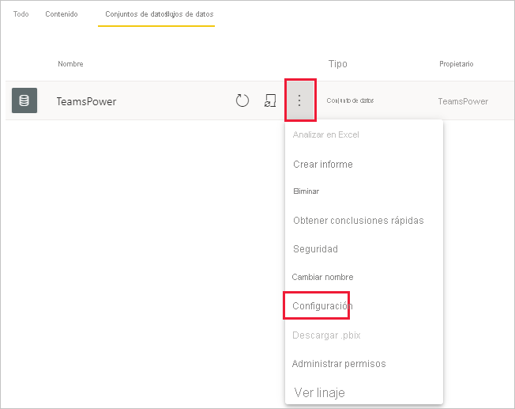
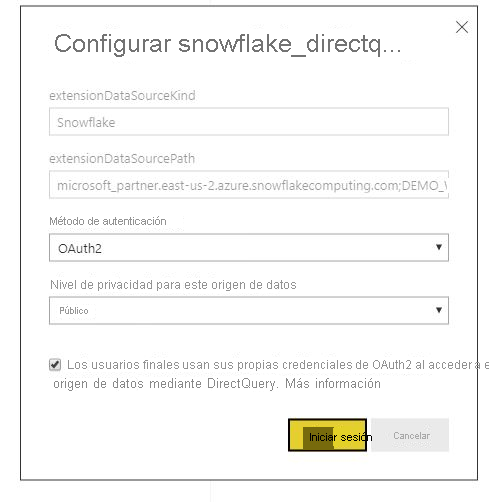

# Conexión a Snowflake en el servicio Power BI

## Introducción

La conexión a Snowflake en el servicio Power BI difiere de otros conectores solo de una manera. Snowflake tiene una funcionalidad adicional para Azure Active Directory (AAD), con una opción para SSO. Los elementos de la integración requieren roles administrativos distintos a través de Snowflake, Power BI y Azure. También puede optar por habilitar la autenticación de AAD sin usar SSO. La autenticación básica funciona de forma similar a otros conectores en el servicio.

Para configurar la integración de AAD y, si quiere, habilitar el inicio de sesión único, siga los pasos de este artículo:

* Si es el administrador de Snowflake, lea el artículo [SSO de Power BI para Snowflake: Introducción](https://docs.snowflake.com/en/user-guide/oauth-powerbi.html) de la documentación de Snowflake.
* Si es administrador de Power BI, consulte [Configuración del servicio Power BI: portal de administración](service-connect-snowflake.md#admin-portal) para información sobre cómo habilitar el inicio de sesión único.
* Si es creador de un conjunto de datos de Power BI, consulte [Configuración del servicio Power BI: configuración de un conjunto de datos con AAD](service-connect-snowflake.md#configuring-a-dataset-with-aad) para aprender a habilitar el inicio de sesión único.

## Configuración del servicio Power BI

### Portal de administración

Para habilitar el inicio de sesión único, un administrador global tiene que activar la configuración en el Portal de administración de Power BI. Esta configuración aprueba el envío de credenciales de AAD a Snowflake para la autenticación de toda la organización. Siga estos pasos para habilitar el inicio de sesión único:

1. [Inicie sesión en Power BI](https://app.powerbi.com) con las credenciales de administrador global.
1. Seleccione **Configuración** en el menú de encabezado de la página y, luego, seleccione **Portal de administración**.
1. Seleccione **Configuración de inquilinos** y desplácese hasta **Configuración de integración**.

   

4. Expanda **SSO de Snowflake**, cambie la configuración a **Habilitado** y seleccione **Aplicar**.

Este paso es necesario para dar su consentimiento para enviar el token de AAD a los servidores de Snowflake. Una vez habilitada la configuración, puede tardar hasta una hora en surtir efecto.

Una vez habilitado el inicio de sesión único, puede usar informes con SSO.

### Configuración de un conjunto de datos con AAD

Después de publicar en el servicio de Power BI un informe basado en el conector de Snowflake, el creador del conjunto de datos tiene que actualizar la configuración del área de trabajo adecuada para que use el inicio de sesión único.

Debido al funcionamiento de Power BI, SSO solo funcionará cuando no se ejecute ningún origen de datos a través de la puerta de enlace de datos local. Las limitaciones se indican a continuación:

* Si solo va a usar un origen de Snowflake en el modelo de datos, puede utilizar el inicio de sesión único si decide no usar la puerta de enlace de datos local.
* Si va a usar un origen de Snowflake y otro origen, puede utilizar el inicio de sesión único si ninguno de los orígenes usa la puerta de enlace de datos local.
* Si va a usar un origen de Snowflake a través de la puerta de enlace de datos local, las credenciales de AAD no se admiten actualmente. Esta consideración puede ser importante en caso de que intente acceder a una red virtual desde una única dirección IP con la puerta de enlace instalada en ella, en lugar de hacerlo desde el intervalo de direcciones IP completo de Power BI.
* Si usa un origen de Snowflake y otro origen que requiera una puerta de enlace, también debe usar Snowflake a través de la puerta de enlace de datos local. En este caso, no podrá usar SSO.

Obtenga más información sobre cómo usar la puerta de enlace de datos local en [¿Qué es una puerta de enlace de datos local?](service-gateway-onprem.md)

Si no va a usar la puerta de enlace, ya está todo listo. Cuando tiene credenciales de Snowflake configuradas en la puerta de enlace de datos local, pero solo usa ese origen de datos en el modelo, puede hacer clic en el control de la página Configuración del conjunto de datos para desactivar la puerta de enlace para ese modelo de datos.

Si quiere activar el inicio de sesión único para un conjunto de datos, siga estos pasos:

1. [Inicie sesión en Power BI](https://app.powerbi.com) con las credenciales del creador del conjunto de datos.
1. Seleccione el área de trabajo adecuada y, luego, elija **Configuración** en el menú Más opciones que se encuentra junto al nombre del conjunto de datos.
  
1. Seleccione **Credenciales del origen de datos** e inicie sesión. Se puede iniciar sesión en el conjunto de datos en Snowflake con credenciales básicas o de OAuth2 (AAD). Si usa AAD, puede habilitar el inicio de sesión único en el paso siguiente.
1. Seleccione la opción **Los usuarios finales usan sus propias credenciales de OAuth2 al acceder a este origen de datos mediante DirectQuery.** . Esta configuración habilitará el inicio de sesión único de AAD. Ya sea que el usuario inicial inicie sesión con la autenticación básica o la de OAuth2 (AAD), las credenciales de AAD serán las que se enviarán para SSO.

    

Una vez listos estos pasos, los usuarios adicionales deben usar automáticamente su autenticación de AAD para conectarse a los datos de ese conjunto de datos de Snowflake.

Si decide no habilitar el inicio de sesión único, los usuarios que actualicen el informe utilizarán las credenciales del usuario que haya iniciado sesión, como la mayoría de otros informes de Power BI.

### Solución de problemas

Si tiene problemas con la integración, consulte la [guía de solución de problemas](https://docs.snowflake.com/en/user-guide/oauth-powerbi.html#troubleshooting) de Snowflake.

## Pasos siguientes

* [Orígenes de datos del servicio Power BI](service-get-data.md)
* [Conexión a conjuntos de datos del servicio Power BI desde Power BI Desktop](desktop-report-lifecycle-datasets.md)
* [Conexión a un almacén de Snowflake Computing](desktop-connect-snowflake.md)