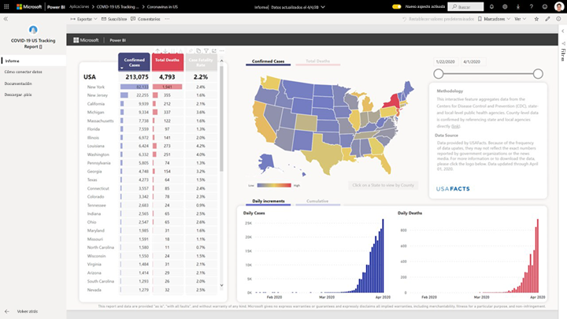
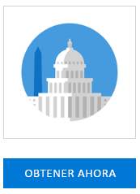
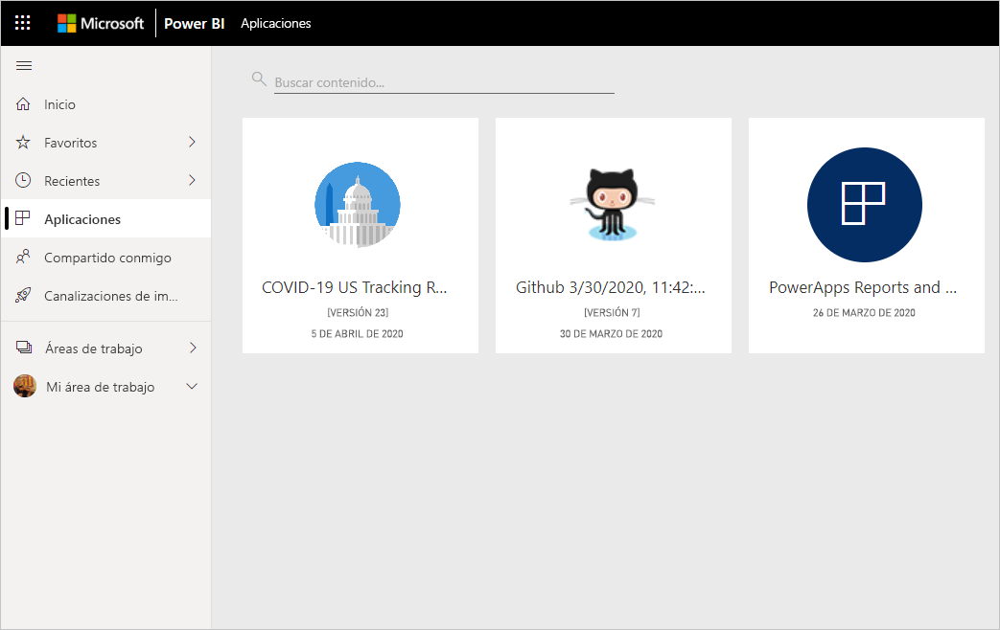
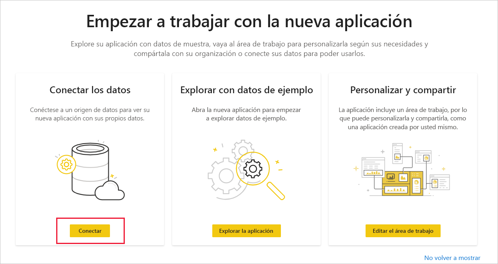
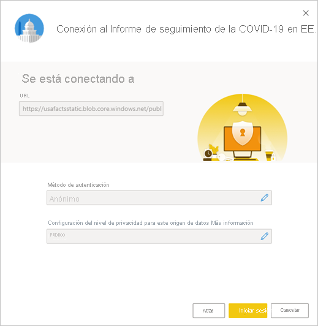
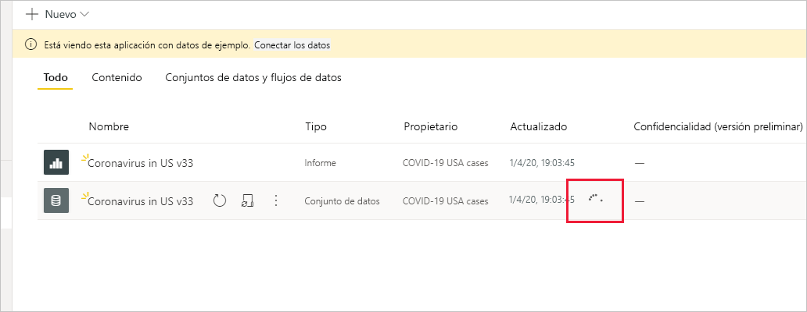

# Conexión al informe de seguimiento de la COVID-19 en EE. UU.
En este artículo se explica cómo instalar la aplicación de plantilla para el informe de seguimiento de la COVID-19 y cómo conectarse a los orígenes de datos.

Para obtener información detallada sobre el propio informe, incluidas las declinaciones de responsabilidad e información sobre los datos, vea [Ejemplo de seguimiento de la COVID-19 para los gobiernos estatales y locales de EE. UU.](../create-reports/sample-covid-19-us.md).

Después de instalar la aplicación de plantilla y conectarse a los orígenes de datos, puede personalizar el informe según sus necesidades. Luego puede distribuirlo como una aplicación entre los compañeros de su organización.

## Instalación de la aplicación

1. Haga clic en el vínculo siguiente para obtener la aplicación: [Aplicación de plantilla del Informe de seguimiento de la COVID-19 en EE. UU.](https://appsource.microsoft.com/en-us/product/power-bi/pbi-contentpacks.covid19ms)

1. Una vez que esté en la página AppSource de la aplicación, haga clic en [**OBTENER AHORA**](https://appsource.microsoft.com/en-us/product/power-bi/pbi-contentpacks.covid19ms).

    

1. Cuando se le solicite, haga clic en **Instalar**. Una vez instalada la aplicación, la verá en la página Aplicaciones.

   

## Conexión a orígenes de datos

1. Haga clic en el icono de la página Aplicaciones para abrir la aplicación.

1. En la pantalla de presentación que aparece, elija **Conectar**.

   

1. Aparecen dos cuadros de diálogo de inicio de sesión, uno después del otro. En ambos, establezca el nivel de privacidad en Público.

   

   El informe se conectará a los orígenes de datos y se rellenará con datos actualizados. Durante este tiempo, se activará el monitor de actividad.

   

## Programación de la actualización del informe

Cuando se haya completado la actualización de datos, estará en el área de trabajo asociada a la aplicación. [Configure una programación de actualización](../connect-data/refresh-scheduled-refresh.md) para mantener actualizados los datos del informe.

## Personalizar y compartir

Vea [Personalización y uso compartido de la aplicación](../connect-data/service-template-apps-install-distribute.md#customize-and-share-the-app) para obtener detalles. Asegúrese de revisar las [declinaciones de responsabilidades del informe](../create-reports/sample-covid-19-us.md#disclaimers) antes de publicar o distribuir la aplicación.

## Pasos siguientes
* [Ejemplo de seguimiento de la COVID-19 para gobiernos locales y estatales de EE. UU.](../create-reports/sample-covid-19-us.md)
* ¿Tiene alguna pregunta? [Pruebe a preguntar a la comunidad de Power BI](https://community.powerbi.com/)
* [¿Qué son las aplicaciones de plantilla de Power BI?](../connect-data/service-template-apps-overview.md)
* [Instalación y distribución de aplicaciones de plantilla en la organización](../connect-data/service-template-apps-install-distribute.md)
