# Conexión con el Informe de presencia de comunicación de crisis

Esta aplicación Power BI es el artefacto de informe o de panel de la solución de Power Platform para la Comunicación de crisis. Realiza un seguimiento de la ubicación del trabajo de los usuarios de la aplicación Comunicación de crisis. La solución combina capacidades de Power Apps, Power Automate, Teams, SharePoint y Power BI. Se puede usar en la Web, en dispositivos móviles o en Teams.

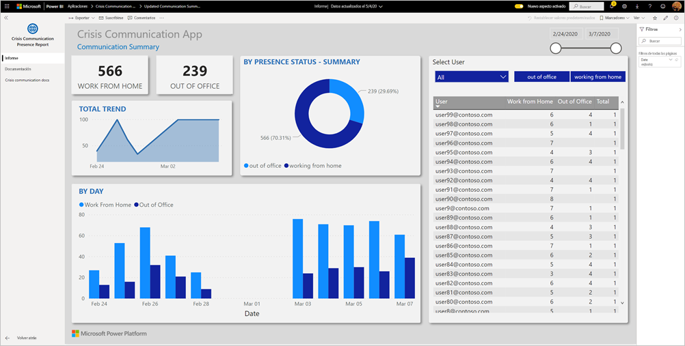

El panel muestra que los administradores de emergencia agregan datos a través de su sistema de mantenimiento para ayudarles a tomar decisiones oportunas y correctas.

En este artículo se explica cómo instalar la aplicación y cómo conectarse a los orígenes de datos. Para obtener más información sobre la aplicación Comunicación de crisis, vea [Configuración e información sobre la plantilla de ejemplo Comunicación de crisis en Power Apps](/powerapps/maker/canvas-apps/sample-crisis-communication-app).

Después de instalar la aplicación de plantilla y conectarse a los orígenes de datos, puede personalizar el informe según sus necesidades. Luego puede distribuirlo como una aplicación entre los compañeros de su organización.

## Requisitos previos

Antes de instalar esta aplicación de plantilla, primero debe instalar y configurar el [Ejemplo de Comunicación de crisis](/powerapps/maker/canvas-apps/sample-crisis-communication-app). Al instalar esta solución, se crean las referencias de orígenes de datos necesarias para rellenar la aplicación con datos.

Al instalar el ejemplo de Comunicación de crisis, tome nota de la [ruta de acceso de la carpeta de la lista de SharePoint de "Estado de CI_Employee" y la id. de la lista](/powerapps/maker/canvas-apps/sample-crisis-communication-app#monitor-office-absences-with-power-bi).

## Instalación de la aplicación

1. Haga clic en el vínculo siguiente para obtener la aplicación: [Plantilla de aplicación del Informe de presencia de comunicación de crisis](https://appsource.microsoft.com/en-us/product/power-bi/pbi-contentpacks.crisiscomms)

1. En la página AppSource de la aplicación, seleccione [**OBTENER AHORA**](https://appsource.microsoft.com/en-us/product/power-bi/pbi-contentpacks.crisiscomms).

    [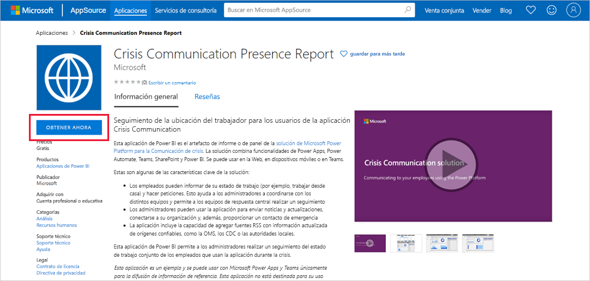](https://appsource.microsoft.com/en-us/product/power-bi/pbi-contentpacks.crisiscomms)

1. Lea la información en **Una cosa más** y seleccione **Continuar**.

    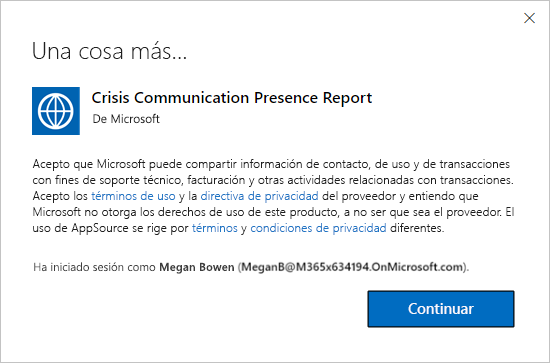

1. Haga clic en **Instalar**. 

    

    Una vez instalada la aplicación, la verá en la página Aplicaciones.

   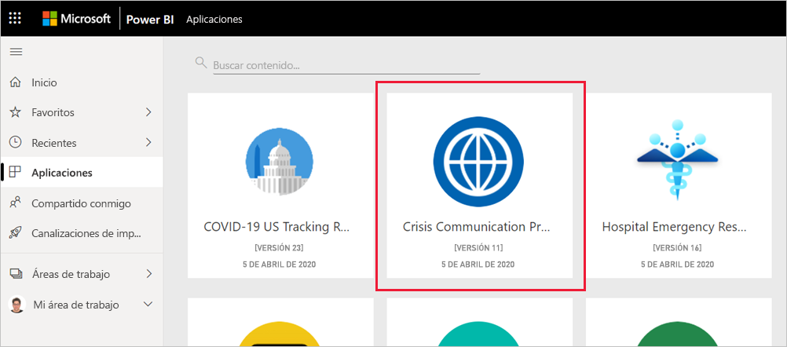

## Conexión a orígenes de datos

1. Seleccione el icono de la página Aplicaciones para abrir la aplicación.

1. En la pantalla de presentación, seleccione **Explorar**.

   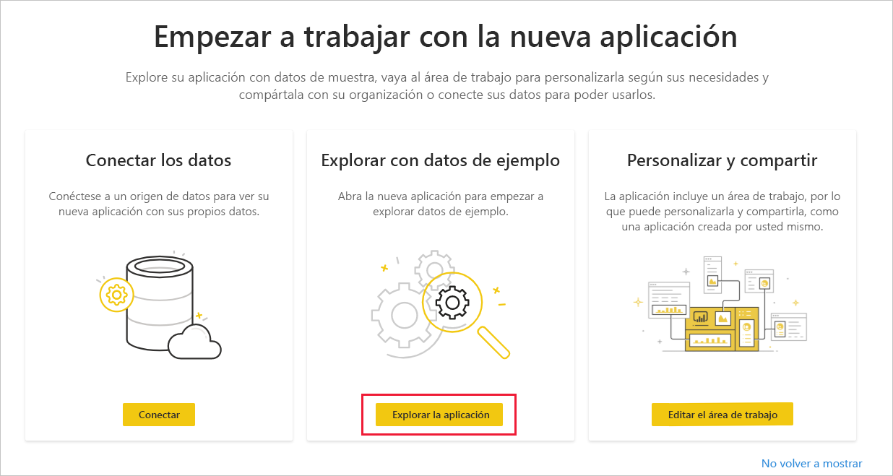

   La aplicación se abre y muestra los datos de ejemplo.

1. Seleccione el vínculo **Conectar los datos** en el banner de la parte superior de la página.

   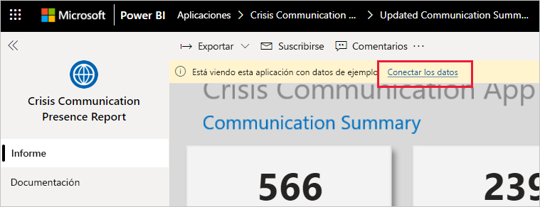

1. En el cuadro de diálogo, haga lo siguiente:
   1. En el campo SharePoint_Folder, escriba su [ruta de acceso de la lista de SharePoint "Estado de CI_Employee"](/powerapps/maker/canvas-apps/sample-crisis-communication-app#monitor-office-absences-with-power-bi).
   1. En el campo List_ID, escriba el id. de la lista que ha obtenido de la configuración de la lista. Cuando termine, haga clic en **Siguiente**.

   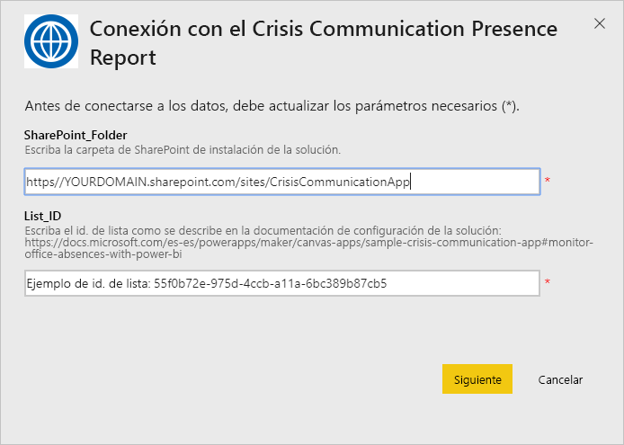

1. En el cuadro de diálogo siguiente que aparece, establezca el método de autenticación en **OAuth2**. No tiene que hacer nada en lo que respecta a la configuración de nivel de privacidad.

   Seleccione **Iniciar sesión**.

   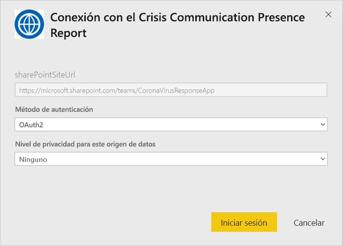

1. En la pantalla de inicio de sesión de Microsoft, inicie sesión en Power BI.

   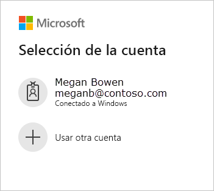

   Una vez que haya iniciado sesión, el informe se conectará a los orígenes de datos y se rellenará con datos actualizados. Durante este tiempo se activará el monitor de actividad.

   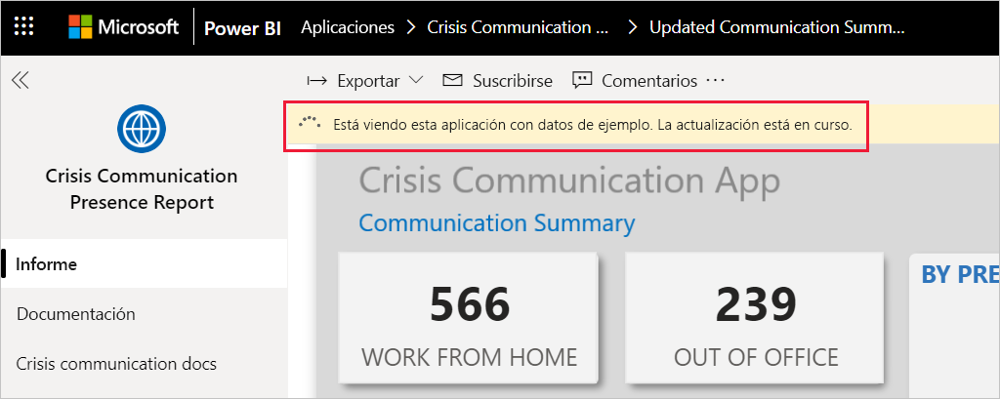

## Programación de la actualización del informe

Cuando se haya completado la actualización de los datos, [configure una programación de actualización](../connect-data/refresh-scheduled-refresh.md) para mantener actualizados los datos del informe.

1. En la barra de encabezado superior, seleccione **Power BI**.

   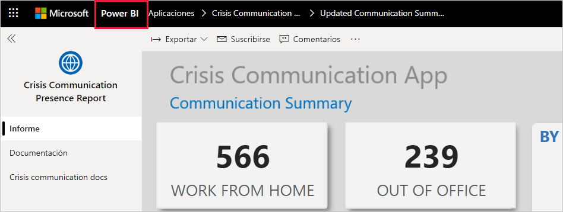

1. En el panel de navegación izquierdo, busque el área de trabajo del Panel de ayuda para la toma de decisiones en respuesta ante emergencias hospitalarias en **Áreas de trabajo** y siga las instrucciones descritas en el artículo [Configuración de la actualización programada](../connect-data/refresh-scheduled-refresh.md).

## Personalizar y compartir

Vea [Personalización y uso compartido de la aplicación](../connect-data/service-template-apps-install-distribute.md#customize-and-share-the-app) para obtener detalles. Asegúrese de revisar las [declinaciones de responsabilidades del informe](../create-reports/sample-covid-19-us.md#disclaimers) antes de publicar o distribuir la aplicación.

## Pasos siguientes
* [Configuración e información sobre la plantilla de ejemplo de Comunicación de crisis en Power Apps](/powerapps/maker/canvas-apps/sample-crisis-communication-app)
* ¿Tiene alguna pregunta? [Pruebe a preguntar a la comunidad de Power BI](https://community.powerbi.com/)
* [¿Qué son las aplicaciones de plantilla de Power BI?](../connect-data/service-template-apps-overview.md)
* [Instalación y distribución de aplicaciones de plantilla en la organización](../connect-data/service-template-apps-install-distribute.md)