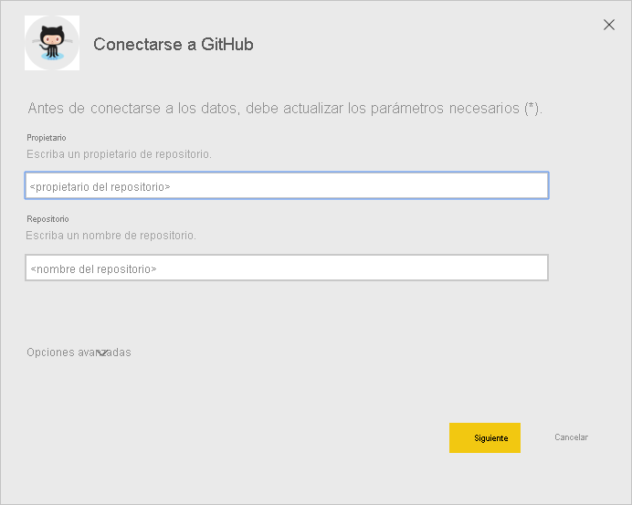

# <a name="connect-to-github-with-power-bi"></a>Conexión a GitHub con Power BI
En este artículo, se explica cómo obtener datos de una cuenta de GitHub con una aplicación de plantilla de Power BI. La aplicación de plantilla genera un área de trabajo con un panel, un conjunto de informes y un conjunto de datos para que pueda explorar los datos de GitHub. La aplicación de GitHub para Power BI le muestra conclusiones sobre su repositorio de GitHub, con datos sobre contribuciones, problemas, solicitudes de incorporación de cambios y usuarios activos.


Después de instalar la aplicación de plantilla, puede cambiar el panel y el informe. A continuación, puede distribuirlo como una aplicación entre los compañeros de su organización.

Conéctese a la [aplicación de plantilla de GitHub](https://app.powerbi.com/groups/me/getapps/services/pbi-contentpacks.pbiapps-github) u obtenga más información sobre la [integración de GitHub](https://powerbi.microsoft.com/integrations/github) con Power BI.

También puede probar el [tutorial de GitHub](service-tutorial-connect-to-github.md). Instala datos reales de GitHub sobre el repositorio público para la documentación de Power BI.

>[!NOTE]
>Esta aplicación de plantilla requiere que la cuenta de GitHub tenga acceso al repositorio. Consulte más detalles sobre los requisitos a continuación.
>
>Esta aplicación de plantilla no es compatible con GitHub Enterprise.

## <a name="install-the-app"></a>Instalación de la aplicación

1. Haga clic en el vínculo siguiente para obtener la aplicación: [Aplicación de plantilla de GitHub](https://app.powerbi.com/groups/me/getapps/services/pbi-contentpacks.pbiapps-github)

1. En la página AppSource de la aplicación, seleccione [**OBTENER AHORA**](https://app.powerbi.com/groups/me/getapps/services/pbi-contentpacks.pbiapps-github).

    [](https://app.powerbi.com/groups/me/getapps/services/pbi-contentpacks.pbiapps-github)

1. Haga clic en **Instalar**. 

    

    Una vez instalada la aplicación, la verá en la página Aplicaciones.

   

## <a name="connect-to-data-sources"></a>Conexión a orígenes de datos

1. Seleccione el icono de la página Aplicaciones para abrir la aplicación.

1. En la pantalla de presentación, Seleccione **Explorar la aplicación**.

   

   La aplicación se abre y muestra los datos de ejemplo.

1. Seleccione el vínculo **Conectar los datos** en el banner de la parte superior de la página.

   

1. En el cuadro de diálogo que se abre, escriba el nombre del repositorio y el propietario del repositorio. Consulte los detalles acerca de la [búsqueda de parámetros](#FindingParams) más adelante. Cuando termine, haga clic en **Siguiente**.

   

1. En el siguiente cuadro de diálogo que se abre, asegúrese de que el método de autenticación esté establecido en **OAuth2**. No tiene que hacer nada en lo que respecta a la opción de privacidad. Cuando esté listo, haga clic en **Iniciar sesión**.

   

1. Escriba sus credenciales de GitHub y siga el proceso de autenticación de GitHub (este paso se podría omitir si ya ha iniciado sesión con el explorador).

   


Una vez que haya iniciado sesión, el informe se conectará a los orígenes de datos y se rellenará con datos actualizados. Durante este tiempo se activará el monitor de actividad.


Los datos del informe se actualizarán automáticamente una vez al día, a menos que haya deshabilitado esta opción durante el proceso de inicio de sesión. También puede [configurar su propia programación de actualización](./refresh-scheduled-refresh.md) para mantener actualizados los datos del informe si así lo quiere.

## <a name="customize-and-share"></a>Personalizar y compartir

Para personalizar y compartir la aplicación, seleccione el icono de lápiz en la esquina superior derecha de la página.


Para obtener información sobre la edición de artefactos en el área de trabajo, consulte los vínculos siguientes:
* [Paseo por el editor de informes de Power BI](../create-reports/service-the-report-editor-take-a-tour.md)
* [Conceptos básicos para los diseñadores en el servicio Power BI](../fundamentals/service-basic-concepts.md)

Cuando haya terminado de realizar los cambios deseados en los artefactos del área de trabajo, estará a punto para publicar y compartir la aplicación. Vea [Publicación de la aplicación](../collaborate-share/service-create-distribute-apps.md#publish-your-app) para aprender a hacerlo.

## <a name="whats-included-in-the-app"></a>Qué se incluye en la aplicación
Los siguientes datos están disponibles desde GitHub en Power BI:     

| Nombre de tabla | Descripción |
| --- | --- |
| Contribuciones |La tabla de contribuciones proporciona el total de adiciones, eliminaciones y confirmaciones creadas por el colaborador de forma agregada por semana. Se incluyen los 100 colaboradores principales. |
| Problemas |Lista de todos los problemas para el repositorio seleccionado con cálculos como, por ejemplo, tiempo total y promedio para cerrar un problema, total de problemas abiertos o total de problemas cerrados. Esta tabla estará vacía cuando no haya ningún problema en el repositorio. |
| Solicitudes de extracción |Esta tabla contiene todas las solicitudes de extracción para el repositorio, así como quién extrajo la solicitud. También contiene cálculos de las solicitudes de incorporación de cambios abiertas, cerradas y el total, cuánto tiempo se ha necesitado para incorporar los cambios y cuánto tiempo se ha tardado de media para cada solicitud de incorporación de cambios. Esta tabla estará vacía cuando no haya ninguna solicitud de incorporación de cambios en el repositorio. |
| Usuarios |En esta tabla, se muestra una lista de colaboradores o usuarios de GitHub que han realizado contribuciones, registrado problemas o solucionado solicitudes de incorporación de cambios para el repositorio seleccionado. |
| Hitos |Contiene todos los hitos para el repositorio seleccionado. |
| DateTable |Estas tablas contienen fechas actuales y de años anteriores, y permiten analizar los datos de GitHub por fecha. |
| ContributionPunchCard |Esta tabla puede usarse como una tarjeta perforada de contribución para el repositorio seleccionado. Muestra confirmaciones por día de la semana y hora del día. Esta tabla no está conectada a otras tablas en el modelo. |
| RepoDetails |Esta tabla proporciona detalles para el repositorio seleccionado. |

## <a name="system-requirements"></a>Requisitos del sistema
* La cuenta de GitHub que tiene acceso al repositorio.  
* Permiso concedido a la aplicación de Power BI para GitHub durante el primer inicio de sesión. Vea los detalles siguientes sobre la revocación del acceso.  
* Llamadas de API suficientes disponibles para extraer y actualizar los datos.
>[!NOTE]
>Esta aplicación de plantilla no es compatible con GitHub Enterprise.

### <a name="de-authorize-power-bi"></a>Quitar autorización de Power BI
Para quitar la autorización de Power BI para conectarse al repositorio de GitHub, puede revocar el acceso en GitHub. Para obtener más información, vea este tema en la [Ayuda de GitHub](https://help.github.com/articles/keeping-your-ssh-keys-and-application-access-tokens-safe/#reviewing-your-authorized-applications-oauth).

<a name="FindingParams"></a>
## <a name="finding-parameters"></a>Búsqueda de parámetros
Para determinar el propietario y el repositorio, examine el repositorio en GitHub:


La primera parte, "Azure", es el propietario y la segunda parte, "azure-sdk-for-php" es el repositorio mismo.  Verá estos dos mismos elementos en la dirección URL del repositorio:

```console
<https://github.com/Azure/azure-sdk-for-php> .
```

## <a name="troubleshooting"></a>Solución de problemas
Si es necesario, puede comprobar las credenciales de GitHub.  

1. En otra ventana del explorador, visite el sitio web de GitHub e inicie sesión en GitHub. Puede ver si está conectado en la esquina superior derecha del sitio de GitHub.    
2. En GitHub, vaya a la dirección URL del repositorio al que desea tener acceso en Power BI. Por ejemplo: https://github.com/dotnet/corefx.  
3. En Power BI, intente conectarse a GitHub. En el cuadro de diálogo Configurar GitHub, use los nombres del repositorio y el propietario del repositorio para dicho repositorio.  

## <a name="next-steps"></a>Pasos siguientes

* [Tutorial: conectarse a un repositorio de GitHub con Power BI](service-tutorial-connect-to-github.md)
* [Crear las nuevas áreas de trabajo en Power BI](../collaborate-share/service-create-the-new-workspaces.md)
* [Instalar y usar aplicaciones en Power BI](../consumer/end-user-apps.md)
* [Conectarse a aplicaciones de Power BI para servicios externos](service-connect-to-services.md)
* ¿Tiene alguna pregunta? [Pruebe a preguntar a la comunidad de Power BI](https://community.powerbi.com/)
