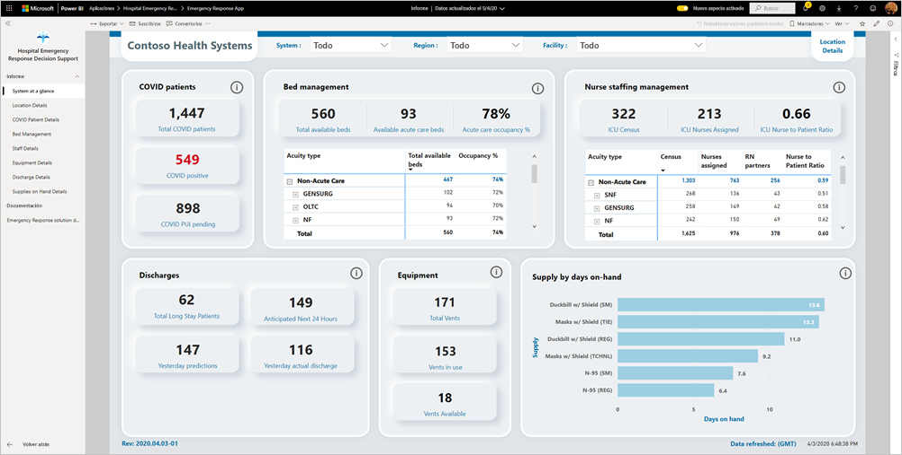
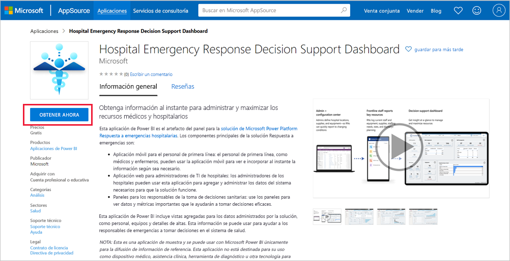
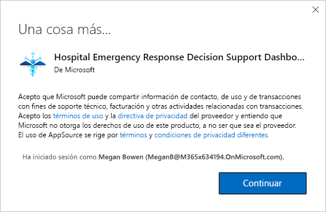
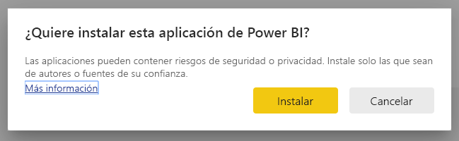
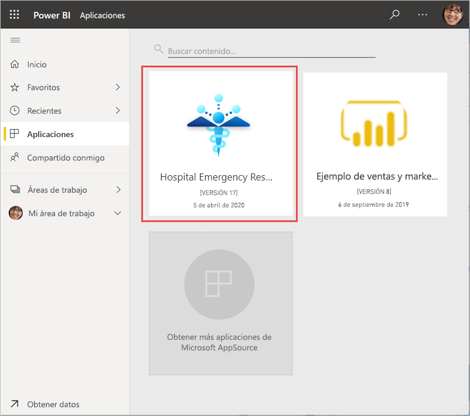
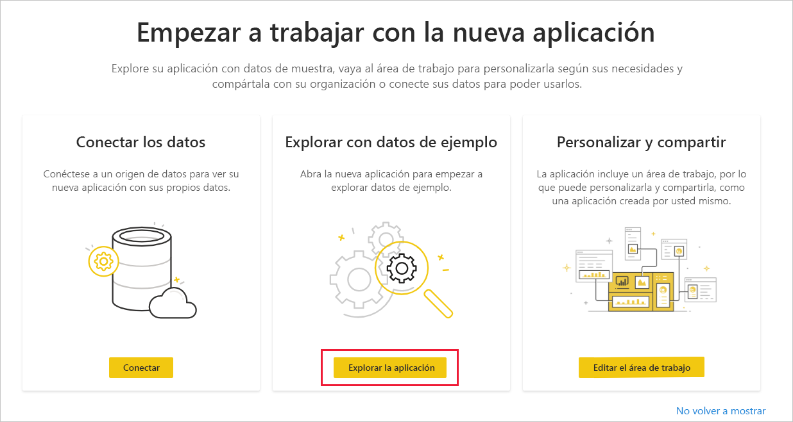
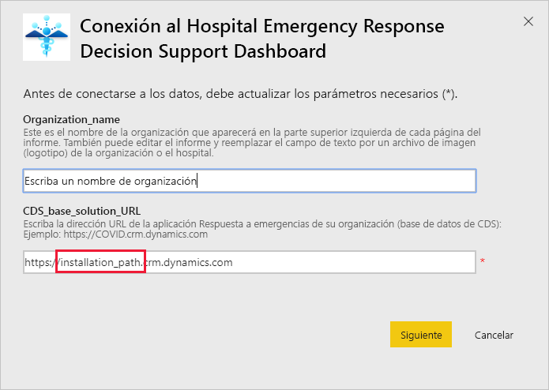
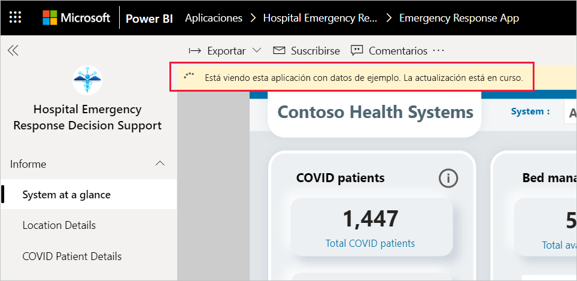
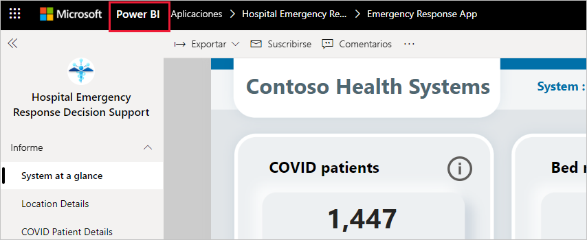

# Conexión al Panel de ayuda para la toma de decisiones en respuesta ante emergencias hospitalarias
La aplicación de plantilla del Panel de ayuda para la toma de decisiones en respuesta ante emergencias hospitalarias es el componente de informes de la [solución de Power Platform para la respuesta ante emergencias sanitarias](https://powerapps.microsoft.com/blog/emergency-response-solution-a-microsoft-power-platform-solution-for-healthcare-emergency-response/). El panel muestra que los administradores de emergencia agregan datos a través de su sistema de mantenimiento para ayudarles a tomar decisiones oportunas y correctas.

En este artículo se explica cómo instalar la aplicación y cómo conectarse a los orígenes de datos. Para obtener información sobre cómo usar el informe que verá con esta aplicación, consulte la [documentación del Panel de ayuda para la toma de decisiones en respuesta ante emergencias hospitalarias](https://docs.microsoft.com/powerapps/sample-apps/emergency-response/deploy-configure#view-the-power-bi-dashboard).

Después de instalar la aplicación de plantilla y conectarse a los orígenes de datos, puede personalizar el informe según sus necesidades. Luego puede distribuirlo como una aplicación entre los compañeros de su organización.

## Requisitos previos

Antes de instalar esta aplicación de plantilla, primero debe instalar y configurar la [solución Respuesta ante emergencias hospitalarias de Power Platform](https://docs.microsoft.com/powerapps/sample-apps/emergency-response/deploy-configure). Al instalar esta solución, se crean las referencias de orígenes de datos necesarias para rellenar la aplicación con datos.

Al instalar la solución de Power Platform Respuesta ante emergencias hospitalarias, tome nota de la [dirección URL de la instancia del entorno Common Data Service](https://docs.microsoft.com/powerapps/sample-apps/emergency-response/deploy-configure#publish-the-power-bi-dashboard). La necesitará para conectar la aplicación de plantilla a los datos.

## Instalación de la aplicación

1. Haga clic en el vínculo siguiente para obtener la aplicación: [Aplicación de plantilla del Panel de ayuda para la toma de decisiones en respuesta ante emergencias hospitalarias](https://aka.ms/AppSource_Hospital_offer)

1. En la página AppSource de la aplicación, seleccione [**OBTENER AHORA**](https://aka.ms/AppSource_Hospital_offer).

    

1. Lea la información en **Una cosa más** y seleccione **Continuar**.

    

1. Haga clic en **Instalar**. 

    

    Una vez instalada la aplicación, la verá en la página Aplicaciones.

   

## Conexión a orígenes de datos

1. Seleccione el icono de la página Aplicaciones para abrir la aplicación.

1. En la pantalla de presentación, seleccione **Explorar**.

   

   La aplicación se abre y muestra los datos de ejemplo.

1. Seleccione el vínculo **Conectar los datos** en el banner de la parte superior de la página.

   

1. En el cuadro de diálogo, haga lo siguiente:
   1. En el campo Nombre de la organización, escriba el nombre de la organización como, por ejemplo, "Contoso Health Systems". Este campo es opcional. Este nombre aparece en la parte superior izquierda del panel.
   1. En el campo CDS_base_solution, escriba la [dirección URL del de la instancia del entorno Common Data Service](https://docs.microsoft.com/powerapps/sample-apps/emergency-response/deploy-configure#publish-the-power-bi-dashboard). Por ejemplo: https://[myenv].crm.dynamics.com. Cuando termine, haga clic en **Siguiente**.

   

1. En el cuadro de diálogo siguiente que aparece, establezca el método de autenticación en **OAuth2**. No tiene que hacer nada en lo que respecta a la configuración de nivel de privacidad.

   Seleccione **Iniciar sesión**.

   

1. En la pantalla de inicio de sesión de Microsoft, inicie sesión en Power BI.

   

   Una vez que haya iniciado sesión, el informe se conectará a los orígenes de datos y se rellenará con datos actualizados. Durante este tiempo se activará el monitor de actividad.

   

## Programación de la actualización del informe

Cuando se haya completado la actualización de los datos, [configure una programación de actualización](../connect-data/refresh-scheduled-refresh.md) para mantener actualizados los datos del informe.

1. En la barra de encabezado superior, seleccione **Power BI**.

   

1. En el panel de navegación izquierdo, busque el área de trabajo del Panel de ayuda para la toma de decisiones en respuesta ante emergencias hospitalarias en **Áreas de trabajo** y siga las instrucciones descritas en el artículo [Configuración de la actualización programada](../connect-data/refresh-scheduled-refresh.md).

## Personalizar y compartir

Vea [Personalización y uso compartido de la aplicación](../connect-data/service-template-apps-install-distribute.md#customize-and-share-the-app) para obtener detalles. Asegúrese de revisar las [declinaciones de responsabilidades del informe](../create-reports/sample-covid-19-us.md#disclaimers) antes de publicar o distribuir la aplicación.

## Pasos siguientes
* [Descripción del informe de Respuesta ante emergencias hospitalarias](https://docs.microsoft.com/powerapps/sample-apps/emergency-response/deploy-configure#view-the-power-bi-dashboard)
* [Configuración e información sobre la plantilla de ejemplo de Comunicación de crisis en Power Apps](https://docs.microsoft.com/powerapps/maker/canvas-apps/sample-crisis-communication-app)
* ¿Tiene alguna pregunta? [Pruebe a preguntar a la comunidad de Power BI](https://community.powerbi.com/)
* [¿Qué son las aplicaciones de plantilla de Power BI?](../connect-data/service-template-apps-overview.md)
* [Instalación y distribución de aplicaciones de plantilla en la organización](../connect-data/service-template-apps-install-distribute.md)
