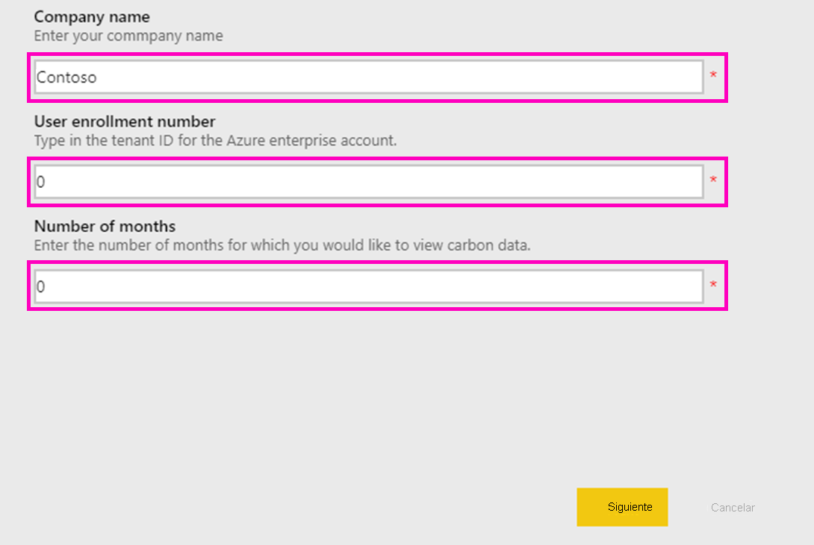
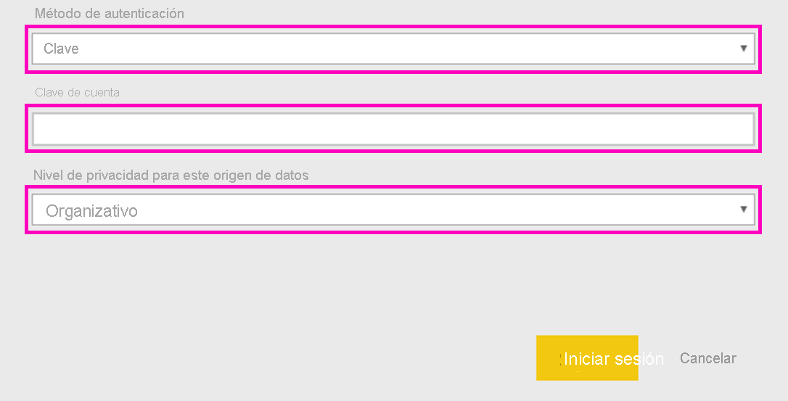

# Conexión con Microsoft Sustainability Calculator
Obtención de conclusiones sobre las emisiones de carbono de la infraestructura de TI para tomar decisiones informáticas más sostenibles

Microsoft Sustainability Calculator proporciona nuevas conclusiones sobre los datos de emisiones de carbono asociados a los servicios de Azure. Los responsables de informar sobre la sostenibilidad e impulsarla dentro de sus organizaciones, ahora tienen la capacidad de cuantificar el impacto de carbono de cada suscripción de Azure, así como ver el ahorro de carbono estimado que supone la ejecución de esas cargas de trabajo en Azure frente a los centros de datos locales. Estos datos se pueden usar para los informes de gases de efecto invernadero de las emisiones del ámbito 3. El acceso a Microsoft Sustainability Calculator requerirá su identificador de inquilino y la clave de acceso, normalmente disponibles a través del administrador de Azure de su organización.

Para usar esta aplicación, necesitará información de Azure Enterprise Portal. Los administradores del sistema de su empresa pueden ayudarle a obtener esta información. Revise estas instrucciones y obtenga la información necesaria antes de instalar la aplicación. 

Esta versión del conector solo admite las inscripciones empresariales desde [https://ea.azure.com](https://ea.azure.com/). Actualmente no se admiten las inscripciones de China.

## Cómo conectarse
[!INCLUDE [powerbi-service-apps-get-more-apps](../includes/powerbi-service-apps-get-more-apps.md)]

1. Seleccione **Microsoft Sustainability Calculator** \> **Obtenerla ahora**.
1. En **¿Instalar esta aplicación de Power BI?** , seleccione **Instalar**.
1. En el panel **Aplicaciones**, seleccione el icono **Microsoft Sustainability Calculator**.
1. En **Empezar a trabajar con la nueva aplicación**, seleccione **Conectar**.

    

1. Escriba la información pertinente en **Nombre de la compañía, Número de inscripción del usuario** y **Número de meses \> Iniciar sesión**. Consulte los detalles acerca de la [búsqueda de parámetros](#finding-parameters) más adelante.

    

1. En **Método de autenticación**, seleccione **Clave** y en **Nivel de privacidad**, elija **Organización**.
1. En **Clave**, escriba la **clave de acceso\> Iniciar de sesión**.

    

1. El proceso de importación se inicia automáticamente. Cuando haya finalizado, aparece un nuevo panel, informe y modelo en el **panel de navegación**. Seleccione el informe para ver los datos importados.

## Búsqueda de parámetros

Para encontrar el **id. de inscripción** y la **clave de acceso** de su empresa, trabaje con el administrador de Azure para obtener la información necesaria. El administrador

1. Inicie sesión en [Azure Enterprise Portal](https://ea.azure.com) y haga clic en **Administrar** en la cinta de opciones de la izquierda y obtenga la información de **Número de inscripción** como se muestra a continuación.
2. En [Azure Enterprise Portal](https://ea.azure.com), haga clic en **Informes** y luego en Clave de acceso de API, como se muestra a continuación, para obtener la clave de cuenta de inscripción principal.

## Uso de la aplicación

Para actualizar los parámetros en cualquier momento, vaya a la configuración **Conjunto de datos**, acceda al conjunto de datos asociado al espacio área de trabajo de la aplicación y actualice el identificador del inquilino, el nombre de la empresa o los meses de datos. Después de aplicar los parámetros, haga clic en **Actualizar** para volver a cargar los datos con los nuevos parámetros aplicados.