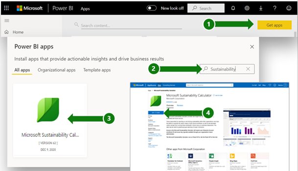
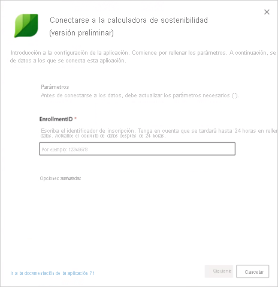
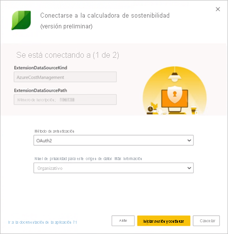
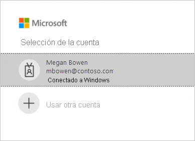

# Página de soporte técnico de Microsoft Sustainability Calculator

Microsoft Sustainability Calculator proporciona nuevas conclusiones sobre los datos de emisiones de carbono asociados a los servicios de Azure. Los responsables de informar sobre la sostenibilidad e impulsarla dentro de sus organizaciones ahora pueden cuantificar el impacto de carbono de cada suscripción de Azure, así como ver el ahorro de carbono estimado que supone la ejecución de esas cargas de trabajo en Azure frente a los centros de datos locales. Estos datos se pueden usar para los informes de gases de efecto invernadero de las emisiones del ámbito 3.

> [!NOTE]
> Esta versión del conector solo admite las inscripciones desde [portal Azure Enterprise](https://ea.azure.com). Actualmente no se admiten las inscripciones de China.

## Requisitos previos

Para acceder a Microsoft Sustainability Calculator, necesitará la información sigueinte del administrador de Azure de la organización:

- Id. de inquilino
- Clave de acceso
- Número de inscripción
- Solo los roles de administrador de Azure pueden autenticar y conectar la calculadora con los datos de la empresa (**solo para la versión preliminar de diciembre de 2020**).

Para buscar el número de inscripción de la empresa:

1. Inicie sesión en [Azure Enterprise Portal](https://ea.azure.com) como administrador.
2. Seleccione **Active Directory** o **Administrar** en la barra de navegación de la izquierda. Verá el número de inscripción de la empresa.

   

Para buscar la clave de acceso de la empresa:

1. Inicie sesión en [Azure Enterprise Portal](https://ea.azure.com) como administrador.
2. Seleccione **Informes** y, luego, **Clave de acceso de API** para obtener la clave de la cuenta de inscripción principal.

## Sustainability Calculator, versión de enero de 2020

### Cómo conectarse

[!INCLUDE [powerbi-service-apps-get-more-apps](../includes/powerbi-service-apps-get-more-apps.md)]

3. Seleccione **Microsoft Sustainability Calculator** y, luego, **Obtenerla ahora**.

4. En **¿Instalar esta aplicación de Power BI?** , seleccione **Instalar**.

5. En el panel **Aplicaciones**, seleccione el icono **Microsoft Sustainability Calculator**.

6. En **Empezar a trabajar con la nueva aplicación**, seleccione **Conectar**.

   

7. Escriba la información correspondiente en **Nombre de la empresa**, **Número de inscripción del usuario** y **Número de meses**. Para información sobre cómo obtener el número de inscripción, consulte [Requisitos previos](#prerequisites). Seleccione **Next** (Siguiente).

   

8. Escriba la información siguiente:

   | Campo | Valor |
   | --- | --- |
   | **Método de autenticación** | Seleccione **Clave**. |
   | **Clave de cuenta** | Escriba la clave de acceso. |
   | **Nivel de privacidad para este origen de datos** | Seleccione **Organizativo**. |

   

9. Seleccione **Iniciar sesión**.

10. El proceso de importación se inicia automáticamente. Cuando haya finalizado, aparece un nuevo panel, informe y modelo en el **panel de navegación**. Seleccione el informe para ver los datos importados.

### Uso de la aplicación

Para actualizar los parámetros:

1. Vaya al ajuste **Conjunto de datos** y acceda a la configuración asociada con el área de trabajo de la aplicación.
2. Actualice la información correspondiente en **Nombre de la empresa**, **Número de inscripción del usuario** o **Número de meses**, según sea necesario.
3. Seleccione **Actualizar** para recargar los datos con los parámetros nuevos aplicados.

## Sustainability Calculator, versión (versión preliminar) de diciembre de 2020

Calcule hoy mismo las emisiones de carbono basadas en la nube con Microsoft Sustainability Calculator.

La precisión de la contabilidad de carbono requiere una buena información por parte de los asociados, distribuidores y proveedores. Microsoft Sustainability Calculator le brinda transparencia con respecto a las emisiones de carbono que genera su uso de Azure y Microsoft Dynamics.

La contabilidad de carbono se extiende a través de los tres ámbitos de emisiones con una metodología validada por la Universidad de Stanford en 2018. Usa la contabilidad de carbono coherente y precisa para cuantificar el impacto de los servicios en la nube de Microsoft en la huella medioambiental de los clientes. Microsoft es el único proveedor de servicios en la nube que ofrece este nivel de transparencia a los clientes al compilar informes para los requisitos de informes voluntarios o reglamentarios.

### Antes de comenzar

Microsoft Sustainability Calculator se ejecuta en Power BI Pro. Si no tiene Power BI Pro, [obtenga una evaluación gratuita ahora mismo](https://powerbi.microsoft.com/power-bi-pro).

Necesitará el número de inscripción de Azure. Si no lo tiene, pídale ayuda al administrador de Azure de su organización. Para obtener más información, consulte [Requisitos previos](#prerequisites).

### Conexión de la calculadora: cinco pasos sencillos para la contabilidad de carbono

1. Descargue la aplicación en [AppSource](https://go.microsoft.com/fwlink/?linkid=2151690).

   

   También puede buscar la aplicación en Power BI.

   

2. Abra la aplicación.

3. Escriba el número de inscripción. Seleccionar **Conectar los datos** y escriba el número de inscripción. Para más información sobre cómo obtener el número de inscripción, consulte [Requisitos previos](#prerequisites).

   

4. Conecte la cuenta:
   - En **Se está conectando a (1 de 2)** , en **Método de autenticación**, seleccione **OAuth2**, y en **Configuración del nivel de privacidad de este origen de datos**, seleccione **Organizativo**.

      
 
   - Seleccione la cuenta del usuario.

      
       
   - En **Se está conectando a (2 de 2)** , en **Método de autenticación**, seleccione **Anónimo**, y en **Configuración del nivel de privacidad de este origen de datos**, seleccione **Organizativo**.

     
    
5. Espere que se cree la vista. Este proceso puede tardar hasta 24 horas.

### Recursos adicionales

- [Vídeo práctico](https://go.microsoft.com/fwlink/?linkid=2151608)
- [Las ventajas en términos de emisiones de carbono de la informática en la nube: Un estudio sobre la nube de Microsoft en colaboración con WSP](https://download.microsoft.com/download/7/3/9/739BC4AD-A855-436E-961D-9C95EB51DAF9/Microsoft_Cloud_Carbon_Study_2018.pdf)

### Preguntas más frecuentes

#### Configuración de la aplicación

**Recibo un error al conectar mis datos con la calculadora. ¿Qué puedo hacer?**

En primer lugar, revise en Azure Cost Management para ver si tiene privilegios de administrador de TI. Si no es así, solicite este acceso al administrador. A continuación, asegúrese de usar el número de inscripción correcto.

**Escribí el número de inscripción, pero los datos de la empresa no se cargan. ¿Qué pasa?**

La versión preliminar pública de Sustainability Calculator puede tardar hasta 24 horas en cargar los datos. Vuelva después de 24 horas y seleccione **Refrescar** en Power BI.

**¿Microsoft está tratando de transferirme la responsabilidad de sus emisiones?**

No. Las emisiones de carbono de los servicios de Azure se informan como emisiones del ámbito 1 y 2 de Microsoft, coherentes con el [protocolo de gases de efecto invernadero (GEI)](https://ghgprotocol.org/) estándar del sector. El protocolo de gases de efecto invernadero define las emisiones del ámbito 3 como las que otra entidad emite en su nombre y que, de manera inherente, se cuentan dos veces. Microsoft Sustainability Calculator proporciona una transparencia nueva para sus emisiones del ámbito 3 asociadas con el uso de los servicios de Azure, específicamente la categoría 1 del ámbito 3, "Bienes y servicios comprados".

**¿Por qué mis emisiones a partir del uso de la nube de Microsoft son mucho más bajas de lo que serían si estuviera usando una solución local?**

Microsoft llevó a cabo [un estudio, publicado en 2018](https://blogs.microsoft.com/on-the-issues/2018/05/17/microsoft-cloud-delivers-when-it-comes-to-energy-efficiency-and-carbon-emission-reductions-study-finds/), en el que se evaluó la diferencia entre la nube de Microsoft y los centros de datos locales o tradicionales. Los resultados muestran que Azure Compute y Storage son entre 52 y 79 por ciento más eficaces en términos energéticos que los centros de datos empresariales tradicionales, en función de si la comparación se hace con una alternativa local de baja, media o alta eficacia. Al tener en cuenta nuestras compras de energía renovables, Azure está entre el 79 y el 98 por ciento más eficaz en términos de emisiones de carbono. Estos ahorros se deben a cuatro características clave de la nube de Microsoft: eficacia operativa de TI, eficacia de los equipos de TI, eficacia de la infraestructura de los centros de datos y energía eléctrica renovable.

**Si las operaciones de Microsoft son neutras en carbono y se basan en energías renovables, ¿por qué las emisiones de los clientes de los servicios de Azure no son cero?**

Hay dos razones principales por las que las emisiones de los clientes de Microsoft no son cero. La primera está relacionada con las prácticas de contabilidad de los gases de efecto invernadero, mientras que la segunda tiene que ver con el límite de este análisis. Para lograr operaciones neutras en carbono, Microsoft usa compensaciones de carbono para disminuir ciertas fuentes de emisiones, como la quema de combustible local para los generadores de copia de seguridad, refrigerantes y flotas de vehículos. Esto permite que Microsoft reduzca a cero sus emisiones *netas*. La calculadora informa las emisiones *brutas* de gases de efecto invernadero antes de aplicar estas compensaciones, aunque el volumen de las compensaciones aplicadas y las emisiones netas se informa en la pestaña **Informe de GEI** para mayor transparencia. La segunda razón es que, además de la energía y las emisiones asociadas al funcionamiento de los centros de datos de Microsoft, la huella de las emisiones incluye la energía que usan los proveedores de servicios de Internet fuera del límite operativo de Microsoft para transmitir datos entre los centros de datos de Microsoft y los clientes de Azure.

**¿Cómo debo usar estos datos y dónde tengo que informarlos?**

Puede informar sus emisiones como parte del ámbito 3 de las emisiones de carbono indirectas de la empresa. Las emisiones del ámbito 3 se suelen divulgar en los informes de sostenibilidad, el informe CDP sobre el cambio climático y otros tipos de informes. Además de las emisiones totales, el ahorro de emisiones ofrece un claro ejemplo de cómo la decisión de su empresa de usar los servicios de Microsoft Azure colabora con la disminución de las emisiones globales. Para contextualizar, la aplicación indica el equivalente en kilómetros recorridos evitados correspondiente a la reducción de las emisiones de gases de efecto invernadero, en función de los factores de la calculadora de equivalencias de la Agencia de Protección Ambiental de EE. UU. a partir de enero de 2020.

**¿Qué puedo hacer para disminuir aún más las emisiones?**

La rentabilidad de los recursos y los costos en Azure reducirá el impacto medioambiental del uso de Azure. Por ejemplo, las máquinas virtuales sin usar son innecesarias tanto en la nube como en el entorno local. Ajustar el tamaño de las máquinas virtuales para mejorar los factores de utilización de proceso (CUF) reduce el uso energético por salida útil, al igual que en los servidores físicos. [Azure Cost Management](https://docs.microsoft.com/azure/cost-management-billing/costs/cost-mgt-best-practices) ofrece las herramientas para planear, analizar y reducir los gastos para maximizar su inversión en la nube.

#### Metodología

**¿Cuál es la metodología detrás de la herramienta?**

Microsoft Sustainability Calculator refleja los servicios en la nube específicos utilizados y los requisitos energéticos asociados, la eficacia de los centros de datos que proporcionan esos servicios, la combinación de electricidad y combustible en las regiones donde funcionan esos centros de datos y las compras de energía renovable de Microsoft. Como parte del desarrollo de la aplicación, la metodología y su implementación fueron comprobadas por terceros para garantizar que cumplían con el Estándar de Informes y Contabilidad Corporativa del Protocolo de Gases de Efecto Invernadero (GEI) del Instituto de Recursos Mundiales (WRI)/Consejo Empresarial Mundial para el Desarrollo Sostenible (WBCSD). El ámbito de la comprobación, realizada en conformidad con ISO 14064-3: Gases de efecto invernadero, parte 3: Especificación con directrices para la validación y comprobación de las aserciones de gas de efecto invernadero, incluyó la estimación de las emisiones de los servicios de Azure, pero excluyó la estimación de las emisiones locales dada la naturaleza hipotética de esa estimación. Hay documentada una descripción más detallada del cálculo de carbono en la pestaña **Metodología del cálculo** de la herramienta.

**¿Qué datos se necesitan para calcular la huella de carbono de Azure? ¿Tienen acceso a los datos de mi empresa?**

Los cálculos de carbono estimados se realizan en función del consumo de los servicios de Azure a los que se accede con Ingresos por consumo de Azure. Calculator no accede a ninguno de sus datos almacenados de cliente. Los datos de consumo se combinan con los datos de seguimiento de energía y carbono de Microsoft para calcular las emisiones estimadas asociadas con su consumo de servicios de Azure en función de los centros de datos que proporcionan esos servicios.

**¿Este cálculo incluye todos los servicios y todas las regiones de Azure?**

Las estimaciones incluyen todos los servicios de Azure en todas las regiones de Azure asociadas al identificador de inquilino proporcionado durante la instalación.

#### Caracterización de las emisiones locales

**¿De dónde obtiene Microsoft Sustainability Calculator los datos sobre mis operaciones y emisiones locales?**

Microsoft Sustainability Calculator no obtiene información específica sobre los centros de datos locales, *excepto* la que usted proporciona. Tal como se describe en las secciones de Preguntas más frecuentes, Microsoft Sustainability Calculator se basa en la investigación del sector y las entradas de usuario con respecto a la eficacia y la combinación de energía de las alternativas locales para calcular una estimación de las emisiones locales.

**¿Cuáles son los supuestos relacionados con los cálculos locales? ¿Los ahorros por eficiencia pueden atribuirse solo a la eficacia en el uso de energía (PUE)?**

Las eficiencias asociadas con los servicios en la nube de Microsoft incluyen mucho más que la eficacia en el uso de energía (PUE) mejorada. Si bien los centros de datos de Microsoft se esfuerzan por optimizar la PUE, las optimizaciones de eficiencia principales provienen de la eficiencia operativa de TI (aprovisionamiento dinámico, multiinquilinato, utilización del servidor) y la eficiencia del sistema de TI (adaptación del hardware a los servicios para garantizar que fluya más energía hacia la salida útil), además de la eficiencia de la infraestructura del centro de datos (mejoras de PUE). Nuestro [estudio de 2018](https://blogs.microsoft.com/on-the-issues/2018/05/17/microsoft-cloud-delivers-when-it-comes-to-energy-efficiency-and-carbon-emission-reductions-study-finds/) cuantifica estos ahorros en comparación con una variedad de alternativas locales que abarcan desde centros de recursos de baja eficiencia hasta de alta eficiencia. Estas conclusiones se usan para calcular el uso de energía que se necesita para que un centro de datos local proporcione los mismos servicios que cada cliente consume en la nube de Microsoft.

**¿Cuál es la combinación de energía supuesta para la infraestructura local?**

De manera predeterminada, Microsoft Sustainability Calculator calcula las emisiones locales en función de la combinación de energías renovables y no renovables en la red eléctrica. Se supone que el centro de datos local se ubicaría en la misma red eléctrica que los centros de datos de Microsoft. Sin embargo, en el caso de los clientes que compren electricidad renovable *además de* lo que se encuentra en la red eléctrica (por ejemplo, a través de acuerdos de compra de energía), los usuarios pueden seleccionar el porcentaje de electricidad renovable y Microsoft Sustainability Calculator ajustará las emisiones locales según corresponda.

**¿Cuándo debo elegir Baja, Media o Alta para la eficacia de la infraestructura local?**

Los usuarios deben seleccionar la eficacia más representativa de la implementación local con la que les gustaría realizar la comparación, en función de las características del equipo y del centro de datos que aquí se indican:

- **Baja**: servidores físicos y almacenamiento con conexión directa en un centro de datos localizado pequeño (de 500 a 1999 pies cuadrados).
- **Media**: combinación de servidores físicos o virtualizados y almacenamiento conectado o dedicado en el centro de datos interno de nivel intermedio (de 2000 a 19 999 pies cuadrados).
- **Alta**: servidores virtualizados y almacenamiento dedicado en centros de datos internos de alta gama (más de 20 000 pies cuadrados).
