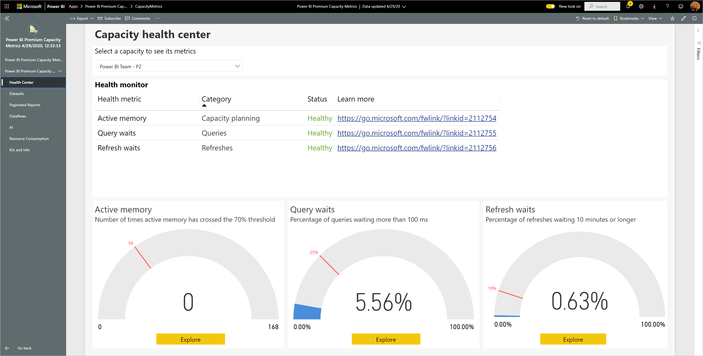
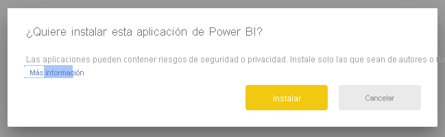
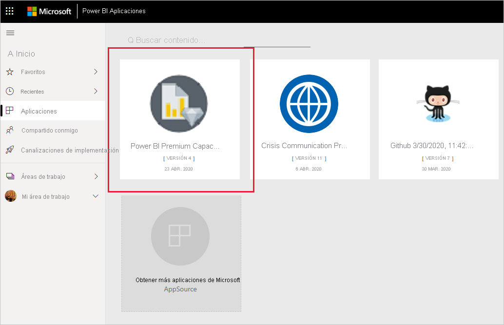
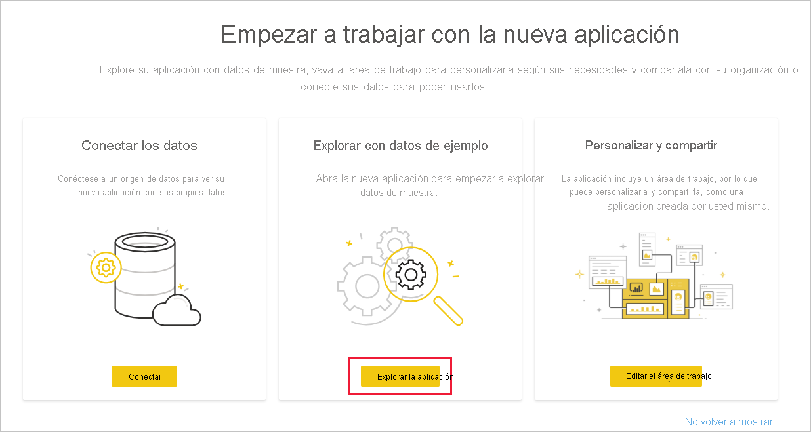
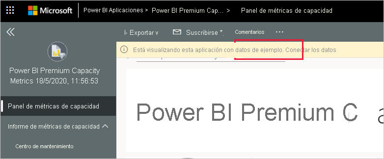
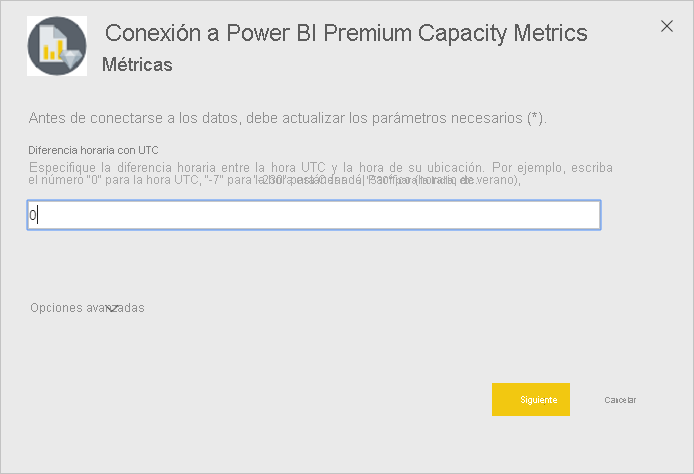
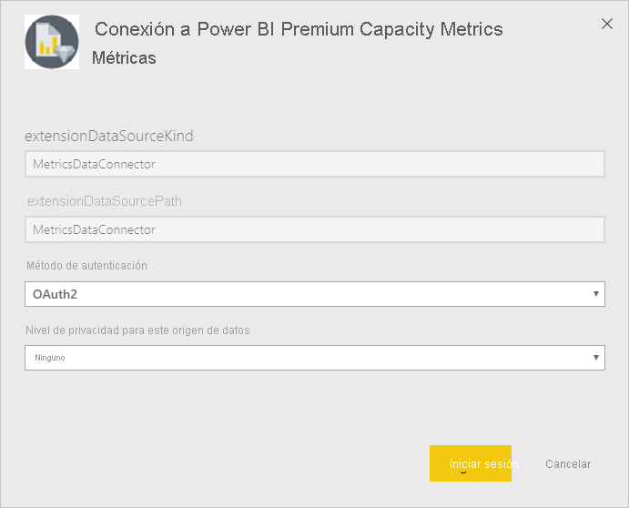
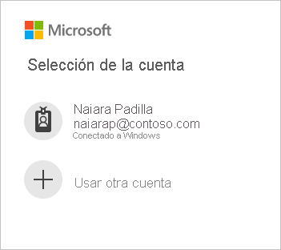
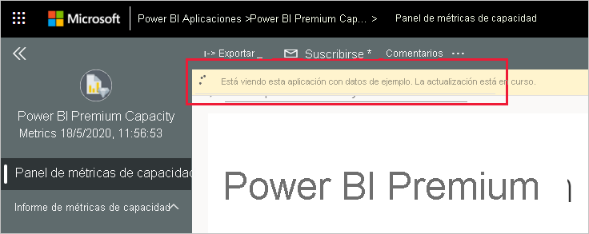
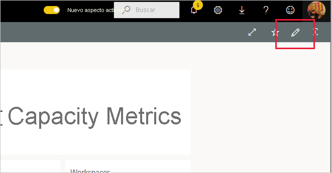

# Conexión a Power BI Premium Capacity Metrics

La supervisión de las capacidades es esencial para tomar decisiones fundamentadas sobre el uso óptimo de los recursos de capacidad Premium. La aplicación Power BI Premium Capacity Metrics proporciona la información más detallada sobre el rendimiento de las capacidades.

En este artículo se describe cómo instalar la aplicación y conectarse a los orígenes de datos. Para obtener información sobre el contenido del informe y cómo usarlo, consulte [Supervisión de capacidades Premium con la aplicación](../admin/service-admin-premium-monitor-capacity.md) y [Entrada de blog de la aplicación Premium Capacity Metrics](https://powerbi.microsoft.com/blog/premium-capacity-metrics-app-new-health-center-with-kpis-to-explore-relevant-metrics-and-steps-to-mitigate-issues/).

Después de instalar la aplicación y conectarse a los orígenes de datos, puede personalizar el informe según sus necesidades. Luego puede distribuirlo entre los compañeros de su organización.

> [!NOTE]
> La instalación de aplicaciones de plantilla requiere [permisos](./service-template-apps-install-distribute.md#prerequisites). Si no tiene permisos suficientes, póngase en contacto con el administrador de Power BI.

## Instalación de la aplicación

1. Haga clic en el vínculo siguiente para obtener la aplicación: [Aplicación de plantilla Power BI Premium Capacity Metrics](https://app.powerbi.com/groups/me/getapps/services/pbi_pcmm.capacity-metrics-dxt)

1. En la página AppSource de la aplicación, seleccione [**OBTENER AHORA**](https://app.powerbi.com/groups/me/getapps/services/pbi_pcmm.capacity-metrics-dxt).

    

1. Seleccione **Instalar**. 

    

    > [!NOTE]
    > Si ha instalado la aplicación previamente, se le preguntará si desea [sobrescribir esa instalación](./service-template-apps-install-distribute.md#update-a-template-app) o instalarla en una nueva área de trabajo.

    Una vez instalada la aplicación, la verá en la página Aplicaciones.

   

## Conectarse a orígenes de datos

1. Seleccione el icono de la página Aplicaciones para abrir la aplicación.

1. En la pantalla de presentación, seleccione **Explorar**.

   

   La aplicación se abre y muestra los datos de ejemplo.

1. Seleccione el vínculo **Conectar los datos** en el banner de la parte superior de la página.

   

1. En el cuadro de diálogo que se abre, establezca la diferencia horaria con UTC, es decir, la diferencia en horas entre la hora universal coordinada y la hora de la ubicación. A continuación, haga clic en **Siguiente**.
  
   
   **Nota: El formato de media hora debe ser decimal (por ejemplo: 5,5, 2,5, etc.).**

1. En el siguiente cuadro de diálogo que aparece, no tiene que hacer nada. Tan solo seleccione **Iniciar sesión**.

   

1. En la pantalla de inicio de sesión de Microsoft, inicie sesión en Power BI.

   

   Una vez que haya iniciado sesión, el informe se conectará a los orígenes de datos y se rellenará con datos actualizados. Durante este tiempo se activará el monitor de actividad.

   

   Los datos del informe se actualizarán automáticamente una vez al día, a menos que haya deshabilitado esta opción durante el proceso de inicio de sesión. También puede [configurar su propia programación de actualización](./refresh-scheduled-refresh.md) para mantener actualizados los datos del informe si así lo quiere.

## Personalizar y compartir

Para iniciar la personalización de la aplicación, haga clic en el icono de lápiz en la esquina superior derecha.

 

Vea [Personalización y uso compartido de la aplicación](./service-template-apps-install-distribute.md#customize-and-share-the-app) para obtener detalles.

## Pasos siguientes
* [Supervisión de capacidades Premium con la aplicación](../admin/service-admin-premium-monitor-capacity.md)
* [Entrada de blog de la aplicación Premium Capacity Metrics](https://powerbi.microsoft.com/blog/premium-capacity-metrics-app-new-health-center-with-kpis-to-explore-relevant-metrics-and-steps-to-mitigate-issues/)
* [¿Qué son las aplicaciones de plantilla de Power BI?](./service-template-apps-overview.md)
* [Instalación y distribución de aplicaciones de plantilla en la organización](./service-template-apps-install-distribute.md)
* ¿Tiene preguntas? [Pruebe a plantearlas en la Comunidad de Power BI](https://community.powerbi.com/)