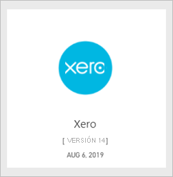

# Conexión a Xero con Power BI
Xero es un software de contabilidad en línea fácil de usar que está diseñado específicamente para pequeñas empresas. Cree visualizaciones atractivas basadas en las operaciones financieras de Xero con esta aplicación de plantilla de Power BI. En el panel predeterminado se incluyen muchas métricas de pequeña empresa, como la posición de efectivo, los ingresos frente a los gastos, la tendencia de beneficios y pérdidas, los días de deudor y la rentabilidad de la inversión.

Conéctese a la [aplicación de plantilla de Xero](https://app.powerbi.com/getdata/services/xero) para Power BI u obtenga más información sobre la integración de [Xero y Power BI](https://help.xero.com/Power-BI).

## Cómo conectarse

[!INCLUDE [powerbi-service-apps-get-more-apps](../includes/powerbi-service-apps-get-more-apps.md)]

3. Seleccione **Xero** \> **Obtenerlo ahora**.
4. En **¿Quiere instalar esta aplicación de Power BI?** , seleccione **Instalar**.

    

4. En el panel **Aplicaciones**, seleccione el icono de **Xero**.

   

6. En **Empezar a trabajar con la nueva aplicación**, seleccione **Conectar**.

    

4. Escriba un alias para la organización asociada con la cuenta de Xero. Valdrá cualquiera, sirve principalmente para ayudar a que los usuarios que tengan varias organizaciones de Xero lo tengan claro. Vea los detalles sobre la [búsqueda parámetros](#FindingParams) más adelante en este artículo.

    

5. En **Método de autenticación**, seleccione **OAuth**. Cuando se le pida, inicie sesión en la cuenta de Xero y seleccione la organización a la que conectarse. Una vez completado el inicio de sesión, seleccione **Iniciar sesión** para que empiece el proceso de carga.
   
    
   
    
6. Tras la aprobación, el proceso de importación se iniciará automáticamente. Cuando haya finalizado, aparecerá un nuevo panel, el informe y modelo en el panel de navegación. Seleccione el panel para ver los datos importados.
   
     

**¿Qué más?**

* Pruebe a [hacer una pregunta en el cuadro de preguntas y respuestas](../consumer/end-user-q-and-a.md), en la parte superior del panel.
* [Cambie los iconos](../create-reports/service-dashboard-edit-tile.md) en el panel.
* [Seleccione un icono](../consumer/end-user-tiles.md) para abrir el informe subyacente.
* Aunque el conjunto de datos se programará para actualizarse diariamente, puede cambiar la programación de actualización o intentar actualizar a petición mediante **Actualizar ahora**

## Qué se incluye
En la aplicación de plantilla se incluyen iconos y métricas que abarcan una gran variedad de áreas, con los informes correspondientes para obtener más información:  

| Área | Iconos de panel | Informe |
| --- | --- | --- |
| Cash |Daily cash flow  Cash in  Cash out  Closing balance by account  Closing balance today |Bank Accounts |
| Cliente |Invoiced sales  Invoiced sales by customer  Invoiced sales growth trend  Invoices due  Outstanding receivables  Overdue receivables |Cliente  Inventory |
| Supplier |Billed purchases  Billed purchases by supplier  Billed purchases growth trend   Bills due  Outstanding payables  Overdue payables |Suppliers  Inventario |
| Inventario |Monthly sales amount by product |Inventario |
| Profit and loss |Monthly profit and loss  Net profit this fiscal year  Net profit this month  Top expense accounts |Profit and Loss |
| Balance sheet |Total assets  Total liabilities  Equity |Balance Sheet |
| Mantenimiento |Current ratio  Gross profit percentage   Return on total assets  Total liabilities to equity ratio |Salud  Glossary and Technical Notes |

El conjunto de datos también incluye las siguientes tablas para personalizar los informes y paneles:  

* Addresses  
* Alerts  
* Bank Statement Daily Balance  
* Bank Statements  
* Contactos  
* Expense Claims  
* Invoice Line Items  
* Invoices  
* Items  
* Month End  
* Organización  
* Saldo de comprobación  
* Xero Accounts

## Requisitos del sistema
Los siguientes roles son necesarios para acceder a la aplicación de plantilla de Xero: "Standard + Reports" o "Advisor".

## Búsqueda de parámetros
Proporcione un nombre para la organización para realizar el seguimiento en Power BI. Así, podrá conectarse a varias organizaciones diferentes. No puede conectarse a la misma organización varias veces, ya que afectará a la actualización programada.   

## Solución de problemas
* Los usuarios de Xero deben tener los siguientes roles para acceder a la aplicación de plantilla de Xero para Power BI: "Standard + Reports" o "Advisor". La aplicación de plantilla depende de los permisos basados en el usuario para acceder a datos de informes a través de Power BI.
* Durante la carga, los iconos del panel se encontrarán en un estado de carga genérico. Permanecen así hasta que se completa la carga. Si recibe una notificación que le indica que se ha completado la carga pero los iconos todavía se están cargando, intente actualizar los iconos del panel mediante los puntos suspensivos (...) que aparecen en la parte superior derecha del panel.
* Si no se puede actualizar la aplicación de plantilla, compruebe si se ha conectado a la misma organización más de una vez en Power BI. Xero solo permite una conexión activa a una organización y puede que vea un error que indica que las credenciales no son válidas si se conecta a la misma más de una vez.  
* Si tiene problemas para conectarse a la aplicación de plantilla de Xero para Power BI, como mensajes de error o tiempos de carga lentos, primero borre la caché y las cookies, reinicie el explorador; después, vuelva a conectarse a Power BI.  

Si el problema persiste, envíe un vale a https://support.powerbi.com.

## Pasos siguientes
[Introducción a Power BI](../fundamentals/service-get-started.md)

[Obtener datos en Power BI](service-get-data.md)
