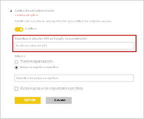

# Certificación de los conjuntos de datos: Power BI

La organización puede *certificar* los conjuntos de datos que son un origen autorizado de información importante. Estos conjuntos de datos se destacan especialmente cuando los diseñadores de informes empiezan a crear un informe y buscan datos de confianza. La certificación es un proceso muy selectivo en el que solo se certifican los conjuntos de datos más valiosos. Los administradores de Power BI tienen una configuración nueva para controlar de manera estricta quién puede certificar los conjuntos de datos. Los administradores garantizan que el proceso de certificación genere como resultado conjuntos de datos de confianza y con autoridad diseñados para su uso en toda la organización.

Como propietario del conjuntos de datos puede solicitar la certificación de un conjunto de datos promocionado. Un grupo concreto de usuarios definidos en la configuración de inquilino **Certificación** decide qué conjuntos de datos se certifican. El nombre del usuario que ha certificado un conjunto de datos se muestra en una información sobre herramientas durante la experiencia de detección de conjuntos de datos. Puede verlo si mantiene el mouse sobre la etiqueta **Certificado**. Vea [Configuración de la certificación de conjuntos de datos y flujos de datos](../admin/service-admin-setup-certification.md) para obtener más información.

Power BI proporciona dos maneras de *promocionar* los conjuntos de datos. Además de la certificación, la otra es la *promoción*. Como propietario del conjunto de datos o miembro de un área de trabajo, puede promocionar los conjuntos de datos cuando estén listos para su uso generalizado. Vea [Promoción del conjunto de datos](service-datasets-promote.md) para obtener más información. 

## Certificación de un conjunto de datos

El administrador de Power BI puede proporcionar una dirección URL para el vínculo **Más información** en la página de configuración **Aprobación**.  Los vínculos pueden apuntar a la documentación sobre el proceso de certificación. Si no proporciona un destino para el vínculo **Más información**, se apunta a este artículo de forma predeterminada.

Es evidente que ser seleccionado para certificar conjuntos de datos es una gran responsabilidad. El principio del proceso de comprobación es cuando el creador de un conjunto de datos se pone en contacto con usted para la certificación de un conjunto de datos. Cuando esté satisfecho de que un conjunto de datos merece la certificación, estos son los últimos pasos.

1. El propietario del conjunto de datos debe concederle permisos de miembro para el área de trabajo en la que se encuentra el conjunto de datos.
1. Si el administrador le ha nombrado como alguien que puede certificar conjuntos de datos, estará disponible la opción **Certificado** de la sección **Aprobación** de **Configuración** para el conjunto de datos. Seleccione **Certificado**.
1. Seleccione **Aplicar**.

Más información sobre cómo los administradores [controlan el uso de los conjuntos de datos entre áreas de trabajo](service-datasets-admin-across-workspaces.md).

## Pasos siguientes

* [Certificación para la configuración de conjuntos de datos y flujos de datos](../admin/service-admin-setup-certification.md)
* [Uso de conjuntos de datos entre áreas de trabajo](service-datasets-across-workspaces.md)
* ¿Tiene alguna pregunta? [Pruebe a preguntar a la comunidad de Power BI](https://community.powerbi.com/)
