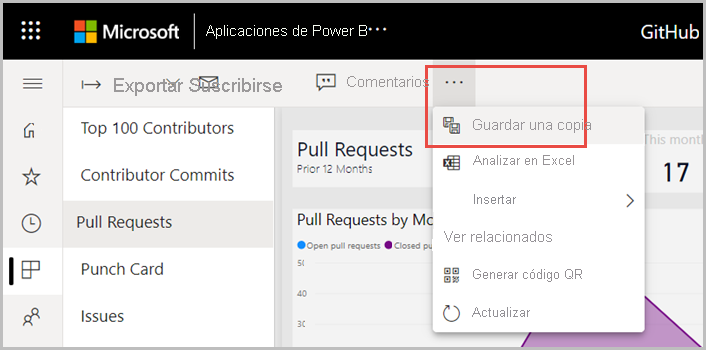
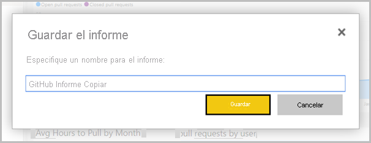
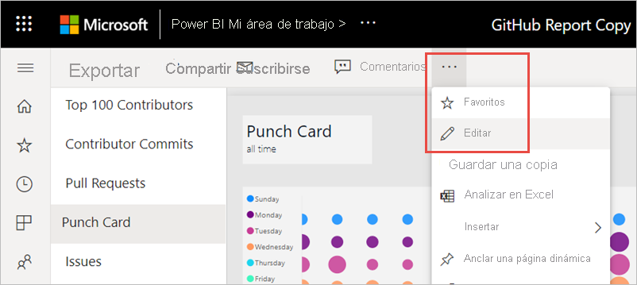
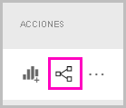
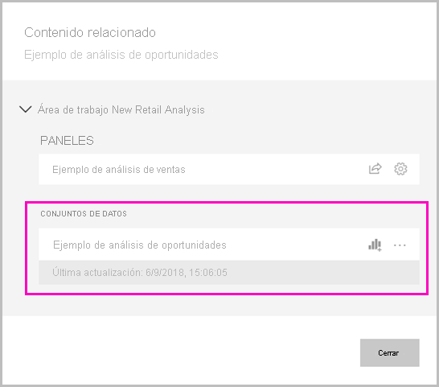

# Copia de informes desde otras áreas de trabajo

Si encuentra un informe que le gusta en un área de trabajo o una aplicación, puede realizar una copia y guardarlo en otra área de trabajo. Luego puede modificar la copia del informe mediante la incorporación o eliminación de objetos visuales y otros elementos. No tiene que preocuparse de crear el modelo de datos. Ya se ha creado de forma automática. Y resulta mucho más fácil modificar un informe existente que empezar desde cero. Pero si se crea una aplicación desde la nueva área de trabajo, a veces no se puede publicar la copia del informe en la aplicación. Vea [Consideraciones y limitaciones en el artículo "Uso de conjuntos de datos entre áreas de trabajo"](service-datasets-across-workspaces.md#considerations-and-limitations) para obtener detalles.

> [!NOTE]
> Para realizar una copia se necesita una licencia Pro, aunque el informe original se encuentre en un área de trabajo de una capacidad Premium.

## Guardado de una copie de un informe en un área de trabajo

1. En un área de trabajo, vaya a la vista de lista Informes.

    

1. En **Acciones**, seleccione **Guardar una copia**.

    

    Solo verá el icono **Guardar una copia** si el informe está en una nueva experiencia de área de trabajo y tiene [permiso de compilación](service-datasets-build-permissions.md). Incluso si tiene acceso al área de trabajo, necesita tener permiso de compilación para el conjunto de datos.

3. En **Guardar una copia de este informe**, asigne un nombre del informe y seleccione el área de trabajo de destino.

    

    Puede guardar el informe en el área de trabajo actual o en otra diferente en el servicio Power BI. Solo verá las áreas de trabajo que sean de la nueva experiencia, de las que sea miembro. 
  
4. Seleccione **Guardar**.

    Power BI crea de forma automática una copia del informe y una entrada en la lista de conjuntos de datos si el informe se basa en un conjunto de datos fuera del área de trabajo. El icono para este conjunto de datos es diferente del de los conjuntos de datos del área de trabajo: 
    
    De este modo, los miembros del área de trabajo pueden saber en qué paneles e informes se usan conjuntos de datos que están fuera del área de trabajo. En la entrada se muestra información sobre el conjunto de datos y algunas acciones concretas.

    

    Consulte [su copia del informe](#your-copy-of-the-report) en este artículo para obtener más información sobre el informe y el conjunto de información relacionado.

## Copia de un informe en una aplicación

1. En una aplicación, abra el informe que quiera copiar.
2. En la barra de menús, seleccione **Más opciones** ( **...** ) > **Guardar una copia**.

    

    Solo verá la opción **Guardar una copia** si el informe está en una nueva experiencia de área de trabajo y tiene [permiso de compilación](service-datasets-build-permissions.md).

3. Asigne un nombre al informe > **Guardar**.

    

    La copia se guardará automáticamente en Mi área de trabajo.

4. Seleccione **Ir al informe** para abrir la copia.

## Su copia del informe

Al guardar una copia del informe, se crea una conexión dinámica al conjunto de datos, y puede abrir la experiencia de creación de informes con el conjunto completo de datos disponible. 

No ha realizado una copia del conjunto de datos. El conjunto de datos aún reside en su ubicación original. Puede usar todas las tablas y medidas del conjunto de datos en el informe propio. Las restricciones de seguridad de nivel de fila (RLS) en el conjunto de datos están en vigor, por lo que solo verá los datos para los que tenga permiso, según su rol de RLS.

## Visualización de conjuntos de datos relacionados

Si tiene un informe en un área de trabajo basada en un conjunto de un conjunto de trabajo de otra área de trabajo, puede que necesite saber más sobre el conjunto de datos del que se basa.

1. En la vista de lista Informes, seleccione **Ver relacionados**.

    

1. En el cuadro de diálogo **Contenido relacionado** se muestran todos los elementos relacionados. En esta lista, el conjunto de datos es similar a cualquier otro. No puede saber que se encuentra en otra área de trabajo. Es un problema conocido.
 
    

## Eliminación de un informe y su conjunto de datos compartido

Puede decidir que ya no quiere ni el informe ni su conjunto de datos compartido asociado en el área de trabajo.

1. Elimine el informe. En la lista de informes del área de trabajo, seleccione el icono de **Eliminar**.

    

2. En la lista de conjuntos de datos, observará que los conjuntos de datos compartidos no tienen iconos de **Eliminar**. Actualice la página o vaya a otra página y regrese. El conjunto de datos se habrá eliminado. Si no, compruebe **Ver relacionados**. Puede estar relacionadas con otra tabla del área de trabajo.

    

    > [!NOTE]
    > La eliminación del conjunto de datos compartido en esta área de trabajo no elimina el conjunto de datos, tan solo la referencia a él.

## Pasos siguientes

- [Uso de conjuntos de datos entre áreas de trabajo](service-datasets-across-workspaces.md)
- ¿Tiene alguna pregunta? [Pruebe a preguntar a la comunidad de Power BI](https://community.powerbi.com/)
