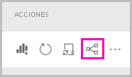
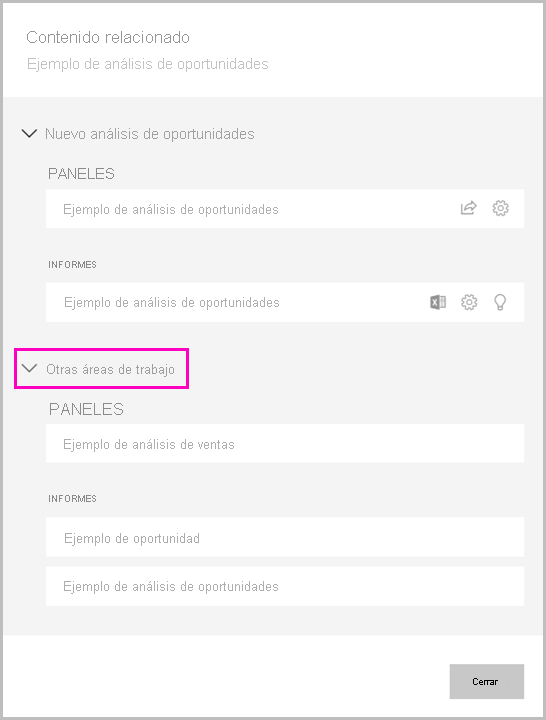

# Compartir un conjunto de datos

Como creador de *modelos de datos* en Power BI Desktop, creará *conjuntos de datos* que puede distribuir en el servicio Power BI. A continuación, otros creadores de informes podrán usar los conjuntos de valores como base para sus propios informes. En este artículo, aprenderá a compartir sus conjuntos de archivos. Para obtener información sobre cómo conceder y quitar el acceso a los conjuntos de datos compartidos, lea sobre el [permiso de compilación](service-datasets-build-permissions.md).

## Pasos para compartir el conjunto de datos

1. Primero debe crear un archivo .pbix con un modelo de datos en Power BI Desktop. Si piensa ofrecer este conjunto de datos para que otros usuarios generen informes, ni siquiera tendrá que diseñar un informe en el archivo .pbix.

    Un procedimiento recomendado consiste en guardar el archivo .pbix en un grupo de Microsoft 365.

1. Publique el archivo .pbix en una [nueva experiencia de área de trabajo](../collaborate-share/service-create-the-new-workspaces.md) del servicio Power BI.
    
    Otros miembros de esta área de trabajo ya pueden crear informes en otras áreas de trabajo en función de este conjunto de datos. Use la opción Administrar permisos en el conjunto de datos de la lista de contenidos del área de trabajo para proporcionar a otros usuarios acceso al conjunto de datos. 

1. También puede [publicar una aplicación](../collaborate-share/service-create-distribute-apps.md) desde esta área de trabajo. Al hacerlo, especifique quién tiene permisos y qué puede hacer en la página **Permisos**.

    > [!NOTE]
    > Si selecciona **Toda la organización**, nadie de la organización tendrá permisos de compilación. Este problema ya se conoce. En su lugar, especifique direcciones de correo electrónico en **Grupos o usuarios específicos**.  Si quiere que toda la organización tenga permiso de compilación, especifique un alias de correo electrónico para toda la organización.

    

1. Seleccione **Publicar aplicación**, o bien **Actualizar aplicación** si ya está publicada.

## Seguimiento del uso del conjunto de datos

Cuando tiene un conjunto de datos compartido en el área de trabajo, es posible que necesite saber qué informes de otras áreas de trabajo se basan en él.

1. En la vista de lista Conjuntos de datos, seleccione **Ver relacionados**.

    

1. En el cuadro de diálogo **Contenido relacionado** se muestran todos los elementos relacionados. En esta lista, verá los elementos relacionados en esta área de trabajo y en **Otras áreas de trabajo**.
 
    

## Limitaciones y consideraciones
Aspectos que se deben tener en cuenta sobre el uso compartido de conjuntos de datos:

* Al compartir un conjunto de datos mediante la administración de permisos, el uso compartido de informes o paneles, o bien la publicación de una aplicación, se concede acceso a todo el conjunto de datos a menos que se limite mediante la [seguridad de nivel de fila (RLS)](../admin/service-admin-rls.md). Los autores de informes pueden usar funciones que personalicen las experiencias del usuario al ver o interactuar con los informes, por ejemplo ocultar columnas, limitar las acciones en objetos visuales y otras. Esta experiencia de usuario personalizada no restringe los datos a los que los usuarios pueden acceder en el conjunto de datos. Use la [seguridad de nivel de fila (RLS)](../admin/service-admin-rls.md) en el conjunto de datos para que las credenciales de cada usuario determinen los datos a los que puede acceder.

## Pasos siguientes

- [Uso de conjuntos de datos entre áreas de trabajo](service-datasets-across-workspaces.md)
- ¿Tiene alguna pregunta? [Pruebe a preguntar a la comunidad de Power BI](https://community.powerbi.com/)
