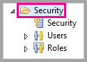

# <a name="use-security-assertion-markup-language-saml-for-sso-from-power-bi-to-on-premises-data-sources"></a>Uso de SAML (Lenguaje de marcado de aserción de seguridad) para el SSO de Power BI en orígenes de datos locales

La habilitación de SSO facilita la tarea de los informes y paneles de Power BI de actualizar los datos de orígenes locales al tiempo que se respetan los permisos de nivel de usuario configurados en esos orígenes. Use [SAML (Lenguaje de marcado de aserción de seguridad)](https://www.onelogin.com/pages/saml) para habilitar la conectividad de inicio de sesión único directa. 

## <a name="supported-data-sources"></a>Orígenes de datos admitidos

Actualmente se admite SAP HANA con SAML. Para más información acerca de cómo instalar y configurar el inicio de sesión único para SAP HANA con SAML, consulte [SSO de SAML para la plataforma de BI a HANA](https://wiki.scn.sap.com/wiki/display/SAPHANA/SAML+SSO+for+BI+Platform+to+HANA).

Se admiten orígenes de datos adicionales con [Kerberos](service-gateway-sso-kerberos.md) (incluido SAP HANA).

Para SAP HANA, se recomienda habilitar el cifrado antes de establecer una conexión de inicio de sesión único con SAML. Para habilitar el cifrado, configure el servidor de HANA para que acepte las conexiones cifradas y configure la puerta de enlace para que use el cifrado para comunicarse con el servidor de HANA. Como el controlador ODBC de HANA no cifra las aserciones de SAML de forma predeterminada, la aserción de SAML firmada se envía desde la puerta de enlace al servidor de HANA *sin cifrar* y es vulnerable a la intercepción y reutilización por parte de terceros.

> [!IMPORTANT]
> SAP ya no admite OpenSSL y, como consecuencia, Microsoft también ha dejado de ofrecer soporte técnico. Las conexiones nuevas y existentes seguirán funcionando correctamente hasta el final de 2020, pero dejarán de funcionar a partir del 1 de enero de 2021. Use en su lugar CommonCryptoLib.

## <a name="configuring-the-gateway-and-data-source"></a>Configuración del origen de datos y la puerta de enlace

Para usar SAML, debe establecer una relación de confianza entre los servidores de HANA para los que quiere habilitar el inicio de sesión único y la puerta de enlace, que actúa como proveedor de identidades de SAML (IdP) en este escenario. Hay varias maneras de establecer esta relación. SAP recomienda el uso de la biblioteca criptográfica de SAP (también conocida como CommonCryptoLib o sapcrypto) para realizar los pasos de configuración en los que se establece la relación de confianza. Para más información, consulte la documentación oficial de SAP.

En los pasos siguientes se explica cómo establecer una relación de confianza entre un servidor HANA y el IdP de la puerta de enlace mediante la firma del certificado X509 del IdP de la puerta de enlace con una entidad de certificación raíz de confianza para el servidor de HANA. 

### <a name="create-the-certificates"></a>Creación de los certificados

Siga estos pasos para crear los certificados:

1. En el dispositivo que está ejecutando SAP HANA, cree una carpeta vacía para almacenar los certificados y, después, vaya a esa carpeta.
2. Ejecute el comando siguiente para crear los certificados raíz:

   ```
   openssl req -new -x509 -newkey rsa:2048 -days 3650 -sha256 -keyout CA_Key.pem -out CA_Cert.pem -extensions v3_ca'''
   ```

    Debe recordar la frase de contraseña para usar este certificado con el fin de firmar otros certificados.
    Debería ver que se están creando *CA_Cert.pem* y *CA_Key.pem* .

   
3. Ejecute el comando siguiente para crear los certificados de IdP:
 
    ```
    openssl req -newkey rsa:2048 -days 365 -sha256 -keyout IdP_Key.pem -out IdP_Req.pem -nodes
    ```
    Debería ver que se están creando *IdP_Key.pem* y *IdP_Req.pem* .

4. Firme los certificados de IdP con los certificados raíz:

    ```
    openssl x509 -req -days 365 -in IdP_Req.pem -sha256 -extensions usr_cert -CA CA_Cert.pem -CAkey CA_Key.pem -CAcreateserial -out IdP_Cert.pem
    ```
    Debería ver que se están creando *CA_Cert.srl* e *IdP_Cert.pem* .
    Solo nos preocupa el archivo *IdP_Cert.pem* .    

### <a name="create-saml-identity-provider-certificate-mapping"></a>Creación de la asignación del certificado de proveedor de identidades SAML

Cree la asignación del certificado de proveedor de identidades SAML con los pasos siguientes.

1. En **SAP HANA Studio** , haga clic con el botón derecho en el nombre del servidor de SAP HANA y luego vaya a **Security > Open Security Console > SAML Identity Provider** (Seguridad > Abrir consola de seguridad > Proveedor de identidades de SAML).
2. Si la biblioteca criptográfica de SAP no está seleccionada, selecciónela. *No* use la biblioteca criptográfica OpenSSL (la selección a la izquierda, en la siguiente imagen), está en desuso por parte de SAP.

    

3. Importe el certificado firmado *IdP_Cert.pem* haciendo clic en el botón de importación azul, que se muestra en la imagen siguiente.

    

No olvide asignar un nombre al *Nombre del proveedor de identidades* .

### <a name="import-and-create-the-signed-certificates-in-hana"></a>Importación y creación de los certificados firmados en HANA

Después, importará y creará los certificados firmados en HANA. Siga estos pasos:

1. En **HANA Studio** , ejecute la consulta siguiente:

    ```
    CREATE CERTIFICATE FROM '<idp_cert_pem_certificate_content>'
    ```
    
    Este es un ejemplo:

    ```
    CREATE CERTIFICATE FROM
    '-----BEGIN CERTIFICATE-----
    MIIDyDCCArCgA...veryLongString...0WkC5deeawTyMje6
    -----END CERTIFICATE-----
    '
    ```

2. Si no hay ningún propósito de SAML de PSEwith, cree uno ejecutando la consulta siguiente en **HANA Studio** :
    
    ```
    CREATE PSE SAMLCOLLECTION;<br>set pse SAMLCOLLECTION purpose SAML;<br>
    ```

3. Agregue el certificado firmado recientemente creado a PSE con el comando siguiente:

    ```
    alter pse SAMLCOLLECTION add CERTIFICATE <certificate_id>;
    ```

    Por ejemplo:
    ```
    alter pse SAMLCOLLECTION add CERTIFICATE 1978320;
    ```

    Puede comprobar la lista de certificados creados con la consulta siguiente:
    ```
    select * from PUBLIC"."CERTIFICATES"
    ```

    El certificado se ha instalado correctamente. Puede ejecutar la consulta siguiente para confirmarlo:
    ```
    select * from "PUBLIC"."PSE_CERTIFICATES"
    ```

### <a name="map-the-user"></a>Asignación del usuario

Siga estos pasos para asignar el usuario:

1. En **SAP HANA Studio** , seleccione la carpeta **Security** (Seguridad):

    

2. Expanda **Users** (Usuarios) y seleccione el usuario al cual quiere asignar su usuario de Power BI.

3. Active la casilla **SAML** y, después, seleccione la opción **Configurar** , resaltada en la imagen siguiente.

    

4. Seleccione el proveedor de identidades que ha creado en la sección [Creación de la asignación del certificado de proveedor de identidades SAML](#create-saml-identity-provider-certificate-mapping), anteriormente en este artículo. En Identidad externa, escriba el UPN del usuario de Power BI (normalmente, la dirección de correo electrónico con la que el usuario inicia sesión en Power BI) y luego seleccione **Agregar** .  En la imagen siguiente se muestran las opciones y selecciones.

    

    Si ha configurado la puerta de enlace para que use la opción de configuración *ADUserNameReplacementProperty* , deberá escribir el valor que reemplazará el UPN original del usuario de Power BI. Por ejemplo, si ha establecido *ADUserNameReplacementProperty* en *SAMAccountName* , escriba el valor *SAMAccountName* del usuario.

### <a name="configure-the-gateway"></a>Configuración de la puerta de enlace

Ahora que ha configurado el certificado y la identidad de la puerta de enlace, convierta el certificado a formato pfx y configure la puerta de enlace para usarlo con los pasos siguientes.

1. Para convertir el certificado al formato pfx, ejecute el comando siguiente. Este comando asigna el nombre samlcert.pfx al archivo .pfx resultante y establece *root* como contraseña:

    ```
    openssl pkcs12 -export -out samltest.pfx -in IdP_Cert.pem -inkey IdP_Key.pem -passin pass:root -passout pass:root
    ```

2. Copie el archivo pfx en el equipo de puerta de enlace:

    1. Haga doble clic en *samltest.pfx* y, después, seleccione **Equipo local** > **Siguiente** .

    2. Escriba la contraseña y, a continuación, seleccione **Siguiente** .

    3. Seleccione **Colocar todos los certificados en el siguiente almacén** y, después, **Examinar** > **Personal** > **Aceptar** .

    4. Seleccione **Next** (Siguiente) y **Finish** (Finalizar).

       

3. Conceda a la cuenta de servicio de la puerta de enlace acceso a la clave privada del certificado con los pasos siguientes:

    1. En el equipo de puerta de enlace, ejecute Microsoft Management Console (MMC).

        

    2. En **File** (Archivo), seleccione **Add/Remove Snap-in** (Agregar o quitar complemento).

        

    3. Seleccione **Certificates** > **Add** (Certificados > Agregar) y **Computer account** > **Next** (Cuenta de equipo > Siguiente).

    4. Seleccione **Equipo local** > **Finalizar** > **Aceptar** .

    5. Expanda **Certificados** > **Personal** > **Certificados** y busque el certificado.

    6. Haga clic con el botón derecho en el certificado y vaya a **Todas las tareas** &gt; **Administrar claves privadas** .

        

    1. Agregue la cuenta de servicio de la puerta de enlace a la lista. De forma predeterminada, la cuenta es **NT SERVICE\PBIEgwService** . Puede averiguar qué cuenta ejecuta el servicio de puerta de enlace si ejecuta **services.msc** y busca el **Servicio de puerta de enlace de datos local** .

        

Por último, siga estos pasos para agregar la huella digital del certificado a la configuración de puerta de enlace:

1. Ejecute el siguiente comando de PowerShell para enumerar los certificados en la máquina:

    ```powershell
    Get-ChildItem -path cert:\LocalMachine\My
    ```

2. Copie la huella digital del certificado que ha creado.

3. Vaya al directorio de la puerta de enlace, que de manera predeterminada es *C:\Archivos de programa\Puerta de enlace de datos local* .

4. Abra *PowerBI.DataMovement.Pipeline.GatewayCore.dll.config* y busque la sección *SapHanaSAMLCertThumbprint* . Pegue la huella digital que ha copiado.

5. Reinicie el servicio de puerta de enlace.

## <a name="running-a-power-bi-report"></a>Ejecución de un informe de Power BI

Ahora puede usar la página **Administrar puertas de enlace** de Power BI para configurar el origen de datos de SAP HANA y habilitar el inicio de sesión único en **Configuración avanzada** . Hacer esto le permitirá publicar los enlaces de los conjuntos de datos y los informes al origen de datos.

   

## <a name="troubleshooting"></a>Solución de problemas

Después de configurar el inicio de sesión único basado en SAML, es posible que vea el siguiente error en el portal de Power BI: *The credentials provided cannot be used for the SapHana source.* (Las credenciales proporcionadas no se pueden usar para el origen de SapHana). Este error indica que SAP HANA ha rechazado la credencial SAML.

Los seguimientos de autenticación del lado servidor proporcionan información detallada para solucionar problemas de credenciales en SAP HANA. Siga estos pasos para configurar el seguimiento para su servidor de SAP HANA:

1. En el servidor de SAP HANA, ejecute la siguiente consulta para activar el seguimiento de la autenticación:

    ```
    ALTER SYSTEM ALTER CONFIGURATION ('indexserver.ini', 'SYSTEM') set ('trace', 'authentication') = 'debug' with reconfigure 
    ```

1. Reproduzca el problema.

1. En HANA Studio, abra la consola de administración y seleccione la pestaña **Diagnosis Files** (Archivos de diagnóstico).

1. Abra el último seguimiento de indexserver y busque *SAMLAuthenticator.cpp* .

    Debería encontrar un mensaje de error en el que se indica la causa raíz, por ejemplo:

    ```
    [3957]{-1}[-1/-1] 2018-09-11 21:40:23.815797 d Authentication   SAMLAuthenticator.cpp(00091) : Element '{urn:oasis:names:tc:SAML:2.0:assertion}Assertion', attribute 'ID': '123123123123123' is not a valid value of the atomic type 'xs:ID'.
    [3957]{-1}[-1/-1] 2018-09-11 21:40:23.815914 i Authentication   SAMLAuthenticator.cpp(00403) : No valid SAML Assertion or SAML Protocol detected
    ```

1. Cuando haya terminado la solución de problemas, ejecute la siguiente consulta para desactivar el seguimiento de la autenticación:

    ```
    ALTER SYSTEM ALTER CONFIGURATION ('indexserver.ini', 'SYSTEM') UNSET ('trace', 'authentication');
    ```

## <a name="next-steps"></a>Pasos siguientes

Para más información sobre la puerta de enlace de datos local y DirectQuery, consulte los recursos siguientes:

* [¿Qué es una puerta de enlace de datos local?](/data-integration/gateway/service-gateway-onprem)
* [DirectQuery en Power BI](desktop-directquery-about.md)
* [Orígenes de datos compatibles con DirectQuery](power-bi-data-sources.md)
* [DirectQuery y SAP BW](desktop-directquery-sap-bw.md)
* [DirectQuery y SAP HANA](desktop-directquery-sap-hana.md)