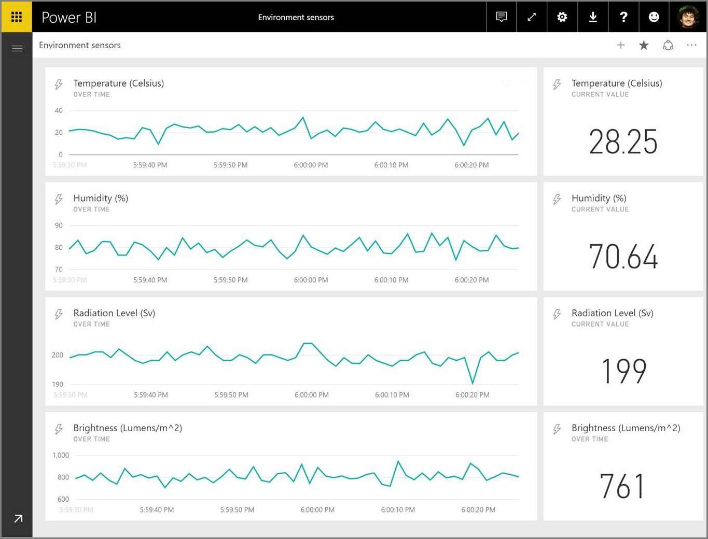

# Transmisión en tiempo real en Power BI
Con la transmisión en tiempo real de Power BI, puede transmitir los datos y actualizar los paneles en tiempo real. Cualquier objeto visual o panel creado en Power BI puede mostrar y actualizar datos en tiempo real y objetos visuales. Los dispositivos y orígenes de datos de transmisión pueden ser sensores de fábrica, orígenes de medios sociales, métricas de uso del servicio y muchos otros elementos a partir de los cuales se puedan recopilar o transmitir datos dependientes del tiempo.

En este artículo se muestra cómo configurar un conjunto de datos de streaming en tiempo real en Power BI. Primero, es importante entender los tipos de conjuntos de datos en tiempo real que están diseñados para mostrarse en los iconos (y paneles) y la diferencia entre estos conjuntos de datos.

## Tipos de conjuntos de datos en tiempo real
Hay tres tipos de conjuntos de datos en tiempo real que están diseñados para aparecer en los paneles en tiempo real:

* Conjunto de datos de inserción
* Conjunto de datos de streaming
* Conjunto de datos de streaming PubNub

Primero, vamos a entender en qué se diferencian estos conjuntos de datos (esta sección) y, después, veremos cómo insertar datos en cada uno de esos conjuntos de datos.

### Conjunto de datos de inserción
Con un **conjunto de datos de inserción** , los datos se insertan en el servicio Power BI. Cuando se crea el conjunto de datos, el servicio Power BI crea automáticamente una nueva base de datos en el servicio para almacenar los datos. Como hay una base de datos subyacente que continúa almacenando los datos según llegan, se pueden crear informes con los datos. Estos informes y sus objetos visuales son iguales que cualquier otro objeto visual, lo que significa que se pueden usar todas las características de creación de informes de Power BI para crear objetos visuales, incluidos objetos visuales de Power BI, alertas de datos, mosaicos de panel anclados y mucho más.

Una vez creado un informe con el conjunto de datos de inserción, cualquiera de los objetos visuales se puede anclar en un panel. En el panel de control, los objetos visuales se actualizan en tiempo real siempre que se actualizan los datos. En el servicio, el panel desencadena una actualización del icono cada vez que se reciben nuevos datos.

Hay dos factores a tener en cuenta acerca de los iconos anclados desde un conjunto de datos de inserción:

* Anclar un informe completo con la opción *página Anclar elemento activo* **no** hará que los datos se actualicen automáticamente.
* Una vez que un objeto visual está anclado a un panel, puede usar **Preguntas y respuestas** para formular preguntas sobre el conjunto de datos de inserción en lenguaje natural. Después de realizar la consulta de **Preguntas y respuestas** , puede anclar el objeto visual resultante al panel, y ese panel *también* se actualizará en tiempo real.

### Conjunto de datos de streaming
Con un **conjunto de datos de streaming** , también se insertan datos en el servicio Power BI, con una diferencia importante: Power BI solo almacena los datos en una caché temporal, que expira rápidamente. La memoria caché temporal solo se usa para mostrar los objetos visuales que tienen cierto sentido de historial transitorio, por ejemplo, un gráfico de líneas que tiene un período de tiempo de una hora.

Con un **conjunto de datos de streaming** , *no* hay una base de datos subyacente, por lo que *no* se crean objetos visuales de informe con los datos que llegan desde el flujo. Por tanto, no se pueden usar funciones de informes como objetos visuales de Power BI o filtros, entre otras.

La única manera de visualizar un conjunto de datos de streaming es agregar un icono y usar el conjunto de datos de streaming como un origen de **datos de streaming personalizados** . Los iconos de streaming personalizados que se basan en un **conjunto de datos de streaming** están optimizados para mostrar rápidamente los datos en tiempo real. Hay poca latencia entre el momento en que se insertan los datos en el servicio Power BI y el momento en que se actualiza el objeto visual, ya que no es necesario insertar o leer los datos en una base de datos.

En la práctica, los conjuntos de datos de streaming y los objetos visuales de streaming que los acompañan son útiles cuando es necesario minimizar la latencia entre el momento en que se insertan los datos y el momento en que se visualizan. Además, es aconsejable insertar los datos con un formato que se pueda visualizar tal cual, sin agregar nada. Algunos ejemplos de datos que está listos tal cual son las temperaturas y las medias previamente calculadas.

### Conjunto de datos de streaming PubNub
Con un conjunto de datos de streaming **PubNub** , el cliente web de Power BI usa el SDK de PubNub para leer un flujo de datos de PubNub existente. El servicio Power BI no almacena ningún dato. Como esta llamada se realiza directamente desde el cliente web, tendría que incluir el tráfico a PubNub como permitido si solo permitió el tráfico de salida desde la red. Consulte las instrucciones del artículo de soporte técnico sobre la [aprobación del tráfico de salida de PubNub](https://support.pubnub.com/support/solutions/articles/14000043522-can-i-whitelist-ips-for-pubnub-traffic-).

Como sucede con el **conjunto de datos de streaming** , con el **conjunto de datos de streaming de PubNub** no hay ninguna base de datos subyacente en Power BI y, por tanto, no se pueden crear objetos visuales de informe con los datos del flujo, y no se pueden aprovechar las ventajas de la funcionalidad de informes como objetos visuales de Power BI, filtros, etc. El **conjunto de datos de streaming de PubNub** solo se puede visualizar si se agrega un icono al panel y se configura un flujo de datos de PubNub como origen.

Los iconos basados en un **conjunto de datos de streaming de PubNub** están optimizados para mostrar rápidamente los datos en tiempo real. Como Power BI está conectado directamente con el flujo de datos de PubNub, hay poca latencia entre el momento en que se insertan los datos en el servicio Power BI y el momento en que se actualiza el objeto visual.

### Matriz del conjunto de datos de streaming
La tabla siguiente (o matriz, si lo prefiere) describe los tres tipos de conjuntos de datos para streaming en tiempo real y muestra las funcionalidades y limitaciones de cada uno.

> [!NOTE]
> Vea [este artículo](../developer/automation/api-rest-api-limitations.md) para obtener más información sobre los límites de **inserción** , sobre la cantidad de datos que se puede insertar.

## Inserción de datos en conjuntos de datos
La sección anterior describe los tres tipos principales de conjuntos de datos en tiempo real que puede usar en streaming en tiempo real, y sus diferencias. En esta sección se describe cómo crear e insertar datos en estos conjuntos de datos.

Hay tres maneras principales de insertar datos en un conjunto de datos:

* Uso de las API de REST de Power BI
* Uso de la interfaz de usuario de conjunto de datos de streaming
* Uso de Azure Stream Analytics

Veamos cada uno de estos enfoques por turnos.

### Uso de las API de REST de Power BI para insertar datos
Las **API REST de Power BI** se pueden usar para crear y enviar datos a conjuntos de datos de **inserción** y conjuntos de datos de **streaming** . Cuando se crea un conjunto de datos mediante las API de REST de Power BI, el indicador *defaultMode* especifica si el conjunto de datos es de inserción o de streaming. Si no hay ningún indicador *defaultMode* establecido, el valor predeterminado del conjunto de datos es **push** .

Si el valor de *defaultMode* se establece en *pushStreaming* , el conjunto de datos es a la vez un conjunto de datos de **inserción** *y* **streaming** , lo que proporciona las ventajas a ambos tipos de conjunto de datos. 

> [!NOTE]
> Cuando se usan conjuntos de datos con el valor de *defaultMode* establecido en *pushStreaming* , si una solicitud supera la restricción de tamaño de 15 KB para un conjunto de datos de **streaming** , pero es menor que la restricción de tamaño de 16 MB de un conjunto de datos de **inserción** , la solicitud se realizará correctamente y los datos se actualizarán en el conjunto de datos de inserción. Sin embargo, los iconos de streaming generarán un error temporal.

Una vez creado el conjunto de datos, use las API REST para insertar datos con la API [**PostRows**](/rest/api/power-bi/pushdatasets/datasets_postrows).

Todas las solicitudes a las API de REST se protegen con **Azure AD OAuth** .

### Uso de la interfaz de usuario de conjunto de datos de streaming para insertar datos
Para crear un conjunto de datos en el servicio Power BI, use la **API** tal y como se muestra en la siguiente imagen.

Al crear el nuevo conjunto de datos de streaming, puede seleccionar habilitar **Análisis de datos históricos** , tal y como se muestra a continuación; esta acción tiene un impacto significativo.

Cuando **Análisis de datos históricos** está deshabilitado, y lo está de forma predeterminada, se crea un **conjunto de datos de streaming** , tal y como se describió anteriormente en este artículo. Cuando **Análisis de datos históricos** está *habilitado* , el conjunto de datos que se crea se convierte en tanto en un **conjunto de datos de streaming** como en **conjunto de datos de inserción** . Esto equivale a usar las API de REST de Power BI para crear un conjunto de datos con el indicador *defaultMode* establecido en *pushStreaming* , tal y como se describió anteriormente en este artículo.

> [!NOTE]
> Los conjuntos de datos de streaming creados mediante la interfaz de usuario del servicio Power BI, tal como se describió en el párrafo anterior, no requieren la autenticación de Azure AD. En estos conjuntos de datos, el propietario del conjunto de datos recibe una dirección URL con una clave de fila, que autoriza al solicitante a insertar datos en el conjunto de datos sin usar un token de portador de Azure AD OAuth. Sin embargo, Azure AD (AAD) también permite insertar datos en el conjunto de datos.
> 
> 

### Uso de Azure Stream Analytics para insertar datos
Puede agregar Power BI como una salida en **Azure Stream Analytics** (ASA) y visualizar después dichos flujos de datos en el servicio Power BI en tiempo real. En esta sección se describen los detalles técnicos de cómo se produce ese proceso.

Azure Stream Analytics usa las API REST de Power BI para crear el flujo de datos de salida a Power BI, con *defaultMode* establecido en *pushStreaming* , lo que da como resultado un conjunto de datos que puede aprovechar las ventajas de ambos tipos, **inserción** y **streaming** . Cuando se crea el conjunto de datos, Azure Stream Analytics establece la marca **retentionPolicy** en *basicFIFO* . Con ese valor, la base subyacente al conjunto de datos de inserción almacena 200 000 filas y, una vez alcanzado ese límite, se van quitando filas siguiendo el orden primero en llegar, primero en salir (FIFO).

> [!CAUTION]
> Si la consulta de Azure Stream Analytics produce una salida muy rápida a Power BI (por ejemplo, una o dos veces por segundo), Azure Stream Analytics empezará a procesar esas salidas por lotes en una sola solicitud. Esto puede provocar que el tamaño de la solicitud supere el límite de iconos de streaming. En ese caso, tal y como se mencionó en las secciones anteriores, los iconos de streaming no se podrán representar. En estos casos, la práctica recomendada es reducir la velocidad de salida de los datos hacia Power BI; por ejemplo, en lugar de un valor máximo cada segundo, establézcalo en un máximo superior a 10 segundos.
> 
> 

## Configurar el conjunto de datos de transmisión en tiempo real en Power BI
Ahora que hemos analizado los tres tipos principales de conjuntos de datos para streaming en tiempo real y las tres maneras de insertar datos en un conjunto de datos, vamos a poner a trabajar el conjunto de datos de streaming en tiempo real en Power BI.

Para empezar a trabajar con la transmisión en tiempo real, debe elegir una de las dos formas en las que se pueden utilizar los datos de transmisión de Power BI:

* **iconos** con objetos visuales de datos de transmisión
* **conjuntos de datos** creados a partir de los datos de transmisión que persisten en Power BI

Con cualquiera de estas opciones, deberá configurar los **Datos de transmisión** en Power BI. Para hacerlo, en el panel (un panel existente o uno nuevo) seleccione **Agregar un icono** y, a continuación, seleccione **Datos de transmisión personalizados** .

Si no ha configurado todavía los datos de transmisión, no se preocupe, puede seleccionar **Administrar datos** para comenzar.

En esta página, puede escribir el extremo de su conjunto de datos de transmisión si ya tiene uno creado (en el cuadro de texto). Si aún no tiene un conjunto de datos de transmisión, seleccione el icono del signo más ( **+** ) en la esquina superior derecha para ver las opciones disponibles para crear un conjunto de datos de transmisión.

Al hacer clic en el icono **+** , verá dos opciones:

La siguiente sección describe estas opciones y explica con más detalle cómo crear un **icono** de transmisión o cómo crear un **conjunto de datos** desde el origen de datos de transmisión por secuencias, que puede usar a continuación para generar informes.

## Crear el conjunto de datos de transmisión con la opción que más le guste
Hay dos maneras de crear una fuente de datos de transmisión en tiempo real que se puede usar y visualizar con Power BI:

* **API de REST de Power BI** con un extremo de transmisión en tiempo real
* **PubNub**

Las secciones siguientes detallan cada una de las opciones.

### Uso de la API de REST de Power BI
**API de REST de Power BI** : las mejoras recientes en la API de REST de Power BI están diseñadas para facilitar la transmisión en tiempo real a los desarrolladores. Al seleccionar **API** desde la ventana **Nuevo conjunto de datos de transmisión** , se visualizan las entradas que se pueden proporcionar y que permiten que Power BI se conecte y utilice su extremo:

Si desea que Power BI almacene los datos que se envían a través de esta secuencia de datos, habilite *Análisis del historial de datos* y se podrán realizar informes y análisis en el flujo de datos recopilados. También puede [obtener más información acerca de la API](/rest/api/power-bi/).

Una vez creado correctamente el flujo de datos, se le ofrece un punto de conexión de URL de la API REST, al que la aplicación puede llamar mediante solicitudes *POST* para insertar los datos en el conjunto de **datos de transmisión** de Power BI que ha creado.

Al realizar solicitudes *POST* , debe asegurarse de que el cuerpo de la solicitud coincide con el JSON de ejemplo proporcionado por la interfaz de usuario de Power BI. Por ejemplo, ajuste los objetos JSON en una matriz.

> [!WARNING]
> En el caso de los conjuntos de datos de streaming creados mediante la interfaz de usuario del servicio Power BI, el propietario del conjunto del conjunto de datos recibe una dirección URL que incluye una **clave de recurso** . Esta clave autoriza al solicitante a insertar datos en el conjunto de datos sin usar un token de portador de OAuth de Azure AD, por lo que debe tener en cuenta las implicaciones de tener una **clave secreta** en la dirección URL al trabajar con este tipo de conjunto de datos y método.

### Uso de PubNub
Con la integración de la transmisión de **PubNub** con Power BI, puede usar los flujos de datos de **PubNub** de baja latencia (o crear nuevos) y usarlos en Power BI. Al seleccionar **PubNub** y, después, seleccionar **Siguiente** , verá la siguiente ventana:

> [!WARNING]
> Los canales PubNub se pueden proteger mediante una clave de autenticación de PubNub Access Manager (PAM). Esta clave se compartirá con todos los usuarios que tengan acceso al panel. Obtenga [más información sobre el control de acceso mediante PubNub](https://www.pubnub.com/docs/web-javascript/pam-security).
> 
> 

Los flujos de datos de **PubNub** suelen ser de alto volumen y no son siempre adecuados en su forma original para el almacenamiento y análisis histórico. Para usar Power BI para realizar análisis históricos de los datos de PubNub, tendrá que agregar la secuencia PubNub sin procesar y enviarla a Power BI. Una forma de hacerlo es con [Azure Stream Analytics](https://azure.microsoft.com/services/stream-analytics/).

## Ejemplo de transmisión en tiempo real en Power BI
Este es un ejemplo rápido de cómo funciona la transmisión en tiempo real de Power BI. Puede seguir los pasos de este ejemplo para ver por sí mismo el valor de transmisión en tiempo real.

En este ejemplo, utilizamos una secuencia disponible públicamente de **PubNub** . Estos son los pasos que debe realizar:

1. En el **servicio Power BI** , seleccione un panel (o cree uno nuevo) y seleccione **Agregar icono** > **Datos de transmisión personalizados** y, a continuación, seleccione el botón **Siguiente** .
   
   
2. Si no tiene un origen de datos de transmisión, seleccione el vínculo **Administrar datos** (justo encima del botón **Siguiente** ) y, a continuación, seleccione **+ Agregar datos de transmisión** desde el vínculo situado en el lado superior derecho de la ventana. Seleccione **PubNub** y, a continuación, seleccione **Siguiente** .
3. Cree un nombre para el conjunto de datos, y después, pegue los valores siguientes en la ventana que aparece y seleccione **Siguiente** :
   
   **Clave de suscripción:** *sub-c-5f1b7c8e-fbee-11e3-aa40-02ee2ddab7fe*

   **Canal:** *pubnub-sensor-network*
   
   
4. En la siguiente ventana, simplemente seleccione los valores predeterminados (que se rellenan automáticamente) y, después, seleccione **Crear** .
   
   
5. Vuelva al área de trabajo de Power BI, cree un nuevo panel y después agregue un icono (consulte los pasos anteriores si es necesario). Esta vez cuando se cree un icono y seleccione **Datos de transmisión personalizados** , tiene un conjunto de datos de transmisión para trabajar con él. Adelante, practique con él. Al agregar los campos de *números* a los gráficos de líneas y, después, agregar otros iconos, puede obtener un panel en tiempo real similar al siguiente:
   
   

Pruébelo y practique con el conjunto de datos de ejemplo. Después, cree sus propios conjuntos de datos y transmita datos en directo a Power BI.

## Preguntas y respuestas
Estas son algunas preguntas habituales acerca del streaming en tiempo real en Power BI, y sus respuestas.

#### ¿Puedo usar filtros en un conjunto de datos de inserción? ¿Y en un conjunto de datos de streaming?
Lamentablemente, los conjuntos de datos de streaming no admiten filtros. En los conjuntos de datos de inserción, puede crear un informe, filtrarlo y, después, anclar los objetos visuales filtrados a un panel. Sin embargo, no hay ninguna manera de cambiar el filtro en el objeto visual una vez que se encuentra en el panel.

También puede anclar el icono de informe activo al panel, en cuyo caso puede cambiar los filtros. Sin embargo, los iconos de informes activos no se actualizan en tiempo real cuando se insertan datos; tendrá que actualizar manualmente el objeto visual con la opción *Actualizar iconos del panel* en el menú **Más** .

Al aplicar filtros para insertar conjuntos de datos con campos *DateTime* con una precisión de milisegundos, no se admiten los operadores de *equivalencia* . Sin embargo, los operadores como mayor que (>) o menor que (<) funcionan correctamente.

#### ¿Cómo veo el valor más reciente en un conjunto de datos de inserción? ¿Y en un conjunto de datos de streaming?
Los conjuntos de datos de streaming están diseñados para mostrar los datos más recientes. Puede usar el objeto visual de streaming **Tarjeta** para ver fácilmente los valores numéricos más recientes. Lamentablemente, la tarjeta no admite datos de tipo *DateTime* o *Text* .

Para los conjuntos de datos de inserción, cuando tenga una marca de tiempo en el esquema, puede intentar crear un informe visual con el filtro de últimos N.

#### ¿Puedo conectarme a conjuntos de datos de streaming o de inserción en Power BI Desktop?
Los conjuntos de valores de inserción e híbridos pueden estar conectados en tiempo real en Power BI Desktop. Otros conjuntos de datos de streaming no pueden estar conectados en Power BI Desktop.

#### Siguiendo la pregunta anterior, ¿cómo puedo realizar modelados en conjuntos de datos en tiempo real?
El modelado no es posible en un conjunto de datos de streaming porque los datos no se almacenan permanentemente. En el caso de un conjunto de datos de inserción, puede usar la API REST de la creación del conjunto de datos para crear un conjunto de datos con relación y medidas o usar las API REST de actualización de tabla para agregar medidas a una tabla existente. 

#### ¿Cómo puedo borrar todos los valores en un conjunto de datos de inserción? ¿Y en un conjunto de datos de streaming?
En un conjunto de datos de inserción, puede usar la llamada de API de REST para eliminar filas. Actualmente no hay ninguna manera de borrar los datos de un conjunto de datos de streaming, aunque los datos se borrarán automáticamente después de una hora.

#### He configurado una salida de Azure Stream Analytics hacia Power BI pero no la veo en Power BI. ¿Cuál es el problema?
Esta es una lista de comprobación que puede usar para solucionar el problema:

1. Reinicie el trabajo de Azure Stream Analytics (los trabajos creados antes de la versión de disponibilidad general del streaming deberán reiniciarse).
2. Intente volver a autorizar la conexión de Power BI en Azure Stream Analytics
3. ¿Qué área de trabajo ha especificado en la salida de Azure Stream Analytics? En el servicio Power BI, ¿está consultando la misma área de trabajo?
4. ¿La consulta de Azure Stream Analytics envía la salida explícitamente a la salida de Power BI? (con la palabra clave INTO)
5. ¿Fluyen datos a través del trabajo de Azure Stream Analytics? El conjunto de datos solo se crea cuando se transmiten los datos.
6. En el registro de Azure Stream Analytics, consulte si hay advertencias o errores.

## Actualización automática de páginas

La actualización automática de páginas funciona en el nivel de página de informe, y le permite establecer un intervalo de actualización de los objetos visuales que solo está activo cuando la página se está usando. La actualización automática de páginas solo está disponible en orígenes de datos de DirectQuery. El intervalo de actualización mínimo depende del tipo de área de trabajo en la que el informe se publica y de la configuración de administración de capacidad de las áreas de trabajo Premium.

Obtenga más información sobre la actualización automática de páginas en el artículo [Actualización automática de la página](../create-reports/desktop-automatic-page-refresh.md).

## Pasos siguientes
Estos son algunos vínculos que le resultarán útiles para trabajar con streaming en tiempo real en Power BI:

* [Información general de la API de REST de Power BI con datos en tiempo real](/rest/api/power-bi/)
* [Azure Stream Analytics](https://azure.microsoft.com/services/stream-analytics/)