# Creación de una aplicación de plantilla en Power BI

Las *aplicaciones de plantilla* de Power BI permiten a los asociados crear aplicaciones de Power BI sin tener que escribir código (o muy poco) e implementarlas en cualquier cliente de Power BI.  Este artículo contiene instrucciones paso a paso para crear una aplicación de plantilla de Power BI.

Si puede crear paneles e informes de Power BI, puede convertirse en un *desarrollador de aplicaciones de plantilla*, así como compilar y empaquetar contenido analítico en una *aplicación*. Después, puede implementar la aplicación en otros inquilinos de Power BI por medio de cualquier plataforma disponible, como AppSource o un servicio web propio. Si va a distribuir su aplicación de plantilla por medio de su propio servicio web, también puede [automatizar parte del proceso de instalación](../developer/template-apps/template-apps-auto-install.md) con el fin de facilitar la tarea a los clientes.

Los administradores de Power BI controlan quién de la organización puede crear aplicaciones de plantilla y quién puede instalarlas. Los usuarios autorizados pueden instalar la aplicación de plantilla y después modificarla y distribuirla a los consumidores de Power BI en la organización.

## Requisitos previos

Estos son los requisitos para crear una aplicación la plantilla:  

- Una [licencia de Power BI Pro](../fundamentals/service-self-service-signup-for-power-bi.md).
- Una [instalación de Power BI Desktop](../fundamentals/desktop-get-the-desktop.md) (opcional).
- Estar familiarizado con los [conceptos básicos de Power BI](../fundamentals/service-basic-concepts.md).
- Permisos para compartir una aplicación de plantilla públicamente (para más información, vea [Portal de administración de Power BI, Configuración de aplicación de plantilla](../admin/service-admin-portal.md#template-apps-settings)

## Creación del área de trabajo de plantilla

Para crear una aplicación de plantilla que se pueda distribuir a otros inquilinos de Power BI, tendrá que crearla en una de las nuevas áreas de trabajo.

1. En el servicio Power BI, haga clic en **Áreas de trabajo** > **Crear un área de trabajo**.

    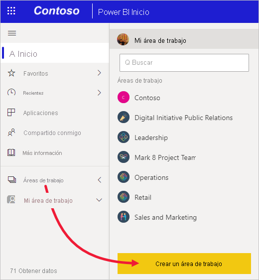

2. En **Crear un área de trabajo**, proporcione un nombre, una descripción (opcional) y un logotipo de imagen (opcional) para el área de trabajo.

    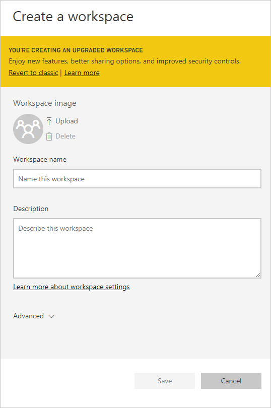

4. Expanda la sección **Avanzado** y seleccione **Desarrollar una aplicación de plantilla**.

    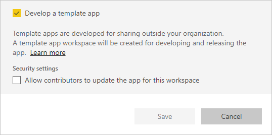

5. Seleccione **Guardar**.
>[!NOTE]
>Necesita permisos del administrador de Power BI para promocionar las aplicaciones de plantilla.

## Adición de contenido al área de trabajo de la aplicación de plantilla

Como sucede con un área de trabajo estándar de Power BI, el siguiente paso consiste en agregar contenido al área de trabajo.  

- [Cree el contenido de Power BI](index.yml) en el área de trabajo de la aplicación.

Si va a usar parámetros en Power Query, asegúrese de que tengan tipos bien definidos (por ejemplo, Texto). Los tipos Todo y Binario no se admiten.

En [Sugerencias para la creación de aplicaciones de plantilla en Power BI](service-template-apps-tips.md) se proporcionan sugerencias que puede tener en cuenta al crear informes y paneles para la aplicación de plantilla.

## Definición de las propiedades de la aplicación de plantilla

Ahora que tiene contenido en el área de trabajo, está listo para empaquetarlo en una aplicación de plantilla. El primer paso consiste en crear una aplicación de plantilla de prueba, accesible únicamente desde dentro de la organización en su inquilino.

1. En el área de trabajo de la aplicación de plantilla, haga clic en **Crear aplicación**.

    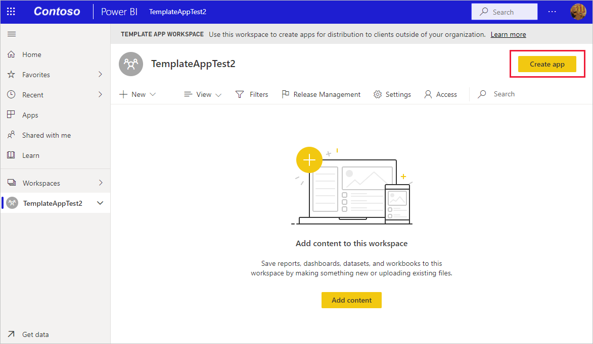

    Aquí, tendrá que rellenar opciones de creación adicionales para la aplicación de plantilla, en seis pestañas:

    **Personalización de marca**

    
    - Nombre de la aplicación
    - Descripción
    - Sitio de soporte técnico (el vínculo se presenta en la información de la aplicación después de redistribuir la aplicación de plantilla como aplicación de la organización)
    - Logotipo de la aplicación (límite de tamaño de archivo de 45 K, relación de aspecto 1:1, formatos .png .jpg .jpeg)
    - Color de tema de la aplicación

    **Navegación**

    Active el **Nuevo generador de navegación**, donde puede definir el panel de navegación de la aplicación. Para obtener más información, consulte [Diseño de la experiencia de navegación](../collaborate-share/service-create-distribute-apps.md#design-the-navigation-experience) en este artículo.

   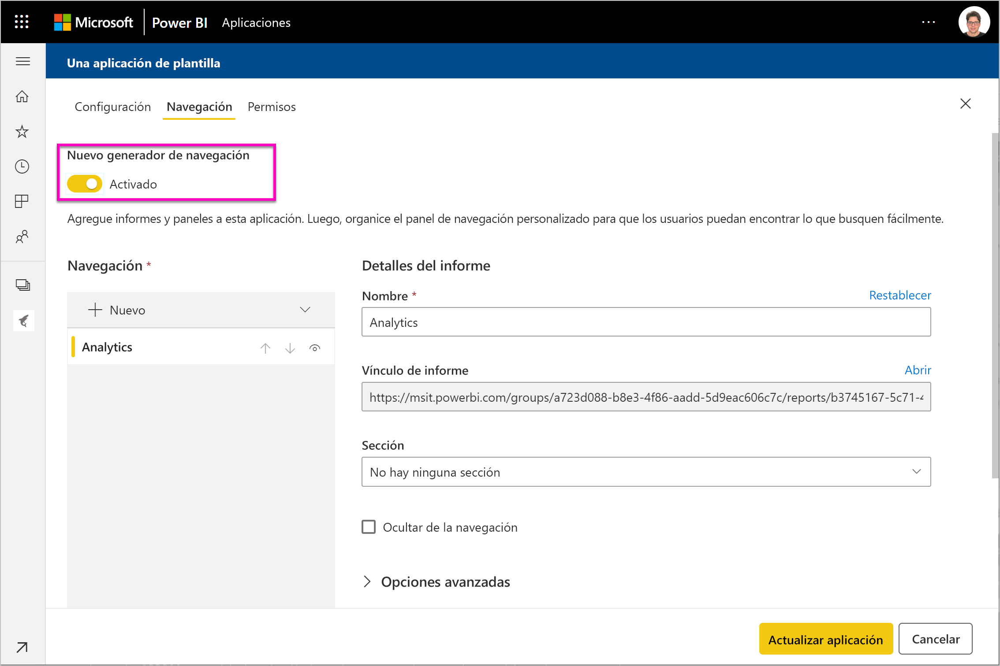
    
    **Página de inicio de la aplicación:** Si decide no participar en el generador de navegación, tiene la opción de seleccionar la página de aterrizaje de la aplicación. defina un informe o panel como la página de aterrizaje de la aplicación. Use una página de aterrizaje que proporcione la impresión correcta.

    **Control**

    Establezca las limitaciones y las restricciones que tendrán los usuarios de la aplicación con el contenido de esta. Puede usar este control para proteger la propiedad intelectual que la aplicación pueda contener.

    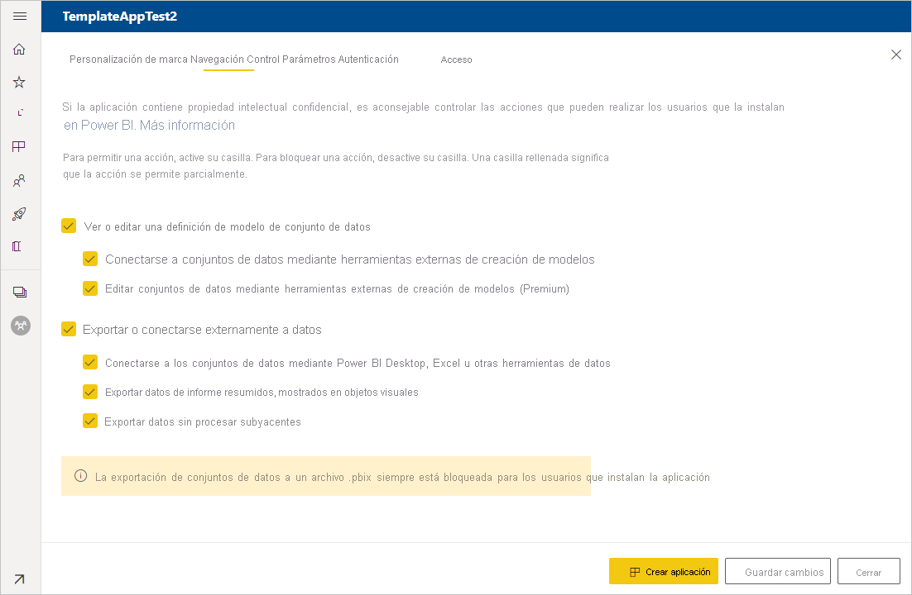

    >[!NOTE]
    >Siempre está bloqueada la exportación a formato .pbix para los usuarios que instalen la aplicación.

    **Parámetros**

    Los parámetros se crean en el archivo .pbix original; obtenga más información sobre la [creación de parámetros de consulta](https://powerbi.microsoft.com/blog/deep-dive-into-query-parameters-and-power-bi-templates/). Las funcionalidades de esta pestaña se usan para ayudar al instalador de la aplicación a configurarla después de su instalación, cuando se conecta a sus datos.

    Además, en esta pestaña, debe proporcionar un vínculo a la documentación de la aplicación.

    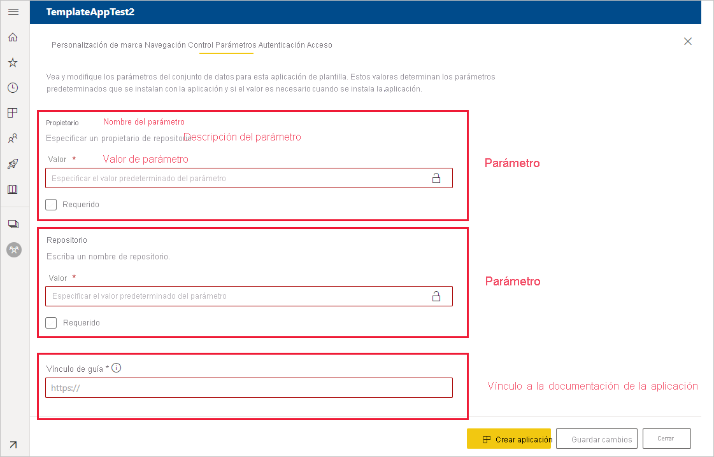

    Cada parámetro tiene un nombre y una descripción, que proceden de la consulta, así como un campo de valor. Hay tres formas de obtener un valor para el parámetro durante la instalación.

    * Puede requerir que el instalador escriba un valor. En este caso, debe proporcionar un ejemplo para que el instalador lo reemplace. Para configurar un parámetro de esta manera, active la casilla **Requerido** y proporcione un ejemplo en el cuadro de texto que muestre al usuario qué tipo de valor se espera. Por ejemplo:

       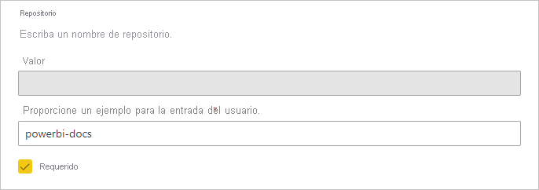

    * Puede proporcionar un valor rellenado previamente que no puede cambiar el usuario que instala la aplicación. Un parámetro configurado de esta manera está oculto para la persona que instala la aplicación. Solo debe usar este método si tiene la certeza de que el valor rellenado previamente es válido para todos los usuarios; de lo contrario, use el primer método mencionado anteriormente que requiere la intervención del usuario.

       Para configurar un parámetro de esta manera, escriba el valor en el cuadro de texto **Valor** y, después, haga clic en el icono de candado. Esto hace que no se pueda modificar el valor. Por ejemplo:

       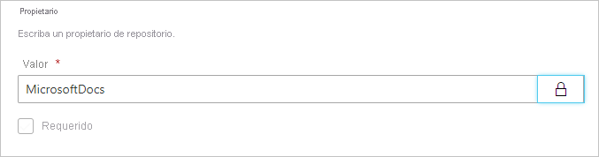

    * Puede proporcionar un valor predeterminado que el usuario puede cambiar durante la instalación. Para configurar un parámetro de esta manera, escriba el valor predeterminado deseado en el cuadro de texto **Valor** y deje el icono de candado desbloqueado. Por ejemplo:

      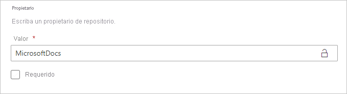

    **Autenticación**
    
    En esta pestaña, seleccione el método de autenticación que se usará. Las opciones disponibles dependen de los tipos de orígenes de datos que se usan.

    

    El nivel de privacidad se configura automáticamente:
   * Origen de datos único: se configura automáticamente como privado.
   * Origen de datos anónimo múltiple: se configura automáticamente como público.

    **Acceder**
    
    En la fase de prueba, decida qué otros usuarios de su organización pueden instalar y probar la aplicación. No se preocupe, siempre puede volver y cambiar estas opciones más adelante. La configuración no afecta al acceso de la aplicación de plantilla distribuida.

    

2. Seleccione **Crear aplicación**.

    Verá un mensaje que indica que la aplicación de prueba está lista, con un vínculo para copiar y compartir con los evaluadores de la aplicación.

    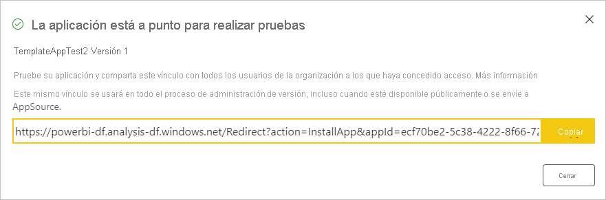

    También ha realizado el primer paso del proceso de administración de versiones, que se muestra a continuación.

## Administración de la versión de la plantilla de aplicación

Antes de publicar esta aplicación de plantilla, querrá asegurarse de que esté lista. Power BI ha creado el panel de administración de versiones, donde puede realizar el seguimiento e inspeccionar la ruta de versiones completa de la aplicación. También puede desencadenar la transición de una etapa a otra. Las fases comunes son:

- Generar la aplicación de prueba: para realizar pruebas solo en la organización.
- Promover el paquete de prueba a la fase de preproducción: para realizar pruebas fuera de la organización.
- Promover el paquete de preproducción a producción: la versión de producción.
- Eliminar todos los paquetes o comenzar de nuevo desde la fase anterior.

La dirección URL no cambia cuando alterna entre las fases de la versión. La promoción no afecta a la propia dirección URL.

A continuación se analizan las fases:

1. En el área de trabajo de plantilla, seleccione **Administración de versiones**.

    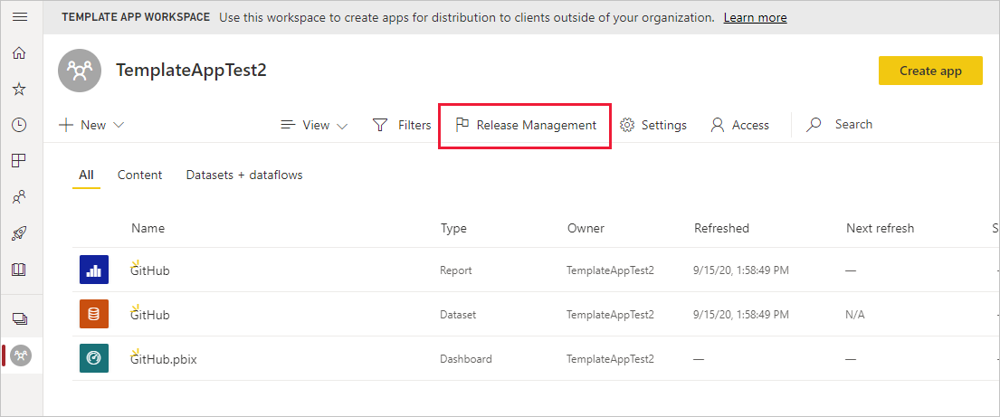

2. Seleccione **Obtener vínculo** si creó la aplicación en la anterior sección **Definición de las propiedades de la aplicación de plantilla** (como resultado, el punto de color amarillo junto a **Pruebas** ya está rellenado).

    Si aún no ha creado la aplicación, seleccione **Crear aplicación**. Esto le devuelve al proceso de creación de la aplicación de plantilla.

    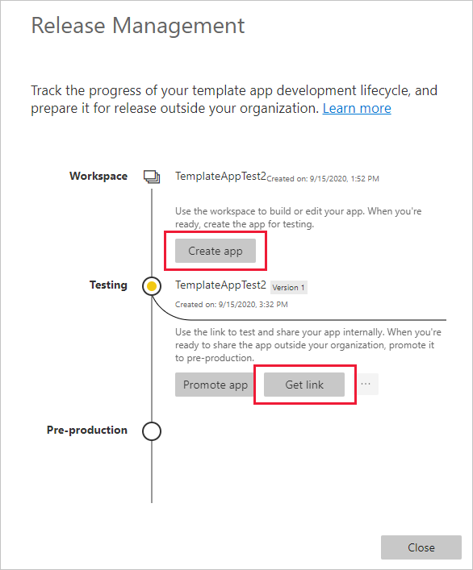

4. Para probar la experiencia de instalación de la aplicación, copie el vínculo de la ventana de notificación y péguelo en otra ventana del explorador.

    Desde aquí, seguirá los mismos pasos que seguirán los clientes. Consulte el artículo [Instalación y distribución de aplicaciones de plantilla en la organización](service-template-apps-install-distribute.md).

5. En el cuadro de diálogo, haga clic en **Instalar**.

    Cuando la instalación se realice correctamente, verá una notificación en la que se indica que la nueva aplicación está lista.

6. Seleccione **Ir a la aplicación**.

    Compruebe que la aplicación de prueba tiene los datos de ejemplo. Para realizar cambios, vuelva a la aplicación en el área de trabajo original. Actualice la aplicación de prueba hasta que esté satisfecho.

1. Cuando esté listo para promover la aplicación al entorno de preproducción para realizar más pruebas fuera del inquilino, vuelva al panel **Administración de versiones** y seleccione **Promover aplicación**.

    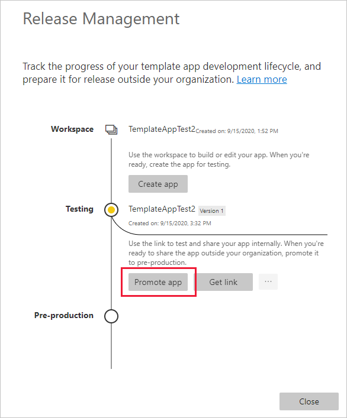
    >[!NOTE]
    > Cuando se promueve la aplicación, esta pasa a estar públicamente disponible fuera de la organización.

    Si no ve esta opción, póngase en contacto con el administrador de Power BI para que le conceda [permisos para el desarrollo de aplicaciones de plantilla](../admin/service-admin-portal.md#template-apps-settings) en el portal de administración.
11. Haga clic en **Promover** para confirmar la elección.
12. Copie esta nueva dirección URL para compartir fuera del inquilino con el fin de realizar pruebas. Este vínculo también es el que se envía para comenzar el proceso de distribución de la aplicación en AppSource mediante la creación de una [nueva oferta del Centro de partners](/azure/marketplace/partner-center-portal/create-power-bi-app-offer). Solo debe enviar al Centro de partners vínculos del entorno de preproducción. Solo después de que la aplicación se apruebe y reciba la notificación de que está publicada en AppSource podrá promover este paquete a producción en Power BI.
13. Cuando la aplicación esté lista para producción o para compartirla a través de AppSource, vuelva al panel **Release Management** y haga clic en **Promover aplicación** junto a **Preproducción**.
14. Haga clic en **Promover** para confirmar la elección.

    Ahora la aplicación está en producción, lista para su distribución.

    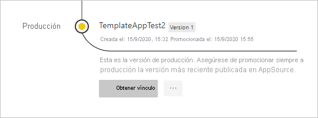

Para hacer que la aplicación esté disponible a miles de usuarios de Power BI en todo el mundo, le animamos a enviarla a AppSource. Vea [Oferta de aplicación de Power BI](/azure/marketplace/partner-center-portal/create-power-bi-app-offer) para obtener más información.

## Configuración de parámetros automatizada durante la instalación

Si es un ISV y está distribuyendo su aplicación de plantilla por medio de su servicio web, puede crear una automatización que configure los parámetros de la aplicación de plantilla de forma automática cuando los clientes instalen la aplicación en su cuenta de Power BI. Esto facilita la tarea a los clientes y aumenta la probabilidad de que una instalación se realice correctamente, ya que no es necesario proporcionar detalles que puede que no conozcan. Consulte [Configuración automatizada de la instalación de una aplicación de plantilla](../developer/template-apps/template-apps-auto-install.md) para obtener más información.

## Pasos siguientes

Vea cómo interactúan los clientes con la aplicación de plantilla en [Instalación, personalización y distribución de aplicaciones de plantilla en la organización](service-template-apps-install-distribute.md).

Vea [Oferta de aplicación de Power BI](/azure/marketplace/partner-center-portal/create-power-bi-app-offer) para obtener información sobre cómo distribuir la aplicación.