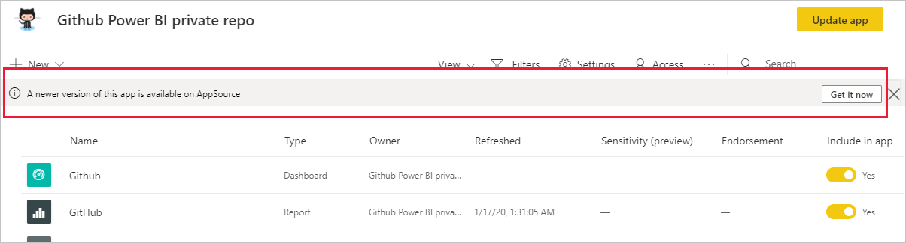

# Instalación y distribución de aplicaciones de plantilla en la organización

¿Es un analista de Power BI? Si es así, en este artículo se explica cómo instalar [aplicaciones de plantilla](service-template-apps-overview.md) para conectarse a muchos de los servicios que usa para dirigir su negocio, como Salesforce, Microsoft Dynamics y Google Analytics. Puede modificar los informes y paneles integrados de la aplicación de plantilla para adaptarlos a las necesidades de la organización, y distribuirlos a sus compañeros de trabajo como [aplicaciones](../consumer/end-user-apps.md). 

Si está interesado en crear aplicaciones de plantilla para distribuirlas fuera la organización, vea [Creación de una plantilla de aplicación en Power BI](service-template-apps-create.md). Los asociados de Power BI pueden compilar aplicaciones de Power BI con poca o ninguna codificación, y hacer que estén disponibles para los clientes de Power BI. 

## Requisitos previos  

Para instalar, personalizar y distribuir una aplicación de plantilla, necesita lo siguiente: 

* Una [licencia de Power BI Pro](../fundamentals/service-self-service-signup-for-power-bi.md).
* Permisos para instalar aplicaciones de plantilla en el inquilino.
* Un vínculo de instalación válido para la aplicación, que se obtiene de AppSource o del creador de la aplicación.
* Estar familiarizado con los [conceptos básicos de Power BI](../fundamentals/service-basic-concepts.md).

## Instalación de una aplicación de plantilla

1. En el panel de navegación del servicio Power BI, haga clic en **Aplicaciones** > **Obtener aplicaciones**.

    

1. En el marketplace de aplicaciones de Power BI que aparece, seleccione **Aplicaciones de plantilla**. Se mostrarán todas las aplicaciones de plantilla disponibles en AppSource. Busque la aplicación de plantilla que está buscando u obtenga una selección filtrada mediante el cuadro de búsqueda. Al escribir parte del nombre de una aplicación de plantilla o de una categoría, como finanzas, análisis, marketing, etc., resultará más fácil encontrar el elemento que está buscando.

    

1. Cuando encuentre la aplicación de plantilla que está buscando, haga clic en ella. Se mostrará el anuncio de la aplicación de plantilla. Haga clic en **OBTENERLO AHORA**.

   

1. En el cuadro de diálogo que aparece, haga clic en **Instalar**.

    
    
    La aplicación se instala, junto con un área de trabajo con el mismo nombre que tiene todos los artefactos necesarios para una mayor [personalización](#customize-and-share-the-app).

    > [!NOTE]
    > Si usa un vínculo de instalación para una aplicación que no aparece en AppSource, se le pedirá que confirme la elección en un cuadro de diálogo de validación.
    >
    >Para poder instalar una aplicación de plantilla que no aparece en AppSource, debe solicitar al administrador los permisos pertinentes. Vea la [configuración de aplicaciones de plantilla](../admin/service-admin-portal.md#template-apps-settings) en el portal de administración de Power BI para obtener más información.

    Cuando la instalación finalice correctamente, una notificación le indicará que la nueva aplicación está lista.

    

## Conectar a datos

1. Haga clic en **Ir a la aplicación**.

1. En la ventana **Empezar a trabajar con la nueva aplicación**, seleccione **Explorar**.

   

   La aplicación se abre y muestra los datos de ejemplo.

1. Seleccione el vínculo **Conectar los datos** en el banner de la parte superior de la página.

   

    Se abrirá el cuadro de diálogo de parámetros, donde cambia el origen de datos de los datos de ejemplo a su propio origen de datos (vea [limitaciones conocidas](service-template-apps-overview.md#known-limitations)), a lo que sigue el cuadro de diálogo del método de autenticación. Es posible que tenga que volver a definir los valores en estos cuadros de diálogo. Consulte la documentación de la aplicación de plantilla específica que está instalando para obtener más información.

   

    Una vez que haya terminado de rellenar los cuadros de diálogo de conexión, se iniciará el proceso de conexión. Un banner le informa de que se están actualizando los datos y que mientras tanto está viendo datos de ejemplo.

    

   Los datos del informe se actualizarán automáticamente una vez al día, a menos que haya deshabilitado esta opción durante el proceso de inicio de sesión. También puede [configurar su propia programación de actualización](./refresh-scheduled-refresh.md) para mantener actualizados los datos del informe si así lo quiere.

## Personalización y uso compartido de la aplicación

Cuando se haya conectado a los datos y la actualización de datos se haya completado, podrá personalizar cualquiera de los informes y paneles incluidos en las aplicaciones, además de compartir la aplicación con sus compañeros. Recuerde que los cambios que realice se sobrescribirán al actualizar la aplicación con una nueva versión, a menos que guarde con otro nombre los elementos que ha cambiado. [Vea detalles sobre la sobrescritura](#overwrite-behavior).

Para personalizar y compartir la aplicación, seleccione el icono de lápiz en la esquina superior derecha de la página.

Para obtener información sobre la edición de artefactos en el área de trabajo, consulte los vínculos siguientes:
* [Paseo por el editor de informes de Power BI](../create-reports/service-the-report-editor-take-a-tour.md)
* [Conceptos básicos para los diseñadores en el servicio Power BI](../fundamentals/service-basic-concepts.md)

Cuando haya terminado de realizar los cambios deseados en los artefactos del área de trabajo, estará a punto para publicar y compartir la aplicación. Vea [Publicación de la aplicación](../collaborate-share/service-create-distribute-apps.md#publish-your-app) para aprender a hacerlo.

## Actualización de una aplicación de plantilla

En ocasiones, los creadores de aplicaciones de plantilla lanzan nuevas versiones mejoradas de sus aplicaciones de plantilla, a través de AppSource, un vínculo directo o ambos.

Si originalmente descargó la aplicación de AppSource, cuando haya disponible una nueva versión de la aplicación de plantilla, recibirá una notificación de dos maneras:
* Aparece un banner de actualización en el servicio Power BI que le informa de que hay disponible una nueva versión de la aplicación.
  
* Recibirá una notificación en el panel de notificaciones de Power BI.

  

>[!NOTE]
>Si originalmente ha obtenido la aplicación a través de un vínculo directo, y no desde AppSource, la única forma de saber cuándo hay una versión nueva disponible es ponerse en contacto con el creador de la aplicación de plantilla.

  Para instalar la actualización, haga clic en **Obtenerla** en el banner de notificación o en el centro de notificaciones, o bien busque de nuevo la aplicación en AppSource y elija **Obtenerla ahora**. Si ha obtenido un vínculo directo para la actualización del creador de la aplicación de plantilla, simplemente haga clic en el vínculo.
  
  Se le preguntará si quiere sobrescribir la versión actual o instalar la nueva en una nueva área de trabajo. De forma predeterminada, está seleccionada la opción de "sobrescritura".

  

- **Sobrescritura de una versión existente:** sobrescribe el área de trabajo existente con la versión actualizada de la aplicación de plantilla. [Vea detalles sobre la sobrescritura](#overwrite-behavior).

- **Instalación en una nueva área de trabajo:** Instala una versión nueva del área de trabajo y la aplicación que tiene que volver a configurar (es decir, conectarse a los datos, definir la navegación y los permisos).

### Comportamiento de sobrescritura

* Al sobrescribir, se actualizan los informes, los paneles y el conjunto de datos dentro del área de trabajo, no de la aplicación. La sobrescritura no cambia la navegación, la configuración ni los permisos de la aplicación.
* Después de actualizar el área de trabajo, **debe actualizar la aplicación para aplicar sobre esta los cambios del área de trabajo**.
* La sobrescritura mantiene los parámetros y la autenticación configurados. Después de la actualización, se inicia una actualización automática del conjunto de datos. **Durante esta actualización, la aplicación, los informes y los paneles presentan datos de ejemplo**.

  

* Al sobrescribir siempre se muestran datos de ejemplo hasta que se completa la actualización. Si el autor de la aplicación de plantilla ha realizado cambios en el conjunto de datos o en los parámetros, los usuarios del área de trabajo y la aplicación no verán los datos nuevos hasta que finalice la actualización. En su lugar, durante este tiempo seguirán viendo datos de ejemplo.
* Al sobrescribir nunca se eliminan los informes o paneles nuevos que haya agregado al área de trabajo. Solamente se sobrescriben los informes y paneles originales con los cambios del autor original.

>[!IMPORTANT]
>Recuerde [actualizar la aplicación](#customize-and-share-the-app) después de sobrescribir para aplicar los cambios en los informes y el panel de los usuarios de la aplicación de la organización.

## Pasos siguientes

[Creación de áreas de trabajo con sus compañeros en Power BI](../collaborate-share/service-create-the-new-workspaces.md)
