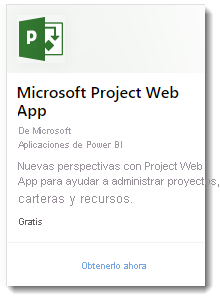
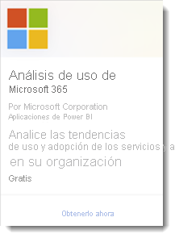
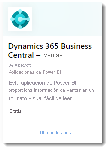

# ¿Qué son las aplicaciones de plantilla de Power BI?

Las nuevas *aplicaciones de plantilla* de Power BI permiten a los asociados de Power BI crear aplicaciones de Power BI con poca o ninguna codificación, e implementarlas en cualquier cliente de Power BI.  Este artículo es una introducción del programa de aplicaciones de plantilla de Power BI.

Como asociado de Power BI, crea contenido rápido para los clientes y lo publica usted mismo.  

Crea aplicaciones de plantillas que permiten a los clientes conectarse y crear instancias con sus propias cuentas. Como expertos de dominio, pueden desbloquear los datos de forma que sus usuarios empresariales puedan consumirlos fácilmente.  

Debe enviar las aplicaciones de plantilla al Centro de partners. Las aplicaciones estarán disponibles públicamente en el [Marketplace de aplicaciones de Power BI](https://app.powerbi.com/getdata/services) y en [Microsoft AppSource](https://appsource.microsoft.com/?product=power-bi). Le presentamos una visión de alto nivel de la experiencia pública de creación de aplicaciones de plantilla.

## Marketplace de aplicaciones de Power BI

Las aplicaciones de plantilla de Power BI permite que los usuarios de Power BI Pro o de Power BI Premium obtenga información inmediata a través de informes y paneles empaquetados previamente que se pueden conectar a orígenes de datos activos. Muchas aplicaciones de Power BI ya están disponibles en el [Marketplace de aplicaciones de Power BI](https://app.powerbi.com/getdata/services).

:::row:::
    :::column:::
        
    :::column-end:::
    :::column:::
        
    :::column-end:::
    :::column:::
        
    :::column-end:::
    :::column:::
        
    :::column-end:::
:::row-end:::

## Proceso
El proceso general para desarrollar y enviar una aplicación de plantilla implica varias fases. Algunas fases pueden incluir más de una actividad al mismo tiempo.

| Fase | Power BI Desktop |  |Servicio Power BI  |  |Centro de partners  |
|---|--------|--|---------|---------|---------|
| **Uno** | Crear un modelo de datos y un informe en un archivo .pbix. |  | Cree un área de trabajo. Importar el archivo .pbix. Crear un panel complementario.  |  | Registrarse como asociado. |
| **Dos** |  |  | Crear un paquete de prueba y ejecutar la validación interna.        |  | |
| **Tres** | |  | Promover el paquete de prueba a preproducción para la validación fuera del inquilino de Power BI y enviarlo a AppSource.  |  | Con el paquete de preproducción, crear una oferta de aplicación de plantilla de Power BI e iniciar el proceso de validación. |
| **Cuatro** | |  | Promover el paquete de preproducción a producción. |  | Go Live |

## Antes de empezar

Para crear la aplicación de plantilla, necesita permisos para crear una. Vea la configuración de aplicaciones de plantilla en el portal de administración de Power BI para obtener más información. 

Para publicar una aplicación de plantilla en el servicio Power BI y AppSource, debe cumplir los requisitos para [convertirse en publicador del Centro de partners](/azure/marketplace/become-publisher).
 
## Pasos de alto nivel

Estos son los pasos generales. 

1. [Revise los requisitos](#requirements) para asegurarse de que los cumple. 

2. Cree un informe en Power BI Desktop. Use parámetros para poder guardarlo como un archivo que otros usuarios puedan utilizar. 

3. Cree un área de trabajo para la aplicación de plantilla en el inquilino en el servicio Power BI (app.powerbi.com). 

4. Importe el archivo .pbix y agregue contenido como un panel a la aplicación. 

5. Cree un paquete de prueba para probar la aplicación de plantilla dentro de la organización. 

6. Promueva la aplicación de prueba a preproducción con el fin de enviarla para la validación en AppSource y probarla fuera del inquilino. 

7. Envíe el contenido al [Centro de partners](/azure/marketplace/partner-center-portal/create-power-bi-app-offer) para su publicación. 

8. "Publique" la oferta en AppSource y mueva la aplicación a producción en Power BI.

9. Ya puede empezar a desarrollar la próxima versión en la misma área de trabajo, en preproducción. 

## Requisitos

Para crear la aplicación de plantilla, necesita permisos para crear una. Vea la [configuración de aplicaciones de plantilla en el portal de administración](../admin/service-admin-portal.md#template-apps-settings) de Power BI para obtener más información.

Para publicar una aplicación de plantilla en el servicio Power BI y AppSource, debe cumplir los requisitos para [convertirse en publicador del Centro de partners](/azure/marketplace/become-publisher).
 > [!NOTE] 
 > Los envíos de aplicaciones de plantilla se administran en el [Centro de partners](/azure/marketplace/partner-center-portal/create-power-bi-app-offer). Use la misma cuenta de registro de Microsoft Developer Center para iniciar sesión. Solo debe tener una cuenta Microsoft para sus ofertas de AppSource. Las cuentas no deberían ser específicas de servicios ni de ofertas individuales.

## Sugerencias 

- Asegúrese de que la aplicación incluye datos de ejemplo para que todos los usuarios puedan empezar a trabajar con un clic. 
- Examine con cuidado la aplicación mediante su instalación en el inquilino y en un inquilino secundario. Asegúrese de que los clientes solo ven lo que quiere que vean. 
- Use AppSource como almacén en línea para hospedar la aplicación. De este modo, todos los usuarios de Power BI podrán encontrar la aplicación. 
- Considere la posibilidad de ofrecer más de una aplicación de plantilla para escenarios únicos independientes. 
- Habilite la personalización de datos, por ejemplo admita la configuración personalizada de parámetros y conexiones mediante el instalador.
- Si es un ISV y distribuye su aplicación por medio de su servicio web, tenga en cuenta la posibilidad de configurar los parámetros de forma automatizada durante la instalación para facilitar la tarea a los clientes y aumentar la probabilidad de realizar la instalación correctamente. Consulte [Configuración automatizada de la instalación de una aplicación de plantilla](../developer/template-apps/template-apps-auto-install.md) para obtener más información.

Vea [Sugerencias para crear aplicaciones de plantilla en Power BI](service-template-apps-tips.md) para obtener más sugerencias.

## Restricciones conocidas

| Característica | Limitación conocida |
|---------|---------|
|Contenido:  Conjuntos de datos   | Debe haber exactamente un conjunto de datos. Solo se permiten los conjuntos de datos creados en Power BI Desktop (archivos .pbix).  No se admiten: conjuntos de datos de otras aplicaciones de plantilla, conjuntos de datos de varias áreas de trabajo, informes paginados (archivos .rdl), libros de Excel. |
|Contenido: Paneles | No se admiten los iconos en tiempo real (en otras palabras, no se admiten para los conjuntos de datos de inserción o streaming). |
|Contenido: Flujos de datos | No se admiten: Flujos de datos |
|Contenido de archivos | Solo se admiten archivos PBIX.  No se admiten: archivos .rdl (informes paginados), libros de Excel.   |
| Orígenes de datos | Se permiten los orígenes de datos admitidos para la actualización de datos programada en la nube.  No compatible: <li>Conexiones dinámicas (no Azure AS).</li> <li>Orígenes de datos locales (no se admiten las puertas de enlace personales y empresariales)</li> <li>Tiempo real (no se admite para los conjuntos de datos de inserción)</li> <li>Modelos compuestos</li></ul> |
| Conjunto de datos: entre áreas de trabajo | No se admiten los conjuntos de datos entre áreas de trabajo  |
| Parámetros de consulta | No se admiten: los parámetros de tipo "Todo", "Fecha" o "Binario" bloquean la operación de actualización del conjunto de datos. |
| Objetos visuales de Power BI | Solo se admiten los objetos visuales de Power BI disponibles públicamente. No se admiten los [objetos visuales de Power BI de la organización](../developer/visuals/power-bi-custom-visuals-organization.md). |
| Nubes soberanas | Las aplicaciones de plantilla no están disponibles en nubes independientes |

## Soporte técnico
Para obtener soporte técnico durante el desarrollo, use [https://powerbi.microsoft.com/support](https://powerbi.microsoft.com/support). Supervisamos y administramos de forma activa este sitio. Los incidentes del cliente encuentran rápidamente la forma de llegar al equipo adecuado.

## Pasos siguientes

[Creación de una aplicación de plantilla](service-template-apps-create.md)