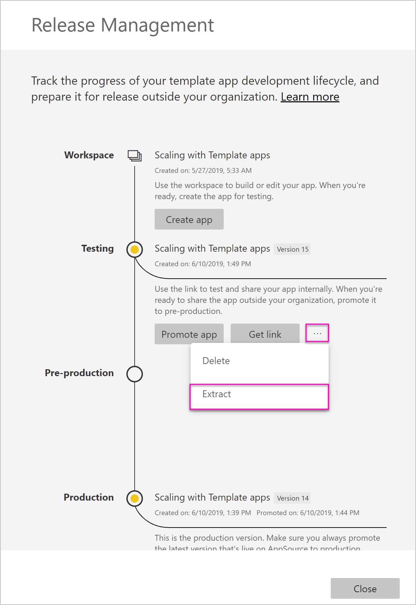

# Actualización, eliminación y extracción de una aplicación de plantilla

Ahora que la aplicación está en producción, puede empezar de nuevo en la fase de prueba, sin interrumpir la aplicación en producción.
## Actualización de la aplicación

Si ha realizado los cambios en Power BI Desktop, empiece en el paso (1). Si no ha realizado los cambios en Power BI Desktop, empiece en el paso (4).

1. Cargue el conjunto de datos actualizado y sobrescriba el conjunto de datos existente. **Asegúrese de usar exactamente el mismo nombre del conjunto de datos**. Si usa otro nombre, se creará un nuevo conjunto de datos para los usuarios que actualicen la aplicación.

1. Importe el archivo pbix desde el equipo.

1. Confirme la sobrescritura.

1. En el panel **Release Management**, haga clic en **Crear aplicación**.
1. Vuelva a realizar el proceso de creación de la aplicación.
1. Después de establecer **Personalización de marca**, **Contenido**, **Control** y **Acceso**, seleccione de nuevo **Crear aplicación**.
1. Haga clic en **Cerrar** y vuelva a **Release Management**.

   Ahora verá que tiene dos versiones: la versión en producción, además de una nueva versión de prueba.

    

1. Cuando esté listo para promover la aplicación al entorno de preproducción para realizar más pruebas fuera del inquilino, vuelva al panel Release Management y seleccione **Promover aplicación** junto a **Pruebas**.

   Ya tenemos una versión en producción y una versión en preproducción.

   

   El vínculo ya está disponible. **Observe que el botón Promover aplicación en la fase de preproducción está atenuado**. Esto es así para evitar que el vínculo de producción en directo a la versión de la aplicación actual se sobrescriba accidentalmente antes de que Cloud Partner Portal haya validado y aprobado la nueva versión de la aplicación.

1. Vuelva a enviar el vínculo a Cloud Partner Portal según los pasos descritos en [Actualizar una oferta de aplicación de Power BI](/azure/marketplace/cloud-partner-portal/power-bi/cpp-update-existing-offer). En Cloud Partner Portal, debe volver a **publicar** la oferta y hacer que se valide y apruebe.

   Cuando la oferta se apruebe, el botón Promover aplicación volverá a estar activo. 
1. Promueva la aplicación a la fase de producción.
   
### Comportamiento de la actualización

1. La actualización de la aplicación permitirá al instalador de la aplicación de plantilla [Actualizar la aplicación de plantilla](service-template-apps-install-distribute.md#update-a-template-app) en el área de trabajo ya instalada sin perder la configuración de la conexión.
1. Consulte el [comportamiento de sobrescritura](service-template-apps-install-distribute.md#overwrite-behavior) del instalador para obtener información sobre cómo afectan los cambios en el conjunto de datos a la aplicación de plantilla instalada.
1. Al actualizar (sobrescribir) una aplicación de plantilla, primero vuelve a los datos de ejemplo y se vuelve a conectar automáticamente con la configuración del usuario (parámetros y autenticación). Hasta que se complete la actualización, los informes, los paneles y la aplicación de la organización presentarán el banner de datos de ejemplo.
1. Si ha agregado un nuevo parámetro de consulta al conjunto de datos actualizado que requiere la entrada de los usuarios, debe activar la casilla *requerido*. Esto le pedirá al instalador la cadena de conexión después de actualizar la aplicación.
 

## Extracción del área de trabajo
Revertir a la versión anterior de una aplicación de la plantilla es más fácil que nunca con la funcionalidad de extracción. Los pasos siguientes extraerán una versión específica de la aplicación a partir de varias fases de publicación en una nueva área de trabajo:

1. En el panel de administración de versiones, presione más **(...)**  y, a continuación, **Extraer**.

    
    
2. En el cuadro de diálogo, escriba el nombre del área de trabajo extraída. Se agregará una nueva área de trabajo.

Se restablece el nuevo control de versiones del área de trabajo y puede continuar desarrollando y distribuyendo la aplicación de plantilla desde el área de trabajo recién extraída.

## Eliminación de una versión de la aplicación de plantilla
El área de trabajo de plantilla es el origen de una aplicación de plantilla distribuida activa. Para proteger a los usuarios de la aplicación de la plantilla, no es posible eliminar un área de trabajo sin quitar primero todas las versiones de la aplicación creada en el área de trabajo.
La eliminación de una versión de la aplicación también elimina la dirección URL de la aplicación que ya no funcionará.

1. En el panel de administración de versiones, seleccione los puntos suspensivos **(...)** y, a continuación, **Eliminar**.
 
 

>[!NOTE]
>Asegúrese de no eliminar la versión de la aplicación que están utilizando los clientes o **AppSource** o ya no funcionará.

## Pasos siguientes

Vea cómo interactúan los clientes con la aplicación de plantilla en [Instalación, personalización y distribución de aplicaciones de plantilla en la organización](service-template-apps-install-distribute.md).

Vea [Oferta de aplicación de Power BI](/azure/marketplace/cloud-partner-portal/power-bi/cpp-power-bi-offer) para obtener información sobre cómo distribuir la aplicación.