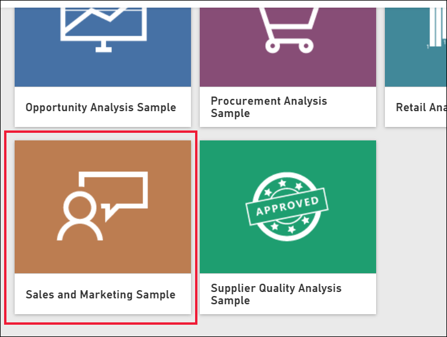
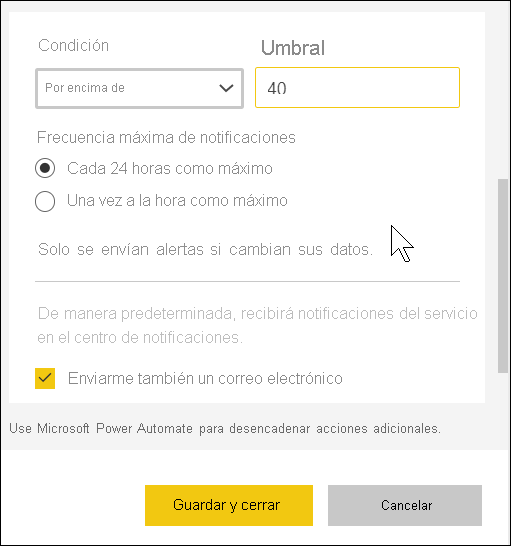

# Tutorial: Establecer alertas en paneles de Power BI

[!INCLUDE[consumer-appliesto-yynn](../includes/consumer-appliesto-yynn.md)]

[!INCLUDE [power-bi-service-new-look-include](../includes/power-bi-service-new-look-include.md)]

Establezca alertas en el servicio Power BI que le envíen notificaciones cada vez que los datos de sus paneles cambien por encima o por debajo de los límites establecidos. Las alertas solo se pueden configurar en los iconos anclados desde objetos visuales de informes y solo en medidores, KPI y tarjetas. 

Se pueden crear alertas en paneles:
- que se han creado y guardado en **Mi área de trabajo**.
- que se han compartido con usted en una [capacidad Premium](end-user-license.md). 
- en cualquier área de trabajo a la que pueda acceder, si tiene una licencia de Power BI Pro.    

Las alertas solo funcionan en los datos que se actualizan. Cuando los datos se actualizan, Power BI busca si se ha configurado una alerta para esos datos. Si los datos han alcanzado un umbral de alerta, se activará una alerta. 

Esta característica sigue evolucionando, así que vea la sección [Sugerencias y solución de problemas](#tips-and-troubleshooting) más adelante.

Nadie más podrá ver las alertas que establezca, aunque comparta el panel. Las alertas de datos están completamente sincronizadas en las plataformas; establezca y vea las alertas de datos [en las aplicaciones móviles de Power BI](mobile/mobile-set-data-alerts-in-the-mobile-apps.md) y en el servicio Power BI. 

> [!WARNING]
> Estas alertas proporcionan información sobre los datos. Si consulta sus datos de Power BI en un dispositivo móvil y le roban ese dispositivo, se recomienda usar el servicio Power BI para desactivar todas las alertas.
> 

En este artículo se tratan los temas siguientes:
> [!div class="checklist"]
> * ¿Quién puede establecer alertas?
> * ¿Qué objetos visuales admiten alertas?
> * ¿Quién puede ver mis alertas?
> * ¿Las alertas funcionan en Power BI Desktop y en la versión para móviles?
> * Cómo crear una alerta
> * ¿Dónde recibiré mis alertas?

## Requisitos previos

Si no está registrado en Power BI, [regístrese para obtener una evaluación gratuita](https://app.powerbi.com/signupredirect?pbi_source=web) antes de empezar.

1. En este ejemplo se usa un icono de tarjeta de panel de la aplicación de ejemplo Ventas y marketing. Abra el servicio Power BI (app.powerbi.com), inicie sesión y abra **Mi área de trabajo**.    
    

2. En la esquina inferior izquierda, seleccione **Obtener datos**.

    

3. En la página Obtener datos que aparece, seleccione **Ejemplos**.

4. Seleccione el ejemplo de Ventas y marketing y, luego, elija **Conectar**.

    

5. Una vez que Power BI se ha conectado al ejemplo, seleccione **Ir al panel** en el cuadro de diálogo que aparece.     
    

## Adición de una alerta a un icono del panel

1. En un icono de tarjeta, KPI o medidor del panel, seleccione los puntos suspensivos.
   
   

2. Seleccione el icono de alerta , o **Administrar alertas**, para agregar una o varias alertas a la tarjeta **Cuota de mercado**.

   

   
1. En el panel **Administrar alertas**, haga clic en **+ Agregar regla de alertas**.  Asegúrese de que el control deslizante esté **activado** y asigne un título a la alerta. Los títulos le ayudan a reconocer fácilmente las alertas.
   
   
4. Desplácese hacia abajo y escriba los detalles de la alerta.  En este ejemplo, vamos a crear una alerta que nos enviará una notificación una vez al día si nuestra cuota de mercado es 40 o superior. Las alertas aparecen en nuestro [Centro de notificaciones](end-user-notification-center.md). Y haremos que Power BI nos envíe también un correo electrónico.
   
   

5. Haga clic en **Guardar y cerrar**.
 

   > 

## Recibir alertas
Si los datos de seguimiento llegan a uno de los umbrales que ha establecido, se realizan varias acciones. En primer lugar, Power BI comprueba si han pasado más de una hora, o de 24 horas (según la opción seleccionada), desde que se ha enviado la última alerta. Siempre que los datos superen el umbral, recibirá una alerta.

Después, Power BI envía una alerta al centro de notificaciones y, opcionalmente, un correo electrónico. Cada alerta contiene un vínculo directo a los datos. Seleccione el enlace para ver el icono pertinente.  

1. Si ha configurado la alerta para que se envíe un correo electrónico, encontrará algo parecido a esto en su bandeja de entrada. Esta es una alerta establecida para la tarjeta **Opinión**.
   
   
2. Power BI agrega un mensaje a su **Centro de notificaciones**.
   
   
3. Abra el Centro de notificaciones para ver los detalles de la alerta.
   
    
   
  

## Administración de alertas

Hay varias maneras de administrar las alertas: desde el icono del panel, desde el menú de configuración de Power BI, en un icono individual de la [aplicación móvil de Power BI en el iPhone](mobile/mobile-set-data-alerts-in-the-mobile-apps.md) o en la [aplicación móvil de Power BI para Windows 10](mobile/mobile-set-data-alerts-in-the-mobile-apps.md).

### Desde el icono

1. Si necesita cambiar o quitar una alerta de un icono, vuelva a abrir la ventana **Administrar alertas** seleccionando el icono de alerta . Se muestran todas las alertas que ha configurado para ese icono.
   
    .
2. Para modificar una alerta, seleccione la flecha situada a la izquierda del nombre de la alerta.
   
    .
3. Para eliminar una alerta, seleccione la papelera situada a la derecha del nombre de la alerta.
   
      

### Desde el menú de configuración de Power BI

1. Seleccione el icono de engranaje de la barra de menús de Power BI.
   
    .
2. En **Configuración**, seleccione **Alertas**.
   
    
3. Desde aquí, puede activar y desactivar alertas, abrir la ventana **Administrar de alertas** para realizar cambios o eliminar alertas.

## Sugerencias y solución de problemas 

* Si no puede establecer una alerta para un medidor, un indicador KPI o una tarjeta, póngase en contacto con el administrador de inquilinos o con el departamento de soporte técnico de TI para solicitar ayuda. A veces, las alertas se desactivan o no están disponibles para el panel o para tipos específicos de iconos del panel.
* Las alertas solo funcionan en los datos que se actualizan. No funcionan con datos estáticos. La mayoría de los ejemplos proporcionados por Microsoft son estáticos. 
* Para recibir y ver contenido compartido, se necesita una licencia Power BI Pro o Premium. Para obtener más información, vea [¿Qué licencia tengo?](end-user-license.md)
* Las alertas se pueden establecer en los objetos visuales creados a partir de conjuntos de streaming que se anclan desde un informe a un panel. No se pueden establecer alertas en iconos de streaming creados directamente en el panel mediante **Agregar icono** > **Datos de transmisión personalizados**.

## Limpieza de recursos
A continuación se dan instrucciones para eliminar alertas. En resumen, debe seleccionar el icono de engranaje de la barra de menús de Power BI. En **Configuración**, seleccione **Alertas** y elimine la alerta.

> [!div class="nextstepaction"]
> [Establecer alertas de datos en dispositivos móviles](mobile/mobile-set-data-alerts-in-the-mobile-apps.md)

