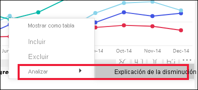
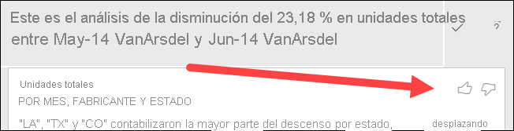
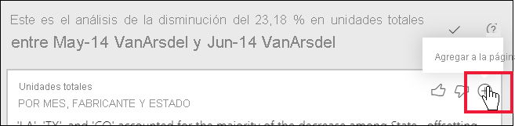

# Uso de la característica de análisis para explicar las fluctuaciones en los objetos visuales de informe

[!INCLUDE[consumer-appliesto-yynn](../includes/consumer-appliesto-yynn.md)]

A menudo, en los objetos visuales de informe, se observa un gran aumento y después un descenso brusco en los valores, y se pregunta cuál es la causa de esas fluctuaciones. En el **servicio Power BI**, con **Analizar** puede conocer la causa con unos pocos clics.

Por ejemplo, considere el siguiente código visual que muestra las *unidades totales* por *mes* y *fabricante*. VanArsdel supera los resultados de la competencia, pero experimenta una profunda caída en junio de 2014. En tales casos, puede explorar los datos para ayudar a explicar el cambio que se ha producido. 

Puede indicar al servicio Power BI que explique los aumentos, reducciones o distribuciones inusuales en los objetos visuales, y obtener un análisis rápido, automatizado y detallado sobre los datos. Haga clic con el botón derecho en un punto de datos y seleccione **Analizar > Explicación de la disminución** (o del aumento, si la barra anterior era inferior), o bien **Analizar > Buscar en qué se diferencia esta distribución**, y las conclusiones se proporcionarán en una ventana fácil de usar.

La característica de análisis es contextual y se basa en el punto de datos inmediatamente anterior como, por ejemplo, la barra o columna anterior.

> [!NOTE]
> Esta característica está en su versión preliminar y está sujeta a cambios. La característica de información detallada está habilitada y activada de forma predeterminada (no es necesario activar ninguna casilla de vista previa para habilitarla).

### Qué factores y categorías se eligen

Después de examinar diferentes columnas, Power BI selecciona y muestra los factores que representen el mayor cambio en la contribución relativa. Para cada una de ellas, se indican en la descripción los valores que han tenido el cambio más significativo en la contribución. Además, también se indican los valores que han tenido los mayores aumentos y disminuciones reales.

Para ver toda la información detallada generada por Power BI, use la barra de desplazamiento. El orden se clasifica con el colaborador más destacado mostrado en primer lugar. 

## Uso de la información detallada
Para usar información detallada para explicar las tendencias que se muestran en los objetos visuales, haga clic con el botón derecho en cualquier punto de datos de un gráfico de barras o de líneas y seleccione **Analizar**. A continuación, elija la opción que aparece: **Explicación del aumento**, **Explicación de la disminución** o **explain the difference** (Explicación de la diferencia).

A continuación, Power BI ejecuta sus algoritmos de aprendizaje automático sobre los datos y rellena una ventana con un objeto visual y una descripción que muestra qué categorías influyeron más en el aumento, la disminución o la diferencia.  En este ejemplo, la primera información detallada es un gráfico de cascada.

Si selecciona los pequeños iconos situados en la parte inferior del objeto visual de cascada, puede elegir si la información detallada se muestra como un gráfico de dispersión, un gráfico de columnas apiladas o un gráfico de la barra de herramientas.

Los iconos de *pulgar hacia arriba* y *pulgar hacia abajo* de la parte superior de la página sirven para proporcionar comentarios sobre el objeto visual y la característica.  

Puede usar la información detallada si el informe está en la vista de lectura o de edición, lo cual lo hace muy versátil a la hora de analizar datos o de crear objetos visuales que puede agregar fácilmente a los informes. Si el informe se abre en la vista de edición, verá un icono de signo más junto a los iconos de los pulgares. Seleccione el icono de signo más para agregar la información detallada al informe como un nuevo objeto visual. 

## Detalles de los resultados devueltos

Los detalles que devuelven las conclusiones están destinados a destacar las diferencias entre los dos períodos, para ayudarle a comprender el cambio entre ellos.  

Se puede considerar el algoritmo de la siguiente forma: se toman todas las demás columnas del modelo y se calcula el desglose por esa columna para los períodos de tiempo de *antes* y *después*, se determina el cambio que se ha producido en ese desglose y después se devuelven las columnas con el mayor cambio. Por ejemplo, se seleccionó la opción de *estado* en la información detallada en cascada mostrada anteriormente, ya que la contribución realizada por Louisiana, Texas y Colorado cayó del 13 % al 19 % de junio a julio, y ha contribuido en gran medida a la disminución de las *unidades totales*.  

Para cada información detallada devuelta, se pueden mostrar cuatro objetos visuales. Tres de esos objetos visuales están diseñados para destacar el cambio de la contribución entre los dos períodos. Por ejemplo, en el caso de la explicación del aumento del *T2* al *T3*. El gráfico de la barra de herramientas muestra cambios tanto antes como después del punto de datos seleccionado.

### Gráfico de dispersión

El objeto visual del gráfico de dispersión muestra el valor de la medida en el primer período (en el eje X) con respecto al valor de la medida en el segundo período (en el eje Y) para cada valor de la columna (*Estado* en este caso). Los puntos de datos están en la región de color verde si aumenta el valor y en la región de color rojo si disminuye. 

La línea de puntos muestra la mejor opción, y los puntos de datos situados encima de esta línea han aumentado más que la tendencia general y los que están situados debajo, menos.  

Los elementos de datos cuyo valor estaba en blanco en cualquier período no aparecerán en el gráfico de dispersión.

### Gráfico de columnas 100 % apiladas

El objeto visual del gráfico de columnas 100 % apiladas muestra el valor de la contribución al total (100 %) para el punto de datos seleccionado y el anterior. Esto permite una comparación en paralelo de la contribución para cada punto de datos. En este ejemplo, la información sobre herramientas muestra la contribución para el valor seleccionado de Texas. Dado que la lista de estados es larga, la información sobre herramientas le ayuda a ver los detalles. Con la información sobre herramientas, vemos que Texas aportaba aproximadamente el mismo porcentaje al total de unidades (31 % y 32 %), pero el número real de unidades totales disminuyó de 89 a 71. Recuerde que el eje Y es un porcentaje, no un total, y que cada banda de columna es un porcentaje, no un valor. 

### Gráfico de la barra de herramientas

El objeto visual del gráfico de la barra de herramientas muestra el valor de la medida antes y después. Resulta especialmente útil para mostrar los cambios de las contribuciones cuando ha cambiado el *orden* de los colaboradores (por ejemplo, si *LA* ha pasado de ser el segundo colaborador a ocupar la undécima posición).  Además, si *TX* se representa con una banda ancha en la parte superior, lo que significa que es el colaborador más importante antes y después, la disminución muestra que el valor de la contribución ha caído durante el período seleccionado y después.

### Gráfico de cascada

El cuarto objeto visual es un gráfico de cascada, que muestra los aumentos y las disminuciones reales entre los períodos. Este objeto visual muestra claramente un colaborador importante en la disminución de junio de 2014, en este caso, **estado**. Y los detalles de la influencia de **Estado** en las unidades totales es que la disminución de Louisiana, Texas y Colorado ha desempeñado el rol más importante.      

 

## Consideraciones y limitaciones
Como estas conclusiones se basan en los cambios que se han producido desde el punto de datos anterior, estas no estarán disponibles al seleccionar el primer punto de datos de un objeto visual. 

La característica **Analizar** no está disponible para todos los tipos de objetos visuales. 

La siguiente lista es una recopilación de los escenarios que no se admiten actualmente para **Analizar: explicación del aumento, la disminución o la diferencia**:

* Filtros TopN
* Filtros de inclusión o exclusión
* Filtros de medidas
* Medidas no numéricas
* Uso de "Mostrar valor como"
* Medidas filtradas: las medidas filtradas son cálculos de nivel visual con un filtro específico aplicado (por ejemplo, *Total de ventas en Francia*) y se usan en algunos de los objetos visuales creados por la característica de conclusiones
* Columnas de categorías en el eje X a menos que defina una ordenación por columna que sea escalar. Si usa una jerarquía, todas las columnas de la jerarquía activa deben coincidir con esta condición

## Pasos siguientes
[Gráficos de cascada](../visuals/power-bi-visualization-waterfall-charts.md)    
[Gráficos de dispersión](../visuals/power-bi-visualization-scatter.md)    
[Gráficos de columnas](../visuals/power-bi-report-visualizations.md)    
[Gráficos de la barra de herramientas](../visuals/desktop-ribbon-charts.md)
