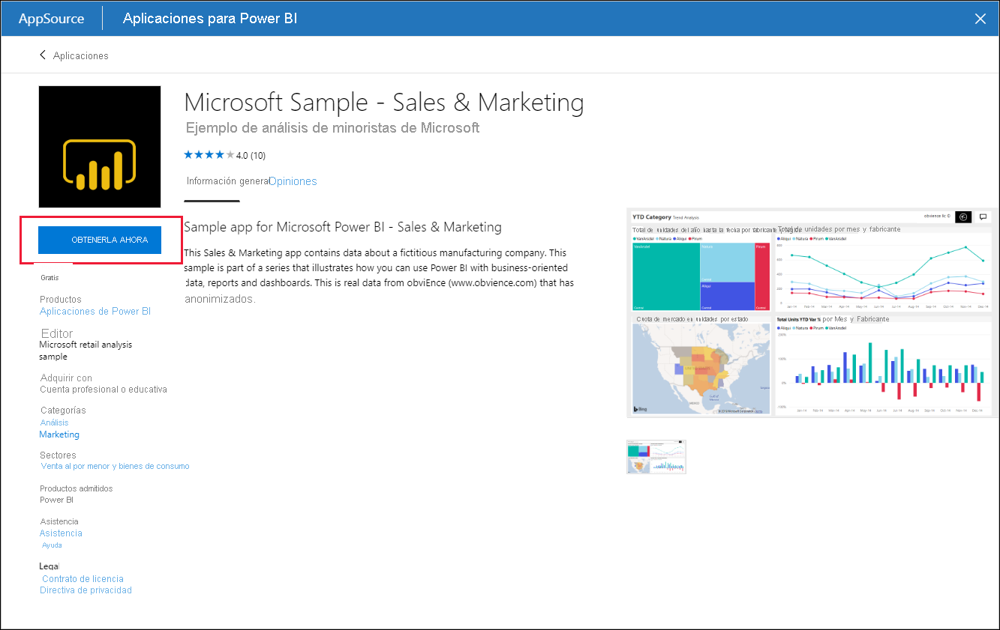
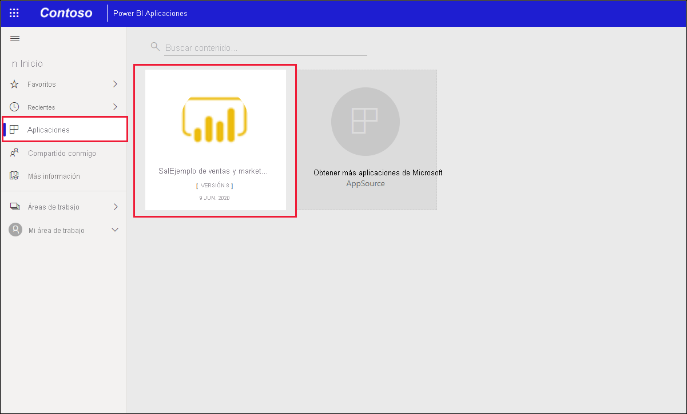
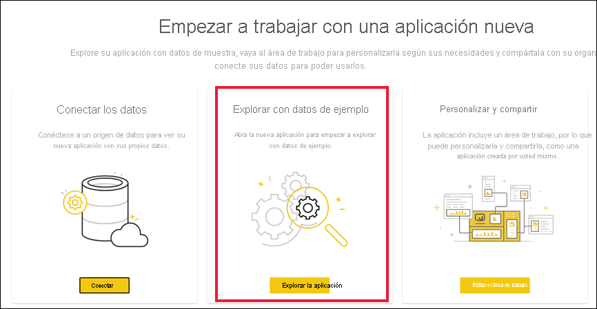

# Instalación y uso de la aplicación de ejemplo de marketing y ventas en el servicio Power BI

[!INCLUDE[consumer-appliesto-yyny](../includes/consumer-appliesto-yyny.md)]

Ahora que tiene un [conocimiento básico sobre cómo obtener contenido de Power BI](end-user-app-view.md), se usará Microsoft AppSource para obtener la aplicación de marketing y ventas. 

## Obtención de la aplicación desde Microsoft AppSource

1. Abra [https://appsource.microsoft.com](https://appsource.microsoft.com).

   

1. En el cuadro de búsqueda, escriba **Marketing** y active la casilla **Restringir por producto > Aplicaciones de Power BI**. 

    

1. Seleccione el icono de aplicación para **Microsoft sample - Sales & Marketing** (Ejemplo de Microsoft: ventas y marketing). Opcionalmente, lea la información general y las revisiones, y examine las imágenes.  Después, seleccione **Obtenerla ahora**.

   

1. Confirme que quiere instalar la aplicación.

   

5. El servicio Power BI muestra un mensaje de operación correcta cuando se instale la aplicación. Seleccione **Ir a la aplicación** para abrir la aplicación. En función de cómo el diseñador haya creado la aplicación, se mostrará el panel de la aplicación o el informe de la aplicación.

    

    También puede abrir la aplicación directamente desde la lista de contenido de la aplicación si selecciona **Aplicaciones** y elige el icono de aplicación **Sales & Marketing**.

    

6. Elija si quiere conectar datos propios, explorar con datos de ejemplo, o bien personalizar y compartir la nueva aplicación. Como hemos seleccionado una aplicación de ejemplo de Microsoft, vamos a empezar explorándola. 

    

7.  La nueva aplicación se abre con un panel. El *diseñador* de la aplicación podría haberla configurado para que, en su lugar, se abra en un informe.  

    

## Interacción con los paneles e informes en la aplicación
Dedique algún tiempo a explorar los datos de los paneles y los informes que componen la aplicación. Puede acceder a todas las interacciones estándar de Power BI, como filtrar, resaltar, ordenar y explorar en profundidad.  ¿Aún no tiene clara la diferencia entre paneles e informes?  Lea el [artículo sobre paneles](end-user-dashboards.md) y el [artículo sobre informes](end-user-reports.md).  

## Pasos siguientes
* [Volver a la información general de las aplicaciones](end-user-apps.md)    
* [Ver un informe de Power BI](end-user-report-open.md)    
* [Otras formas de compartir contenido con usted](end-user-shared-with-me.md)
