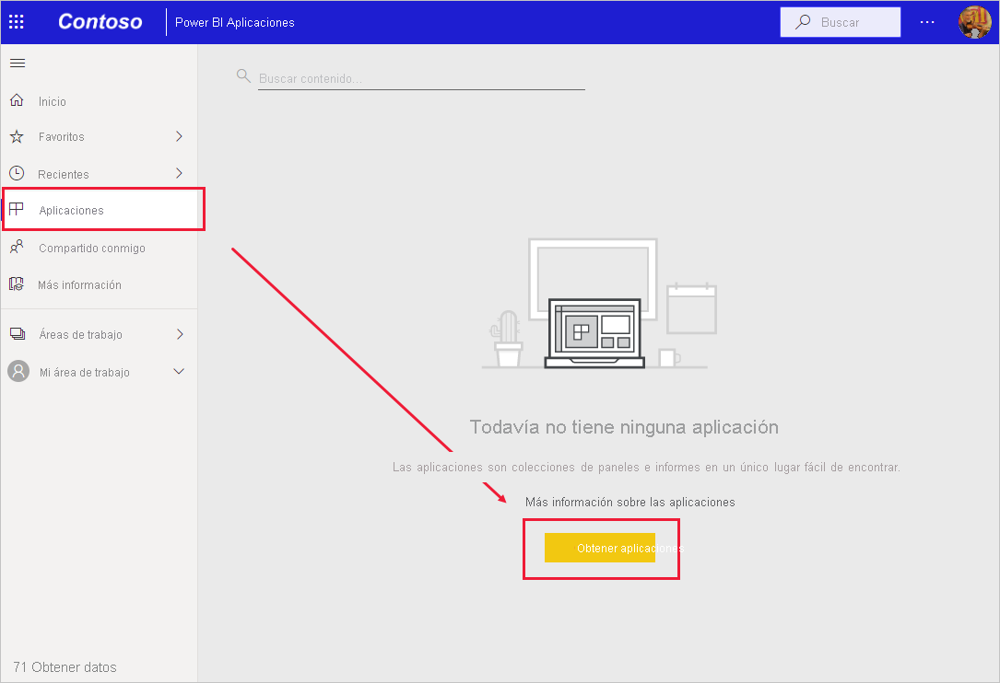
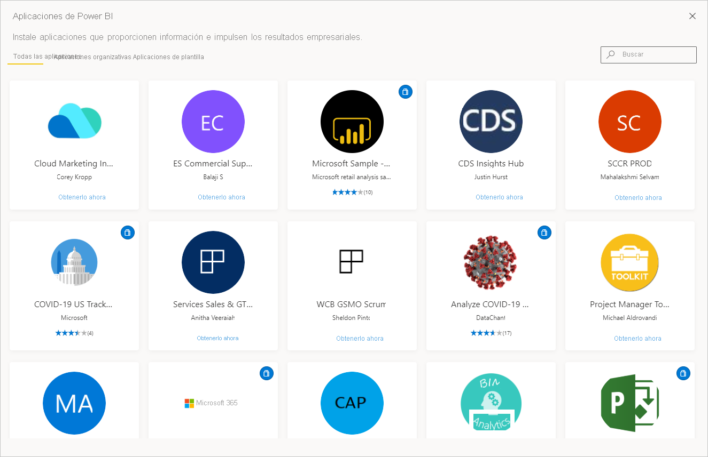
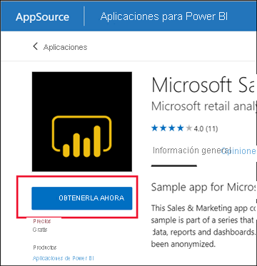
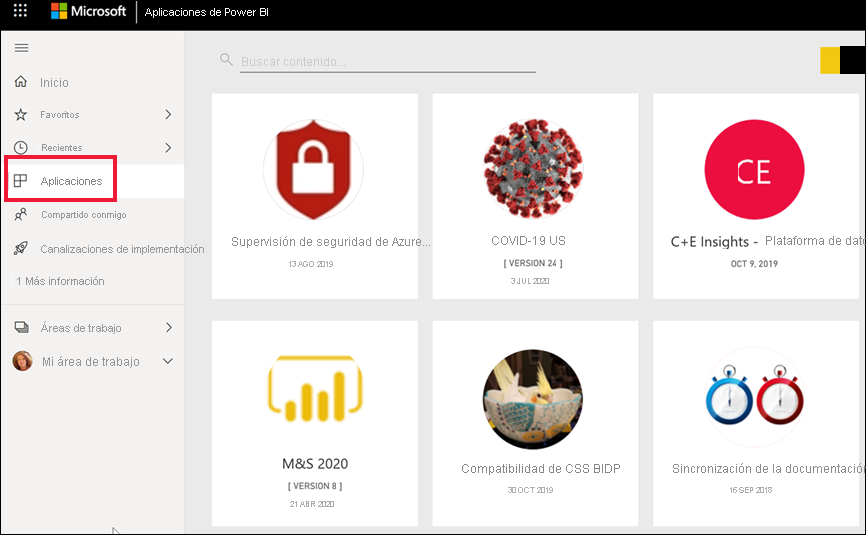
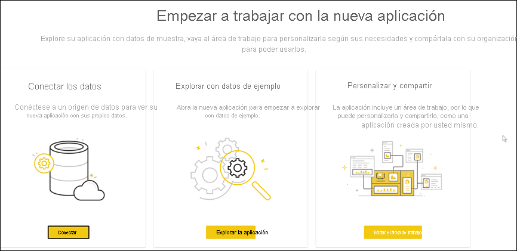
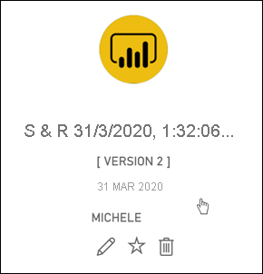
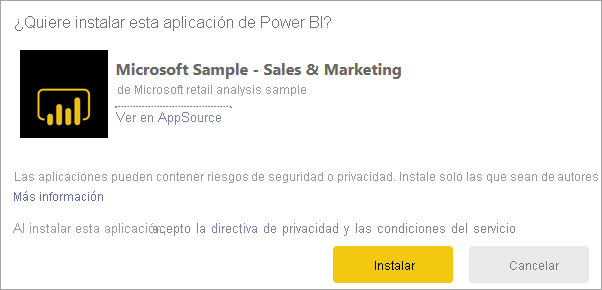
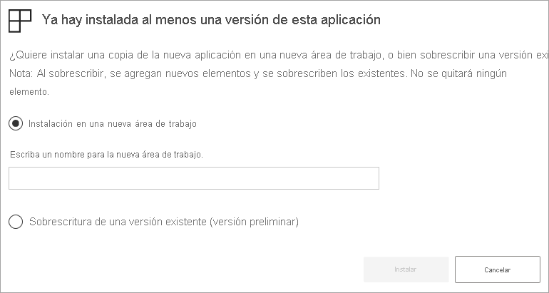

# Instalación y uso de aplicaciones con los paneles e informes de Power BI

[!INCLUDE[consumer-appliesto-ynny](../includes/consumer-appliesto-ynny.md)]

[!INCLUDE [power-bi-service-new-look-include](../includes/power-bi-service-new-look-include.md)]

Ahora que tiene [conocimientos básicos sobre las aplicaciones](end-user-apps.md), vamos a aprender a abrirlas e interactuar con ellas. 

## Maneras de obtener una nueva aplicación
Hay varias maneras de obtener una nueva aplicación:
* Puede obtenerla desde el marketplace de aplicaciones de Power BI del servicio Power BI.
* Puede usar un vínculo directo a una aplicación que haya recibido del diseñador de la aplicación. 
* Un diseñador de aplicaciones de la organización puede instalar la aplicación de forma automática en la cuenta de Power BI.

Con Power BI para dispositivos móviles, solo puede instalar una aplicación desde un vínculo directo. Si el diseñador de la aplicación la instala automáticamente, podrá verla en la lista de aplicaciones.

## Aplicaciones y licencias
No todos los usuarios de Power BI pueden ver las aplicaciones e interactuar con ellas. 
- Si tiene una licencia gratuita, puede abrir aplicaciones que estén almacenadas en una capacidad Premium y después se hayan compartido con usted.  
- Si tiene una licencia Pro, puede abrir las aplicaciones que se han compartido con usted.

Por lo tanto, si no puede abrir aplicaciones, póngase en contacto con el administrador o el departamento de soporte técnico. Para obtener información sobre las licencias, vea [Licencias de Power BI](end-user-license.md).

## Obtención de la aplicación en el marketplace de aplicaciones de Power BI

Puede buscar e instalar aplicaciones en el marketplace de aplicaciones de Power BI. En el marketplace de aplicaciones puede obtener aplicaciones de organización y de plantilla.

- Una *aplicación de la organización* está disponible para los usuarios de Power BI de la organización. Estas aplicaciones también incluyen informes y paneles pregenerados que puede usar tal cual, o bien personalizarlos y compartirlos. La organización puede tener aplicaciones para realizar el seguimiento de las ventas, medir el rendimiento o analizar el éxito de las contrataciones.
- Una *aplicación de plantilla* incluye paneles e informes pregenerados que puede usar para conectarse a muchos de los servicios que utiliza para dirigir el negocio, como SalesForce, Microsoft Dynamics y Google Analytics.

1. [Inicie sesión en el servicio Power BI](./end-user-sign-in.md) si aún no lo ha hecho. 

1. Una vez que el servicio Power BI esté abierto, seleccione **Aplicaciones > Obtener aplicaciones**. 

    

1. Se abre el marketplace de aplicaciones de Power BI.

   

   Hay tres pestañas que puede utilizar:
   * **Todas las aplicaciones**: examine las aplicaciones de plantilla y todas las aplicaciones de la organización disponibles. Las aplicaciones de plantilla se distinguen por el icono de la bolsa de la compra en la esquina superior derecha de los iconos.
   * **Aplicaciones de la organización**: examine las aplicaciones de la organización que se han compartido con usted. 
   * **Aplicaciones de plantilla**: examine las aplicaciones de plantilla que se hospedan en AppSource.

   Como alternativa, puede usar el cuadro de búsqueda para obtener una selección filtrada de aplicaciones. Al escribir parte del nombre de una aplicación o de una categoría, como finanzas, análisis, marketing, etc., resultará más fácil encontrar el elemento que está buscando. 

   El cuadro de búsqueda depende de la pestaña que haya abierto (solo se devolverán las aplicaciones del tipo seleccionado). Si la pestaña **Todas las aplicaciones** está abierta, se devuelven las aplicaciones de plantilla y de la organización. Esto puede dar lugar a confusiones cuando una aplicación de la organización y una aplicación de plantilla tienen el mismo nombre. Simplemente recuerde que los iconos de la aplicación de plantilla tienen un icono de bolsa de la compra en la esquina superior derecha.

Cuando encuentre la aplicación que quiera, haga clic en **Obtenerla ahora** para instalarla.

   

* Si va a instalar una aplicación de la organización, se agregará inmediatamente a la lista de aplicaciones.
* Si va a instalar una aplicación de plantilla, se le dirigirá al anuncio de la aplicación de plantilla en AppSource. Consulte [un ejemplo](end-user-app-marketing.md) de cómo descargar e instalar una aplicación de plantilla de muestra en el marketplace de aplicaciones de Power BI. La aplicación se instala, junto con un área de trabajo con el mismo nombre.

   > [!NOTE]
   > Si usa una licencia de usuario gratuita, podrá descargar aplicaciones, pero no las verá a menos que actualice a una cuenta de Power BI Pro o que la aplicación esté almacenada en una capacidad compartida Premium. Para obtener más información, vea [Licencias para usuarios profesionales](end-user-license.md).

## Instalar una aplicación desde un vínculo directo
También puede instalar una aplicación de la organización desde el vínculo directo de un correo electrónico en el diseñador de aplicaciones.  

**En el equipo** 

Al hacer clic en el vínculo en el correo, el servicio Power BI ([https://app.powerbi.com](https://app.powerbi.com)) abre la aplicación en el explorador. 

**En su dispositivo móvil de iOS o Android** 

Si selecciona el vínculo del correo desde su dispositivo móvil, la aplicación se instala automáticamente y se abre en la aplicación móvil. Es posible que primero tenga que iniciar sesión. 

## Interacción con los paneles e informes en la aplicación
Dedique algún tiempo a explorar los datos de los paneles y los informes que componen la aplicación. Puede acceder a todas las interacciones estándar de Power BI, como filtrar, resaltar, ordenar y explorar en profundidad.  ¿Aún no tiene clara la diferencia entre paneles e informes?  Lea el [artículo sobre paneles](end-user-dashboards.md) y el [artículo sobre informes](end-user-reports.md).  

### Abrir una aplicación

Ha instalado una aplicación o ha recibido una aplicación de un colega. Para ver esa aplicación, abra la lista de contenido Aplicaciones; para ello, seleccione **Aplicaciones** en el panel de navegación.

Mantenga el puntero sobre la aplicación que quiera abrir y selecciónela. En función de la aplicación, es posible que reciba un mensaje similar al siguiente:

Para obtener instrucciones sobre qué opción seleccionar, vea [Instalación de aplicaciones de plantilla](../connect-data/service-template-apps-install-distribute.md).

Mantenga el puntero sobre la aplicación para ver los detalles y seleccione la tarjeta de la aplicación para abrirla.

Se abre la aplicación. Cada aplicación tendrá un aspecto distinto: diseño, objetos visuales, colores y opciones diferentes. Pero todas las aplicaciones tienen algunas características comunes.

1. Nombre de la aplicación y hora de la última actualización. Seleccione la flecha desplegable para buscar el propietario y el contacto de ayuda.
1. Seleccione **Power BI** para volver a [Inicio](end-user-home.md).
1. La barra de acciones. 
1. El lienzo de la página del informe.
1. El panel de navegación de la aplicación.  Debajo del nombre de la aplicación se encuentra la lista de páginas del informe. Seleccione el nombre de una página de informe para abrirlo. Actualmente está abierta la página *Tasa de devoluciones*. 
1. Seleccione la flecha para expandir el panel **Filtros**.

También puede explorar el área de trabajo asociada. [Obtenga información sobre las áreas de trabajo](end-user-workspaces.md) Seleccione **Power BI** (número 2) para volver a **Inicio** y elija **Áreas de trabajo**. 

## Actualización de una aplicación 

En ocasiones, los diseñadores de aplicaciones pueden publicar nuevas versiones de sus aplicaciones. La forma de obtener la nueva versión depende de cómo haya recibido la original. 

* Si ha recibido la aplicación de su organización, la actualización a la versión nueva es completamente transparente; no tiene que hacer nada. 

* Si ha obtenido la aplicación de AppSource, la próxima vez que la abra verá un mensaje emergente a modo de notificación. La notificación le permitirá saber que hay una versión nueva disponible. 

    1. Seleccione **Obtener** para actualizarla.  

        <!-- -->

    2. Cuando se le pida que instale la aplicación actualizada, seleccione **Instalar**. 

         

    3. Como ya tiene una versión de esta aplicación, decida si quiere reemplazar la existente o instalar la aplicación actualizada en una nueva área de trabajo.   

         

     > [!NOTE] 
     > Al instalar una versión nueva, se sobrescriben los cambios que pueda haber realizado en los informes y paneles. Para conservar los informes y paneles actualizados, puede guardarlos con otro nombre o en otra ubicación antes de instalarlos. 

    4. Una vez que haya instalado la versión actualizada, seleccione **Actualizar aplicación** para completar el proceso de actualización. 

## Consideraciones y solución de problemas

- La capacidad de instalar aplicaciones se puede activar y desactivar mediante el administrador de Power BI. Póngase en contacto con el departamento de TI o el de soporte técnico si tiene que habilitar esta característica.    
- El uso de aplicaciones requiere una licencia Pro o que la aplicación se almacene en una capacidad compartida Premium. [Más información sobre las licencias](end-user-license.md).

## Pasos siguientes
* [Volver a la información general de las aplicaciones](end-user-apps.md)
* [Ver un informe de Power BI](end-user-report-open.md)
* [Otras formas de compartir contenido con usted](end-user-shared-with-me.md)

