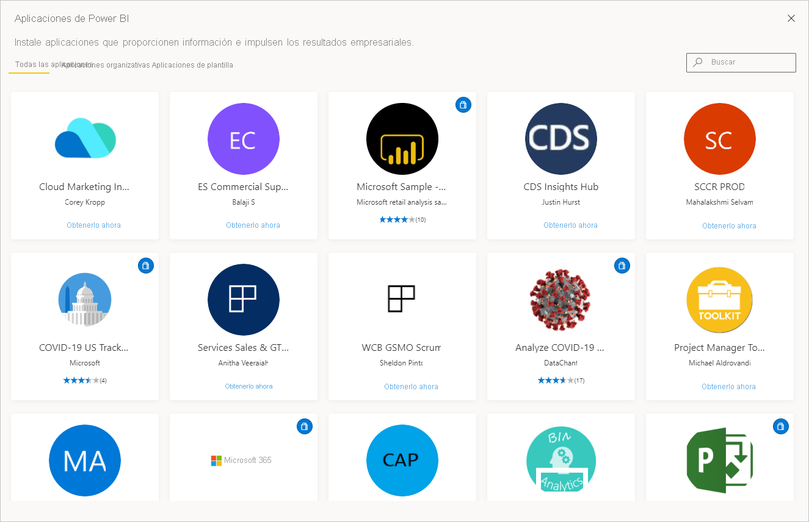

# Aplicaciones de Power BI

[!INCLUDE[consumer-appliesto-ynny](../includes/consumer-appliesto-ynny.md)]

[!INCLUDE [power-bi-service-new-look-include](../includes/power-bi-service-new-look-include.md)]

## ¿Qué es una aplicación de Power BI?
Una *aplicación* es un tipo de contenido de Power BI que combina paneles e informes relacionados en un mismo lugar. Una aplicación puede tener uno o más paneles e informes, todos ellos agrupados. Las aplicaciones las crean *diseñadores* de Power BI que las distribuyen y comparten con sus compañeros de trabajo. Un *diseñador* puede compartir contenido de muchas maneras diferentes. Para obtener más información, vea la sección **Obtención de una nueva aplicación** a continuación. 

## *Diseñadores* y *usuarios* de aplicaciones
En función de su rol, es posible que sea alguien que crea aplicaciones ( *diseñador* ) para su propio uso o para compartir con otros compañeros. O bien, puede que sea alguien que recibe y descarga aplicaciones ( *usuario profesional* ) creadas por otros. Este artículo está destinado a *usuarios profesionales* .

Para ver y abrir una aplicación se necesitan determinados permisos. El destinatario debe tener una licencia Pro de Power BI o la aplicación se tendrá que compartir con el destinatario en un tipo especial de almacenamiento en la nube denominado **capacidad Premium** . Para obtener más información sobre las licencias y la capacidad Premium, vea [Licencias para el servicio Power BI](end-user-license.md).

## Ventajas de aplicaciones
Las aplicaciones permiten a los *diseñadores* compartir con facilidad diferentes tipos de contenido de manera simultánea. Los *diseñadores* de aplicaciones crean los paneles e informes y los agrupan en una aplicación. Después, los *diseñadores* comparten o publican la aplicación en una ubicación donde usted, el *usuario profesional* , pueda acceder a ella. Como los paneles y los informes relacionados están agrupados, es más fácil buscar e instalar el servicio Power BI ([https://powerbi.com](https://powerbi.com)) en el escritorio y en su dispositivo móvil. Después de instalar una aplicación, no tendrá que recordar los nombres de muchos paneles o informes diferentes ya que se encontrarán todos juntos en una aplicación, en el explorador o en su dispositivo móvil.

En el caso de las aplicaciones, siempre que el autor de la aplicación publique actualizaciones, recibirá una notificación o verá los cambios automáticamente. El autor controla la frecuencia de actualización de los datos, por lo que no tiene que preocuparse de mantenerlos actualizados. 

<!-- add conceptual art -->
## Obtener una nueva aplicación
Hay varias maneras de obtener una nueva aplicación. Puede buscar e instalar aplicaciones, y los diseñadores de aplicaciones pueden compartirlas con usted. 

### Búsqueda e instalación de aplicaciones desde el marketplace de aplicaciones de Power BI
Una manera de buscar aplicaciones consiste en seleccionar **Obtener aplicación** en la pantalla **Aplicaciones** de Power BI. 

Desplácese por la lista de aplicaciones en el marketplace de aplicaciones de Power BI hasta que encuentre una que quiera instalar. Elija entre **Aplicaciones de la organización** , que solo están disponibles para los usuarios de la empresa, o bien **Aplicaciones de plantilla** , publicadas por Microsoft y la comunidad que cualquier usuario de Power BI puede instalar. 

Hay algunas otras maneras de obtener aplicaciones. Estas son algunas de ellas. Pero para obtener instrucciones detalladas paso a paso para obtener y explorar una aplicación, vea [Abrir e interactuar con una aplicación](end-user-app-view.md).

* El diseñador de la aplicación puede instalar la aplicación automáticamente en su cuenta de Power BI y, la próxima vez que abra el servicio Power BI, verá la nueva aplicación en la lista de contenido **Aplicaciones** . 
* El diseñador de la aplicación puede enviarle por correo un vínculo directo a ella. Al seleccionar el vínculo se abre la aplicación en el servicio Power BI.
* En Power BI desde el dispositivo móvil, solo puede instalar una aplicación desde un vínculo directo y no desde el marketplace de aplicaciones. Si el autor de la aplicación la instala automáticamente, podrá verla en la lista de aplicaciones. 

Las aplicaciones se organizan en la lista de contenido **Aplicaciones** . Simplemente seleccione **Aplicaciones** para mostrar las aplicaciones. Mantenga el puntero sobre una aplicación para ver la fecha de la última actualización y el propietario. 

## Pasos siguientes
* [Abrir una aplicación e interactuar con ella](end-user-app-view.md)
* [Otras formas de compartir contenido](end-user-shared-with-me.md)

