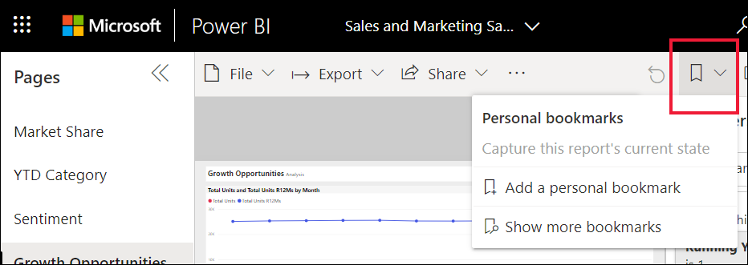
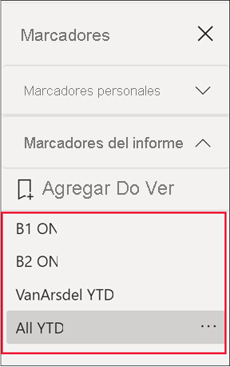
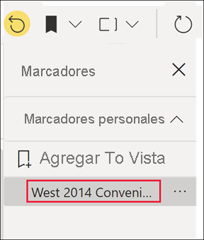

# ¿Qué son los marcadores?

[!INCLUDE[consumer-appliesto-ynnm](../includes/consumer-appliesto-ynnm.md)]

Los marcadores capturan la vista configurada actual de una página de informe, incluidos los filtros, las segmentaciones y el estado de los objetos visuales. Al seleccionar un marcador, Power BI lleva de vuelta a esa vista. Hay dos tipos de marcadores: los que crea el usuario y los creados por *diseñadores* de informes. Cualquier usuario de Power BI puede crear marcadores personales, pero para poder usar los marcadores creados por otros usuarios, se necesita una licencia de Power BI Pro o Premium. [¿Qué licencia tengo?](end-user-license.md)

## Uso de marcadores para compartir información detallada y crear historias en Power BI 
Los marcadores tienen muchos usos. Imagine que descubre algo interesante y quiere conservarlo: cree un marcador para poder volver más adelante. Si tiene que dejar el trabajo actual pero quiere conservarlo, cree un marcador. Incluso puede convertir un marcador en la vista predeterminada del informe para que, cada vez que vuelva, se abra en primer lugar esa vista de la página del informe. 

También puede crear una colección de marcadores, organizarlos en el orden que quiera y, posteriormente, usarlos en una presentación para resaltar una serie de informaciones que cuentan una historia.  

Comparta el informe marcado con los compañeros que también tengan acceso de lectura al informe. La vista marcada del informe no invalida el informe original del diseñador.  Compartirlo con los compañeros que todavía no tienen acceso de lectura requiere permisos para volver a compartirlo. Si no puede compartir la vista del informe, póngase en contacto con el propietario del informe para pedirle permiso para volver a compartirlo.  

### Compartir cambios 
Si tiene permisos para leer y volver a compartir, cuando comparta el informe podrá elegir incluir los cambios.

:::image type="content" source="media/end-user-bookmarks/power-bi-personalize-share-changes.png" alt-text="Compartir cambios":::
 

## Apertura de marcadores
Para abrir el panel Marcadores, seleccione **Marcadores** > **Mostrar más marcadores** en la barra de menús. 

Para volver a la vista publicada original del informe, seleccione el icono de **Restablecer**.

### Informar de marcadores
Si el *diseñador* del informe ha incluido marcadores de informe, los puede encontrar en el encabezado **Informar de marcadores**. Esta página del informe tiene cuatro marcadores: B1, B2, VanArsdel YTD y All YTD. **All YTD** está seleccionado.

> [!NOTE]
> Necesitará Power BI Pro o Premium para ver informes compartidos. 

Seleccione un marcador para ir a esa vista de informe. 

### Marcadores personales

Si puede ver un informe, también puede agregar marcadores personales.  Cuando crea un marcador, los siguientes elementos se guardan con él:

* La página actual
* Filtros
* Segmentaciones de datos, incluidos el tipo de segmentación de datos (por ejemplo, menú desplegable o lista) y el estado de la segmentación de datos
* Estado de selección del objeto visual (por ejemplo, los filtros de resaltado cruzado)
* Criterio de ordenación
* Ubicación de exploración
* Visibilidad (de un objeto, mediante el panel **Selección**)
* Los modos de enfoque o de **Destacados** de cualquier objeto visible

Configure una página de informe de la forma en que desee que aparezca en el marcador. En este ejemplo:

1. Hemos cambiado el filtro de fecha del panel **Filtros**.
1. Hemos cambiado el filtro de regiones del panel **Filtros**.
1.  Hemos seleccionado puntos de datos en el objeto visual del gráfico de anillos para aplicar un filtro cruzado y resaltar el lienzo del informe. 

Una vez que la página del informe y los objetos visuales estén organizados a su gusto, seleccione **Agregar** en el panel **Marcadores** para agregar un marcador. 

**Power BI** crea un marcador personal y le asigna un nombre genérico o el que especifique el usuario. Puede *cambiar de nombre*, *eliminar* o *actualizar* el marcador si selecciona los puntos suspensivos junto al nombre del marcador y luego selecciona una acción en el menú que aparece.

Una vez que tiene un marcador, puede mostrarlo con solo seleccionarlo en el panel **Marcadores**. 

<!--
## Arranging bookmarks
As you create bookmarks, you might find that the order in which you create them isn't necessarily the same order you'd like to present them to your audience. No problem, you can easily rearrange the order of bookmarks.

In the **Bookmarks** pane, simply drag-and-drop bookmarks to change their order, as shown in the following image. The yellow bar between bookmarks designates where the dragged bookmark will be placed.

The order of your bookmarks can become important when you use the **View** feature of bookmarks, as described in the next section. 

-->

## Marcadores como una presentación con diapositivas
Para presentar o ver marcadores en orden, seleccione **Vista** en el panel **Marcadores** para iniciar una presentación de diapositivas.

Cuando está en el modo **Vista**, hay algunas características a tener en cuenta:

- El nombre del marcador aparece en la barra de título de este, la cual, a su vez, aparece en la parte inferior del lienzo.
- La barra de título del marcador tiene flechas que le permiten moverse al marcador siguiente o al anterior.
- Puede salir del modo **Vista** seleccionando **Salir** en el panel **Marcadores** o la **X** que se encuentra en la barra de título del marcador.

Cuando está en modo **Vista**, puede cerrar el panel **Marcadores** (haciendo clic en la X en ese panel) para proporcionar más espacio para la presentación. Siempre que esté en el modo **Vista**, todos los objetos visuales serán interactivos y estarán disponibles para realizar el resaltado cruzado, al igual que lo estarían en caso contrario si interactúa con ellos. 

<!--
## Visibility - using the Selection pane
With the release of bookmarks, the new **Selection** pane is also introduced. The **Selection** pane provides a list of all objects on the current page and allows you to select the object and specify whether a given object is visible. 

You can select an object using the **Selection** pane. Also, you can toggle whether the object is currently visible by clicking the eye icon to the right of the visual. 

When a bookmark is added, the visible status of each object is also saved based on its setting in the **Selection** pane. 

It's important to note that **slicers** continue to filter a report page, regardless of whether they are visible. As such, you can create many different bookmarks, with different slicer settings, and make a single report page appear very different (and highlight different insights) in various bookmarks.

## Bookmarks for shapes and images
You can also link shapes and images to bookmarks. With this feature, when you click on an object, it will show the bookmark associated with that object. This can be especially useful when working with buttons; you can learn more by reading the article about [using buttons in Power BI](../create-reports/desktop-buttons.md). 

To assign a bookmark to an object, select the object, then expand the **Action** section from the **Format Shape** pane, as shown in the following image.

Once you turn the **Action** slider to **On** you can select whether the object is a back button, a bookmark, or a Q&A command. If you select bookmark, you can then select which of your bookmarks the object is linked to.

There are all sorts of interesting things you can do with object-linked bookmarking. You can create a visual table of contents on your report page, or you can provide different views (such as visual types) of the same information, just by clicking on an object.

When you are in editing mode you can use ctrl+click to follow the link, and when not in edit mode, simply click the object to follow the link. 

## Bookmark groups

Beginning with the August 2018 release of **Power BI Desktop**, you can create and use bookmark groups. A bookmark group is a collection of bookmarks that you specify, which can be shown and organized as a group. 

To create a bookmark group, hold down the CTRL key and select the bookmarks you want to include in the group, then click the ellipses beside any of the selected bookmarks, and select **Group** from the menu that appears.

**Power BI Desktop** automatically names the group *Group 1*. Fortunately, you can just double-click on the name and rename it to whatever you want.

With any bookmark group, clicking on the bookmark group's name only expands or collapses the group of bookmarks, and does not represent a bookmark by itself. 

When using the **View** feature of bookmarks, the following applies:

* If the selected bookmark is in a group when you select **View** from bookmarks, only the bookmarks *in that group* are shown in the viewing session. 

* If the selected bookmark is not in a group, or is on the top level (such as the name of a bookmark group), then all bookmarks for the entire report are played, including bookmarks in any group. 

To ungroup bookmarks, just select any bookmark in a group, click the ellipses, and then select **Ungroup** from the menu that appears. 

Note that selecting **Ungroup** for any bookmark from a group takes all bookmarks out of the group (it deletes the group, but not the bookmarks themselves). So to remove a single bookmark from a group, you need to **Ungroup** any member from that group, which deletes the grouping, then select the members you want in the new group (using CTRL and clicking each bookmark), and select **Group** again. 
-->

### Restablecer todos los cambios en un informe

En la esquina superior derecha del lienzo del informe, seleccione **Restablecer valores predeterminados**. Esta acción quitará todos los cambios de dicho informe y lo restablecerá a la última vista que guardó el autor del informe.

:::image type="content" source="media/end-user-bookmarks/power-bi-personalize-reset-all.png" alt-text="Restablecer todos los cambios":::

## Limitaciones y consideraciones
En esta versión de los **marcadores** hay algunas limitaciones y consideraciones que debe tener en cuenta.

* La mayoría de los objetos visuales personalizados de Power BI deberían funcionar bien con los marcadores. Si experimenta problemas con marcadores y un objeto visual personalizado de Power BI, póngase en contacto con el creador de ese objeto visual personalizado y pídale que haga los marcadores compatibles.    
* Si agrega un objeto visual en una página de informe después de crear un marcador, se mostrará el objeto visual en su estado predeterminado. Esto también significa que si se introduce una segmentación de datos en una página en la que previamente creó marcadores, la segmentación de datos se comportará según su estado predeterminado.
* Por lo general, los marcadores no se ven afectados si el *diseñador* del informe lo actualiza o lo vuelve a publicar. Pero si realiza cambios importantes en el informe, como quitar campos usados por un marcador, se recibe un mensaje de error la siguiente vez que se intenta abrir ese marcador. 
* Esta característica se admite en las aplicaciones móviles de Power BI para tabletas iOS y Android, así como en su versión para Windows; no se admite en las aplicaciones móviles de Power BI para teléfonos. Pero cualquier cambio en un objeto visual que guarde en un marcador personal mientras se encuentre en el servicio Power BI se respetará en todas las aplicaciones móviles de Power BI.

## Pasos siguientes
[Personalización de objetos visuales en un informe](end-user-personalize-visuals.md)
