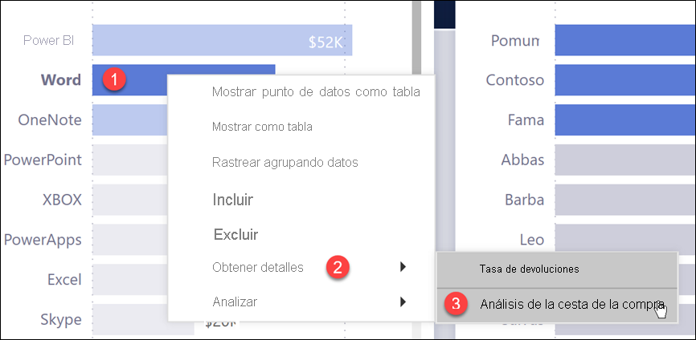
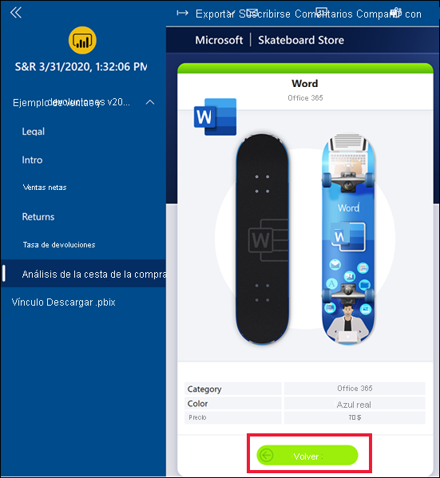
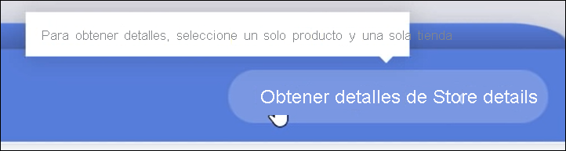
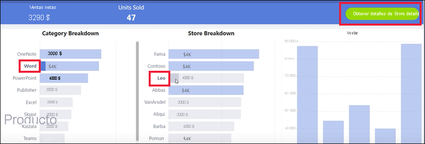
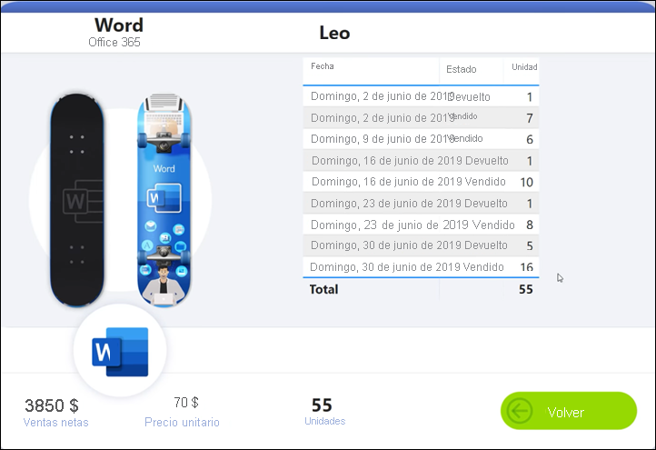
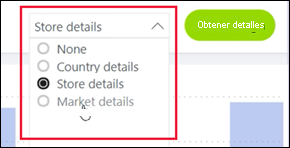
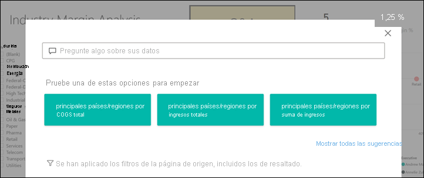
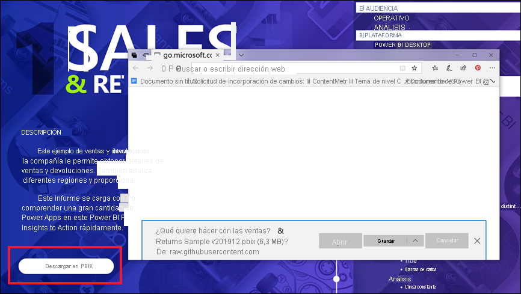

# Botones en el servicio Power BI
En los informes que recibe de compañeros, es posible que haya observado botones y se haya preguntado cómo usarlos. Algunos tienen palabras, algunos tienen flechas, otros tienen gráficos y algunos tienen incluso menús desplegables. En este artículo se enseña cómo reconocer un botón y cómo averiguar qué hacer con él.

## Reconocimiento de un botón
Los botones pueden tener un aspecto muy similar a formas, imágenes o iconos de una página del informe. Pero si se produce una acción al seleccionarlo (hacer clic en él), es probable que sea un botón.

## Tipos de botones
Los creadores de informes agregan botones a los informes para ayudarle con la navegación y la exploración. Los tipos de botones son: **Atrás**, **Marcador**, **Obtener detalles**, **Navegación de páginas**, **Preguntas y respuestas** y **Dirección URL web**. 

### Botones Atrás 
Un botón Atrás puede tener un icono de flecha que, al seleccionarlo, Power BI le lleva a la página anterior.  Los botones Atrás suelen usarse con la obtención de detalles. Aquí se muestra un ejemplo de un botón Atrás que se usa con la obtención de detalles.

1. Seleccione **Word** en el gráfico de barras.
1. Seleccione **Obtener detalles** y elija **Análisis de la cesta de la compra**.

    

    Al elegir **Análisis de la cesta de la compra**, Power BI abre la página del informe *Análisis de la cesta de la compra* y utiliza las selecciones realizadas en la página de origen para filtrar lo que se muestra en la página de destino.

    

    Ahora se encuentra en la página del informe**Análisis de la cesta de la compra**, que se filtra por Word. Para volver a la página anterior del informe, seleccione la flecha Atrás. 

## Botones de marcador
A menudo, los diseñadores de informes incluyen marcadores con sus informes. Puede ver la lista de marcadores de informe seleccionando **Ver** > **Marcadores** en la esquina superior derecha. Cuando un diseñador de informes agrega un *botón* de marcador, es simplemente una forma alternativa de navegar a la página de informe concreta asociada a ese marcador. La página tendrá los filtros y la configuración aplicados que se capturan mediante el marcador. Obtenga más información sobre los [marcadores en Power BI](end-user-bookmarks.md). 

En este ejemplo, el botón tiene un icono de marcador y el nombre del marcador, *Urbano*. 

Al elegir el botón Marcador, Power BI le lleva a la ubicación y la configuración tal y como se define para ese marcador.  En este caso, el marcador se encuentra en la página del informe*Oportunidades de crecimiento* y a esa página se aplica un filtro cruzado por **Urbano**.

## Botones de obtención de detalles
Hay dos maneras de obtener detalles en el servicio Power BI. La obtención de detalles le lleva a otra página de informe y los datos de esa página de destino se presentan según los filtros y las selecciones que haya realizado en la página de origen.

Una manera de obtener detalles en un informe consiste en hacer clic con el botón derecho en un punto de datos de un objeto visual, seleccionar **Obtener detalles** y elegir el destino. Este método se ha descrito anteriormente en la sección titulada **Botón Atrás**. Pero a veces los diseñadores de informes usan un *botón* de obtención de detalles en su lugar, para que la acción sea más obvia y para llamar la atención a conclusiones importantes.  

Los botones de obtención de detalles pueden tener más de un requisito previo. A menos que cumpla todos los requisitos previos, el botón no funcionará. Veamos un ejemplo.

Este es un botón de obtención de detalles que nos llevará a la página de *detalles de la tienda*. Al mantener el mouse sobre el botón se revela una información sobre herramientas que nos permite saber que necesitamos seleccionar tanto una tienda como un producto. Hasta que se seleccione uno de cada uno de ellos, el botón permanece inactivo.

Ahora que hemos seleccionado un producto (**Word**) y una tienda (**Leo**), el botón cambia de color para indicar que ahora está activo.

Al seleccionar el botón de obtención de detalles, se abre la página del informe *Tienda*. La página *Tienda* se filtra por las selecciones de **Word** y **Leo**.

Los botones de obtención de detalles también pueden tener menús desplegables que le ofrecen una selección de destinos. Cuando haya realizado las selecciones en la página del informe de origen, seleccione la página del informe de destino para la obtención de detalles. En el ejemplo siguiente, vamos a cambiar la selección para obtener detalles de la página del informe de *detalles del mercado*. 

## Navegación de páginas

Los botones de navegación de páginas le llevan a otra página del mismo informe. A menudo, los diseñadores de informes crean botones de navegación para contar una historia o guiar al usuario a través de las conclusiones de informes. En el ejemplo siguiente, el diseñador de informes agregó un botón en cada página del informe que le lleva a la primera página, la página de resumen de nivel superior, en el informe. Este botón de navegación de páginas resulta útil porque hay muchas páginas en este informe.

## Botones de Preguntas y respuestas 
Al seleccionar un botón de Preguntas y respuestas, se abre la ventana Explorador de preguntas y respuestas de Power BI. La ventana Preguntas y respuestas se muestra en la parte superior de la página del informe y se puede cerrar seleccionando la X. [Más información sobre Preguntas y respuestas](end-user-q-and-a.md)

## URL de web
Los botones Dirección URL web abren una nueva ventana del explorador. Los diseñadores de informes pueden agregar este tipo de botón como origen de referencia, para vincular al sitio web corporativo o incluso como vínculo a otro informe o panel. En el ejemplo siguiente, el botón Dirección URL web le permite descargar el archivo de origen del informe. 

Como la página se abre en una ventana independiente, cierre la ventana o seleccione la pestaña Power BI para volver al informe de Power BI.

## Pasos siguientes
[Marcadores](end-user-bookmarks.md)    
[Resumir/explorar en profundidad](end-user-drill.md)
