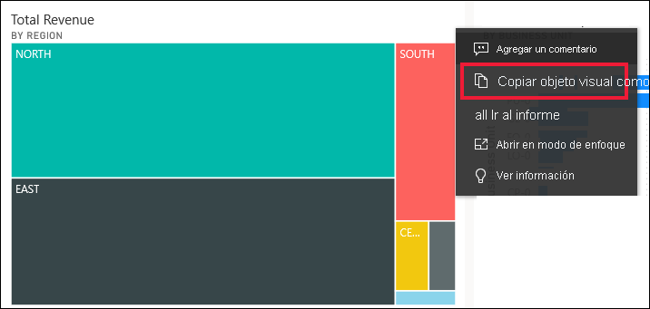
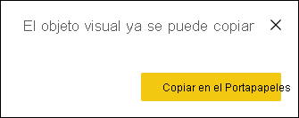
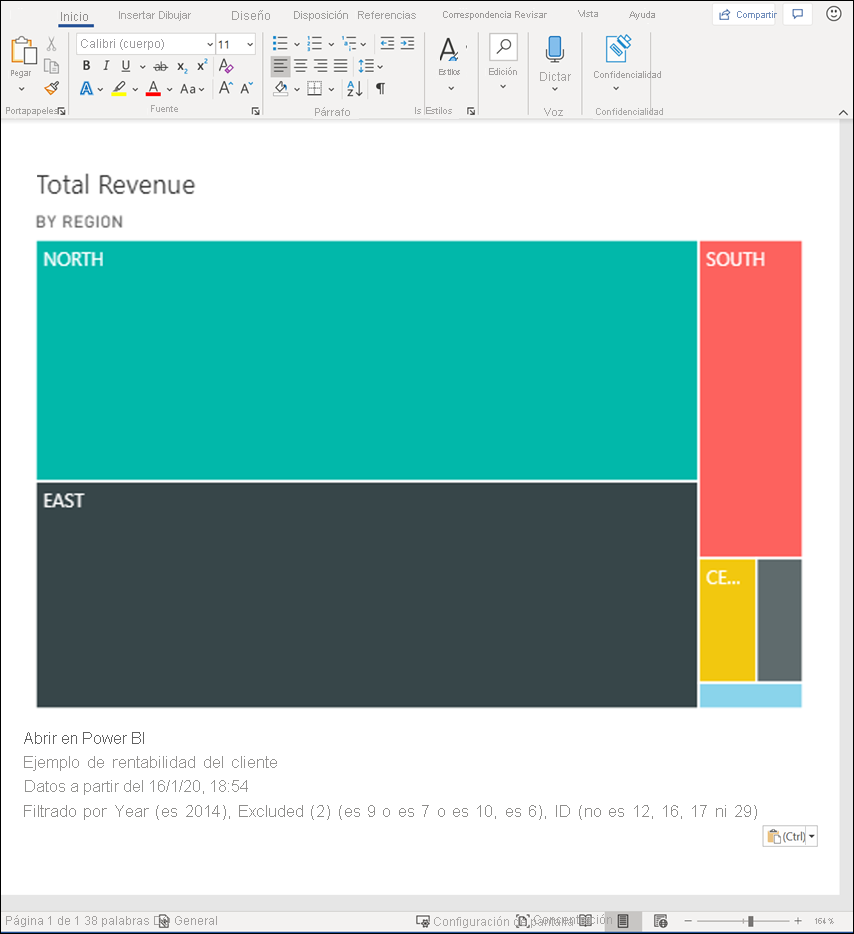
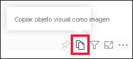
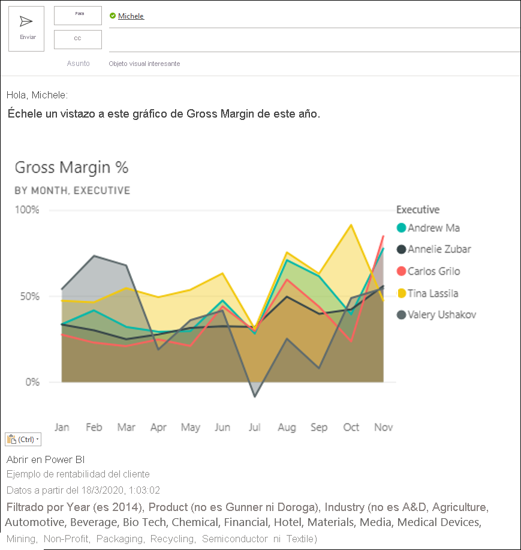
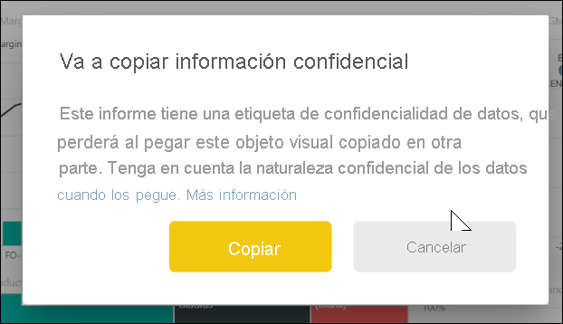
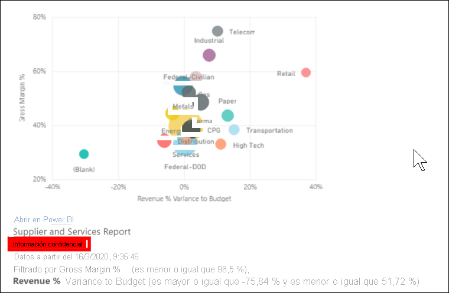
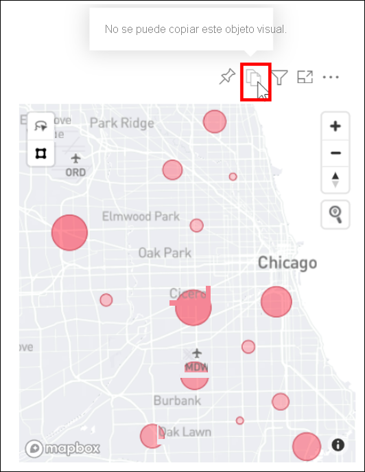

# Copia de un objeto visual como imagen en el portapapeles

[!INCLUDE[consumer-appliesto-yyyn](../includes/consumer-appliesto-yyyn.md)]

¿Alguna vez ha querido compartir una imagen de un informe o de un panel de Power BI? Ahora puede copiar el objeto visual y pegarlo en cualquier otra aplicación que admita el pegado. 

Cuando se copia una imagen estática de un objeto visual, se obtiene una copia del mismo junto con los metadatos. Esto incluye:
* Vínculo al informe o al panel de Power BI
* Título del informe o del panel
* Aviso si la imagen contiene información confidencial
* Hora de la última actualización
* Filtros aplicados al objeto visual

### Copia desde un icono de panel

1. Navegue al panel desde el que quiera copiar.

2. En la esquina superior derecha del objeto visual, seleccione **Más acciones (…)** y elija **Copiar objeto visual como imagen**. 

    

3. Cuando aparezca el cuadro de diálogo **El objeto visual ya se puede copiar**, seleccione **Copiar al portapapeles**.

    

4. Una vez copiado el objeto visual, péguelo en otra aplicación mediante **Ctrl+V** o haga clic con el botón derecho y seleccione Pegar. En la siguiente captura de pantalla, hemos pegado el objeto visual en Microsoft Word. 

    

### Copia desde el objeto visual de un informe 

1. Navegue al informe desde el que quiera copiar.

2. En la esquina superior derecha del objeto visual, seleccione el icono **Copiar objeto visual como imagen**. 

    

3. Cuando aparezca el cuadro de diálogo **El objeto visual ya se puede copiar**, seleccione **Copiar al portapapeles**.

    

4. Una vez copiado el objeto visual, péguelo en otra aplicación mediante **Ctrl+V** o haga clic con el botón derecho y seleccione Pegar. En la siguiente captura de pantalla, hemos pegado el objeto visual en un correo electrónico.

    

5. Si hay una etiqueta de confidencialidad de datos aplicada al informe, recibirá una advertencia al seleccionar el icono de copia.  

    

    Además, se agregará una etiqueta de confidencialidad a los metadatos que se encuentran debajo del objeto visual pegado. 

    

## Consideraciones y solución de problemas

   

P: ¿Por qué está deshabilitado el icono de copia en un objeto visual?    
R: Actualmente se admiten objetos visuales nativos de Power BI y objetos visuales personalizados certificados. Hay compatibilidad limitada con ciertos objetos visuales, entre los que se incluyen: 
- ESRI y otros objetos visuales de mapa 
- Objetos visuales de Python 
- Objetos visuales de R 
- PowerApps    

R: El departamento de TI o el administrador de Power BI pueden desactivar la opción para copiar un objeto visual.

P: ¿Por qué mi objeto visual no se pega correctamente?    
R: Existen limitaciones para los objetos visuales personalizados y los objetos visuales animados. 

## Pasos siguientes
Obtenga más información sobre [Visualizaciones en informes de Power BI](end-user-visual-type.md)

¿Tiene más preguntas? [Pruebe la comunidad de Power BI](https://community.powerbi.com/)

