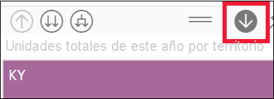

# Modo de exploración en un objeto visual de Power BI

[!INCLUDE[consumer-appliesto-yyny](../includes/consumer-appliesto-yyny.md)]

En este artículo se muestra cómo explorar en profundidad en un objeto visual en el servicio Microsoft Power BI. El uso del rastreo agrupando y desagrupando puntos de datos le permite explorar en profundidad sus detalles. 

## El modo detallado necesita una jerarquía

Cuando un objeto visual tiene una jerarquía, se puede explorar en profundidad para mostrar detalles adicionales. Por ejemplo, es posible que tenga un objeto visual que examine el número de medallas olímpicas mediante una jerarquía formada por deporte, disciplina y evento. De forma predeterminada, en el objeto visual se muestra el número de medallas por deporte, como gimnasia, esquí, deportes acuáticos, etc. Pero, como tiene una jerarquía, al seleccionar uno de los elementos visuales (como una barra, línea o burbuja) se mostraría una imagen cada vez más detallada. Al seleccionar el elemento **aquatics** se mostrarían los datos de natación, buceo y waterpolo.  Al seleccionar el elemento **diving** se mostrarían los detalles de los eventos de trampolín, plataforma y salto sincronizado.

Las fechas son un tipo único de jerarquía.  A menudo, los *diseñadores* de informes agregan jerarquías de fecha a los objetos visuales. Una jerarquía de fecha común es la que contiene el año, el trimestre, el mes y el día. 

## Averiguar qué objetos visuales se pueden explorar
¿No está seguro de qué objetos visuales de Power BI contienen una jerarquía? Mantenga el cursor sobre un objeto visual. Si ve una combinación de estos controles de detalle en la parte superior, el control visual tiene una jerarquía.

  

## Más información sobre cómo explorar en profundidad y resumir

En este ejemplo, se usará un gráfico de rectángulos que tiene una jerarquía formada por territorio, ciudad, código postal y nombre de la tienda. El gráfico de rectángulos, antes de la exploración, examina las unidades totales vendidas este año por territorio. Territorio es el nivel superior de la jerarquía.

  

### Dos maneras de acceder a las características de exploración

Tiene dos maneras de acceder a las características de exploración en profundidad, obtención de detalles y expansión de los objetos visuales que tienen jerarquías. Pruébelas y use la que más le guste.

- Primera: mantenga el mouse sobre un objeto visual para ver y usar los iconos. Seleccione la flecha hacia abajo para activar primero la exploración en profundidad. El fondo gris le permite saber que esta característica está activa.   

    

- Segunda: haga clic con el botón derecho en un objeto visual para mostrar el menú y usarlo.

    

## Rutas de exploración

### Rastreo desagrupando datos de todos los campos a la vez

Existen varias formas de explorar el objeto visual. Al seleccionar el icono de exploración en profundidad de flecha doble , va al siguiente nivel de la jerarquía. Si va a examinar el nivel **Territory** (Territorio) para Kentucky y Tennessee, puede explorar en profundidad hasta el nivel de ciudad de los dos estados, después el nivel de código postal y, por último, el nivel de nombre de la tienda de los dos estados. Cada paso de la ruta muestra información nueva.

Selección del icono de obtención de detalles  hasta que retroceda a "Unidades totales de este año por territorio".

### Expandir todos los campos a la vez

**Expandir** agrega un nivel de jerarquía adicional a la vista actual. Por tanto, si está viendo el nivel **Territorio**, puede expandir todas las hojas actuales del árbol al mismo tiempo.  La primera exploración agrega los datos de ciudad a **KY** y **TN**. La siguiente exploración agrega los datos de código postal de **KY** y **TN**, y mantiene también los datos de ciudad. Cada paso de la ruta muestra la misma información y agrega un nivel de información nueva.

### Rastrear desagrupando datos un solo campo a la vez

1. Seleccione el icono de rastrear desagrupando datos para activar esta opción .

    Ahora tiene la opción de explorar en profundidad **un solo campo a la vez** si selecciona un elemento visual. Barras, burbujas y hojas son ejemplos de elementos visuales.

    

    Si no activa la opción de explorar en profundidad, la selección de un elemento visual (como una barra, burbuja u hoja) no explorará en profundidad, sino que aplicará un filtro cruzado a los otros gráficos de la página del informe.

1. Seleccione el nodo hoja para **TN**. Ahora en el gráfico de rectángulos se muestran todos los territorios de Tennessee que tienen una tienda.

    

1. En este momento, puede hacer lo siguiente:

    1. Seguir profundizando para Tennessee.

    1. Explorar en profundidad para una ciudad determinada de Tennessee.

    1. Expanda en su lugar.

    Sigamos rastreando desagrupando datos de un solo campo a la vez.  Seleccione **Knoxville, TN**. El gráfico de rectángulos muestra ahora el código postal de la tienda en Knoxville.

    

    Observe que el título cambia a medida que realiza la exploración en profundidad y vuelve a agruparlos de nuevo.

    Explore en profundidad un campo más. Seleccione el código postal **37919** y explore en profundidad el nombre de la tienda. 

        

    En estos datos en concreto, puede que explorar en profundidad todos los niveles a la vez no sea interesante. Vamos a probar mejor con la expansión.

### Expandir todo y expandir un campo a la vez

Tener un gráfico de rectángulos que nos muestra solo un código postal o solo el nombre de una tienda no es muy informativo.  A continuación se *expandirá* un nivel en la jerarquía.  

1. En primer lugar, vuelva a profundizar hasta el nivel de código postal.     
1. Con el gráfico de rectángulos activo, seleccione el icono de *expansión*. El gráfico de rectángulos muestra ahora dos niveles de la jerarquía: código postal y nombre de la tienda.

    

1. Para ver los cuatro niveles de jerarquía de datos para Tennessee, haga clic en la flecha de obtención de detalles hasta llegar al segundo nivel **Total units this year by territory and city** (Unidades totales este año por territorio y ciudad).

    

1. Asegúrese de que el rastreo desagrupando datos sigue activado,  y seleccione el icono de *expansión*. Ahora, en el gráfico de rectángulos se muestra el mismo número de hojas (cuadros), pero cada hoja tiene detalles adicionales. En lugar de mostrar solo la ciudad y el estado, también muestra el código postal.

    

1. Haga clic en el icono de *expandir* una vez más para mostrar los cuatro niveles de jerarquía de detalle para Tennessee en el gráfico de rectángulos. Mantenga el mouse sobre un nodo hoja para ver más detalles.

    

## Mostrar los datos a medida que se explora
Use **Show as a table** (Mostrar como tabla) para tener una vista en segundo plano. Cada vez que profundice o expanda, en **Show as a table** (Mostrar como tabla) aparecen los datos que se usan para crear el objeto visual. Esto puede ayudarle a entender el funcionamiento conjunto de las jerarquías, explorar en profundidad y expandir para crear objetos visuales. 

En la esquina superior derecha, seleccione **Más acciones** (...) y, luego, elija **Show as a table** (Mostrar como tabla). 

Power BI abre el gráfico de rectángulos para rellenar el lienzo. Los datos que componen el gráfico de rectángulos se muestran debajo del objeto visual. 

Con solo el objeto visual en el lienzo, continúe profundizando. Vea que los datos de la tabla cambian para reflejar los que se usan para crear el gráfico de rectángulos. En la tabla siguiente se muestran los resultados de explorar en profundidad todos los campos a la vez desde territorio hasta nombre de la tienda. La primera tabla representa el nivel superior de la jerarquía, el gráfico de rectángulos que muestra dos hojas, una para **KY** y otra para **TN**. Las tres tablas siguientes representan los datos del gráfico de rectángulos a medida que explora en profundidad todos los niveles a la vez, desde territorio hasta ciudad, código postal y nombre de tienda.

Observe que los totales son los mismos para **City** (Ciudad), **PostalCode** (Código postal) y **Name** (Nombre). Que los totales coincidan no será siempre el caso.  Pero para estos datos, solo hay una tienda en cada código postal y en cada ciudad.  

## Consideraciones y limitaciones
- De forma predeterminada, el modo detallado no filtrará otros objetos visuales en un informe. Pero el diseñador del informe puede cambiar este comportamiento predeterminado. A medida que explore en profundidad, compruebe si los demás objetos visuales de la página realizan filtrado cruzado o resaltado cruzado.

- Para visualizar un informe que se haya compartido con usted, se requiere una licencia de Power BI Pro o Premium o que el informe se almacene en una capacidad de Power BI Premium. [¿Qué licencia tengo?](end-user-license.md)

## Pasos siguientes

[Objetos visuales en informes de Power BI](../visuals/power-bi-report-visualizations.md)

[Informes de Power BI](end-user-reports.md)

[Power BI: Conceptos básicos](end-user-basic-concepts.md)

¿Tiene más preguntas? [Pruebe la comunidad de Power BI](https://community.powerbi.com/)
