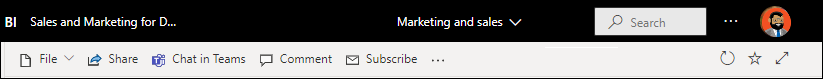

# Inicio rápido: Moverse por el servicio Power BI

[!INCLUDE [power-bi-service-new-look-include](../includes/power-bi-service-new-look-include.md)]

Ahora que ya conocemos los [conceptos básicos de Power BI](end-user-basic-concepts.md), echemos un vistazo al **servicio Power BI** . Como se mencionó en el artículo anterior, es posible que los compañeros del equipo pasen todo su tiempo en **Power BI Desktop** , donde combinan datos y crean informes, paneles y aplicaciones para otros usuarios. Son *diseñadores* . Mientras tanto, usted, pasa todo el tiempo en el servicio Power BI, donde ve el contenido que han creado otros usuarios e interactúa con él (experiencia de **consumo** ). Usted es un *usuario profesional* . Este inicio rápido está destinado a ese tipo de usuarios. 

   
 
## Requisitos previos

- Si no está registrado para Power BI, [registrarse para obtener una versión de prueba gratuita](https://app.powerbi.com/signupredirect?pbi_source=web) antes de empezar.

- Leer los [conceptos básicos del servicio Power BI](end-user-basic-concepts.md).

- Para ver el contenido de Power BI (informes, paneles, aplicaciones) que han creado los *diseñadores* , es necesario cumplir una de estas dos condiciones:
    - una licencia de Power BI Pro.
    - que la organización tenga una suscripción a Power BI Premium y que el contenido se comparta con usted desde la capacidad Premium.    
    [Aprenda sobre las licencias y suscripciones](end-user-license.md).     

    En este inicio rápido, sin embargo, no es necesario que se cumpla ninguna de estas condiciones. Microsoft ha puesto a su disposición el contenido de ejemplo directamente desde la interfaz del servicio Power BI. Se usará este contenido de ejemplo como medio para conocer el servicio Power BI. 

## Abrir el servicio Power BI

Para comenzar, abra el servicio Power BI (app.powerbi.com). 
1. Si el panel de navegación izquierdo está contraído, seleccione el icono correspondiente.  para expandirlo. 

1. En la esquina inferior izquierda, seleccione **Obtener datos** . Obtendremos algunos datos de ejemplo para usarlos en nuestro recorrido por el servicio Power BI. Se proporcionan todo tipo de datos de ejemplo para que explore, pero esta vez usaremos los datos sobre marketing y ventas. 

   

1. Cuando se abra la pantalla **Obtener datos** , seleccione **Ejemplos** .

   

1. Seleccione **Marketing y ventas** > **Conectar** . 

   

5. El servicio Power BI instala el ejemplo en **Mi área de trabajo** .  **Mi área de trabajo** es su espacio aislado privado donde aprender y experimentar.  Solo usted puede ver el contenido de **Mi área de trabajo** . El ejemplo incluye un panel, un informe y un conjunto de datos. Normalmente, los *usuarios profesionales* no reciben conjuntos de datos, pero este ejemplo está diseñado para todos los usuarios e incluye uno.

    

    Como *usuario profesional* , la mayor parte del contenido que se comparte con usted no incluirá acceso directo a los conjuntos de datos subyacentes. Los conjuntos de datos se incluyen, ya que los ejemplos de Power BI se crean para todos los clientes de Power BI.   

    Para más información sobre los ejemplos, consulte [Obtención de ejemplos para Power BI](../create-reports/sample-datasets.md).

## Ver el contenido (paneles e informes)
El contenido está organizado dentro del contexto de un área de trabajo. Cada usuario profesional tiene al menos un área de trabajo, que se llama **Mi área de trabajo** . Cuando los compañeros del *diseñador* comparten contenido con usted, puede acabar con áreas de trabajo adicionales.  Por ejemplo, si un *diseñador* le asigna permisos de acceso a una de sus áreas de trabajo, esa área de trabajo se mostrará en su sitio de Power BI.  

En **Mi área de trabajo** se almacena todo el contenido que se crea y del que se es propietario. Puede considerarla como su espacio aislado o área de trabajo para su propio contenido. Para muchos *usuarios profesionales* de Power BI, la sección **Mi área de trabajo** permanece vacía porque entre sus tareas no está la de crear contenido.  Por definición, los *usuarios profesionales* consumen datos creados por otros usuarios y usan esos datos para tomar decisiones empresariales. Si ve que está creando contenido, plantéese leer los [artículos Power BI para *creadores de informes*](../index.yml).

Las áreas de trabajo son mucho más que una mera descripción de contenido. En esta página, puede obtener información sobre los paneles e informes de un área de trabajo. Dedique unos minutos a identificar el propietario del contenido, la fecha de última actualización, la confidencialidad de los datos y las aprobaciones, si las hubiera. Seleccione **Más acciones (...)** para mostrar una lista de acciones para el panel y el informe.   

Para más información, consulte [Áreas de trabajo](end-user-workspaces.md).

Un área de trabajo también es un camino a sus datos. Desde un área de trabajo, puede abrir un panel o un informe seleccionándolos de la lista.  También, puede marcar como favorito un panel o un informe desplazando el mouse por el icono de estrella y seleccionándolo. Si el *diseñador* le ha dado [permisos de uso compartido](end-user-shared-with-me.md), también puede compartir elementos desde aquí. 

1. Seleccione el nombre del panel para abrirlo. Los paneles son un elemento que diferencia el servicio Power BI de Power BI Desktop. [Más información sobre los paneles](end-user-dashboards.md)

    

2. Las acciones que puede realizar en un panel se muestran en la barra de menús superior.    

    

3. Mantenga el puntero sobre un icono del panel y seleccione **Más opciones (...)** para ver las opciones de que dispone para interactuar con ese icono.

    

4. Seleccione un icono del panel para abrir el informe que se usó para crear ese icono. El informe se abre en la página que contiene el objeto visual que está en el icono. Aquí, se ha seleccionado el icono del panel con el gráfico de rectángulos. El servicio Power BI abre la página del informe **YTD Category** (Categoría hasta la fecha).

    

    Los informes tienen varias secciones. A la izquierda se encuentra la lista de páginas del informe en las que se hace clic. En la parte superior se encuentra la barra de menús que contiene las acciones que puede realizar con el informe.  Las opciones disponibles dependerán del rol y del permiso que el *diseñador* del informe le haya asignado. En el lado derecho se encuentra el panel **Filtros** . En el lienzo central está el informe. Al igual que en el panel, hay acciones que puede realizar con todo el informe, con objetos visuales concretos y también con una sola página del informe. 

    Aprenda sobre los [informes de Power BI](end-user-reports.md).

## Uso del panel de navegación izquierdo
El panel de navegación se vuelve más útil a medida que los compañeros comparten contenido con usted. En esta sección del inicio rápido, dejaremos a un lado el ejemplo de *marketing y ventas* y examinaremos un panel y un informe que pertenecen a un *usuario profesional* de Power BI que tiene mucho contenido compartido.

1. **Inicio** es la página de aterrizaje predeterminada al iniciar sesión en el servicio Power BI. Inicio es un excelente punto de partida y una forma alternativa de navegar por el contenido. El contenido de esta página está organizado en favorito, reciente, frecuente y destacado. También se muestran las aplicaciones y áreas de trabajo más recientes. Basta con seleccionar un elemento para abrirlo.

    Esta sección reúne las herramientas de búsqueda y ordenación, el panel de navegación y un lienzo con *tarjetas* que puede seleccionar para abrir los paneles, los informes y las aplicaciones. Al principio, es posible que no haya muchas tarjetas en el lienzo Inicio, pero eso cambia a medida que se empieza a usar Power BI con los compañeros. El lienzo Inicio también se actualiza con contenido recomendado y recursos de aprendizaje.

   

    Para más información, consulte [Inicio de Power BI](end-user-home.md).

2. **Favoritos** y **Recientes** tienen flechas. Seleccione una flecha para ver rápidamente los primeros cinco elementos favoritos o los cinco elementos de contenido visitados más recientemente. En el menú flotante, seleccione contenido para abrirlo. 

   

    Para ver la lista completa de elementos favoritos o recientes, seleccione la palabra o el icono. Estas listas de contenido proporcionan detalles adicionales sobre los informes, las aplicaciones y los paneles.

    

    Para más información, consulte [Elementos recientes en Power BI](end-user-recent.md) y [Elementos favoritos en Power BI](end-user-recent.md).

4. Seleccione **Aplicaciones** para mostrar todas las aplicaciones que se han compartido con usted o que ha instalado. Seleccione **Compartido conmigo** para ver los paneles e informes que se han compartido con usted. Dado que acaba de empezar con el servicio Power BI, estas áreas de contenido estarán vacías. 

    Aprenda sobre las secciones [Aplicaciones](end-user-apps.md) y [Compartido conmigo](end-user-shared-with-me.md).

### Buscar y ordenar contenido
Si empieza a usar el servicio Power BI por primera vez, solo tendrá algunos elementos de contenido. Sin embargo, a medida que los compañeros comiencen a compartir contenido con usted y empiece a descargar aplicaciones, puede acabar con largas listas de contenido. En este momento encontrará las funciones de búsqueda y ordenación muy útiles.

La búsqueda está disponible en casi todas las partes del servicio Power BI. Para usarla, solo tiene que localizar el cuadro de búsqueda o el icono de lupa.    

En el campo de búsqueda, escriba parte del nombre o el nombre completo de un panel, un informe, un libro o un propietario. Power BI realizará una búsqueda en todo el contenido.

Además, también hay muchas formas de ordenar el contenido. Desplace el mouse por los encabezados de columna y busque las flechas que indican que la columna se puede ordenar. No todas las columnas se pueden ordenar. 

O bien, busque los **filtros** de búsqueda cerca de la esquina superior derecha de las listas de contenido. Busque contenido rápidamente seleccionándolo por el tipo, el propietario o cualquier otro campo disponible.

Para obtener más información, consulte [Navegación en Power BI: buscar y ordenar](end-user-search-sort.md)

## Búsqueda del propietario
Finalizaremos este inicio rápido con una sugerencia útil. Si tiene alguna pregunta acerca de un panel, un informe o una aplicación, puede buscar al propietario. Con el contenido abierto, seleccione la lista desplegable de títulos para mostrar el propietario. El propietario puede ser una persona o un grupo.

## Limpieza de recursos
Una vez que finalice este inicio rápido, si quiere, puede eliminar el panel, el informe y el conjunto de datos de ejemplo.

1. Abra el servicio Power BI (app.powerbi.com) e inicie sesión.    
2. Abra Inicio de Power BI, desplácese hacia abajo y seleccione **Mi área de trabajo** .      

3. Desplace el mouse por el panel, informe o conjunto de datos concreto y seleccione **Más opciones (...)**  > **Eliminar** . Repita este paso hasta que se eliminen los tres elementos.

    

## Pasos siguientes

> [!div class="nextstepaction"]
> [Vista de lectura en el servicio Power BI](end-user-reading-view.md)
