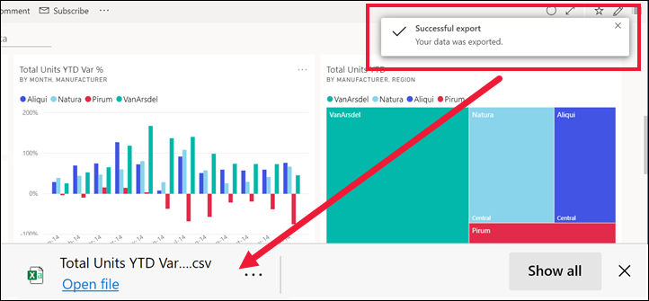

# Exportación de datos de un objeto visual

[!INCLUDE[consumer-appliesto-yyny](../includes/consumer-appliesto-yyny.md)]

Para ver los datos que se usan con el fin de crear un objeto visual, [puede mostrar dichos datos en Power BI](end-user-show-data.md) o exportarlos a Excel. En este artículo se muestra cómo realizar la exportación a Excel.

Para exportar datos a Excel se requiere una licencia Power BI Pro, o bien para que el panel o informe se comparta con usted mediante la capacidad Premium. Para obtener más información, consulte [Tipos de licencias de Power BI](end-user-license.md). 

> [!IMPORTANT]
> Si no puede realizar la exportación a Excel, es posible que el autor del informe o el administrador de Power BI haya deshabilitado esta característica. Esto se suele hacer para proteger los datos privados.

## Exportación de datos desde un objeto visual en un panel

1. Comience en un panel de Power BI. Aquí vamos a usar el panel de la aplicación ***Ejemplo de marketing y ventas** _. Puede [descargar esta aplicación desde AppSource.com](https://appsource.microsoft.com/en-us/product/power-bi/microsoft-retail-analysis-sample.salesandmarketingsample).

    

2. Mantenga el puntero sobre un objeto visual para mostrar _ *Más opciones** (...) y haga clic para mostrar el menú de acciones.

    

3. Seleccione **Exportar a .csv**.

4. Lo que sucede después depende del explorador que use. Puede que se le pida que guarde el archivo o que vea un vínculo al archivo exportado en la parte inferior del explorador. De manera predeterminada, la exportación se guarda en la carpeta local de descargas. 

    

5. Abra el archivo en Excel. 

    > [!NOTE]
    > Si no tiene permisos para los datos, no podrá exportarlos ni abrirlos en Excel. Póngase en contacto con el propietario del panel o con el administrador de Power BI para solicitar permisos de exportación. 

    

## Exportación de datos desde un objeto visual en un informe
Puede exportar datos desde un objeto visual de un informe en formato .csv o .xlsx (Excel). 

1. En un panel, seleccione un icono para abrir el informe subyacente.  En este ejemplo, vamos a seleccionar el mismo objeto visual que antes *Total Units YTD Var %* (% de desviación de unidades totales hasta la fecha). 

    

    Como este icono se creó en el informe *Ejemplo de ventas y marketing*, es el informe que se abre. Y lo hace en la página que contiene el objeto visual del icono seleccionado. 

2. Seleccione el objeto visual en el informe. Observe el panel **Filtros** de la derecha. Este objeto visual tiene filtros aplicados. Para más información sobre los filtros, consulte [Uso de filtros en un informe](end-user-report-filter.md).

    

3. Seleccione **Más opciones (...)** en la esquina superior derecha de la visualización. Elija **Exportar datos**.

    

4. Verá opciones para exportar datos resumidos o datos subyacentes. Si usa la aplicación *Ejemplo de ventas y marketing*, se deshabilitará la opción **Datos subyacentes**. Se requieren permisos adicionales para ver más datos de los que se muestran en el objeto visual (datos subyacentes). Estos permisos protegen los datos para que no se vean, se vuelvan a usar ni se compartan de forma inapropiada con nadie que no sea el público deseado.

    **Datos resumidos**: seleccione esta opción si quiere exportar datos de lo que se ve actualmente en el objeto visual.  Este tipo de exportación solo muestra los datos que se han usado para crear el estado actual del objeto visual. Si el objeto visual tiene filtros aplicados, los datos que exporte también se filtrarán. Por ejemplo, en el caso de este objeto visual, la exportación incluirá únicamente los datos de 2014 y la región central, y solo los datos de cuatro de los fabricantes: VanArsdel, Natura, Aliqui y Pirum. Si el objeto visual tiene agregados (suma, promedio, etc.), también se agregará la exportación. 
  

    **Datos subyacentes**: seleccione esta opción si quiere exportar datos de lo que ve en el objeto visual **junto con** datos adicionales del conjunto de datos subyacente.  Esto puede incluir los datos contenidos en el conjunto de datos pero que no se usan en el objeto visual. Si el objeto visual tiene filtros aplicados, los datos que exporte también se filtrarán.  Si el objeto visual tiene agregados (suma, promedio, etc.), la exportación quitará la agregación; básicamente, los datos se acoplan. 

    

5. Lo que sucede después depende del explorador que use. Puede que se le pida que guarde el archivo o que vea un vínculo al archivo exportado en la parte inferior del explorador. Si usa la aplicación de Power BI en Microsoft Teams, el archivo exportado se guarda en la carpeta local de descargas. 

    

    > [!NOTE]
    > Si no tiene permisos para los datos, no podrá exportarlos ni abrirlos en Excel. Póngase en contacto con el propietario del informe o con el administrador de Power BI para solicitar permisos de exportación. 

6. Abra el archivo en Excel. Compare la cantidad de datos exportados con los que se exportaron desde el mismo objeto visual en el panel. La diferencia es que esta exportación incluye **datos subyacentes**. 

    

## Consideraciones y solución de problemas
Hay muchas consideraciones relacionadas con la exportación a Excel. Esta es una de las características que los diseñadores de informes y los administradores de Power BI pueden deshabilitar para usuarios individuales o incluso para toda la organización. Lo hacen para asegurarse de que los datos privados no se expongan al público equivocado. 

Si no puede usar esta característica, póngase en contacto con el propietario del informe y el administrador para comprender por qué no puede exportar datos desde un determinado objeto visual, o incluso desde todos ellos. Es posible que esta característica se haya deshabilitado intencionadamente y quizás puedan habilitarla para usted.  En otras ocasiones, puede haber motivos particulares por los que una exportación no funciona.  Puede estar relacionado con los permisos, el contenido de los datos, el tipo de datos, el tipo de objeto visual, el modo en el que el diseñador ha asignado un nombre a los campos, etc. Al ponerse en contacto con el propietario o el administrador del informe, indíqueles que consulten estos artículos: [Guía para la configuración de inquilinos](../guidance/admin-tenant-settings.md), [Seguridad de nivel de fila (RLS) con Power BI](../admin/service-admin-rls.md) y [Protección de datos en Power BI](../admin/service-security-data-protection-overview.md).

- Existe un límite en el número de filas que se pueden exportar a Excel.  En el caso de los archivos .xlsx, el límite es de 150 000 filas.  En el caso de los archivos .csv, el límite es de 30 000 filas. 

- El conjunto de datos puede tener aplicada la seguridad de nivel de fila (RLS) a los datos. Esto significa que algunos datos pueden estar ocultos porque no es apropiado que los vea.  Por ejemplo, si es administrador de personal, es posible que el conjunto de datos de RR. HH. tenga aplicada la RLS y solo le permita ver los datos de los empleados que dependan directamente de usted. 

- Ciertos tipos de objetos visuales no se admiten. Entre ellos se incluyen objetos visuales personalizados, objetos visuales de R y otros. 

## Pasos siguientes

[Mostrar los datos usados para crear un objeto visual](end-user-show-data.md)