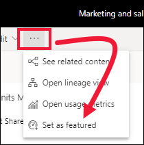
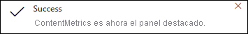
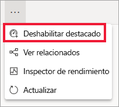

# Paneles destacados en el servicio Power BI

[!INCLUDE [power-bi-service-new-look-include](../includes/power-bi-service-new-look-include.md)]

Muchos de los usuarios tienen un panel que visitan con más frecuencia que otros. Puede ser el panel que se usa para administrar nuestro negocio. O bien puede ser uno que contenga una agregación de iconos de muchos paneles e informes distintos.

## Creación de un panel destacado
Al establecer un panel como *destacado*, cada vez que se abre el servicio Power BI, lo hace mostrando ese panel. 

También puede seleccionar algunos paneles para establecerlos como favoritos. Consulte [Paneles favoritos](end-user-favorite.md).

Si no ha establecido un panel destacado, Power BI se abre en el último panel usado o en **Inicio** de Power BI. 

### Establecimiento de un panel como destacado

1. Abra el panel que quiera establecer como destacado. 
2. En la barra de menús superior, seleccione **Más opciones** (...) y seleccione **Establecer como destacado**. 
   
    
3. Confirme la selección.
   
    

## Cambio del panel destacado
Si cambia de opinión más adelante, puede establecer un nuevo panel como panel destacado. El hecho de dejar de destacar un panel no hace que se quite de Power BI. 

1. Siga los pasos 1 y 2 anteriores.
   
2. Seleccione **Establecer como panel destacado**. 
   
    

## Quitar el panel destacado
Si decide que no quiere que haya ningún panel nombrado como destacado, esta es la forma de hacer que un panel deje de serlo.

1. Abra el panel destacado actualmente.
2. En la barra de menús superior, seleccione **Más opciones** (...) y seleccione **Deshabilitar destacado**.

    
   
## Pasos siguientes
- [Paneles favoritos](end-user-favorite.md)    
- ¿Tiene más preguntas? Consulte la [Comunidad de Power BI](https://community.powerbi.com/).

