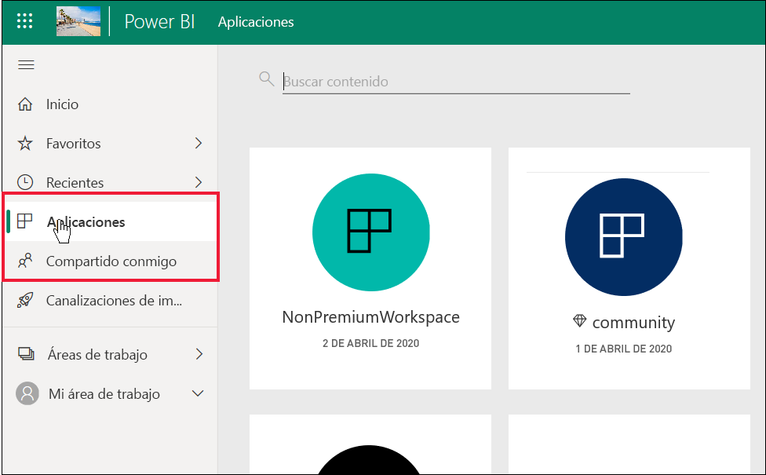
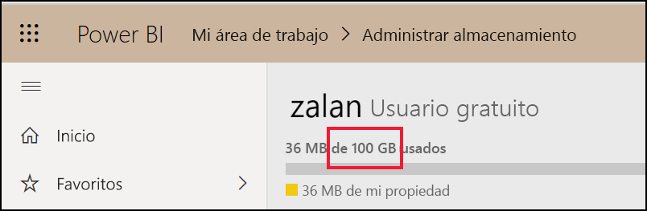
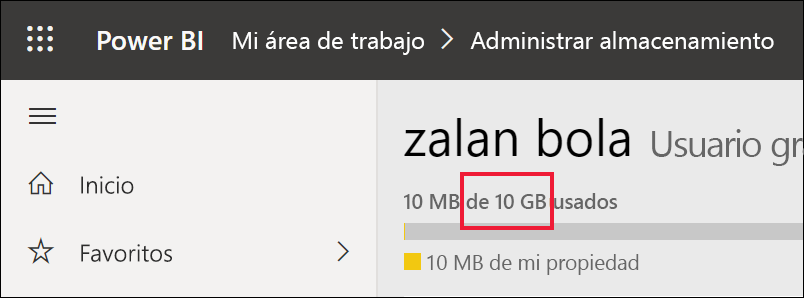

# Lista de características de Power BI para *consumidores* y otros usuarios con licencias gratuitas

[!INCLUDE[consumer-appliesto-ynnn](../includes/consumer-appliesto-ynnn.md)]

Como *usuario empresarial* , usa el servicio Power BI para explorar informes y paneles con el fin de tomar decisiones empresariales. Los *diseñadores* que tienen licencias de Power BI *Pro* crean esos informes y paneles. Los usuarios de Pro tienen la capacidad de compartir contenido con sus compañeros y de controlar lo que estos pueden y no pueden hacer con ese contenido. En ocasiones, los diseñadores comparten contenido mediante el envío de vínculos y, a veces, el contenido se instala de forma automática y aparece en Power BI, en **Aplicaciones** o **Compartido conmigo**.

Los diseñadores pueden compartir contenido de muchas maneras diferentes. Pero este artículo está destinado a los *usuarios empresariales* de Power BI y, por tanto, solo se describe cómo los *usuarios empresariales* reciben el contenido e interactúan con él. Para obtener más información sobre otras formas de compartir contenido, vea [Formas de compartir el trabajo en Power BI](../collaborate-share/service-how-to-collaborate-distribute-dashboards-reports.md).

En el [artículo anterior](end-user-license.md), ha aprendido que lo que puede hacer con los paneles, informes y aplicaciones (contenido) en el servicio Power BI depende de tres cosas: sus licencias, sus roles y permisos, y el lugar en el que se almacena el contenido.

En este artículo se enumeran las características del servicio Power BI que están disponibles para los *usuarios empresariales* como usted. Por definición, los *usuarios empresariales* tienen una licencia gratuita para trabajar en el servicio Power BI (no Power BI Desktop) y son miembros de organizaciones que tienen contenido almacenado en capacidad Premium.

<art>

## Revisión rápida de la terminología
Ahora se revisarán algunos conceptos de Power BI antes de llegar a la lista. Se trata de una revisión rápida; si necesita más detalles, visite [Licencias para consumidores](end-user-license.md) o [Conceptos básicos de Power BI](end-user-basic-concepts.md).

### Áreas de trabajo y roles
Existen dos tipos de áreas de trabajo: **Mi área de trabajo** y las áreas de trabajo de la aplicación. Solo usted tiene acceso a su propio espacio de **Mi área de trabajo**. Para tareas de colaboración y uso compartido, los *diseñadores* de contenido con licencias de Pro tienen que usar un área de trabajo de la aplicación. 

En las áreas de trabajo de la aplicación, los diseñadores asignan *roles* para administrar quién puede hacer qué en esa área de trabajo. *A los usuarios empresariales* a menudo se les asigna el rol **Visor**. 

### Capacidad Premium
Cuando una organización tiene una suscripción a una capacidad Premium, los administradores y los usuarios de Pro pueden asignar áreas de trabajo a una *capacidad*. Un área de trabajo en una capacidad es un espacio en el que los usuarios de Pro pueden compartir y colaborar con los que tienen una licencia gratuita, sin necesidad de que estos últimos tengan licencias de Pro. Dentro de esas áreas de trabajo, los usuarios de la licencia gratuita tienen permisos elevados (vea la lista siguiente). 

### Licencias 
Cada usuario del servicio Power BI tiene una licencia gratuita o una licencia Pro. Los *usuarios empresariales* tienen licencias gratuitas.

- **Licencia gratuita** : normalmente se asigna a los *usuarios empresariales* dentro de una organización (vea la primera imagen abajo). También la usa cualquiera que se suscriba al servicio Power BI como individuo y quiera probar el [servicio Power BI en modo independiente](../fundamentals/service-self-service-signup-for-power-bi.md) (vea la segunda imagen abajo). 

    

    A los usuarios de la licencia gratuita, ser miembro de una organización que tiene capacidad Premium les proporciona superpoderes. Mientras que los compañeros de Pro usen áreas de trabajo de capacidad Premium para compartir contenido, los usuarios de la licencia gratuita podrán verlos y colaborar con ellos.  **De esta manera, el usuario gratuito obtiene la capacidad de consumir contenido creado por otros usuarios. Junto con sus compañeros, incluidos los usuarios del nivel Pro, el usuario empresarial recibe los mismos paneles, informes y aplicaciones, los comparte y colabora en ellos con el fin de tomar decisiones empresariales.** 
 
    

   

## Lista de características de Power BI para *consumidores* y usuarios de la licencia gratuita
En el gráfico siguiente se identifican las tareas que puede realizar un *usuario empresarial* que interactúe con el contenido en capacidad Premium.    

La primera columna representa a un usuario de la licencia gratuita que trabaja con contenido en **Mi área de trabajo**. Este usuario no puede colaborar con compañeros en el servicio Power BI. Los compañeros no pueden compartir contenido directamente con este usuario y este usuario no puede compartir desde **Mi área de trabajo**. 

La segunda columna representa un *usuario empresarial*.  Un usuario empresarial:

- tiene una licencia de usuario gratuita
- forma parte de una organización que tiene una suscripción de capacidad Premium
- obtiene contenido (aplicaciones, paneles e informes) de los usuarios de Pro que lo comparten mediante áreas de trabajo de la aplicación en la capacidad dedicada Premium.
- se le asigna el rol **Visor** para esas áreas de trabajo de la aplicación. 

### Leyenda
 la característica está disponible en el escenario actual    
 la característica no está disponible en el escenario actual    
 **** la disponibilidad de la característica se limita a **Mi área de trabajo**. El contenido de **Mi área de trabajo** es para uso personal del propietario y no se puede compartir ni ver con nadie en Power BI.    
 \* un usuario o un administrador de Pro puede activar o desactivar el acceso a esta característica.    
   

### Lista de características

|Características   | Escenario 1: usuario de una licencia gratuita de Power BI sin acceso al contenido hospedado en una capacidad.    | Escenario 2: usuario de una licencia gratuita de Power BI con permisos **Visor** para el contenido hospedado en una capacidad. Esta persona es un *usuario empresarial* de Power BI. |
|---|---|---|
|**Aplicaciones** 
|Se instalan de forma automática |  | *| 
|Abrir |  |   | 
|Favorito |  |   |
 |Editar, actualizar, volver a compartir, volver a publicar |  |   |
 |Crear la aplicación |  |   |
 |AppSource: descargar y abrir |   | | 
|Tienda de la organización: descargar y abrir|  |  |
 |**Áreas de trabajo de la aplicación**
| Crear, editar o eliminar el área de trabajo o el contenido  |   | |
|Agregar aprobaciones |   | | 
|Abrir y ver  |   |    | 
| Leer los datos almacenados en los flujos de trabajo del área de trabajo | ||
|**Paneles**
|Recibir, ver e interactuar con paneles de compañeros |  |    | 
| Agregar alertas a iconos  |   |    | 
| Ver y responder a los comentarios de otros usuarios: agregar comentarios propios  |   |  *  | 
| Guardar una copia |  | | 
|Copiar objeto visual como imagen | ||
|Crear, editar, actualizar, eliminar |  | | 
|Exportar icono a Excel | | |
|Favorito || |
|Característica | ||
|Modos de enfoque y pantalla completa | | |
|Búsqueda global |* |* |
|Información detallada sobre los mosaicos |     | *|
|  Preguntas y respuestas: usar en el panel  |* |* |
|Preguntas y respuestas: agregar preguntas destacadas y guardadas |   | |
|Preguntas y respuestas: revisar las preguntas formuladas |   | |  
|Inspector de rendimiento |  | |
|Anclar iconos desde Preguntas y respuestas, o informes |  | | 
|Imprimir |* |* |
|Actualizar |  | | 
|Volver a compartir |   | | 
|Suscripción personal |* |*  |
|Suscribir a otros |   | | 
|**Conjuntos de datos**
|  Agregar, eliminar, editar  |    |   |   
| Crear un informe en otra área de trabajo en función de un conjunto de datos de esta área de trabajo |   | |  
|  Información detallada sobre conjuntos de valores  |   || 
|Programar actualización |  || 
|**Informes**
|Recibir informes de compañeros |  |    | 
| Colaborar con compañeros en la misma versión de un informe | |    | 
| Analizar informe en Excel  |*  |*  | 
| Ver los marcadores creados por otros y agregar marcadores propios  | |  |
| Ver y responder a los comentarios de otros usuarios: agregar nuevos comentarios  | |  |
|Cambiar las dimensiones de la pantalla   |  |   | 
| Guardar una copia | |  
|Copiar objeto visual como imagen* |
| Objetos visuales de informe de resaltado cruzado y filtro cruzado   | |  |
|  Explorar   |  |  |
| Obtención de detalles |* |* |
|  Insertar (publicar en la web, público) | * | |  
|  Exportar datos resumidos desde objetos visuales de informe*  | | |
|Exportar datos subyacentes desde objetos visuales de informe* |  |  | 
|  Marcar el informe como favorito  | | |
|  Filtros: tipos de cambio  |* |* |
|  Filtros: interacción   || |
|  Filtros: persistentes  |* |* |
| Buscar en el panel de filtros |* |* |
| Modos de enfoque y pantalla completa   | | |
|  Información detallada sobre los informes1  |   || 
| Vista de linaje  | | |
|PDF: crear a partir de páginas de informe | |  |
|Inspector de rendimiento || |
| PDF: crear a partir de páginas de informe*   | | |
|  Promover contenido a Inicio  |   | | 
| Imprimir páginas de informe* | | |
|Interactuar con el objeto visual de Preguntas y respuestas | | |
|Código QR | | |
|  Actualizar  | | |
|  Compartir contenido con usuarios externos  |   | | 
| Compartir: permitir que otros usuarios vuelvan a compartir elementos |   | | 
|Mostrar como tabla (mostrar datos)| | |
|  Segmentaciones: agregar o eliminar  | | |
| Interactuar con segmentaciones | | |
|  Ordenar objetos visuales de informe  | | |
|  Suscripción personal a informes* | | |
|  Suscripción de otros usuarios a informes  |   | | 
|  Ver relacionados | | |
|  Objetos visuales: cambiar tipos en informes  |* |* |
|  Cambiar interacciones de objeto visual  |  | |
|  Objetos visuales: agregar nuevos  |  | |
|  Objetos visuales: agregar campos nuevos  |   | |
|Objetos visuales: cambiar el tipo |  | |
| Objetos visuales: mantener el mouse para mostrar detalles e información sobre herramientas  |  | |

## Pasos siguientes
[Power BI para *usuarios empresariales*](end-user-consumer.md)    
