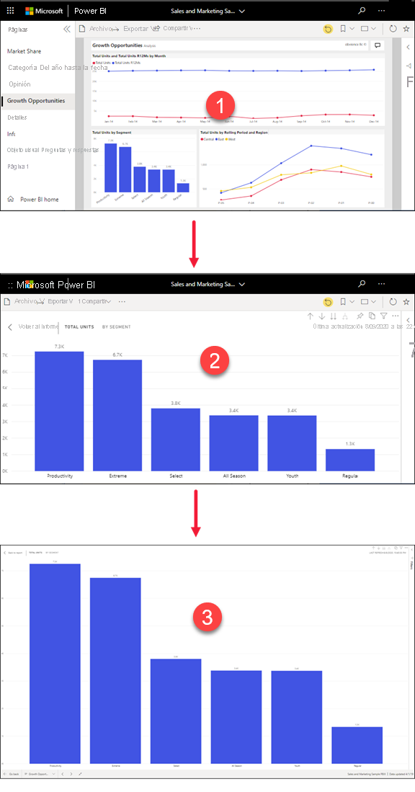
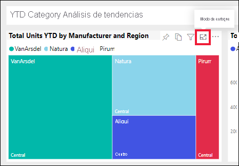
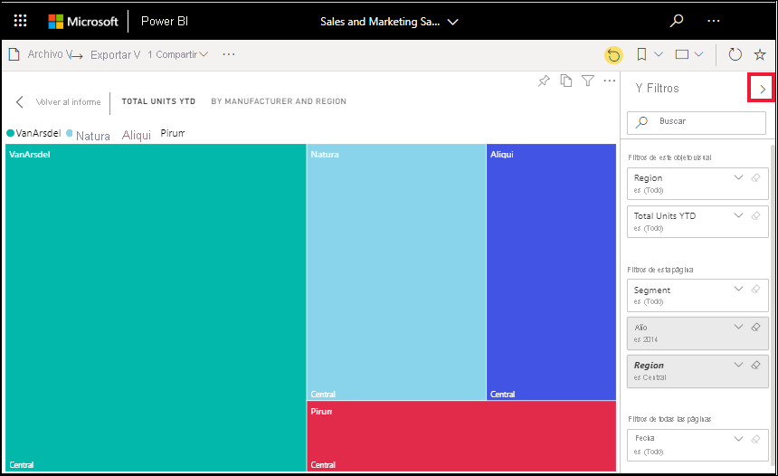
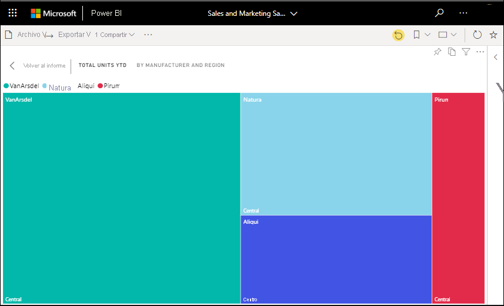

# Mostrar el contenido con más detalle: modo de enfoque y modo de pantalla completa

[!INCLUDE [consumer-appliesto-yynn](../includes/consumer-appliesto-yynn.md)]

[!INCLUDE [power-bi-service-new-look-include](../includes/power-bi-service-new-look-include.md)]    

<iframe width="560" height="315" src="https://www.youtube.com/embed/dtdLul6otYE" frameborder="0" allowfullscreen></iframe>

El modo de enfoque y el modo de pantalla completa son dos maneras diferentes para ver más detalles en los objetos visuales, informes y paneles.  La principal diferencia entre ambas es que la pantalla completa quita todos los paneles que rodean al contenido, mientras el modo de enfoque permite seguir interactuando con los objetos visuales. Veamos en más profundidad las similitudes y las diferencias.  

|Contenido    | Modo de enfoque  |Modo de pantalla completa  |
|---------|---------|----------------------|
|Panel     |   No es posible     | sí |
|Página del informe   | No es posible  | sí|
|Objeto visual del informe | sí    | sí |
|Icono del panel | sí    | No es posible |
|Windows 10 Mobile | No es posible | Sí |

En este ejemplo, se empezó a trabajar con un informe (1), se abrió uno de los objetos visuales en modo de enfoque (2) y, después, se abrió ese mismo objeto visual en modo de pantalla completa (3). 

## Cuándo usar el modo de pantalla completa

Represente el contenido del servicio Power BI (paneles, páginas de informes y objetos visuales) sin la distracción de los menús y los paneles de navegación.  En todo momento se disfruta de una vista completa sin adulterar del contenido con un solo vistazo. Esto a veces se conoce como modo de televisión.   

Si usa Power BI para dispositivos móviles, [la pantalla completa está disponible para las aplicaciones móviles de Windows 10](./mobile/mobile-windows-10-app-presentation-mode.md). 

Algunos usos del modo de pantalla completa son:

* Presentar el panel, objeto visual o informe en una reunión o conferencia.
* Mostrar los elementos en una oficina en una pantalla de gran tamaño dedicada o un proyector.
* Visualizar en una pantalla pequeña.
* Revisar los elementos en modo bloqueado: puede tocar la pantalla o pasar el mouse sobre los iconos sin abrir el panel o el informe subyacente.

## Cuándo usar el modo de enfoque

El modo de ***enfoque** _ permite expandir (hacer emerger) un objeto visual o icono para verlos con mayor detalle.  Quizá tenga un panel o informe que está un poco amontonado y desea acercar un único objeto visual.  Se trata de un uso perfecto del modo de enfoque.  

En el modo de enfoque, un _usuario profesional* de Power BI puede interactuar con todos los filtros que se hayan aplicado al crear este objeto visual.  En el servicio Power BI, puede usar el modo de enfoque en un icono de un panel o un objeto visual de un informe.

## Trabajar en modo de pantalla completa

El modo de pantalla completa está disponible para paneles, páginas de informes y objetos visuales de informes. 

- Para abrir un panel en el modo de pantalla completa, seleccione el icono de pantalla completa  en la barra de menú superior. 

- Para abrir una página de informe en el modo de pantalla completa, seleccione **Vista** > **Pantalla completa**.

    

- Para ver un objeto visual en modo de pantalla completa, ábralo primero en modo de enfoque y, después, seleccione **Vista** > **Pantalla completa**.  

El contenido seleccionado ocupa toda la pantalla. Una vez que esté en modo de pantalla completa, navegue con las barras de menús de la parte superior e inferior (de los informes) o con el menú que aparece al desplazar el cursor (de los paneles y objetos visuales). El modo de pantalla completa está disponible para una amplia variedad de contenido, por lo que las opciones de navegación varían.   

  * Seleccione el botón **Atrás**, **Volver atrás** o **Volver al informe** para navegar a la página anterior del explorador. Si la página anterior era una página de Power BI, se mostrará también en el modo de pantalla completa.  El modo de pantalla completa se mantendrá hasta que salga.

  *     
    Use el botón **Ajustar a la pantalla** para mostrar el panel en el mayor tamaño posible sin tener que recurrir a las barras de desplazamiento.  

    

  *        
    En algunas ocasiones, no importan las barras de desplazamiento, sino que quiere que el panel ocupe todo el ancho del espacio disponible. Seleccione el botón **Ajustar al ancho**.    

    

  *        
    En los informes de pantalla completa, utilice estas flechas para desplazarse entre las páginas del informe.    
  *      
  Para salir del modo de pantalla completa, seleccione el icono **Salir de pantalla completa**.

      

## Trabajar en modo de enfoque

El modo de enfoque está disponible para iconos de paneles y objetos visuales de informe. 

- Para abrir un icono de un panel en el modo de enfoque, mantenga el puntero sobre un icono de un panel o un objeto visual de un informe, seleccione **Más opciones** (...) y elija **Abrir en modo de enfoque**.

    .. 

- Para abrir un objeto visual de un informe en el modo de enfoque, mantenga el puntero sobre el objeto visual y seleccione el icono del **modo de enfoque**.  

   

El objeto visual se abre y pasa a ocupar todo el lienzo. Tenga en cuenta que todavía tiene un panel **Filtros** que puede usar para interactuar con el objeto visual. Se puede contraer el panel **Filtros**.

   

     

Explore más mediante la [modificación de los filtros](end-user-report-filter.md) y la búsqueda de detecciones interesantes en los datos. Como *usuario empresarial*, no puede agregar nuevos filtros, cambiar los campos usados en los objetos visuales ni crear objetos visuales nuevos.  Sin embargo, puede interactuar con los filtros existentes. 

En el caso del icono de un panel, no se pueden guardar los cambios. En el caso de un objeto visual de un informe, cualquier modificación que realice en los filtros existentes se guardará al salir de Power BI. Si no desea que Power BI recuerde las modificaciones, seleccione **Restablecer valores predeterminados**.   

Para salir del modo de enfoque y volver al panel o al informe, seleccione **Salir del modo de enfoque** o **Volver al informe**, en la esquina superior izquierda del objeto visual.

    

  

## Consideraciones y solución de problemas

* Al utilizar el modo de enfoque con un objeto visual de un informe, podrá ver todos los filtros e interactuar con ellos: el nivel de objeto visual, el nivel de página, la obtención de detalles y el nivel de informe.    
* Al utilizar el modo de enfoque con un objeto visual de un panel, podrá ver solo el filtro del nivel del objeto visual e interactuar con él.

## Pasos siguientes

[Configuración de la vista de informes](end-user-report-view.md)