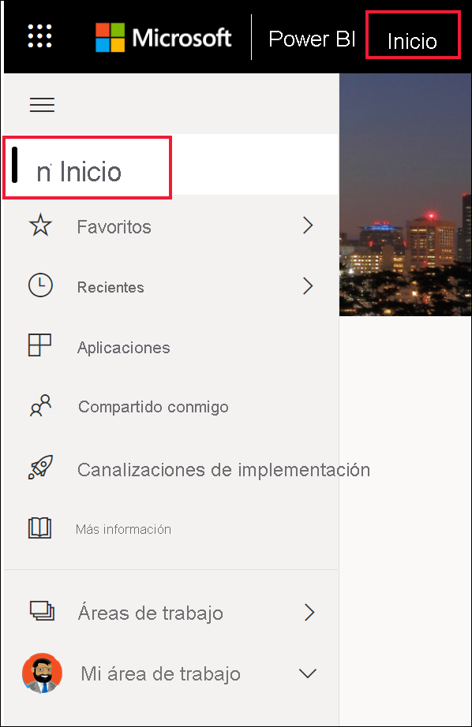
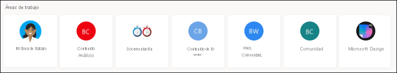
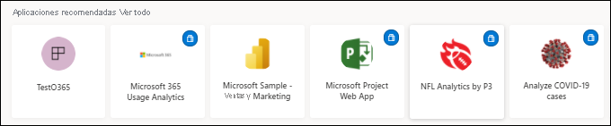
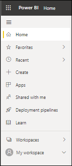
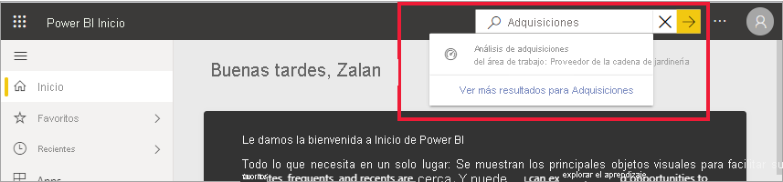

# Búsqueda de paneles, informes y aplicaciones

[!INCLUDE[consumer-appliesto-yynn](../includes/consumer-appliesto-yynn.md)]
En Power BI, el término *contenido* se refiere a aplicaciones, paneles e informes. Los *diseñadores* de Power BI crean el contenido y lo comparten con colegas como usted. El contenido es accesible y visible en el servicio Power BI, donde el mejor lugar para empezar a trabajar es la página **Inicio**.

## Exploración de Inicio de Power BI
Después de iniciar sesión en el servicio Power BI, seleccione **Inicio** en el panel de navegación. 

Power BI muestra el lienzo Inicio, como se muestra en la imagen siguiente. El diseño y el contenido de Inicio son diferentes para cada usuario. Más adelante en este artículo, veremos el lienzo Inicio de un usuario nuevo y de un usuario con mucha experiencia. 
 

Inicio de Power BI ofrece tres formas diferentes de buscar y ver el contenido. Las tres acceden al mismo grupo de contenido, simplemente son maneras distintas de llegar a ese contenido. A veces, la búsqueda es la forma más sencilla y rápida de encontrar algo, mientras que otras, la selección de una *tarjeta* en el lienzo Inicio es la mejor opción.

- En el lienzo Inicio se muestra y organiza el contenido favorito, frecuente, reciente y recomendado, además de las aplicaciones y las áreas de trabajo.  Si no está familiarizado con el servicio Power BI, también tiene a su disposición una sección de introducción. Seleccione una tarjeta o un elemento de una lista para abrirlos.
- A lo largo del lado izquierdo hay un panel de navegación, que se le conoce por este nombre. Seleccionar  para expandir el panel de navegación. En este panel, el mismo contenido se organiza de un modo ligeramente distinto, por Favoritos, Recientes, Aplicaciones y Compartido conmigo. Desde aquí, puede ver listas de contenido y seleccionar la que quiere abrir.
- En la esquina superior derecha, el cuadro de búsqueda global permite buscar contenido por título, nombre o palabra clave.

En los temas siguientes se revisa cada una de estas opciones para buscar y ver contenido.

## Lienzo Página principal
En el lienzo Inicio, puede ver todo el contenido que tiene permiso para usar. El lienzo Inicio también se actualiza con contenido recomendado y recursos de aprendizaje. Al principio, es posible que no haya mucho contenido en el lienzo Inicio, pero eso cambia a medida que se empieza a usar Power BI con los compañeros.

 
A medida que trabaje en el servicio Power BI, recibirá paneles, informes y aplicaciones de compañeros que, finalmente, llenarán la página Inicio de Power BI. Con el tiempo, puede parecerse a la siguiente.

 
En los siguientes temas se examina con más detenimiento el lienzo Inicio para un usuario con experiencia, de arriba a abajo.

## Contenido más importante al alcance de la mano

### Favoritos y frecuentes
Esta sección de la parte superior contiene vínculos al contenido que visita con mayor frecuencia o que ha etiquetado como [destacado o favorito](end-user-favorite.md). Observe que varias tarjetas tienen estrellas negras; se han etiquetado como favoritos. 

Además, puede etiquetar contenido como [destacado](end-user-featured.md). Seleccione el panel o el informe que espera ver más a menudo y establézcalo como contenido *destacado*. Cada vez que abra el servicio Power BI, el panel destacado será el que vea primero. 

### Destacados
La sección **Destacados** incluye contenido que el administrador ha *promocionado a su Inicio*. Normalmente, se trata de contenido que es importante o útil para realizar su trabajo. En este ejemplo, el contenido destacado incluye métricas para supervisar el éxito.

### Recientes, Compartido conmigo y Mis aplicaciones
La siguiente sección es una lista con pestañas. 
- **Recientes** incluye el contenido que ha visitado recientemente. Observe la marca de tiempo de cada elemento. 
- Los colegas comparten aplicaciones con usted, pero también pueden compartir paneles e informes individuales. En la sección **Compartido conmigo**, encontrará paneles e informes que sus compañeros han compartido con usted. 
- En la sección **Mis aplicaciones** aparecen las aplicaciones que se han compartido con usted o que ha [descargado de AppSource](end-user-apps.md); las aplicaciones más recientes se indican aquí. 

### Áreas de trabajo
Cada usuario del servicio Power BI tiene un espacio **Mi área de trabajo**. **Mi área de trabajo** solo incluirá contenido si ha descargado los ejemplos de Microsoft o ha creado o descargado sus propios paneles, informes o aplicaciones. Para muchos *usuarios empresariales*, **Mi área de trabajo** estará y permanecerá vacía. Si es un usuario nuevo, solo tendrá un área de trabajo, **Mi área de trabajo**. 

Y si selecciona esa área de trabajo, la encontrará vacía.

Cada vez que se [descarga una aplicación](end-user-app-marketing.md) o [se comparte una aplicación con usted](end-user-apps.md), se crea una área de trabajo. Con el tiempo, tendrá más de un área de trabajo. Para abrir una *área de trabajo de la aplicación*, selecciónela en el lienzo de Inicio. 

La aplicación se abre en el lienzo y puede ver el nombre del área de trabajo en el panel de navegación. Dentro de las áreas de trabajo, el servicio Power BI separa el contenido por tipo: paneles e informes. En algunos casos, también contendrá libros y conjuntos de datos. Verá esta organización cuando seleccione un área de trabajo. En este ejemplo, el área de trabajo **Cadena de jardinería** contiene cuatro paneles y dos informes.

### Aplicaciones recomendadas
En función de su actividad y la configuración de la cuenta, Power BI muestra un conjunto de aplicaciones recomendadas. Al seleccionar una tarjeta de aplicación se abre ese aplicación. Las aplicaciones con el icono azul son [aplicaciones de plantilla](../connect-data/service-template-apps-overview.md).

 
### Introducción a los recursos de aprendizaje
Los recursos exactos que aparezcan dependen de la actividad, la configuración y el administrador de Power BI. Si es un usuario nuevo, la sección de introducción se muestra en la parte superior de Inicio. Si es un usuario nuevo y ya no desea ver la introducción en la parte superior de Inicio, seleccione **Pin to bottom** (Anclar a la parte inferior).
 
## Exploración del panel de navegación

El panel de navegación clasifica el contenido de forma que le ayude a encontrar lo que necesita rápidamente.  

Use el panel de navegación para buscar paneles, informes y aplicaciones y desplazarse por ellos. A veces, el uso del panel de navegación es la forma más rápida de llegar al contenido. El panel de navegación está ahí al abrir la página de aterrizaje Inicio y permanece ahí mientras se abren otras áreas del servicio Power BI. Se puede seleccionar el icono Ocultar para contraerlo.  .
  
El panel de navegación organiza el contenido en contenedores que son similares a lo que ya ha visto en el lienzo Inicio: Favoritos, Recientes, Aplicaciones, Compartido conmigo y áreas de trabajo. Con los controles flotantes, solo puede ver el contenido más reciente de cada uno de estos contenedores, o bien puede ir a listas de contenido para ver todo el contenido de cada categoría de contenedores.
 
- Para abrir una de estas secciones de contenido y mostrar una lista de todos los elementos, seleccione el encabezado.
- Para ver lo más reciente de cada contenedor, seleccione el control flotante ( **>** ).

    

 
El panel de navegación es otra manera de encontrar el contenido que se quiere rápidamente. El contenido está organizado de forma similar al del lienzo Inicio, aunque se muestra en listas en lugar de en tarjetas. 

## Busque en todo el contenido
A veces, la forma más rápida de encontrar su contenido es buscarlo. Por ejemplo, quizá ha descubierto que un panel que no ha usado durante algún tiempo no aparece en el lienzo Inicio. O puede que recuerde que su colega Aaron compartió algo con usted, pero no recuerda cómo lo llamó ni qué tipo de contenido era, si era un panel o un informe. También, puede que tenga tanto contenido que sea más fácil realizar búsquedas en él que desplazarse u ordenarlo. 
 
El campo de búsqueda se encuentra en la sección superior derecha de la barra de menús de Inicio. Puede escribir el nombre completo o parcial de ese panel y buscarlo. Además, puede escribir el nombre de su compañero y buscar contenido que se haya compartido con usted. La búsqueda se limita para buscar coincidencias en todo el contenido de su propiedad o al que tiene acceso.

## Pasos siguientes
Información general sobre los [Conceptos básicos de Power BI](end-user-basic-concepts.md)

El contenido se muestra como una *tarjeta* o una lista. Las tarjetas tienen un título y un icono. Al seleccionar una tarjeta se abre ese contenido.