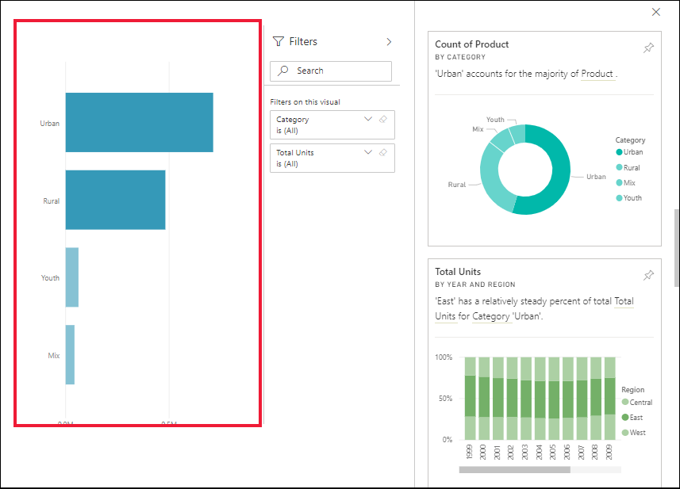

# Visualización de conclusiones de datos en los iconos del panel con Power BI

[!INCLUDE[consumer-appliesto-yyny](../includes/consumer-appliesto-yyny.md)]

Cada [icono](end-user-tiles.md) de objeto visual del panel es una puerta de entrada a la exploración de datos. Cuando se selecciona un icono, se abre un informe o las [Preguntas y respuestas](end-user-q-and-a.md), donde puede filtrar y ordenar, así como profundizar en el conjunto de datos subyacente al informe. Y al extraer información, Power BI realiza la exploración de datos por usted.

Extraiga información para generar objetos visuales interactivos interesantes basados en los datos. Se puede extraer información en un icono de un panel específico e incluso conclusiones a partir de información detallada.

La característica de información se basa en un creciente [conjunto de algoritmos de análisis avanzados](end-user-insight-types.md) desarrollado junto con Microsoft Research, que vamos a seguir usando para que más personas encuentren información en sus datos de formas nuevas e intuitivas.

## Información en un icono del panel
Al extraer información en un icono de panel, Power BI busca solo los datos utilizados para crear ese icono de panel único. 

1. [Abra un panel](end-user-dashboards.md).
2. Mantenga el puntero encima de un icono. Seleccione **Más opciones** (...) y elija **Ver información**. 

    

3. El icono se abre en [modo de enfoque](end-user-focus.md) con las tarjetas de información a la derecha.    
   
        
4. ¿Alguna información capta su interés? Seleccione esa tarjeta de información para profundizar aún más. A la izquierda, se muestra la información seleccionada y, a la derecha, nuevas tarjetas de información, basadas solo en los datos de esa única información.    

 ## Interacción con las tarjetas de información
Una vez que tenga abierta una conclusión, siga explorando.

   * Filtre el objeto visual en el lienzo.  Para mostrar los filtros, en la esquina superior derecha, seleccione la flecha para expandir el panel Filtros.

      
   
   * Información en la propia tarjeta. A esto se le conoce como **información relacionada**. Seleccione una tarjeta de información para activarla. Se moverá a la izquierda del lienzo del informe y, a la derecha, se mostrarán nuevas tarjetas basadas solamente en los datos de esa única tarjeta.
   
      
   
     
Para volver al informe, en la esquina superior izquierda, seleccione **Salir del modo de enfoque**.

## Consideraciones y solución de problemas
- **Ver información** no funciona con todos los tipos de iconos del panel. Por ejemplo, no está disponible para los objetos visuales personalizados de Power BI.<!--[Power BI visuals](end-user-custom-visuals.md)-->

## Pasos siguientes

Ejecutar información detallada en los objetos visuales de informe [mediante la característica de análisis](end-user-analyze-visuals.md)    
Obtenga información acerca de los [tipos de información detallada disponibles](end-user-insight-types.md)

