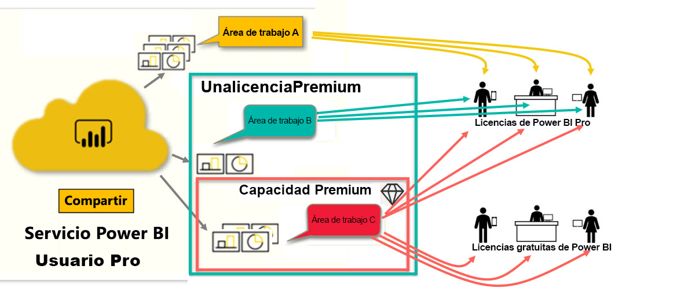

# Tipos de licencias de Power BI
Como *consumidor*, usa el servicio Power BI para explorar informes y paneles con el fin de tomar decisiones empresariales. Si ha estado usando Power BI durante un tiempo o ha estado conversando con sus compañeros *diseñadores*, probablemente haya descubierto que hay algunas características que solo funcionan si tiene un determinado tipo de licencia. 

En este artículo se explican las diferencias entre los tipos de licencia y sus combinaciones: gratuita, Pro, Premium y capacidad Premium. También verá cómo averiguar la combinación de licencias que está usando.  

Para comenzar, nos centraremos en las dos categorías de licencias: licencias por usuario y licencias de organización. Nuestro punto de partida será la funcionalidad predeterminada disponible con las licencias. A continuación, veremos cómo su administrador de Power BI y los propietarios de contenido pueden usar roles y permisos para modificar las capacidades predeterminadas de las licencias. 

Por ejemplo, incluso si una licencia lo permite, el administrador puede limitar la capacidad de hacer cosas, como exportar datos, usar consultas con lenguaje natural en Preguntas y respuestas o publicar en la Web. Y, cuando un *diseñador* de informes asigna contenido a un área de trabajo, puede asignarlo a usted a un rol de área de trabajo. Los roles determinan lo que puede y no puede hacer en esa área de trabajo. El *diseñador* puede ajustar aún más los límites de la licencia mediante la configuración de permisos. En otras palabras... es complicado. Espero que este artículo aclare toda o casi toda la confusión.

## Licencias por usuario
El primer tipo de licencia es una licencia **por usuario**. Cada usuario del servicio Power BI tiene una licencia gratuita o una licencia Pro. Ciertas características están reservadas para los usuarios con licencias Pro.  

- Una **licencia de Power BI Pro** permite a un usuario colaborar con otros usuarios de Pro creando y compartiendo contenido. Solo los usuarios con una licencia Pro pueden publicar informes, suscribirse a paneles e informes y colaborar con compañeros en áreas de trabajo. 

    

    Power BI Pro es una licencia de usuario individual que permite a los usuarios leer e interactuar con los informes y paneles que otros usuarios han publicado en el servicio Power BI. Los usuarios con este tipo de licencia pueden compartir contenido y colaborar con otros usuarios de Power BI Pro. Solo los usuarios de Power BI Pro pueden publicar o compartir contenido con otros usuarios o consumir contenido que han creado otros usuarios. La excepción a esto es el contenido que se hospeda en [capacidad Premium de Power BI](#understanding-premium-and-premium-capacity). Las licencias de Pro suelen utilizarlas los *diseñadores* de informes y los desarrolladores. Para obtener más información, vea la sección sobre la [capacidad Premium de Power BI](#understanding-premium-and-premium-capacity) a continuación.

- **Una licencia gratuita de Power BI independiente**, aunque es práctica, es la que utilizan los usuarios que empiezan a usar Power BI o que crean contenido para ellos mismos. [Regístrese en el servicio Power BI como usuario individual](../service-self-service-signup-for-power-bi.md). Una licencia independiente gratuita no está asociada a una licencia de organización. 

    Una licencia de usuario independiente gratuita es perfecta para alguien que utilice los ejemplos de Microsoft para aprender a usar Power BI. Los usuarios con licencias gratuitas independientes no pueden ver el contenido compartido por otras personas ni compartir su propio contenido con otros usuarios de Power BI. 

    

¿Todo claro hasta el momento?  Aceptar. Vamos a agregar un nivel más, la **capacidad Premium**.

## Descripción de las licencias Premium y capacidad Premium
Premium es una licencia de **organización**. Se puede decir que es como agregar una capa de características y funcionalidad encima de todas las licencias **por usuario** de Power BI de una organización. 

Cuando una organización adquiere una licencia Premium, el administrador suele asignar licencias de Pro a los empleados que van a crear y compartir contenido. Además, el administrador asigna licencias gratuitas a todos los usuarios que vayan a consumir ese contenido. Los usuarios de Pro crean [áreas de trabajo](end-user-workspaces.md) y agregan contenido (paneles, informes, aplicaciones) a esas áreas de trabajo. Para permitir que otros usuarios colaboren en esas áreas de trabajo, los usuarios de Pro usan una combinación de *capacidad*, permisos y roles. 

Cuando una organización adquiere una licencia de capacidad Premium, obtiene capacidad en el servicio Power BI asignada exclusivamente a ella. No se comparte con nadie más. La capacidad es compatible con hardware dedicado totalmente administrado por Microsoft. Las organizaciones pueden aplicar la capacidad que tienen dedicada de forma global o asignarla a áreas de trabajo específicas. Un área de trabajo en una capacidad Premium es un espacio en el que los usuarios de Pro pueden compartir y colaborar con usuarios que tienen una licencia gratuita, sin necesidad de que estos últimos tengan cuentas de Pro.  

En la capacidad Premium, las licencias de Pro siguen siendo necesarias para los diseñadores de contenido. Los diseñadores se conectan a orígenes de datos, modelan los datos y crean paneles e informes que se empaquetan como aplicaciones del área de trabajo. Los usuarios que no tienen una licencia de Pro pueden acceder a un área de trabajo que se encuentre en Power BI Premium, siempre que el contenido esté en una *capacidad* Premium y que el propietario del área de trabajo les dé permiso.

En el diagrama siguiente, el lado izquierdo representa a los usuarios de Pro que crean y comparten contenido en áreas de trabajo.  
- El **área de trabajo A** se creó en una organización que no tiene Premium. 

- El **área de trabajo B** se creó en una organización que tiene una licencia Premium, pero esta área de trabajo en particular no se guardó en la capacidad Premium. El área de trabajo no tiene el icono de diamante.

- El **área de trabajo C** se creó en una organización que tiene una licencia Premium y se guardó en la capacidad Premium. Esta área de trabajo tiene un icono de diamante.  

El *diseñador* de Power BI Pro puede compartir y colaborar con otros usuarios de Pro con cualquiera de las tres áreas de trabajo, siempre que el diseñador comparta el área de trabajo con toda la organización o asigne roles de área de trabajo a los usuarios de Pro. 

El *diseñador* de Power BI Pro solo puede compartir y colaborar con usuarios que tengan una licencia gratuita en el área de trabajo C. El área de trabajo debe estar asignada a la capacidad Premium para que los usuarios con una licencia gratuita puedan tener acceso al área de trabajo. En el área de trabajo, el diseñador asigna roles a los colaboradores: *Administrador*, *Miembro*, *Colaborador* o *Visor*. El rol determina qué acciones puede realizar en el área de trabajo. A los *consumidores* de Power BI se les suele asignar el rol *Visor*. Para obtener más información, vea [Colaboración en áreas de trabajo](end-user-workspaces.md).

## Información sobre qué licencia tiene
Hay varias maneras de encontrar información sobre su licencia de Power BI. 

En primer lugar, averigüe qué licencia de **usuario** posee.

- Algunas versiones de Microsoft Office incluyen una licencia Power BI Pro.  Para ver si su versión de Office incluye Power BI, visite el [portal de Office](https://portal.office.com/account) y seleccione **Suscripciones**.

    Nuestro primer usuario, Pradtanna, tiene Office 365 E5, que incluye una licencia Power BI Pro.

    

    Nuestro segundo usuario, Zalan, tiene una licencia gratuita de Power BI. 

    

A continuación, compruebe si su cuenta tiene también una licencia Premium. Cualquiera de los usuarios anteriores, con licencia de Pro o gratuita, puede pertenecer a una organización que tenga una licencia Premium.  Vamos a comprobarlo con nuestro segundo usuario, Zalan.  

- En el servicio Power BI, seleccione **Mi área de trabajo** y, después, el icono de engranaje en la esquina superior derecha. Seleccione **Administrar almacenamiento personal**.

    

    Las licencias **por usuario**, tanto de Pro como gratuitas, proporcionan 10 GB de almacenamiento en la nube que se pueden usar para hospedar informes de Power BI o libros de Excel. Si ve más de 10 GB, significa que es miembro de una cuenta profesional con una licencia Premium.

    

    Recordemos que, en la página del portal de Office, la suscripción de usuario de Zalan era para Power BI (gratuita), Sin embargo, dado que su organización adquirió una licencia Premium, en el servicio Power BI, Zalan no está limitado a 10 GB de almacenamiento, tiene 100 GB disponibles. Como *consumidor* en una organización con una licencia Premium, siempre y cuando el *diseñador* ponga el área de trabajo en una capacidad Premium, Zalan puede ver el contenido compartido, colaborar con compañeros, trabajar con aplicaciones, etc. La ampliación de sus permisos la establecen su administrador de Power BI y el diseñador del contenido. Tenga en cuenta que un usuario de Pro ya ha compartido un área de trabajo con Zalan. El icono de diamante le permite saber que esta área de trabajo está almacenada en una capacidad Premium. 

   
## Descripción de los roles de un área de trabajo
Hasta ahora, hemos visto las licencias por usuario, las licencias Premium y la capacidad Premium. Echemos un vistazo ahora a los *roles* de un área de trabajo.

Puesto que este es un artículo para *consumidores* de Power BI, tenemos el siguiente escenario:

-  Usted es un usuario con una licencia *gratuita* de una organización que tiene una licencia de Power BI Premium. 
- Un usuario de Power BI Pro ha creado una colección de paneles e informes y la ha publicado como una *aplicación* para toda la organización.  
- Las aplicaciones están en *áreas de trabajo* y el área de trabajo está en una capacidad Premium.    
- El área de trabajo de esta aplicación tiene un panel y dos informes.
- El usuario de Pro nos ha asignado el rol **Visor**.

### Rol Visor
Los roles permiten a los *diseñadores* de Power BI determinar quién puede hacer qué en un área de trabajo para que los equipos puedan colaborar. Uno de estos roles es **Visor**. 

Cuando el área de trabajo está en una capacidad de Power BI Premium, los usuarios con el rol Visor pueden acceder al área de trabajo incluso si no tienen una licencia de Power BI Pro. Sin embargo, dado que el rol Visor no puede tener acceso a los datos subyacentes ni exportarlos, es una forma segura de interactuar con los paneles, los informes y las aplicaciones.

> [!TIP]
> Para obtener información sobre los demás roles (Administrador, Miembro y Colaborador), consulte [Organización del trabajo en las nuevas áreas de trabajo en Power BI](../service-new-workspaces.md).

