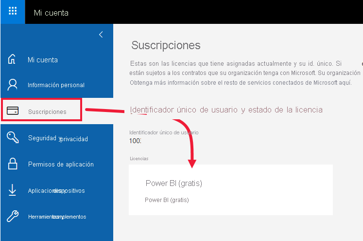
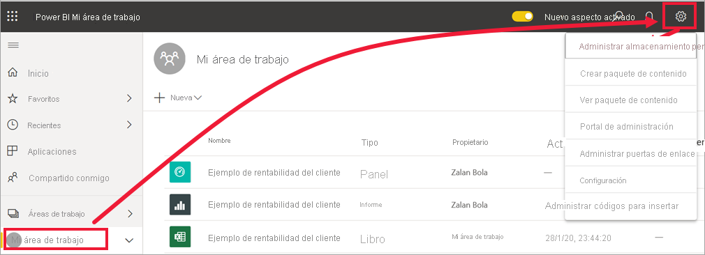
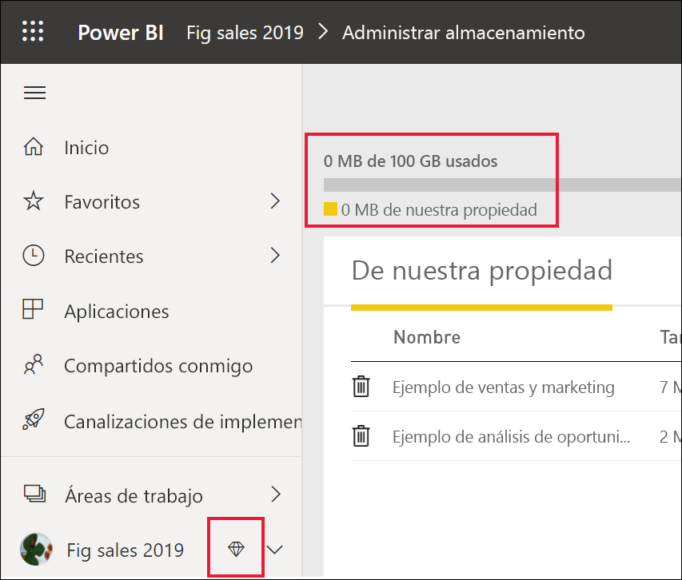
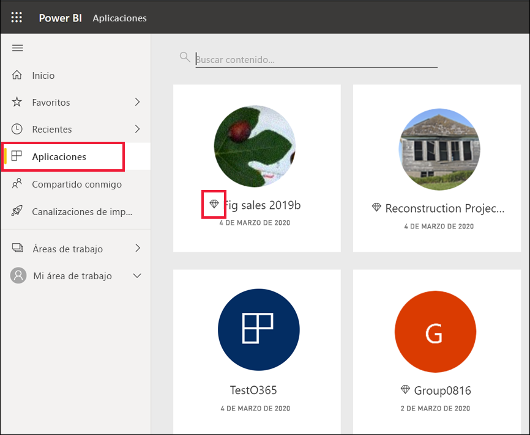
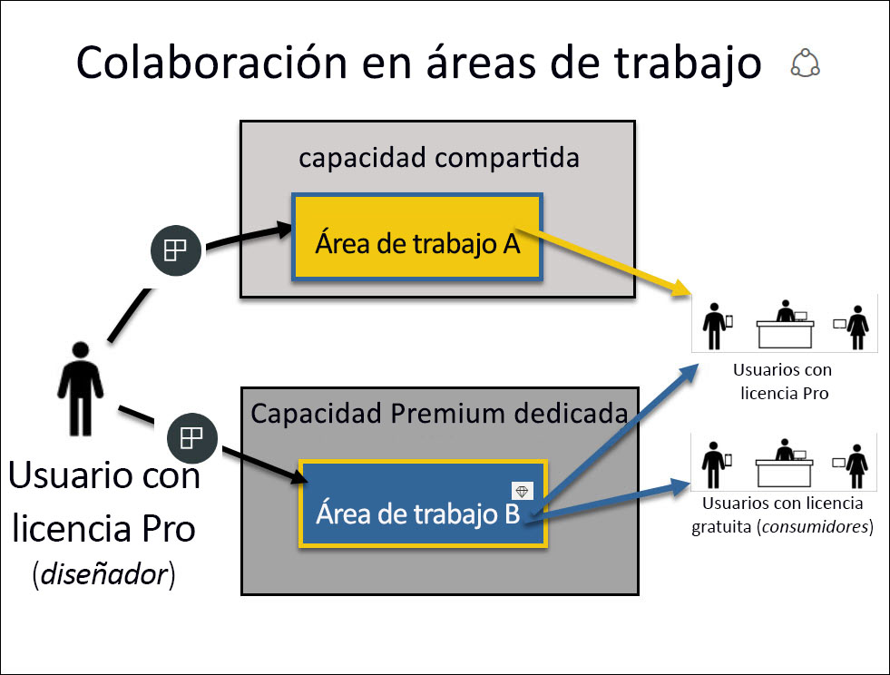

# Licencias y suscripciones para *consumidores*

[!INCLUDE[consumer-appliesto-ynnn](../includes/consumer-appliesto-ynnn.md)]

Como [*consumidor*](end-user-consumer.md), usa el servicio Power BI para explorar informes y paneles con el fin de tomar decisiones empresariales respaldadas por los datos. Si ha estado usando Power BI durante un tiempo o ha estado conversando con sus compañeros *diseñadores*, probablemente haya descubierto que hay algunas características que solo funcionan si tiene un determinado tipo de licencia, suscripción o permiso.

Lo que puede hacer en el servicio Power BI depende de tres cosas:
-    el tipo de licencia y suscripción que está utilizando,
-    el lugar en el que se almacena el contenido y
-    los roles y permisos que tiene asignados.

En este artículo se describen las capacidades de cada tipo de licencia y cómo el *lugar en el que se almacena el contenido* puede repercutir en *lo que puede hacer con él*. También aprenderá a buscar la licencia y la suscripción, y a averiguar dónde se almacena su contenido. Para obtener más información sobre los roles y los permisos, vea [Áreas de trabajo y roles](end-user-workspaces.md).

## Licencias

Cada usuario del servicio Power BI tiene una *licencia gratuita* o una licencia de *Pro*. Si es *consumidor* de Power BI, probablemente esté usando una licencia administrada por su administrador de inquilino de Power BI.

Se puede tener más de una licencia al mismo tiempo.  El servicio siempre le proporcionará una experiencia equivalente a la licencia más permisiva que tenga en cada momento.

## Capacidad Power BI Premium

Premium es una suscripción de la organización que proporciona una forma diferente de almacenar contenido en una capacidad dedicada. Con Premium, todos los usuarios con permisos, ya sea que estén dentro o fuera de la organización, pueden ver el contenido de Power BI sin necesidad de comprar licencias de Power BI Pro individuales. 

Premium permite una amplia distribución de contenido por parte de los usuarios de Pro sin solicitar licencias Pro a los destinatarios que ven el contenido. Las licencias Pro son necesarias para los diseñadores de contenido. Los diseñadores se conectan a orígenes de datos, modelan los datos y crean paneles e informes que se empaquetan como aplicaciones del área de trabajo. Los usuarios sin licencia Pro de todos modos pueden acceder a un área de trabajo que se encuentre en una capacidad de Power BI Premium, siempre y cuando tengan asignado un [rol en esa área de trabajo](end-user-workspaces.md).

Dentro de esas áreas de trabajo, los diseñadores asignan roles, como **espectador**, **colaborador**, **miembro**y **administrador**. Estos roles determinan la medida en la que los compañeros pueden interactuar con el contenido. Para obtener más información, vea [Roles y permisos del área de trabajo](end-user-workspaces.md). 

Vea [¿Qué es Microsoft Power BI Premium?](../admin/service-premium-what-is.md) para obtener más información sobre la capacidad Premium.

## Información sobre las licencias disponibles

Visite [la página **Mi cuenta** de Microsoft](https://portal.office.com/account) para ver qué licencias tiene asignadas.  Seleccione la pestaña **Suscripciones**.

Nuestro primer usuario, Pradtanna, tiene Office 365 E5, que incluye una licencia Power BI Pro.

Nuestro segundo usuario, Zalan, tiene una licencia gratuita de Power BI. 

## Información sobre si tiene acceso a la capacidad Premium

A continuación, compruebe si forma parte de una organización con capacidad Premium. Cualquiera de los usuarios anteriores, con una licencia Pro o gratuita, puede pertenecer a una organización que tenga capacidad Premium.  Vamos a comprobarlo con nuestro segundo usuario, Zalan.  

Podemos determinar si la organización de Zalan tiene capacidad Premium comprobando la cantidad de almacenamiento de la que dispone. 

- En el servicio Power BI, seleccione **Mi área de trabajo** y, después, el icono de engranaje en la esquina superior derecha. Seleccione **Administrar almacenamiento personal**.

    

    Si ve más de 10 GB, significa que es miembro de una organización que tiene una suscripción Premium. En la imagen siguiente se muestra que la organización de Zalan tiene hasta 100 GB de almacenamiento.  

    

Tenga en cuenta que un usuario de Pro ya ha compartido un área de trabajo con Zalan. El icono de diamante indica que esta área de trabajo está almacenada en una capacidad Premium. 

## Identificación del contenido hospedado en la capacidad Premium

Otra forma de averiguar si su organización tiene capacidad Premium es buscar aplicaciones y áreas de trabajo de la aplicación con un icono de diamante. El diamante indica que este contenido está almacenado en una capacidad Premium. 

En la imagen siguiente, tres de las aplicaciones se almacenan en la capacidad Premium.

Como usuario con una licencia gratuita, siempre y cuando el *diseñador* ponga el área de trabajo en una capacidad Premium dedicada, puede ver el contenido compartido, colaborar con compañeros, trabajar con los paneles e informes de la aplicación, etc. **dentro de esa área de trabajo**. La ampliación de sus permisos la establecen el diseñador del contenido y el administrador de Power BI.

## Resumen

Cuando una organización adquiere una suscripción Premium, el administrador suele asignar licencias Pro a los empleados que van a trabajar en dicha capacidad Premium creando y compartiendo contenido. Los usuarios de Pro crean [áreas de trabajo](end-user-workspaces.md) y agregan contenido (paneles, informes, aplicaciones) a esas áreas de trabajo. Para permitir que los usuarios con licencias gratuitas colaboren en esas áreas de trabajo, el administrador o el usuario Pro asigna las áreas de trabajo la *capacidad dedicada*.  

|Tipo de licencia  |Capacidad compartida  |Capacidad dedicada  |
|---------|---------|---------|
|**Gratis**     |  Para su uso como espacio aislado personal en el que poder crear contenido e interactuar con él. Una licencia gratuita es una excelente forma de probar el servicio Power BI. No podrá consumir contenido de otras personas ni compartir contenido1.     |   Interactúe con contenido asignado a la capacidad dedicada y compartido con usted. Los usuarios de licencias gratuitas podrán colaborar con usuarios de Pro sin necesidad de tener una cuenta de Pro.      |
|**Pro**     |  Colabore con otros usuarios de Pro creando y compartiendo contenido.        |  Colabore con usuarios de licencias gratuitas y de Pro creando y compartiendo contenido.       |

1 Vea [Consideraciones y solución de problemas](#considerations-and-troubleshooting).

En el diagrama siguiente, el lado izquierdo representa a los usuarios de Pro que crean y comparten contenido en áreas de trabajo de aplicaciones.

- El **área de trabajo A** se creó en una organización sin capacidad Premium.

- El **área de trabajo B** se creó en una organización con una suscripción Premium. El área de trabajo se guardó en una capacidad dedicada. Esta área de trabajo tiene un icono de diamante.  

    

El *diseñador* de Power BI Pro puede compartir contenido y colaborar con otros usuarios de Pro en cualquiera de las áreas de trabajo, pero con los usuarios de cuentas gratuitas solo puede hacerlo en el área de trabajo B, que se encuentra en una capacidad dedicada Premium.  En el área de trabajo, el diseñador asigna roles a los colaboradores. El rol determina qué acciones puede realizar en el área de trabajo. A los *consumidores* de Power BI se les suele asignar el rol *Visor*. Para obtener más información sobre los roles, vea [Colaboración en áreas de trabajo](end-user-workspaces.md).

## Consideraciones y solución de problemas

- Se puede tener más de una licencia de Power BI. El servicio Power BI siempre le proporcionará una experiencia equivalente a la mejor licencia que tenga en cada momento. Por ejemplo, si tiene una licencia Pro y una gratuita, el servicio Power BI usará la licencia Pro.

- Si desea crear y compartir contenido (paneles, informes, aplicaciones) o abrir contenido que otra persona compartió con usted, debe tener una licencia de usuario de tipo Pro. Puede registrarse para obtener una evaluación gratuita individual de 60 días de Power BI Pro. Seleccione el cuadro de diálogo de actualización que aparece en la servicio Power BI siempre que intente usar una característica de la versión Pro.

    

  Cuando expire el período de evaluación gratuita de 60 días, la licencia volverá a cambiar a una licencia gratuita de Power BI. Después de la licencia cambie, ya no tendrá acceso a las características que requieren una licencia de Power BI Pro. Si quiere continuar con una licencia Pro, póngase en contacto con su administrador o con el departamento de soporte técnico de TI para adquirir una licencia de Power BI Pro. Si no tiene administrador ni departamento de soporte técnico de TI, visite la [página de precios de Power BI](https://powerbi.microsoft.com/pricing/).

- Si se registró para obtener una licencia gratuita por su cuenta mediante la selección de un tipo de botón de *evaluación gratuita*, nunca expirará. De ese modo, si realiza la actualización a una versión de prueba de Pro o su organización le proporciona una licencia de Pro, cuando la versión de prueba finalice o su organización retire su licencia de Pro, seguirá disponiendo de la licencia gratuita y podrá volver a utilizarla, a menos que la cancele.

- 1 Las licencias de usuario gratuitas para el servicio Power BI son ideales para quienes quieran explorarlo o utilizarlo para analizar y visualizar datos personales desde **Mi área de trabajo**. Los usuarios independientes con licencias gratuitas no usan Power BI para colaborar con sus compañeros. Los usuarios independientes con licencias gratuitas no pueden ver el contenido compartido por otras personas ni compartir su propio contenido con otros usuarios de Power BI.

    

## Pasos siguientes

- [¿Soy *consumidor* de Power BI?](end-user-consumer.md)    
- [Más información sobre las áreas de trabajo](end-user-workspaces.md)    
- [Lista de características de Power BI por tipo de licencia](end-user-features.md)
