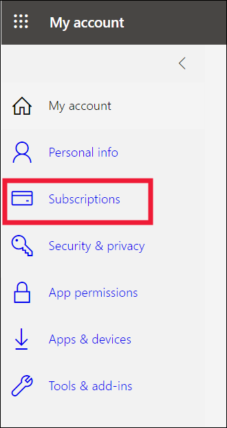

# Licencias y suscripciones para *usuarios empresariales*

[!INCLUDE[consumer-appliesto-ynnn](../includes/consumer-appliesto-ynnn.md)]

Como [*usuario empresarial*](end-user-consumer.md), usa el servicio Power BI para explorar informes y paneles con el fin de tomar decisiones empresariales respaldadas por los datos. Si ha estado usando Power BI durante un tiempo o ha estado conversando con sus compañeros *diseñadores*, probablemente haya descubierto que hay algunas características que solo funcionan si tiene un determinado tipo de licencia, suscripción o permiso.

Lo que puede hacer en el servicio Power BI depende de tres cosas:
-    el tipo de licencia y suscripción que está utilizando,
-    el lugar en el que se almacena el contenido y
-    los roles y permisos que tiene asignados.

En este artículo se describen las capacidades de cada tipo de licencia y cómo el *lugar en el que se almacena el contenido* puede repercutir en *lo que puede hacer con él*. También aprenderá a buscar la licencia y la suscripción, y a averiguar dónde se almacena su contenido. Para obtener más información sobre los roles y los permisos, vea [Áreas de trabajo y roles](end-user-workspaces.md).

## Licencias

Cada usuario del servicio Power BI tiene una licencia *Gratis*, una licencia *Pro* o una licencia *Prémium por usuario**. Si es *usuario empresarial* de Power BI, probablemente esté usando una licencia gratuita administrada por su administrador de Power BI.

Se puede tener más de una licencia al mismo tiempo.  El servicio siempre le proporcionará una experiencia equivalente a la licencia más permisiva que tenga en cada momento.

## Suscripción de la capacidad Power BI Prémium

Prémium es una *suscripción* para organizaciones que proporciona una forma diferente de almacenar contenido: en un contenedor virtual para el que se utiliza el término *capacidad*. Con la capacidad Prémium, todos los usuarios con permisos, con independencia de que estén dentro o fuera de la organización, pueden ver el contenido almacenado en esta capacidad Prémium sin necesidad de comprar licencias individuales de Power BI Pro o Prémium por usuario. 

La capacidad Prémium permite una amplia distribución de contenido por parte de los usuarios de Pro sin solicitar licencias Pro a los destinatarios que ven el contenido. La persona que crea el contenido en la capacidad Prémium usa licencias Pro para conectarse a los orígenes de datos, modelar datos y crear informes y paneles que se guardan en un área de trabajo en la capacidad Prémium. Los usuarios sin licencia Pro de todos modos pueden acceder a un área de trabajo que se encuentre en una capacidad de Power BI Premium, siempre y cuando tengan asignado un [rol en esa área de trabajo](end-user-workspaces.md). Si el propietario del área de trabajo crea una aplicación basada en el contenido de esa área de trabajo, los usuarios que no tienen una licencia Pro todavía pueden ver esa aplicación en la capacidad Prémium, siempre y cuando se les hayan concedido permisos para esa aplicación. 

Dentro de esas áreas de trabajo, los diseñadores asignan roles, como **espectador**, **colaborador**, **miembro** y **administrador**. Estos roles determinan la medida en la que los compañeros pueden interactuar con el contenido. Para obtener más información, vea [Roles y permisos del área de trabajo](end-user-workspaces.md). 

Cuando un diseñador crea y publica una aplicación, concede acceso a todas las organizaciones o usuarios. La medida en la que puede interactuar con el contenido de la aplicación depende de los permisos de acceso específicos que tenga asignados. Por ejemplo, se le puede conceder acceso para ver la aplicación, conectarse a los conjuntos de datos subyacentes, realizar copias de los informes o compartir el contenido.

Vea [¿Qué es Microsoft Power BI Premium?](../admin/service-premium-what-is.md) para obtener más información sobre la capacidad Premium.

## Información sobre las licencias disponibles
Seleccione la imagen de perfil para mostrar la información de la cuenta. Zalan usa una licencia gratuita. Otros tipos de licencias son los siguientes: **Pro** y **Prémium por usuario**. 

Para ver detalles adicionales sobre su cuenta, seleccione **Ver cuenta**. 

<!-- [Your Microsoft **My account** page](https://portal.office.com/account) opens in a new browser tab.  To see what licenses are assigned to you.  Select the tab for  **Subscriptions**.

This first user, Pradtanna, has Office 365 E5, which includes a Power BI Pro license.

This second user, Zalan, has a Power BI free license. 

 

## Find out if you have access to Premium capacity

Next, check to see if you're part of an organization that has Premium capacity. Either of the users above, Pro or free, could belong to an organization that has Premium capacity.  Let's check for our second user, Zalan.  

We can determine whether Zalan's organization has Premium capacity by looking up the amount of storage available. 

- In the Power BI service, select **My workspace** and then select the cog icon from the upper right corner. Choose **Manage personal storage**.

    

    If you see more than 10 GB, then you're a member of an organization that has a Premium subscription. The image below shows that Zalan's organization has up to 100 GB of storage. Zalan, personally, doesn't own 100GB as indicated by the heading **Owned by us**.  

    

    Notice that a Pro user has already shared a workspace with Zalan. The diamond icon shows that this workspace is stored in Premium capacity. 

    If you see any amount of storage, the words **Pro user** next to your name, and the heading **Owned by me**, then you have a Premium per-user license.  

    -->

## Identificación del contenido hospedado en la capacidad Premium

Hay un par de formas de identificar el contenido que se almacena en la capacidad Prémium. Una forma consiste en buscar aplicaciones y áreas de trabajo de la aplicación con el icono de un diamante. El diamante indica que este contenido está almacenado en una capacidad Premium. 

En la imagen siguiente, tres de las aplicaciones se almacenan en la capacidad Premium.

Como usuario con una licencia gratuita, siempre y cuando el *diseñador* ponga el área de trabajo en una capacidad Premium, puede ver el contenido compartido, colaborar con compañeros, trabajar con los paneles e informes de la aplicación, etc. **dentro de esa área de trabajo**. La ampliación de sus permisos la establecen el diseñador del contenido y el administrador de Power BI.

## Resumen

Hay muchas maneras diferentes en que las organizaciones clasifican sus suscripciones y licencias de Power BI. Desde la perspectiva de los *usuarios profesionales*, uno de los escenarios más comunes es cuando una organización adquiere una suscripción Prémium, el administrador asigna licencias Pro a un pequeño grupo de usuarios y todos los demás usuarios trabajan con licencias gratuitas. Normalmente, el administrador asigna las licencias Pro a los empleados que van a crear y compartir contenido. Los usuarios de Pro crean [áreas de trabajo](end-user-workspaces.md) y agregan contenido (paneles, informes, conjuntos de datos y aplicaciones) a esas áreas de trabajo. Para permitir que los usuarios con licencias gratuitas colaboren en esas áreas de trabajo, el administrador o el usuario de Pro asigna las áreas de trabajo a una *capacidad Prémium*.  

|Tipo de licencia  |No en la capacidad Prémium | Capacidad Premium  |
|---------|---------|---------|
|**Gratis**     |  Se usa como espacio aislado personal en el que poder crear contenido e interactuar con él. Una licencia gratuita es una excelente forma de probar el servicio Power BI. No podrá consumir contenido de otras personas ni compartir contenido1.     |   Interactúe con el contenido asignado a la capacidad Premium y compartido con usted. Los usuarios de licencias gratuitas, Prémium por usuario y Pro podrán colaborar sin necesidad de que los usuarios de licencias gratuitas tengan cuentas Pro.      |
|**Pro**     |  Colabore con usuarios de licencias Prémium por usuario y Pro creando y compartiendo contenido.        |  Colabore con usuarios de licencias gratuitas, Prémium por usuario y Pro creando y compartiendo contenido.       |

1 Vea [Consideraciones y solución de problemas](#considerations-and-troubleshooting).

En el diagrama siguiente, el lado izquierdo representa a los usuarios de Pro que crean y comparten contenido en áreas de trabajo de aplicaciones.

- El **área de trabajo A** no se creó en una capacidad Prémium.

- El **área de trabajo B** sí se creó y guardó en una capacidad Prémium. Esta área de trabajo tiene un icono de diamante.  

    

El *diseñador* de Power BI Pro puede compartir contenido y colaborar con otros usuarios de Pro en cualquiera de las áreas de trabajo, pero, en el caso de los usuarios de cuentas gratuitas, solo puede hacerlo en el área de trabajo B, que se encuentra en una capacidad Premium.  En el área de trabajo, el diseñador asigna roles a los colaboradores. El rol determina qué acciones puede realizar en el área de trabajo. A los *usuarios empresariales* de Power BI se les suele asignar el rol *Visor*. Para obtener más información sobre los roles, vea [Áreas de trabajo para usuarios empresariales de Power BI](end-user-workspaces.md).

## Consideraciones y solución de problemas

- Se puede tener más de una licencia de Power BI. El servicio Power BI siempre le proporcionará una experiencia equivalente a la mejor licencia que tenga en cada momento. Por ejemplo, si tiene una licencia Pro y una gratuita, el servicio Power BI usará la licencia Pro.

- Si desea crear y compartir contenido (paneles, informes, aplicaciones) o abrir contenido que otra persona compartió con usted, debe tener una licencia de usuario Pro o Prémium por usuario. Puede registrarse para obtener una evaluación gratuita individual de 60 días de Power BI Pro. Seleccione el cuadro de diálogo de actualización que aparece en la servicio Power BI siempre que intente usar una característica de la versión Pro.

    

  Cuando expire el período de evaluación gratuita de 60 días, la licencia volverá a cambiar a una licencia gratuita de Power BI. Después de la licencia cambie, ya no tendrá acceso a las características que requieren una licencia de Power BI Pro. Si quiere continuar con una licencia Pro, póngase en contacto con su administrador o con el departamento de soporte técnico de TI para adquirir una licencia de Power BI Pro. Si no tiene administrador ni departamento de soporte técnico de TI, visite la [página de precios de Power BI](https://powerbi.microsoft.com/pricing/).

- Si se registró para obtener una licencia gratuita por su cuenta mediante la selección de un tipo de botón de *evaluación gratuita*, nunca expirará. De ese modo, si realiza la actualización a una versión de prueba de Pro o su organización le proporciona una licencia de Pro, cuando la versión de prueba finalice o su organización retire su licencia de Pro, seguirá disponiendo de la licencia gratuita y podrá volver a utilizarla, a menos que la cancele.

- 1 Las licencias de usuario gratuitas para el servicio Power BI son ideales para quienes quieran explorarlo o utilizarlo para analizar y visualizar datos personales desde **Mi área de trabajo**. Los usuarios independientes con licencias gratuitas no usan Power BI para colaborar con sus compañeros. Los usuarios independientes con licencias gratuitas no pueden ver el contenido compartido por otras personas ni compartir su propio contenido con otros usuarios de Power BI.

## Pasos siguientes

- [¿Soy un *usuario empresarial* de Power BI?](end-user-consumer.md)    
- [Más información sobre las áreas de trabajo](end-user-workspaces.md)    
- [Características de usuarios empresariales de Power BI por tipo de licencia](end-user-features.md)
