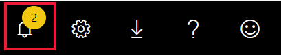
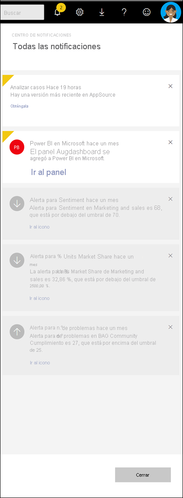

# Visualización de notificaciones de Power BI

[!INCLUDE[consumer-appliesto-yynn](../includes/consumer-appliesto-yynn.md)]

El servicio Power BI realiza un seguimiento de los eventos que se han producido desde la última vez que inició sesión. Por ejemplo, las actualizaciones de las aplicaciones, las alertas que se han desencadenado en los paneles, información sobre eventos y reuniones de Power BI, y el nuevo contenido que se ha agregado a las áreas de trabajo. En el *centro de notificaciones* se guarda una lista secuencial de estos eventos. 

Cuando lo tenga todo listo para revisar las notificaciones, seleccione el icono de campana  . La notificación que aparece más arriba es la más reciente. Los elementos vistos se muestran en gris, y los no vistos están resaltados y tienen una esquina amarilla.   

Vea cómo Amanda revisa, administra y responde a las notificaciones. Luego, siga las instrucciones que encontrará debajo del video para intentarlo usted.    

> [!NOTE]
> En este vídeo se muestra una versión anterior del servicio Power BI. 

<iframe width="560" height="315" src="https://www.youtube.com/embed/bZMSv5KAlcE" frameborder="0" allowfullscreen></iframe>

## Visualización de las notificaciones
Cuando inicie sesión en Power BI, las notificaciones nuevas que haya recibido mientras estaba sin conexión se habrán agregado a su fuente. Si tiene notificaciones nuevas, Power BI mostrará una burbuja amarilla con el número de elementos nuevos encima del icono del centro de notificaciones. Como el centro de notificaciones forma parte de la barra de menús superior del servicio Power BI, puede abrir las notificaciones desde la mayoría de las áreas del servicio Power BI, entre ellas las siguientes: Inicio, Recientes, los paneles, los informes, las aplicaciones, las áreas de trabajo, y la pantalla Preguntas y respuestas de Power BI.

Las notificaciones se le envían por diversos motivos y, a menudo, también recibirá una notificación por correo electrónico en los siguientes casos: 
- Cuando se actualiza una aplicación y está disponible la versión más reciente.
- Cuando se agrega nuevo contenido (por ejemplo, un panel o un informe) a un área de trabajo.
- Cuando se desencadena [una alerta](end-user-alerts.md) (las alertas se pueden establecer en el servicio Power BI y también en las aplicaciones móviles de Power BI).
- y mucho más...

   
1. En la barra de menús del servicio Power BI, seleccione el icono de campana. En este ejemplo, el usuario tiene dos notificaciones nuevas desde la última vez que abrió el centro de notificaciones.
   
   
2. La notificación más reciente se muestra en la parte superior y los mensajes no leídos se presentan resaltados. Las notificaciones se conservan durante 90 días a menos que las elimine antes o alcancen el límite máximo de 100.
   
   

3. Lea la notificación y proceda como convenga. La mayoría de las notificaciones contienen uno o varios vínculos activos.  En la del ejemplo siguiente hay un vínculo a un panel.

   

1. Cuando ya no necesite una notificación, descártela seleccionando el icono X.    

 
## Procedimiento para cancelar una notificación
El servicio Power BI envía algunas notificaciones automáticamente. Otras las crean sus compañeros o usted mismo. Todas las notificaciones se pueden eliminar del centro de notificaciones antes o después de haberlas leído. Sin embargo, si recibe ciertas notificaciones con demasiada frecuencia, o simplemente no necesita más esa información, hay algunas formas de cancelar el envío. 

En el caso de las notificaciones creadas por usted o sus compañeros, puede cancelarlas sin eliminar el contenido al que hacen referencia. Por ejemplo, para dejar de recibir una alerta cada vez que el total de ventas diarias supere los 100 USD, [edite o cancele la alerta](end-user-alerts.md) en el panel. Si su compañero creó la notificación de alerta, póngase en contacto con esa persona y pídale que la elimine.

## Pasos siguientes
* [Alertas de datos en el servicio Power BI](end-user-alerts.md)
* [Establecer alertas de datos en la aplicación de iPhone (Power BI para iOS)](mobile/mobile-set-data-alerts-in-the-mobile-apps.md)
* [Establecer alertas de datos en la aplicación móvil de Power BI para Windows 10](mobile/mobile-set-data-alerts-in-the-mobile-apps.md)
* ¿Tiene más preguntas? [Pruebe la comunidad de Power BI](https://community.powerbi.com/)

