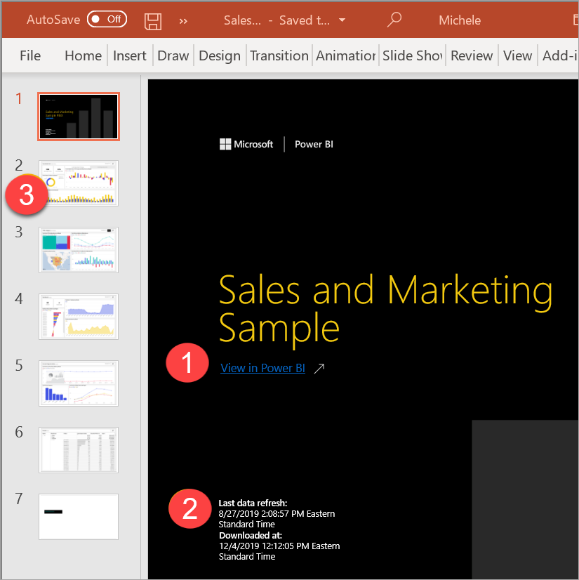

# Exportación de informes a PowerPoint

[!INCLUDE[consumer-appliesto-yynn](../includes/consumer-appliesto-yynn.md)]

Con el servicio Power BI (app.powerbi.com), puede publicar el informe en Microsoft PowerPoint y crear fácilmente una presentación de diapositivas basada en el informe de Power BI. Cuando se exporta a PowerPoint, ocurre lo siguiente:

* Cada página del informe de Power BI se convierte en una diapositiva de PowerPoint.
* Cada página del informe de Power BI se exporta como una única imagen de alta resolución en PowerPoint.
* Puede conservar la configuración de los filtros y las segmentaciones que ha agregado al informe.
* Se crea un vínculo en PowerPoint que dirige de nuevo al informe de Power BI.

Exportar su **informe de Power BI** a **PowerPoint** es muy fácil. Siga los pasos descritos en la sección siguiente.

También puede copiar un solo objeto visual cada vez desde el servicio Power BI y pegarlo en PowerPoint (o en cualquier otro programa que admita pegar). Seleccione el icono **Copiar como imagen** para copiar el objeto visual en el portapapeles. Después, abra PowerPoint y pegue el objeto visual. Para obtener más información, vea el artículo sobre cómo [copiar objetos visuales como imágenes estáticas](../visuals/power-bi-visualization-copy-paste.md).

## Exportación del informe de Power BI a PowerPoint
En el **servicio Power BI**, seleccione un informe para mostrarlo en el lienzo. También puede seleccionar un informe de **Inicio**, **Aplicaciones** o de cualquier otro contenedor del panel de navegación.

[!INCLUDE [power-bi-service-new-look-include](../includes/power-bi-service-new-look-include.md)]

Cuando el informe que quiere exportar a PowerPoint aparezca en el lienzo, seleccione **Archivo** > **Exportar a PowerPoint** en la barra de menús.

Aparece una ventana emergente en la que tiene la opción de seleccionar los **Valores actuales** o los **Valores predeterminados**. Los **valores actuales** exportan el informe en el estado actual, lo que incluye los cambios activos que haya realizado en los valores de filtro o segmentación.  La mayoría de los usuarios seleccionan esta opción. Si se ha desplazado, **Valores actuales** no incluye el estado de desplazamiento del objeto visual, sino que exporta la parte superior de los datos. Como alternativa, al seleccionar **Valores predeterminados** se exporta el informe en el estado original, como lo haya compartido el *diseñador*, y no se reflejan los cambios que haya realizado al estado original.

 
Además, hay una casilla para seleccionar si se quieren exportar o no las pestañas ocultas de un informe. Seleccione esta casilla si solo quiere exportar las pestañas del informe que son visibles para usted en el explorador. Si prefiere incluir todas las pestañas ocultas como parte de la exportación, deje desactivada esta casilla. Si la casilla aparece atenuada, significa que no hay ninguna pestaña oculta en el informe. Un ejemplo de una pestaña oculta sería una pestaña de información sobre herramientas. La [información sobre herramientas personalizada](../create-reports/desktop-tooltips.md) la crean los *diseñadores* de informes y no se muestran como pestañas de informes en el servicio Power BI para los *usuarios empresariales*. 

También puede optar por exportar solo la página que esté viendo de un informe activando la opción **Exportar solo la página actual**.  De forma predeterminada, esta opción está desactivada y se exportarán todas las páginas del informe.

Seleccione **Exportar** para continuar cuando haya realizado las selecciones. Verá un banner de notificación en la esquina superior derecha de la ventana del explorador del servicio Power BI que indica que el informe se está exportando a PowerPoint. 

La exportación puede tardar unos minutos. Entre los factores que pueden afectar al tiempo requerido está la estructura del informe y la carga actual del servicio Power BI. Puede continuar trabajando en Power BI mientras se exporta el informe.

Cuando el servicio Power BI haya terminado el proceso de exportación, el banner de notificación cambiará para informarle. El archivo está disponible donde el explorador muestra los archivos descargados. En la siguiente imagen, se muestra como un banner de descarga en la parte inferior de la ventana del explorador.

Y eso es todo. Puede descargar el archivo, abrirlo con PowerPoint y, después, modificarlo o mejorarlo, tal como lo haría con cualquier otra presentación de PowerPoint.

## Apertura del archivo de PowerPoint
Al abrir el archivo de PowerPoint que exportó Power BI, encontrará unos cuantos elementos útiles e interesantes. Eche un vistazo a la siguiente imagen y desproteja los elementos numerados que describen algunas de esas características interesantes. Las páginas de PowerPoint siempre se crean en el tamaño estándar 16:9, sin tener en cuenta los tamaños de página ni las dimensiones originales del informe de Power BI.

1. La primera página de la presentación de diapositivas incluye el nombre del informe y un vínculo para que pueda **Ver en Power BI** el informe en el que se basa la presentación de diapositivas.
2. También obtendrá información útil sobre el informe. **Última actualización de datos** muestra la fecha y la hora en las que se basa el informe exportado. **Descargado en** muestra la fecha y la hora en las que se ha exportado el informe de Power BI a un archivo de PowerPoint. El tiempo de **Descargado en** se establece en la zona horaria del equipo en el momento de la exportación.

3. Cada página del informe es una diapositiva independiente, tal como se muestra en el panel de navegación. 
4. El informe publicado se representa en el idioma configurado en Power BI, o de acuerdo con el valor de configuración regional del explorador. Para ver o configurar las preferencias de idioma en el explorador, seleccione el icono de engranaje  > **Configuración** > **General** > **Idioma**. Para obtener información sobre la configuración regional, consulte [Idiomas y países o regiones compatibles con Power BI](../fundamentals/supported-languages-countries-regions.md).

Cuando vea una diapositiva individual, observará que cada página del informe es una imagen independiente. El desplazamiento en PowerPoint no está disponible, ya que cada diapositiva es una imagen estática.

Lo que haga con la presentación de PowerPoint a partir de este punto, o con cualquiera de las imágenes de alta resolución, ya es su decisión.

## Consideraciones y solución de problemas
Hay algunas consideraciones y limitaciones a tener en cuenta al trabajar con la característica **Exportar a PowerPoint**.
 

* Si no ve la opción **Exportar**, asegúrese de que ha activado "Nuevo aspecto" y de que está viendo un informe (no un panel).

    

* Actualmente no se respetan los [filtros de las direcciones URL](../collaborate-share/service-url-filters.md) al elegir **Valores actuales** para la exportación.

* Al exportar a PowerPoint, si el informe usa una fuente personalizada, esa fuente se reemplazará por una predeterminada.

* No se admiten los siguientes tipos de objetos visuales y no se exportarán a PowerPoint:
   - No se admiten los [objetos visuales personalizados que no se hayan certificado](../developer/visuals/power-bi-custom-visuals-certified.md). 
   - El [objeto visual de ESRI ArcGIS](../visuals/power-bi-visualizations-arcgis.md) no se admite.
   - No se admiten los objetos visuales de R ni de Python.
   - Las imágenes de fondo se recortan con el área de límite del gráfico. Se recomienda quitar las imágenes de fondo antes de realizar la exportación a PowerPoint.

* Algunos informes no se pueden exportar. Estas incluyen:
    - Si se comparte un panel con alguien de fuera de su organización y, por lo tanto, con un usuario que no está en su inquilino de Power BI, ese usuario no podrá exportar a PowerPoint los informes asociados del panel compartido. Por ejemplo, si es aaron@contoso.com, puede compartir con david@cohowinery.com. Pero david@cohowinery.com no puede exportar los informes asociados a PowerPoint.
    - Informes con más de 50 páginas. Solo se exportarán las 50 primeras páginas.
    - Los informes exportados a versiones anteriores de PowerPoint.
    - Los informes que tardan más de una hora en procesarse. 
    - Las páginas de informes que tardan más de 6 minutos en cargarse. 

* Si el elemento de menú **Exportar a PowerPoint** no está disponible en el servicio Power BI, probablemente se deba a que el administrador de Power BI o el propietario del informe haya deshabilitado la característica. Póngase en contacto con el administrador o el propietario para obtener más información.
* El servicio Power BI utiliza su propia configuración de idioma como idioma para la exportación de PowerPoint. Para ver o configurar las preferencias de idioma en el explorador, seleccione el icono de engranaje  > **Configuración** > **General** > **Idioma**.

## Pasos siguientes
[Copiar objetos visuales como imágenes estáticas](../visuals/power-bi-visualization-copy-paste.md)    
[Imprimir un informe](end-user-print.md)
