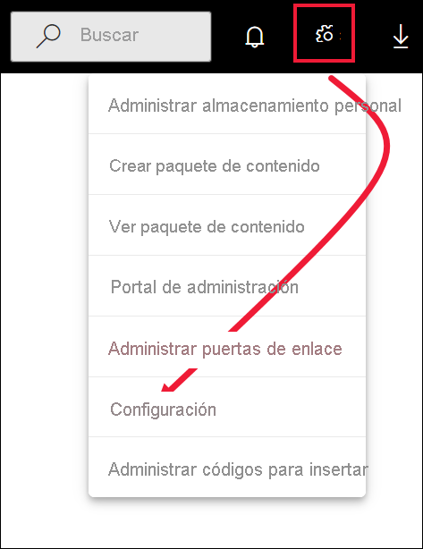
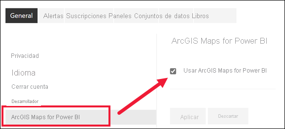

# Participación en las características en vista versión preliminar del servicio Power BI

[!INCLUDE[consumer-appliesto-yynn](../includes/consumer-appliesto-yynn.md)]

## ¿Qué son las *características de vista previa*?
A medida que se realizan mejoras en el servicio Power BI, se publican algunas funcionalidades nuevas como *características en versión preliminar*. Las características de vista previa se pueden activar y desactivar, lo que le ofrece la oportunidad de probarlas.

Algunas características en versión preliminar se pueden activar y desactivar desde el panel de Power BI, Inicio o el propio informe. Por su parte, hay otras características en versión preliminar disponibles en el menú *Configuración*. En este artículo se muestra cómo acceder a las características en versión preliminar a través del menú Configuración.

## Busque versiones preliminares y actívelas (o desactívelas)
1. Abra el menú Configuración al seleccionar el icono de engranaje de la esquina superior derecha de la pantalla de Power BI y seleccione **Configuración**.
   
   .
2. Seleccione la pestaña **General**. Si existen versiones preliminares, verá una opción para **Características de versión preliminar** o verá una característica de versión preliminar a la izquierda.  En este ejemplo, hay una característica de versión preliminar de ArcGIS Maps. 
   
   
3. Seleccione el botón de opción **Activar**, o marque la casilla, para probar la nueva experiencia. Luego, seleccione **Aplicar**.
4. Para desactivar las características en versión preliminar, siga los pasos 1 a 3 anteriores y, en el paso 3, seleccione **Desactivar** o desactive la casilla y seleccione **Aplicar**.

¿Tiene preguntas o comentarios? [Visite el foro de la comunidad de Power BI](https://community.powerbi.com/t5/Navigation-Preview-Forum/bd-p/NavigationPreview).

