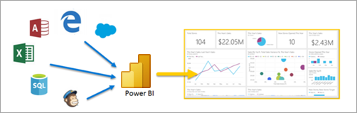
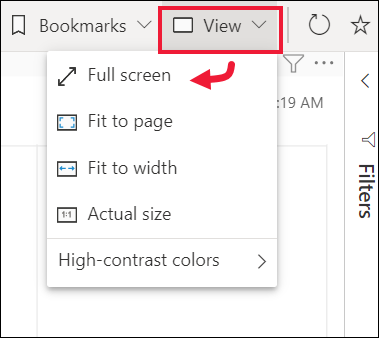

# Inicio rápido: más información sobre las funcionalidades de Power BI para *usuarios empresariales*

[!INCLUDE[consumer-appliesto-ynny](../includes/consumer-appliesto-ynny.md)]

En esta guía de inicio rápido obtendrá información sobre cómo interactuar con Power BI para detectar información empresarial basada en datos. La información del artículo no pretende ser exhaustiva, sino un resumen rápido de muchas de las acciones disponibles para los **usuarios empresariales** de Power BI.

Si no está registrado en Power BI, [regístrese para obtener una evaluación gratuita](https://app.powerbi.com/signupredirect?pbi_source=web) antes de empezar.

## ¿Qué es Power BI? 
Power BI es una colección de servicios de software, aplicaciones y conectores que funcionan conjuntamente para convertir orígenes de datos sin relación entre sí en información coherente, interactiva y atractiva visualmente. Tanto si se trata de una sencilla hoja de cálculo de Excel como de una colección de diferentes orígenes de datos, Power BI le permite conectar fácilmente los orígenes de datos, visualizar (o descubrir) lo más importante y compartirlo con quien quiera. 

Solo tiene que abrir el servicio Power BI en un explorador o un dispositivo móvil. Tanto sus compañeros como usted trabajarán desde los mismos paneles, aplicaciones e informes, que se actualizan automáticamente, por lo que siempre estará trabajando con el contenido más actualizado.   

## Vista de lectura
Existen dos modos de interactuar con los informes en el servicio Power BI: la vista de lectura y la vista de edición.  Si es *usuario empresarial*, es más probable que use la vista de lectura para consumir informes creados por otros usuarios. La vista de edición la usan los *diseñadores* de informes, que crean los informes y los comparten con usted. La vista de lectura es la manera de explorar e interactuar con los informes creados por otros compañeros. 

Incluso en la vista de lectura, el contenido no es estático. Puede profundizar en él, buscar tendencias, información útil y emplear otras técnicas de inteligencia empresarial. Segmente y desglose el contenido e incluso haga búsquedas en él formulando preguntas con sus propias palabras. O bien, deje que los datos le revelen información interesante, le envíen alertas cuando cambien los datos y le envíen informes por correo según la programación que haya configurado. Todos los datos, en cualquier momento, en la nube o de forma local, desde cualquier dispositivo. 

Siga leyendo para obtener más información sobre ellas y muchos más aspectos.

## Contenido de Power BI
Cuando usamos el término "contenido" en Power BI, hacemos referencia a informes, paneles y aplicaciones. Estos son los bloques de creación que usará para explorar los datos y tomar decisiones empresariales. 

> [!NOTE]
> Los paneles, los informes y las aplicaciones también se pueden ver y compartir en dispositivos móviles.

###  Aplicaciones

Una *aplicación* es un tipo de contenido de Power BI que combina paneles e informes relacionados en un mismo lugar. Una aplicación puede tener uno o más paneles e informes, todos ellos agrupados. Las aplicaciones las crean *diseñadores* de Power BI que distribuyen y comparten las aplicaciones con otros *usuarios empresariales*. 

Una manera de ver las aplicaciones es seleccionar **Aplicaciones** en el panel de navegación y elegir una aplicación para abrirla.

Para obtener más información sobre cómo ver aplicaciones, consulte [Aplicaciones de Power BI](end-user-apps.md).

### Informes

Un informe de Power BI es una vista de varias perspectivas de un conjunto de datos, con objetos visuales que representan diferentes hallazgos y conclusiones de ese conjunto de datos. Un informe puede tener un solo objeto visual o páginas llenas de objetos visuales. Los informes los crean *diseñadores* de Power BI que distribuyen y comparten los informes con otros *usuarios empresariales*.

Para obtener información sobre cómo ver informes, consulte [Informes de Power BI](end-user-reports.md).

### Paneles

Un panel de Power BI tiene una sola página, a menudo denominada lienzo, que usa visualizaciones para contar una historia. Dado que se limita a una sola página, un panel bien diseñado contiene únicamente los elementos más importantes de esa historia.

Las visualizaciones que se ven en el panel se denominan iconos y los *diseñadores* del informe se encargan de anclarlas al panel. En la mayoría de los casos, al seleccionar un icono, accede a la página del informe donde se ha creado la visualización. 

Para obtener información sobre cómo ver los paneles, consulte [Paneles de Power BI](end-user-dashboards.md).
 
## Interactuación en el servicio Power BI

### Colaboración con compañeros
Deje de lado el correo electrónico. Agregue un comentario personal o empiece una conversación con compañeros sobre un panel desde el propio panel. La característica de comentarios es solo una de las formas que tiene de colaborar con otros. 

Obtenga información sobre los [comentarios](end-user-comment.md).

### Dejar que Power BI trabaje por el usuario
Dos de las formas en las que el servicio Power BI trabaja es con las suscripciones y las alertas. 

#### Suscribirse a un panel (o un informe)
No es necesario abrir Power BI para supervisar un panel.  En su lugar, puede suscribirse a él y Power BI le enviará una instantánea de dicho panel en un período establecido. 

 Obtenga más información sobre las [suscripciones de Power BI](end-user-subscribe.md).

#### Obtención de alertas cuando los datos alcanzan un umbral
Los datos están activos y los objetos visuales se actualizan automáticamente para reflejarlo. Si quiere recibir una notificación cuando los datos cambien por encima o por debajo de un umbral establecido, use las alertas de datos. Las alertas funcionan en medidores, KPI y tarjetas.    

Power BI le envía un correo electrónico cuando el valor aumente o disminuya más allá del límite que establezca.  

Obtenga más información sobre las [alertas de Power BI](end-user-alerts.md).

### Use Preguntas y respuestas para realizar preguntas con lenguaje natural
A veces, la manera más rápida de obtener una respuesta de sus datos es formular una pregunta con un lenguaje natural. El cuadro de pregunta de Preguntas y respuestas disponible en la parte superior del panel. Por ejemplo, "Mostrarme el recuento de las grandes oportunidades por fase de ventas como un embudo". 

Obtenga más información sobre [Preguntas y respuestas de Power BI](end-user-q-and-a.md).

### Consulta de los detalles de una visualización
Los objetos visuales están compuestos por puntos de datos y, al mantener el mouse sobre un punto de datos, puede ver los detalles.

### Agregar un panel a Favoritos
Al marcar contenido como *favorito*, puede acceder a él desde el panel de navegación y desde [Inicio](end-user-home.md). El panel de navegación es visible desde casi todas las áreas del servicio Power BI. Los favoritos suelen ser los paneles, las páginas de informe y las aplicaciones que consulta con más frecuencia.

Para guardar el contenido como favorito, en la esquina superior derecha del servicio Power BI, seleccione el icono de estrella. 
   

Para ver los favoritos, seleccione **Favoritos** en el panel de navegación.

Eche un vistazo a las demás acciones disponibles en la barra de menús.  En este artículo no se tratan todas ellas, pero se explican en otros artículos.  Obtenga más información con la tabla de contenido de Power BI o el campo **Buscar**. 

Obtenga más información sobre los [favoritos y el contenido destacado](end-user-favorite.md).

### Ajustar las dimensiones de pantalla
Los informes se ven en muchos dispositivos diferentes, con diferentes tamaños de pantalla y relaciones de aspecto.  La representación predeterminada quizá no sea la que quiere ver en el dispositivo.  

Para ajustarla, en la barra de menús superior derecha, seleccione el icono de **Vista** y elija una de las opciones de presentación. 

### Visualización de la interconexión de los objetos visuales de una página
Realice un resaltado cruzado y un filtrado cruzado de las visualizaciones relacionadas en la página de un informe. Las visualizaciones en una única página del informe están todas "conectadas" entre sí.  Esto significa que si selecciona uno o varios valores en una visualización, otras visualizaciones que usan el mismo valor cambiarán en función de esa selección.

> 

Obtenga más información sobre las [interacciones de objetos visuales](end-user-interactions.md).

<!-- ###  Open the **Selection** pane
Easily navigate between the visualizations on the report page. 

1. Select **View > Selection pane** to open the Selection pane. Toggle **Selection pane** to On.

    

2. The Selection pane opens on your report canvas. Select a visual from the list to make it active.

     -->

### Acercar la imagen en objetos visuales individuales
Mantenga el puntero sobre un objeto visual y seleccione el icono **Modo de enfoque** . Cuando se ve una visualización en el modo de enfoque, se expande para ocupar todo el lienzo de informes como se puede ver aquí abajo.

Para mostrar esa misma visualización sin la distracción de las barras de menús, del panel de filtros y otros adornos, seleccione **Pantalla completa** de la barra de menús de la parte superior.   

Obtenga más información sobre el [modo de enfoque y el modo de pantalla completa](end-user-focus.md).

### Ordenar una visualización
Los objetos visuales en una página de informe pueden organizarse y guardarse con los cambios aplicados. 

Mantenga el puntero sobre un objeto visual para activarlo y seleccione **Más opciones** (...) para abrir las opciones de ordenación.

 

Obtenga más información sobre la [ordenación de objetos visuales](end-user-search-sort.md).

### Mostrar los datos utilizados para crear una visualización
Una visualización de Power BI se construye con datos provenientes de los conjuntos de datos subyacentes. Si quiere ver lo que sucede en segundo plano, Power BI le permite *mostrar* los datos que se usan para crear el objeto visual. Cuando se selecciona **Mostrar como tabla**, Power BI muestra los datos que están situados debajo de la visualización o junto a esta.

Con un objeto visual activo, seleccione **Más opciones** (...) y elija **Mostrar datos**.
   
   

### Exportación de datos a Excel
Además de mostrar los datos que se usan para crear un objeto visual, también puede exportar los datos y verlos en Microsoft Excel. Al exportar a Excel, está creando un documento independiente, una hoja de cálculo que no forma parte de Power BI. Los cambios que realice en el archivo de Excel no afectarán a los datos de Power BI. Tanto si quiere examinar los datos más detenidamente como si quiere usarlos en otra aplicación o con otros fines, Power BI le proporciona esa flexibilidad.

<!-- Exporting isn't limited to individual visuals; you can export entire reports to PowerPoint or PDF to share with your colleagues.

 -->

Aquí finaliza esta introducción rápida a algunas de las acciones que pueden realizar los *usuarios empresariales* con el servicio Power BI.  

## Limpieza de recursos
- Si se conecta a una aplicación, en el panel de navegación, seleccione **Aplicaciones** para abrir la lista de contenido de las aplicaciones. Mantenga el puntero sobre la aplicación que desea eliminar y seleccione el icono de Papelera.

- Si ha importado un informe de ejemplo de Power BI, o se ha conectado a uno, abra **Mi área de trabajo** en el panel de navegación. Busque el panel, informe y conjunto de datos mediante las pestañas de la parte superior, y seleccione el icono de Papelera de cada uno.

## Pasos siguientes
[Power BI para usuarios empresariales](end-user-consumer.md)

