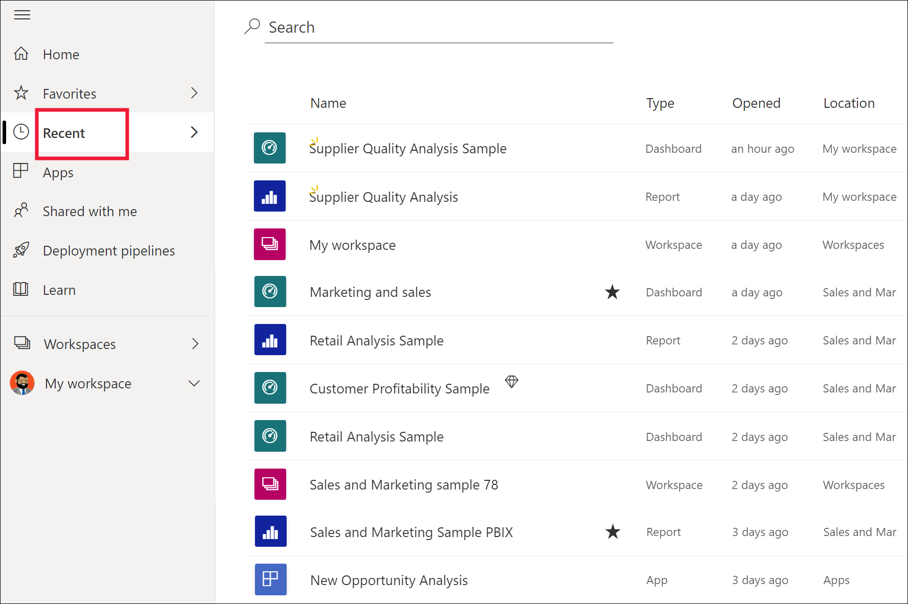
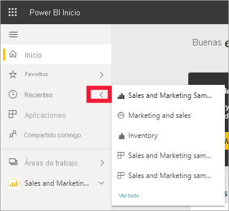
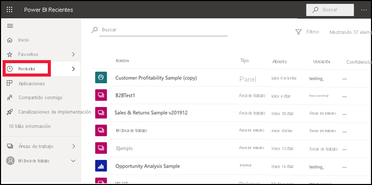
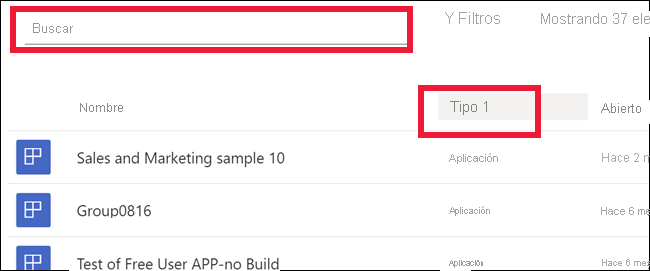

# Contenido **reciente** en el servicio Power BI

[!INCLUDE[consumer-appliesto-yyny](../includes/consumer-appliesto-yyny.md)]

El contenido **reciente** son los últimos elementos que ha visitado en el servicio Power BI. Esto incluye paneles, informes, aplicaciones y libros. Al seleccionar **Recientes** en la barra de navegación, Power BI muestra este contenido en orden descendente por fecha.  Para cambiar el criterio de ordenación, seleccione uno de los encabezados y elija ascendente o descendente.

Observe que hay dos elementos [favoritos](end-user-favorite.md), con un icono de estrella. Y un elemento, el Ejemplo de rentabilidad del cliente, está almacenado en [Capacidad Premium](end-user-license.md).

## Visualización de los cinco más recientes

Para mostrar solo los cinco elementos visitados más recientemente, seleccione la flecha situada a la derecha de **Reciente** en el panel de navegación.  Desde ahí, seleccione contenido para abrirlo. 

## Visualización de todo el contenido reciente

Si tiene más de cinco elementos visitados recientemente, seleccione **Ver todo** para abrir la pantalla **Reciente**. Como ha hecho al principio de este artículo, puede omitir el control flotante y abrir la pantalla **Reciente** si selecciona la palabra **Reciente** o su icono  en el panel de navegación.

## Búsqueda y ordenación de la lista de contenido reciente

Si la lista es extensa, [use el campo de búsqueda y la ordenación para encontrar lo que necesite](end-user-search-sort.md). Para averiguar si se puede ordenar una columna, mantenga el puntero para ver si aparece una flecha. En este ejemplo, al mantener el puntero sobre **Tipo** se muestra una flecha: el contenido reciente se puede ordenar alfabéticamente por tipo. 

Amanda muestra cómo se rellenan las listas de contenido **Recientes** del servicio Power BI; después, siga las instrucciones paso a paso que aparecen debajo del vídeo para intentarlo.

<iframe width="560" height="315" src="https://www.youtube.com/embed/G26dr2PsEpk" frameborder="0" allowfullscreen></iframe>

> [!NOTE]
> En este vídeo se usa una versión anterior del servicio Power BI.

<!--
## Actions available from the **Recent** content list
The actions available to you will depend on the settings assigned by the content *designer*. Some of your options may include:
* Select the star icon to [favorite a dashboard, report, or app](end-user-favorite.md) .
* Some dashboards and reports can be re-shared  .
* [Open the report in Excel](end-user-export.md)  
* [View insights](end-user-insights.md) that Power BI finds in the data . -->

## Pasos siguientes
[Aplicaciones del servicio Power BI](end-user-apps.md)

¿Tiene más preguntas? [Pruebe la comunidad de Power BI](https://community.powerbi.com/)

