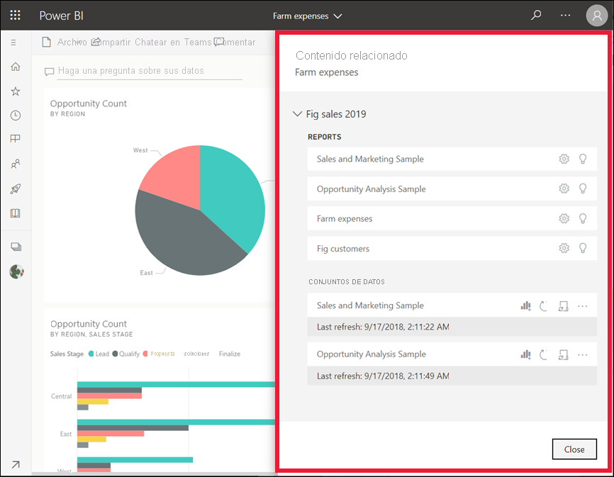

# Consulta de contenido relacionado en el servicio Power BI

[!INCLUDE[consumer-appliesto-yyny](../includes/consumer-appliesto-yyny.md)]

[!INCLUDE [power-bi-service-new-look-include](../includes/power-bi-service-new-look-include.md)]

El panel **Contenido relacionado** muestra cómo está interconectado el contenido del servicio Power BI: paneles, informes y conjuntos de datos. El panel **Contenido relacionado** también es un panel de inicio para la realización de acciones. Desde aquí puede hacer cosas como abrir un panel, abrir un informe, generar información, analizar los datos en Excel y mucho más.  

En el servicio Power BI, los informes se integran en conjuntos de datos, los objetos visuales de informes se anclan a los paneles y los objetos visuales de paneles se vinculan a los informes. Pero ¿cómo sabe cuáles son los paneles que tienen las visualizaciones de su informe de marketing? ¿Y cómo se buscan esos paneles? ¿Está usando el panel de adquisiciones visualizaciones de más de un conjunto de datos? Si es así, ¿cómo se denominan y cómo puede abrir y editarlas? ¿Se está utilizando el conjunto de datos de recursos humanos en algún informe o panel? O bien, ¿se puede mover sin provocar la ruptura de los vínculos? Preguntas como estas pueden responderse en el panel **Contenido relacionado**.  No solo el panel muestra el contenido relacionado, también permite realizar acciones en el contenido y navegar fácilmente entre el contenido relacionado.

> [!NOTE]
> La característica de contenido relacionado no funciona con los conjuntos de datos de streaming.
> 
> 

## Consulta de contenido relacionado de un panel o informe
Vea el vídeo sobre la visualización del contenido relacionado de un panel. Luego, siga las instrucciones paso a paso que aparecen debajo del vídeo para intentarlo con el ejemplo de análisis de adquisiciones.

> [!NOTE]
> Este vídeo se basa en una versión anterior del servicio Power BI. 

<iframe width="560" height="315" src="https://www.youtube.com/embed/B2vd4MQrz4M#t=3m05s" frameborder="0" allowfullscreen></iframe>

Con el panel o informe abierto, seleccione **Más opciones** (...) en la barra de menús y elija **Ver contenido relacionado** en el menú desplegable.

Se abre el panel **Contenido relacionado**. Para un panel, muestra todos los informes con visualizaciones ancladas al panel y los conjuntos de datos asociados. En este panel, hay visualizaciones ancladas desde un solo informe y ese informe se basa en solo un conjunto de datos. Si observa la imagen al principio de este artículo, verá contenido relacionado de un panel que tiene visualizaciones ancladas desde cuatro informes y dos conjuntos de datos.

Desde aquí, pueda realizar una acción directa en el contenido relacionado, dependiendo de los permisos.  Por ejemplo, seleccione el nombre de un informe o panel para abrirlo.  Para obtener uno de los informes mostrados, seleccione un icono para abrir y editar la configuración del informe, [obtener información](end-user-insights.md), etc. Para un conjunto de datos, revise la fecha y hora de la última actualización, [analice en Excel](../collaborate-share/service-analyze-in-excel.md), [obtenga información](end-user-insights.md), actualice, etc.  

<!-- ## See related content for a dataset
You'll need at least *view* permissions to a dataset to open the **Related content** pane. In this example, we're using the [Procurement Analysis sample](../create-reports/sample-procurement.md).

From the nav pane, locate the **Workspaces** heading and select a workspace from the list. If you have content in a workspace, it will display in the canvas to the right. 

In a workspace, select the **Datasets** tab and locate the **See related** icon .

Select the icon to open the **Related content** pane.

From here, you can take direct action on the related content. For example, select a dashboard or report name to open it.  For any dashboard in the list, select an icon to [share the dashboard with others](../collaborate-share/service-share-dashboards.md) or to open the **Settings** window for the dashboard. For a report, select an icon to [analyze in Excel](../collaborate-share/service-analyze-in-excel.md), [rename](../create-reports/service-rename.md), or [get insights](end-user-insights.md).  -->

## Limitaciones y solución de problemas
* Si no ve "Ver relacionados", busque el icono . Seleccione el icono para abrir el panel **Contenido relacionado**.
* Para abrir el contenido relacionado de un informe, debe estar en la [vista de lectura](end-user-reading-view.md).
* La característica de contenido relacionado no funciona con los conjuntos de datos de streaming.

## Pasos siguientes
* [Introducción al servicio Power BI](../fundamentals/service-get-started.md)
* ¿Tiene más preguntas? [Pruebe la comunidad de Power BI](https://community.powerbi.com/)
